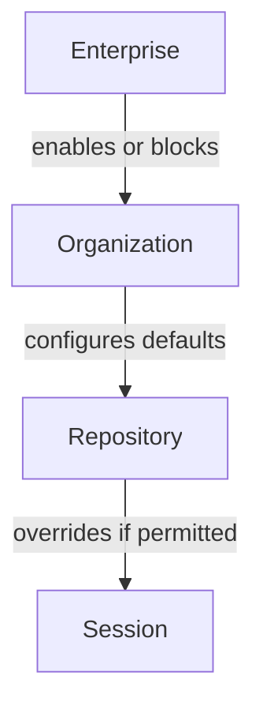

# Copilot Cloud Agent Organization Controls

> Three-tier governance model for managing Copilot cloud agent at enterprise, organization, and repository scope.

## Policy Hierarchy

Copilot cloud agent governance follows a strict top-down hierarchy: enterprise settings override org settings, which override repository defaults.



**Enterprise-level**: Enterprise owners control whether cloud agent is available at all. Options are `Enabled everywhere`, `Let organizations decide`, or block the agent for all enterprise-owned repositories from the AI Controls tab. Cloud agent and MCP server access are [disabled by default](https://docs.github.com/en/copilot/how-tos/administer-copilot/manage-for-enterprise/manage-agents/manage-copilot-cloud-agent) for all assigned Copilot Enterprise and Copilot Business license holders.

**One caveat**: enterprise policies only control users you assign a Copilot license to. Copilot Pro+ users with access to your repositories are not restricted by org or enterprise policies.

**Organization-level**: Org owners control runner configuration, firewall settings, repository access scope, and whether repositories can customize any of these defaults.

**Repository-level**: Repository admins can customize within the bounds the org permits — or receive locked settings with no override capability.

## Runner Configuration

By default, cloud agent runs on `ubuntu-latest`. Org owners can [change the default runner type](https://docs.github.com/en/copilot/how-tos/administer-copilot/manage-for-organization/configure-runner-for-coding-agent) for all repositories:

- **Standard GitHub runner**: `ubuntu-latest` (default)
- **Labeled runner**: a runner matching a specified group name and/or label — use this for larger runners, GPU access, or self-hosted runners with internal network access

A separate toggle controls whether individual repositories can override the org default using a `copilot-setup-steps.yml` workflow. Disable it to enforce a consistent runner type across the organization.

## Firewall Controls

Cloud agent's internet access is restricted by a firewall to limit data exfiltration risks. Org owners configure all firewall settings; repositories can customize within org-permitted bounds.

Org-level controls are in the [cloud agent settings page](https://docs.github.com/en/copilot/how-tos/use-copilot-agents/cloud-agent/customize-the-agent-firewall#configuring-the-firewall-at-the-organization-level):

| Setting | Options |
|---------|---------|
| Enable firewall | Enabled / Disabled / Let repositories decide |
| Recommended allowlist | Enabled / Disabled / Let repositories decide |
| Allow repository custom rules | Enabled (default) / Disabled |
| Organization custom allowlist | Add/remove entries (apply org-wide) |

The [recommended allowlist](https://docs.github.com/en/copilot/how-tos/use-copilot-agents/cloud-agent/customize-the-agent-firewall) — enabled by default — covers OS package repositories, container registries, popular language package registries, certificate authorities, and Playwright browser hosts.

**Known limitations**: The firewall only applies to processes the agent starts via its Bash tool. It does not cover MCP servers or processes running in `copilot-setup-steps`. Self-hosted runners operate outside the GitHub Actions appliance environment entirely — the firewall does not apply to them.

## Commit Traceability

All cloud agent commits are [signed and appear as "Verified"](https://docs.github.com/en/copilot/concepts/agents/cloud-agent/risks-and-mitigations) on GitHub — cryptographic evidence the commits came from the agent and have not been altered. Commits are authored by Copilot with the triggering developer as co-author, making agent-generated code identifiable in git history.

Each commit message links back to the agent session log, enabling code review and forensic audit.

**Audit log**: Filter the enterprise audit log with `actor:Copilot` to view [agentic activity over 180 days](https://docs.github.com/en/copilot/reference/agentic-audit-log-events). Key fields: `action`, `actor_is_agent`, `agent_session_id`, `user`.

## Comparison: Claude Code Enterprise Controls

Claude Code's enterprise governance works through `managed-settings.json` deployed via MDM (JAMF, Intune) or OS-level configuration. Settings apply at the endpoint level and cannot be overridden by user or project settings. Server-managed settings offer a lighter alternative — pushed via Anthropic's servers on startup and hourly polls, without MDM infrastructure.

The models differ in trust anchor: Copilot's controls live in GitHub.com settings (platform-managed), while Claude Code's controls live on the endpoint or Anthropic's servers (IT-managed). Neither approach is strictly stronger — the right choice depends on whether your threat model prioritizes platform-side enforcement or endpoint-level enforcement.

## Example

An enterprise enabling cloud agent for selected teams while enforcing network isolation:

1. Enterprise sets policy to `Let organizations decide`
2. Security-sensitive org: enables cloud agent for 3 selected repositories only; disables firewall override (`Let repositories decide` → `Enabled`); blocks repository custom allowlist rules; adds internal package registry to org custom allowlist
3. Dev productivity org: enables cloud agent for all repositories; leaves firewall at defaults; allows repositories to add custom rules

```
Enterprise: Let organizations decide
  └── Org A (security-sensitive)
        Repository access: selected (3 repos)
        Firewall: Enabled (locked)
        Recommended allowlist: Enabled (locked)
        Allow repo custom rules: Disabled
        Org custom allowlist: packages.corp.internal

  └── Org B (dev productivity)
        Repository access: all repositories
        Firewall: Let repositories decide
        Allow repo custom rules: Enabled
```

## Key Takeaways

- Enterprise → org → repository hierarchy; upper tiers can lock any setting against downstream override
- Cloud agent and MCP server access are off by default — opt-in at every tier
- Firewall does not cover MCP servers or setup steps processes — a gap to account for in threat modeling
- All agent commits are signed and co-authored, making agent work identifiable in git history and audit logs
- Copilot Pro+ users bypass enterprise/org policies — scope repository access controls to address this

## Related

- [Coding Agent](coding-agent.md)
- [MCP Integration](mcp-integration.md)
- [GitHub Agentic Workflows](github-agentic-workflows.md)
- [Enterprise Skill Marketplace](../../workflows/enterprise-skill-marketplace.md)
- [Central Repo Shared Agent Standards](../../workflows/central-repo-shared-agent-standards.md)
