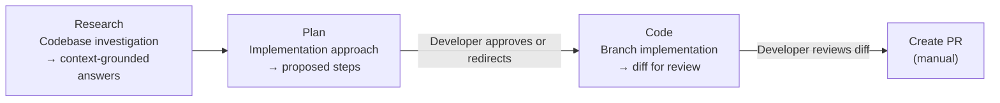

# Copilot Cloud Agent Three-Phase Execution Model

> Copilot cloud agent exposes a three-phase execution model — Research, Plan, and Code — where each phase produces a reviewable artifact before the next phase begins.

[Announced April 2026](https://github.blog/changelog/2026-04-01-research-plan-and-code-with-copilot-cloud-agent/), this capability extends the original cloud agent (which produced a PR directly) with explicit steering points: a research summary, an implementation plan, and a diff — each requiring developer action before proceeding.

## The Three Phases



### Research

Start a research session to answer broad questions about your codebase. Copilot investigates and returns answers grounded in the repository — not generic completions. This is the information-gathering phase before any plan is formed.

Use this phase when:
- The problem space is unfamiliar (new subsystem, inherited codebase)
- You need to understand constraints before committing to an approach
- You want to audit what already exists before requesting new code

Access via the **Agents tab** in the repository or through **Copilot Chat**.

### Plan

Request a plan by including it in your prompt: `"Make a plan before taking any action"`. Copilot generates a proposed implementation approach — what changes it intends to make and why — without writing any code yet.

At this checkpoint, you can:
- **Approve** the plan and proceed to code generation
- **Redirect** with feedback: correct misidentified files, missing constraints, wrong architectural approach

This is the cheapest point to correct the agent. A paragraph of feedback here prevents a complete rewrite after code is generated.

### Code

With the plan approved, Copilot implements on a branch. No pull request is created automatically.

At this checkpoint:
- Click **Diff** to review all changes before proceeding
- Iterate with Copilot until the implementation is ready
- Click **Create pull request** only when satisfied

The manual PR gate means the agent never opens a review request without developer sign-off.

## Cost Asymmetry

The three-phase model formalizes a known cost distribution in agentic coding: errors caught at the research-to-plan boundary cost a redirect comment; errors caught at the plan-to-code boundary cost an approval click; errors caught post-implementation cost a branch revert and a new task. The model enforces early-stage investment through UI gates rather than developer discipline — the plan gate is the cheapest point to correct the agent.

| Catch point | Cost of correction |
|-------------|-------------------|
| After Research (plan redirect) | Paragraph of feedback |
| After Plan (pre-code correction) | Approval click + clarification |
| After Code (diff review) | Inline iteration |
| After PR opened | Branch revert, new task |

## When to Use Planning vs. Direct Assignment

The three-phase flow adds latency at each gate. For simple or well-specified tasks, direct cloud agent assignment (issue → PR) is faster.

| Task type | Recommended flow |
|-----------|----------------|
| Dependency update, typo fix, test generation | Direct assignment (Coding Agent) |
| Feature addition with known spec | Plan → Code |
| Investigation before any coding | Research → Plan → Code |
| Unfamiliar codebase, complex cross-file change | Research → Plan → Code |

## Runner and Policy Requirements

The three-phase model runs on the same infrastructure as the Copilot cloud agent:
- Requires a paid Copilot plan (Pro, Business, or Enterprise)
- Business and Enterprise users need administrator enablement — cloud agent is [off by default](https://docs.github.com/en/copilot/how-tos/administer-copilot/manage-for-enterprise/manage-agents/manage-copilot-cloud-agent) at every tier
- Runner configuration, firewall policy, and org-level governance apply identically — see [Cloud Agent Organization Controls](cloud-agent-org-controls.md)

## When This Backfires

- **Simple tasks**: The plan gate is overhead when the implementation is obvious. A one-line fix doesn't warrant a research → plan → code cycle.
- **Well-specified issues**: If the issue body already documents the exact changes needed, the research phase adds latency without new information.
- **Incomplete repository context**: Research grounding is limited to repository content. If key constraints live in internal wikis, Jira, or external APIs, the research summary will be incomplete — and a plan built on it may be flawed.
- **Bulk automation workflows**: Teams using cloud agent for high-volume tasks (security patches across many repos) pay the plan-review tax on every task. Total throughput drops significantly.

## Example

Requesting a plan for a feature addition with cross-cutting concerns:

```
In the Agents tab, submit:

"Make a plan before taking any action. I want to add rate limiting to
the /api/orders endpoint. The plan should identify which files change,
how the middleware integrates with the existing auth layer, and what
test coverage is needed. Do not write any code yet."
```

Copilot returns a plan. Review it — check that it identified the right middleware location, that it accounts for the WebSocket endpoint exclusion documented in the last PR, and that it includes a regression test. Approve the corrected plan. Copilot implements on a branch. Click **Diff**, verify the changes match the approved plan, then click **Create pull request**.

## Key Takeaways

- Three phases — Research, Plan, Code — each produce a reviewable artifact before the next phase begins
- Developer checkpoints are mandatory: the plan requires approval, the PR requires manual creation
- The cheapest correction point is the plan gate — redirect before code is generated
- Use the full three-phase flow for unfamiliar codebases and complex tasks; use direct agent assignment for simple or well-specified work
- Runner and policy requirements are identical to the standard Copilot cloud agent

## Related

- [Coding Agent](coding-agent.md) — Direct cloud agent assignment without explicit planning gates
- [Cloud Agent Organization Controls](cloud-agent-org-controls.md) — Runner configuration, firewall policy, and org-level governance
- [Research-Plan-Implement Pattern](../../workflows/research-plan-implement.md) — Tool-agnostic version of this pattern with mechanism and cost-asymmetry analysis
- [GitHub Agentic Workflows](github-agentic-workflows.md) — Event-driven repository automation with the same cloud agent infrastructure
- [Agent Mission Control](agent-mission-control.md) — Centralized dashboard for assigning and monitoring cloud agent tasks
