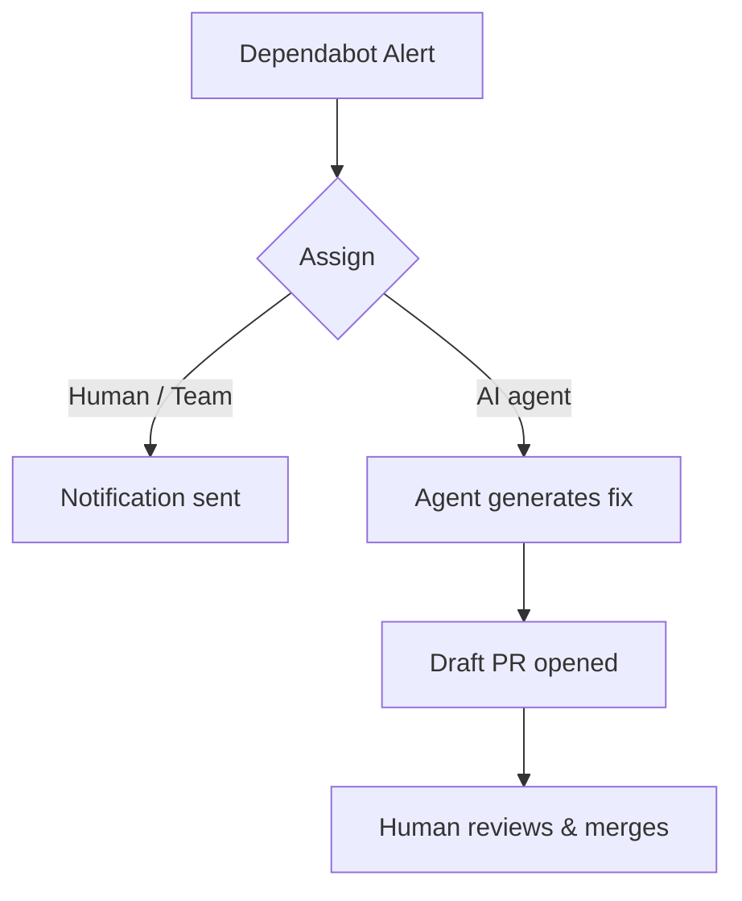

# Dependabot AI Agent Assignment

> Route Dependabot alerts to an AI coding agent for autonomous fix generation, with human review at the merge gate.

## How It Works

GitHub's Dependabot alerts surface vulnerable dependencies. Each alert now accepts an assignee — a collaborator, team, or an AI agent. Assigning to an agent triggers a different path than assigning to a human: instead of sending a notification, GitHub dispatches a coding agent to generate a fix and open a draft pull request. The assignment dialog supports the [Copilot coding agent](coding-agent.md) along with Claude and Codex, and lets you add a custom prompt, pick the AI model, target a different repository, or select a custom agent you have configured ([changelog](https://github.blog/changelog/2026-04-07-dependabot-alerts-are-now-assignable-to-ai-agents-for-remediation/), [docs](https://docs.github.com/en/code-security/dependabot/dependabot-alerts/viewing-and-updating-dependabot-alerts)). Assigning Dependabot alerts to coding agents requires GitHub Code Security and a plan that includes coding agent access.

The workflow:

The draft PR requires human review — there is no auto-merge path. Multiple agents can be assigned to the same alert, and each opens an independent pull request, which is useful when comparing fixes from different agents ([changelog](https://github.blog/changelog/2026-04-07-dependabot-alerts-are-now-assignable-to-ai-agents-for-remediation/)).

## Alert Routing

Not every alert is a good candidate for agent assignment. Two mechanisms filter the queue before a human decides what to delegate:

**Auto-triage rules** dismiss low-risk alerts automatically — before they appear in the queue. Rules can match on CVSS score, EPSS percentage, dependency scope (development vs. production), and whether a patch is available. Alerts that pass through become candidates for assignment.

**Manual triage** decides which passing alerts to assign to the agent vs. a human. The decision turns on the fix complexity:

| Alert type | Agent assignment | Reason |
|------------|-----------------|--------|
| Version bump with available patch | Good fit | Mechanical change, verifiable by tests |
| Transitive dependency update | Good fit | No application code changes required |
| Advisory requiring code changes | Human review first | Business logic impact, needs contextual judgment |
| No patch available | Not applicable | Agent cannot fix what doesn't exist |

Use Security Overview to filter alerts by assignee so you can track which alerts are in-flight with an agent across repositories ([docs](https://docs.github.com/en/code-security/security-overview/filtering-alerts-in-security-overview)).

## Trust Boundaries

The assignment model enforces two controls that bound agent autonomy:

1. **Permissioned assignment** — only collaborators with sufficient repository permissions can assign an alert to an agent. Anonymous or read-only collaborators cannot trigger fix generation.

2. **Draft PR review** — the agent opens a draft, not a ready-to-merge PR. A human must inspect the diff, verify test coverage, and explicitly approve before merging. The agent cannot bypass this gate. GitHub's own announcement stresses that "AI-generated fixes are not always correct" and that human review is required ([changelog](https://github.blog/changelog/2026-04-07-dependabot-alerts-are-now-assignable-to-ai-agents-for-remediation/)).

This positions agent assignment inside the [human-in-the-loop](../../security/defense-in-depth-agent-safety.md) boundary: autonomous execution, mandatory human verification.

## Example

In the Dependabot alerts tab, open any alert with an available patch. Use the **Show options** dropdown next to **Assignees**, or click **Assign to Agent** directly, then pick the agent — Copilot, Claude, Codex, or a custom agent you have configured. Optionally add a custom prompt, select a different repository, or pick the AI model ([full steps](https://docs.github.com/en/code-security/dependabot/dependabot-alerts/viewing-and-updating-dependabot-alerts)). The alert list updates to show the agent as the assignee and the agent begins generating the fix.

To track agent-assigned alerts across an organization's repositories, filter the alerts list or Security Overview by assignee. This enables progress monitoring without opening individual repositories.

## When This Backfires

Agent assignment degrades or fails in three conditions:

1. **No test suite**: The agent opens a PR, but without automated tests there is no signal that the dependency bump is safe. Reviewers must manually exercise the diff — negating much of the time saving.
2. **Complex transitive updates**: When a version bump pulls in a chain of transitive dependency upgrades, the agent may resolve conflicts mechanically while missing semantic breakage in nested packages. Human inspection of the full dependency graph remains necessary.
3. **No available patch**: The agent cannot synthesise a fix for an advisory with no upstream patch. Assigning these alerts wastes a Copilot premium request and produces a draft PR with no actionable changes.

## Key Takeaways

- Assigning a Dependabot alert to an AI agent (Copilot, Claude, Codex, or a custom agent) replaces a manual notification with autonomous fix generation
- Auto-triage rules reduce the assignment queue by dismissing low-risk alerts before they surface
- The draft PR model keeps a human at the merge gate — the agent executes, but cannot ship
- Risk-based routing (version bumps and transitive updates to agent; logic-impacting advisories to humans) maximises throughput while preserving review quality

## Related

- [Copilot Coding Agent](coding-agent.md)
- [GitHub Agentic Workflows](github-agentic-workflows.md)
- [Defense-in-Depth Agent Safety](../../security/defense-in-depth-agent-safety.md)
- [Safe Outputs Pattern](../../security/safe-outputs-pattern.md)
