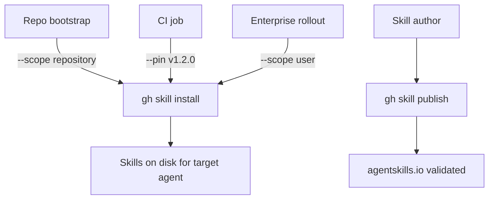

# Managing Agent Skills from the GitHub CLI

> `gh skill` turns skill install, search, update, and publish into scriptable GitHub CLI operations — usable in repo bootstrap scripts, CI, and enterprise provisioning.

Released 2026-04-16 in GitHub CLI v2.90.0, `gh skill` is a new top-level command group that discovers, installs, manages, and publishes [agent skills](../../standards/agent-skills-standard.md) from GitHub repositories ([GitHub Changelog](https://github.blog/changelog/2026-04-16-manage-agent-skills-with-github-cli)). The feature shipped as public preview.

## Command Surface

| Command | Purpose |
|---|---|
| `gh skill search <query>` | Find skills across indexed GitHub repos |
| `gh skill install <owner>/<repo> [<skill>]` | Install one skill or browse the repo interactively |
| `gh skill update [--all]` | Check or apply upstream changes for installed skills |
| `gh skill publish [--fix]` | Validate a local skill against the [agentskills.io](https://agentskills.io) spec and publish |

Install a specific skill by name, tag, or commit SHA ([GitHub Changelog](https://github.blog/changelog/2026-04-16-manage-agent-skills-with-github-cli)):

```shell
gh skill install github/awesome-copilot                                    # interactive picker
gh skill install github/awesome-copilot documentation-writer               # latest
gh skill install github/awesome-copilot documentation-writer@v1.2.0        # tag
gh skill install github/awesome-copilot documentation-writer@abc123def     # commit SHA
```

## Scope and Agent Targeting

Two flags control *where* a skill lands and *which agent* reads it ([GitHub Changelog](https://github.blog/changelog/2026-04-16-manage-agent-skills-with-github-cli)):

| Flag | Values | Effect |
|---|---|---|
| `--scope` | `user`, `repository` | User-wide install vs. committed to the current checkout |
| `--agent` | `claude-code`, `cursor`, `codex`, `gemini`, `antigravity` | Target non-Copilot agents; Copilot is the default |
| `--pin` | tag or commit SHA | Lock this install to an exact version |

Repository scope commits skill files into the working copy so teammates pick them up via normal `git pull`. User scope keeps the skill in the per-user config directory for the target agent, keeping individual setups off the project tree.

## Version Pinning

Skills store a git tree SHA in frontmatter for content-addressed change detection ([GitHub Changelog](https://github.blog/changelog/2026-04-16-manage-agent-skills-with-github-cli)). `gh skill update` only applies an update when the upstream tree SHA differs — avoiding no-op churn and making updates explicit. `--pin` freezes a skill to a tag or SHA so CI runs and provisioning scripts stay deterministic across upstream changes.

## Where It Fits



- **Repo bootstrap** — a `setup.sh` run once per clone installs the project's required skills with `--scope repository` so the whole team operates on the same set.
- **CI pinning** — version-pin skills in CI runners with `--pin` to prevent skill drift from changing pipeline behaviour between runs.
- **Enterprise rollout** — provisioning scripts install organisation-approved skills at `--scope user` on new developer machines without manual VS Code or web-UI steps.
- **Cross-agent distribution** — `--agent` targets other spec-compliant agents (Claude Code, Cursor, Codex, Gemini, Antigravity) from the same CLI, so one provisioning script handles mixed agent fleets.

## Relationship to Other Copilot Surfaces

`gh skill` is a subcommand of the GitHub CLI (`gh`), not the [Copilot CLI](copilot-cli-agentic-workflows.md) (`copilot`). The two are separate binaries:

- `gh skill` — install and manage skills *as files* in the right directory for a target agent.
- `copilot` — interactive and programmatic agent sessions that *use* those skills at runtime.

For the skill file format itself (SKILL.md structure, progressive disclosure, and how agents load skills), see [Custom Agents and Skills](custom-agents-skills.md). For the cross-tool spec that `gh skill publish` validates against, see [Agent Skills Standard](../../standards/agent-skills-standard.md).

## Example

A repo bootstrap script that installs a pinned skill set for every new clone:

```shell
#!/usr/bin/env bash
set -euo pipefail

# Require gh >= 2.90 for gh skill support
gh --version | grep -qE 'gh version 2\.(9[0-9]|[1-9][0-9]{2,})' \
  || { echo "gh >= 2.90 required"; exit 1; }

# Commit skill files into the repo so teammates pick them up via git pull
gh skill install github/awesome-copilot documentation-writer@v1.2.0 \
  --scope repository

gh skill install github/awesome-copilot code-reviewer@v2.0.1 \
  --scope repository

# Second agent on the same machine — share one provisioning step
gh skill install github/awesome-copilot code-reviewer@v2.0.1 \
  --agent claude-code --scope user
```

The pinned tags make the install reproducible; `--scope repository` commits the skill files so teammates get the same set on pull; and the `--agent claude-code` call reuses the same CLI for a second agent host without a separate tool.

## When This Backfires

- **Pre-v2.90 CLI in the fleet** — shared provisioning scripts fail silently or with cryptic errors on machines pinned to older `gh` versions; add an explicit version check before calling `gh skill`.
- **Offline or air-gapped provisioning** — `gh skill install` requires network to GitHub; offline images need a pre-bundled skills tree rather than a live install.
- **Non-GitHub skill sources** — the CLI is built around `owner/repo` GitHub addressing; skills hosted on self-hosted GitLab or private registries need mirroring to GitHub or manual file copy.
- **Public preview churn** — the command surface is subject to change ([GitHub Changelog](https://github.blog/changelog/2026-04-16-manage-agent-skills-with-github-cli)); lock CI jobs to a specific `gh` version to avoid breakage when the preview evolves.

## Key Takeaways

- `gh skill` (GitHub CLI v2.90+) adds scriptable install, search, update, and publish for agent skills.
- `--scope repository` commits skills into the checkout; `--scope user` keeps them per-user.
- `--pin <tag|sha>` locks a skill version; content-addressed updates via git tree SHA make `gh skill update` a no-op when upstream is unchanged.
- `--agent` targets Claude Code, Cursor, Codex, Gemini, and Antigravity in addition to the default Copilot — one CLI for mixed agent fleets.
- Distinct from the `copilot` CLI: `gh skill` manages skill files; `copilot` runs the agent.

## Related

- [Custom Agents, Skills & Plugins](custom-agents-skills.md)
- [Agent Skills Standard](../../standards/agent-skills-standard.md)
- [Copilot CLI Agentic Workflows](copilot-cli-agentic-workflows.md)
- [Monorepo Skill and Agent Discovery](monorepo-hierarchical-discovery.md)
- [Plugin Packaging](../../standards/plugin-packaging.md)
- [Portable Agent Definitions](../../standards/portable-agent-definitions.md)
