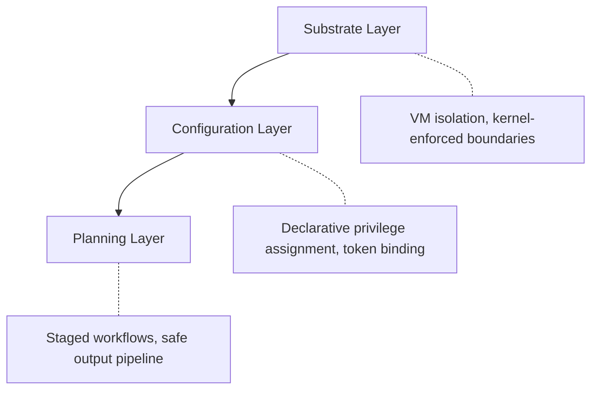

# GitHub Agentic Workflows

> Event-driven repository automation defined in Markdown and compiled to GitHub Actions, with defense-in-depth security and zero-secret-access agent containers.

## Two-File Architecture

Developers write a Markdown file with YAML frontmatter and natural-language instructions. `gh aw compile` produces a `.lock.yml` — the executable GitHub Actions workflow. Only the Markdown file is hand-edited; the lock file is generated and committed alongside it ([GitHub Blog](https://github.blog/ai-and-ml/automate-repository-tasks-with-github-agentic-workflows/)).

The frontmatter declares:

- **`on`** — trigger events (schedule, issue comments, PR events)
- **`permissions`** — access levels (read-only by default)
- **`safe-outputs`** — pre-approved write operations with constraints
- **`tools`** — available integrations (e.g., `github`)
- **`imports`** — shared fragments for reusable tool configs or formatting conventions

## Seven Design Patterns

GitHub defines seven named patterns for common automation scenarios ([GitHub Blog](https://github.blog/ai-and-ml/automate-repository-tasks-with-github-agentic-workflows/)):

| Pattern | Use Case |
|---------|----------|
| **ChatOps** | Respond to issue/PR comments with agent actions |
| **DailyOps** | Scheduled maintenance — stale issue cleanup, status reports |
| **DataOps** | Data validation, reporting, dashboard generation |
| **IssueOps** | [Issue triage](../../workflows/continuous-triage.md), labeling, routing, duplicate detection |
| **ProjectOps** | Project board management, milestone tracking |
| **MultiRepoOps** | Cross-repository coordination, dependency updates |
| **Orchestration** | Multi-step workflows chaining multiple agent actions |

Patterns are combinable — Orchestration can chain IssueOps triage with a ChatOps response.

## Configurable Engine

Agentic Workflows support multiple execution engines — Copilot CLI, Claude Code, and OpenAI Codex — decoupling the pattern from the model provider ([GitHub Blog](https://github.blog/ai-and-ml/automate-repository-tasks-with-github-agentic-workflows/)).

## Safe Outputs: Constraining Agent Writes

Agents operate read-only by default. Write operations require explicit declaration as "safe outputs" — a bounded list of permitted GitHub API calls. Each passes through a four-stage pipeline ([GitHub Blog: Security Architecture](https://github.blog/ai-and-ml/generative-ai/under-the-hood-security-architecture-of-github-agentic-workflows/)):

1. **Operation filtering** — restricts which GitHub API calls the agent can make
2. **Volume limiting** — caps maximum operations per run (e.g., max 3 PRs)
3. **Content sanitization** — removes unwanted patterns including URLs and secrets
4. **Moderation** — deterministic analysis before downstream delivery

This staged vetting prevents agents from performing unbounded mutations.

## Defense-in-Depth Security

The security architecture operates across three trust boundaries ([GitHub Blog: Security Architecture](https://github.blog/ai-and-ml/generative-ai/under-the-hood-security-architecture-of-github-agentic-workflows/)):



**Substrate layer** — VM isolation on Actions runners with kernel-enforced communication boundaries.

**Configuration layer** — Declarative artifacts control privilege assignment; tokens are bound here, never inside agent containers.

**Planning layer** — Staged workflows with explicit data exchanges; agent outputs pass through safe outputs before any downstream effect.

### Secret Segregation

Credentials are compartmentalized across isolated containers ([GitHub Blog: Security Architecture](https://github.blog/ai-and-ml/generative-ai/under-the-hood-security-architecture-of-github-agentic-workflows/)):

- **API proxy container** — holds LLM auth tokens; agent calls through the proxy without seeing keys
- **MCP gateway container** (`gh-aw-mcpg`) — holds MCP credentials; routes MCP calls via HTTP with per-repo guard policies
- **Agent container** — firewalled egress, read-only `/host` mounts, `tmpfs` overlays, `chroot` jails

### Observability

Logging at firewall, API proxy, MCP gateway, and container layers enables end-to-end forensic reconstruction ([GitHub Blog: Security Architecture](https://github.blog/ai-and-ml/generative-ai/under-the-hood-security-architecture-of-github-agentic-workflows/)).

## Fragment and Import System

Shared fragments — tool definitions, MCP configs, formatting conventions — import via `imports: [shared/name.md]`, avoiding duplication across workflows ([GitHub Blog](https://github.blog/ai-and-ml/automate-repository-tasks-with-github-agentic-workflows/)).

## Rollout Sequencing

Start read-only, comment-only. Prove low-noise behavior before enabling labeling or PR creation. PRs created by agentic workflows are never auto-merged ([GitHub Blog](https://github.blog/ai-and-ml/automate-repository-tasks-with-github-agentic-workflows/)).

## Cost Model

Copilot-engine workflows incur two premium requests per run ([GitHub Blog](https://github.blog/ai-and-ml/automate-repository-tasks-with-github-agentic-workflows/)).

## When This Backfires

Not a replacement for standard GitHub Actions YAML workflows ([GitHub Blog](https://github.blog/ai-and-ml/automate-repository-tasks-with-github-agentic-workflows/)):

- **Deterministic CI/CD** — build, test, deploy pipelines belong in standard Actions; agentic workflows are for subjective reasoning tasks
- **High-volume automation** — two premium requests per run compounds fast at scale
- **Broad credential access** — zero-secret-access is a security constraint; cross-repo credential workflows belong in standard Actions
- **Latency-sensitive gates** — agent reasoning adds latency; pre-merge checks and deployments belong outside the agentic loop

## Key Takeaways

- Markdown authoring with compiled lock files provides auditability and deterministic deployment
- Safe outputs pipeline enforces operation filtering, volume limiting, sanitization, and moderation on every write
- Three-layer defense-in-depth with zero-secret-access containers is GitHub's most constrained agent runtime
- Start read-only, prove low-noise, then progressively enable write operations

## Example

A ChatOps workflow that responds to `/summarize` comments on issues:

```markdown
---
on:
  issue_comment:
    types: [created]
    filter: "body contains '/summarize'"
permissions:
  issues: read
safe-outputs:
  - type: issue_comment
    max: 1
tools:
  - github
---

Read every comment on this issue, then post a single reply
summarizing the discussion so far. Keep the summary under 200 words.
Focus on decisions made, open questions, and action items.
```

Compile and commit:

```bash
gh aw compile .github/agentic-workflows/summarize.md
git add .github/agentic-workflows/summarize.md \
       .github/agentic-workflows/summarize.lock.yml
git commit -m "add: ChatOps summarize workflow"
```

The compiled `summarize.lock.yml` is the executable GitHub Actions workflow. The safe-outputs declaration limits the agent to posting one comment per run, and the `issues: read` permission prevents any mutations beyond that comment.

## Related

- [Copilot Coding Agent](coding-agent.md)
- [Custom Agents and Skills](custom-agents-skills.md)
- [Secrets Management for Agents](../../security/secrets-management-for-agents.md)
- [Prompt Injection Threat Model](../../security/prompt-injection-threat-model.md)
- [Defense-in-Depth Agent Safety](../../security/defense-in-depth-agent-safety.md)
- [Safe Outputs Pattern](../../security/safe-outputs-pattern.md)
- [Copilot vs Claude Billing Semantics](../../human/copilot-vs-claude-billing-semantics.md) — premium request costs for workflow runs
- [Cloud Agent Organization Controls](cloud-agent-org-controls.md) — runner configuration, firewall policy, and org-level governance for agentic workflow execution
- [Copilot CLI Agentic Workflows](copilot-cli-agentic-workflows.md)
- [GitHub Models in Actions](github-models-in-actions.md)
- [GitHub Copilot MCP Integration](mcp-integration.md)
- [Dependabot Agent Assignment](dependabot-agent-assignment.md)
