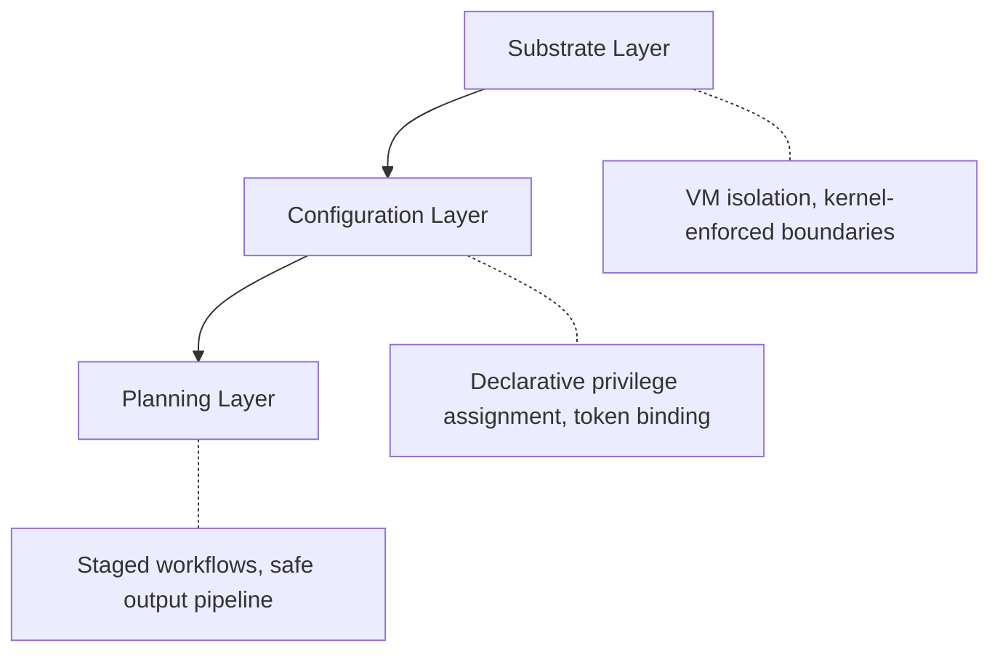

# GitHub Agentic Workflows

> Event-driven repository automation defined in Markdown and compiled to GitHub Actions, with defense-in-depth security and zero-secret-access agent containers.

## Two-file architecture

You write a Markdown file with YAML frontmatter and natural-language instructions. `gh aw compile` produces a `.lock.yml` — the GitHub Actions workflow that runs. You edit only the Markdown file by hand; the lock file is generated and committed alongside it ([GitHub Blog](https://github.blog/ai-and-ml/automate-repository-tasks-with-github-agentic-workflows/)).

GitHub reports that Agentic Workflows entered public preview on 2026-06-11 ([GitHub Changelog](https://github.blog/changelog/2026-06-11-github-agentic-workflows-is-now-in-public-preview)). It sits within a wider push toward programmable agents. GitHub reports the Agent Tasks REST API reached general availability for Copilot Pro, Pro+, and Max on 2026-06-04 ([GitHub Changelog](https://github.blog/changelog/2026-06-04-agent-tasks-rest-api-now-available-for-copilot-pro-pro-and-max)), and that agent apps now let you extend GitHub with custom agents ([GitHub Changelog](https://github.blog/changelog/2026-06-02-extend-github-with-agent-apps)).

The frontmatter declares:

- `on` — trigger events (schedule, issue comments, PR events)
- `permissions` — access levels (read-only by default)
- `safe-outputs` — pre-approved write operations with constraints
- `tools` — available integrations, for example `github`
- `imports` — shared fragments for reusable tool configs or formatting conventions

## Seven design patterns

GitHub defines seven named patterns for common automation scenarios ([GitHub Blog](https://github.blog/ai-and-ml/automate-repository-tasks-with-github-agentic-workflows/)):

| Pattern | Use case |
|---------|----------|
| ChatOps | Respond to issue/PR comments with agent actions |
| DailyOps | Scheduled maintenance — stale issue cleanup, status reports |
| DataOps | Data validation, reporting, dashboard generation |
| IssueOps | [Issue triage](../../workflows/continuous-triage.md), labeling, routing, duplicate detection |
| ProjectOps | Project board management, milestone tracking |
| MultiRepoOps | Cross-repository coordination, dependency updates |
| Orchestration | Multi-step workflows chaining multiple agent actions |

You can combine patterns — Orchestration can chain IssueOps triage with a ChatOps response.

## Configurable engine

Agentic Workflows support several execution engines — Copilot CLI, Claude Code, and OpenAI Codex — so the pattern stays separate from the model provider ([GitHub Blog](https://github.blog/ai-and-ml/automate-repository-tasks-with-github-agentic-workflows/)).

## Safe outputs: constraining agent writes

Agents run read-only by default. Write operations must be declared as "safe outputs" — a bounded list of permitted GitHub API calls. Each one passes through a four-stage pipeline ([GitHub Blog: Security Architecture](https://github.blog/ai-and-ml/generative-ai/under-the-hood-security-architecture-of-github-agentic-workflows/)):

1. Operation filtering restricts which GitHub API calls the agent can make.
2. Volume limiting caps how many operations run, for example a maximum of 3 PRs.
3. Content sanitization removes unwanted patterns, including URLs and secrets.
4. Moderation applies deterministic analysis before any downstream delivery.

This staged vetting stops agents from making unbounded changes.

## Defense-in-depth security

The security architecture works across three trust boundaries ([GitHub Blog: Security Architecture](https://github.blog/ai-and-ml/generative-ai/under-the-hood-security-architecture-of-github-agentic-workflows/)):


```mermaid
graph TD
    A[Substrate Layer] --> B[Configuration Layer]
    B --> C[Planning Layer]
    A -.- D[VM isolation, kernel-enforced boundaries]
    B -.- E[Declarative privilege assignment, token binding]
    C -.- F[Staged workflows, safe output pipeline]
```

The substrate layer gives each run VM isolation on Actions runners, with kernel-enforced communication boundaries.

The configuration layer uses declarative artifacts to control privilege assignment. Tokens are bound here, never inside agent containers.

The planning layer runs staged workflows with explicit data exchanges. Agent outputs pass through safe outputs before they take any downstream effect.

### Secret segregation

Credentials are split across isolated containers ([GitHub Blog: Security Architecture](https://github.blog/ai-and-ml/generative-ai/under-the-hood-security-architecture-of-github-agentic-workflows/)):

- API proxy container — holds LLM auth tokens; the agent calls through the proxy without seeing keys
- MCP gateway container (`gh-aw-mcpg`) — holds MCP credentials; routes MCP calls over HTTP with per-repo guard policies
- Agent container — firewalled egress, read-only `/host` mounts, `tmpfs` overlays, `chroot` jails

GitHub reports that, as of 2026-06-11, Agentic Workflows no longer need a personal access token to run ([GitHub Changelog](https://github.blog/changelog/2026-06-11-agentic-workflows-no-longer-need-a-personal-access-token)). This narrows the standing credential surface a misconfigured workflow could expose.

### Observability

Logging at the firewall, API proxy, MCP gateway, and container layers lets you reconstruct what happened end to end ([GitHub Blog: Security Architecture](https://github.blog/ai-and-ml/generative-ai/under-the-hood-security-architecture-of-github-agentic-workflows/)).

## Fragment and import system

Shared fragments — tool definitions, MCP configs, formatting conventions — import via `imports: [shared/name.md]`. This avoids duplication across workflows ([GitHub Blog](https://github.blog/ai-and-ml/automate-repository-tasks-with-github-agentic-workflows/)).

## Rollout sequencing

Start read-only and comment-only. Prove the workflow stays low-noise before you enable labeling or PR creation. PRs created by agentic workflows are never auto-merged ([GitHub Blog](https://github.blog/ai-and-ml/automate-repository-tasks-with-github-agentic-workflows/)).

## Cost model

Copilot-engine workflows cost two premium requests per run ([GitHub Blog](https://github.blog/ai-and-ml/automate-repository-tasks-with-github-agentic-workflows/)).

## When this backfires

Agentic workflows do not replace standard GitHub Actions YAML workflows ([GitHub Blog](https://github.blog/ai-and-ml/automate-repository-tasks-with-github-agentic-workflows/)):

- Deterministic CI/CD — build, test, and deploy pipelines belong in standard Actions; agentic workflows are for subjective reasoning tasks
- High-volume automation — two premium requests per run add up fast at scale, and workflows that fire on every PR can "quietly accumulate large API bills" ([GitHub Blog: Token Efficiency](https://github.blog/ai-and-ml/github-copilot/improving-token-efficiency-in-github-agentic-workflows/))
- Broad credential access — zero-secret-access is a security constraint, so cross-repo credential workflows belong in standard Actions
- Latency-sensitive gates — agent reasoning adds latency, so pre-merge checks and deployments belong outside the agentic loop
- Wide blast radius from misconfiguration — one bad tool wiring can cause runaway loops; GitHub documents a case where a misconfiguration produced a 64-turn fallback loop before being caught ([GitHub Blog: Token Efficiency](https://github.blog/ai-and-ml/github-copilot/improving-token-efficiency-in-github-agentic-workflows/)). Cap turns, watch token spend per workflow, and alert on per-run anomalies

## Key Takeaways

- Markdown authoring with compiled lock files gives you auditability and deterministic deployment
- The safe outputs pipeline enforces operation filtering, volume limiting, sanitization, and moderation on every write
- Three-layer defense-in-depth with zero-secret-access containers is GitHub's most constrained agent runtime
- Start read-only, prove low-noise, then enable write operations step by step

## Example

A ChatOps workflow that responds to `/summarize` comments on issues:

```markdown
---
on:
  issue_comment:
    types: [created]
    filter: "body contains '/summarize'"
permissions:
  issues: read
safe-outputs:
  - type: issue_comment
    max: 1
tools:
  - github
---

Read every comment on this issue, then post a single reply
summarizing the discussion so far. Keep the summary under 200 words.
Focus on decisions made, open questions, and action items.
```

Compile and commit:

```bash
gh aw compile .github/agentic-workflows/summarize.md
git add .github/agentic-workflows/summarize.md \
       .github/agentic-workflows/summarize.lock.yml
git commit -m "add: ChatOps summarize workflow"
```

The compiled `summarize.lock.yml` is the GitHub Actions workflow that runs. The safe-outputs declaration limits the agent to one comment per run, and the `issues: read` permission blocks any change beyond that comment.

## Related

- [Copilot Coding Agent](coding-agent.md)
- [Custom Agents and Skills](custom-agents-skills.md)
- [Secrets Management for Agents](../../security/secrets-management-for-agents.md)
- [Prompt Injection Threat Model](../../security/prompt-injection-threat-model.md)
- [Defense-in-Depth Agent Safety](../../security/defense-in-depth-agent-safety.md)
- [Safe Outputs Pattern](../../security/safe-outputs-pattern.md)
- [Copilot vs Claude Billing Semantics](../../human/copilot-vs-claude-billing-semantics.md) — premium request costs for workflow runs
- [Cloud Agent Organization Controls](cloud-agent-org-controls.md) — runner configuration, firewall policy, and org-level governance for agentic workflow execution
- [Copilot CLI Agentic Workflows](copilot-cli-agentic-workflows.md)
- [GitHub Models in Actions](github-models-in-actions.md)
- [GitHub Copilot MCP Integration](mcp-integration.md)
- [Dependabot Agent Assignment](dependabot-agent-assignment.md)
