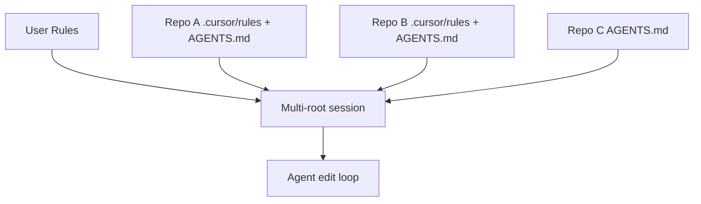

# Cursor Multi-Root Workspaces

> One agent session, multiple repository folders — for edits whose intent crosses repo boundaries.

Cursor 3.2 (2026-04-24) added multi-root workspaces to the Agents Window: one agent session targets a reusable workspace of multiple folders "without retargeting the agent every time it moves between repos" ([Cursor changelog 3.2](https://cursor.com/changelog/04-24-26)). The same release shipped `/multitask` async subagents and revised worktrees — the three compose.

The mechanism is inherited from VS Code: a `.code-workspace` file lists folder roots and the editor treats them as one window with folder-scoped settings ([VS Code multi-root workspaces](https://code.visualstudio.com/docs/editing/workspaces/multi-root-workspaces)). Cursor 3.2 lifts that surface to the agent.

## When Multi-Root Beats Per-Repo Sessions

Use multi-root when one semantic intent fragments across repos — for example, renaming `Order.id` from `int` to `UUID` across a frontend, backend, and shared schema package. A per-repo agent rebuilds intent from PR descriptions on each handoff; a multi-root agent retains it for the full edit.

| Use multi-root when | Use per-repo sessions when |
|---|---|
| Change spans 2+ repos and cannot be sequenced | Change is contained to one repo |
| Repos share schemas/types/contracts being edited together | Repos are coupled only by deployment |
| Review wants one coherent diff narrative | Reviewers prefer narrow per-repo PRs |

For narrow work inside one service of a monorepo, the opposite isolation usually wins — see [Sparse-Checkout Worktrees for Monorepo Agent Isolation](../../workflows/sparse-paths-monorepo-isolation.md).

## Instruction-File Scoping Across Roots

Cursor's rule precedence is **Team Rules → Project Rules → User Rules**, and `AGENTS.md` files in subdirectories "are automatically applied" when working in those areas ([Cursor docs — Rules](https://cursor.com/docs/context/rules)). The published docs do not specify how Project Rules from each root combine inside a multi-root session — only that nested AGENTS.md activate when the agent is working in their subtree.

Practical implication: anything that must always apply belongs at **workspace scope** (User Rules or workspace-level config), not in a single root's `.cursor/rules`. Root-specific build, lint, and framework conventions belong in that root's `AGENTS.md` so they activate only when the agent edits inside that root.



## Settings and Variable Precedence

Multi-root inherits VS Code semantics. Settings precedence is **folder → workspace → user**, but **only resource (file/folder) settings apply at folder level** — UI and editor settings collapse to workspace or user scope ([VS Code multi-root workspaces](https://code.visualstudio.com/docs/editing/workspaces/multi-root-workspaces)). Folder-scoped settings that do not qualify show greyed out in the Settings editor.

Per-folder paths in tasks and launch configs require explicit qualification with `${workspaceFolder:FolderName}`. Bare `${workspaceFolder}` resolves against whichever folder is active — a frequent source of "ran the test in the wrong repo" failures.

## Composition With Worktrees and Multitask

The 3.2 release ships three composable features: multi-root (one session, N folders), worktrees (per-task git isolation inside a folder, [Cursor docs — Worktrees](https://cursor.com/docs/configuration/worktrees)), and `/multitask` (async subagents that decompose and parallelize the request, [Cursor changelog 3.2](https://cursor.com/changelog/04-24-26)).

A cross-repo refactor can run as a multi-root workspace covering the repos, with `/multitask` fanning steps out and each subagent operating in its own worktree to avoid stepping on the foreground branch. For per-task isolation, see [Cursor 3 Agents Window](agents-window.md).

## When Multi-Root Backfires

- **Filename and symbol collisions.** Two repos with `auth.py`, `User`, or `package.json` force per-retrieval disambiguation. Multi-root inflates the collision surface.
- **Asymmetric build/test commands.** Cursor's published rule precedence does not specify how Project Rules from each root combine inside one session ([Cursor docs — Rules](https://cursor.com/docs/context/rules)) — drift between root tooling lands on the agent.
- **Single-repo work inside a monorepo.** Per [sparse-paths monorepo isolation](../../workflows/sparse-paths-monorepo-isolation.md), narrow service refactors benefit from *less* surface, not more.
- **Sensitive credential boundaries.** A session reading both a credential-bearing repo and an open-source repo widens blast radius. VS Code's per-folder settings cover only resource settings ([VS Code multi-root workspaces](https://code.visualstudio.com/docs/editing/workspaces/multi-root-workspaces)); credential isolation per folder is not a built-in guarantee.
- **Mixed VCS or read-only mounts.** Multi-root assumes each folder is a usable checkout — mixed Git/Hg or read-only mounts break the symmetry the workspace presents.

If most apply, prefer per-repo agent sessions coordinated via PRs, or a single root with [orchestrator-worker](../../multi-agent/orchestrator-worker.md) handoffs.

## Multi-Root vs Adjacent Patterns

| Approach | When it fits |
|---|---|
| Multi-root workspace | Cross-repo edits sharing one semantic intent |
| [Sparse-paths worktree](../../workflows/sparse-paths-monorepo-isolation.md) | One service inside a monorepo — restrict, don't expand |
| [Orchestrator-worker](../../multi-agent/orchestrator-worker.md) | Per-repo agents with a coordinator; narrow per-PR diffs |
| Monorepo migration | Repos are constantly co-edited and deployment absorbs the merge |
| [Central repo for shared standards](../../workflows/central-repo-shared-agent-standards.md) | Cross-repo concern is *standards drift*, not co-editing |

## Example

A `.code-workspace` file targeting three repos for a coordinated `Order.id` migration:

```json
{
  "folders": [
    { "name": "frontend", "path": "../shop-frontend" },
    { "name": "backend",  "path": "../shop-backend" },
    { "name": "schema",   "path": "../shop-shared-schema" }
  ]
}
```

Open in Cursor, attach the Agents Window session to the workspace, and run a single prompt:

> Rename `Order.id` from `int` to `UUID` across all three folders. Update the schema package first, then the backend (regenerate types), then the frontend.

Folder roots are explicit (`frontend`, `backend`, `schema`), so the agent can address them by name. Each root's `AGENTS.md` still drives root-specific build/test commands — `pnpm build` in `frontend`, `uv run pytest` in `backend`, `pnpm changeset` in `schema` — without the session retargeting.

## Key Takeaways

- Multi-root workspaces in Cursor 3.2 give one agent session N folder roots — useful when a change shares one semantic intent across repos
- The mechanism is inherited from VS Code: `.code-workspace` files, folder/workspace/user settings precedence, only resource settings at folder level
- Per-root `AGENTS.md` activates when the agent works in that subtree; cross-root rule combination is not specified in Cursor's published docs — keep workspace-wide rules at User scope
- The pattern backfires for narrow per-repo work, asymmetric tooling, or when credential boundaries matter — prefer per-repo sessions, sparse paths, or orchestrator-worker
- Multi-root composes with `/worktree` (per-task isolation) and `/multitask` (async subagents) from the same release

## Related

- [Cursor 3 Agents Window](agents-window.md)
- [Cursor Self-Hosted Cloud Agents](self-hosted-cloud-agents.md)
- [Sparse-Checkout Worktrees for Monorepo Agent Isolation](../../workflows/sparse-paths-monorepo-isolation.md)
- [Architecting a Central Repo for Shared Agent Standards](../../workflows/central-repo-shared-agent-standards.md)
- [Encode Project Conventions in Distributed AGENTS.md Files](../../instructions/agents-md-distributed-conventions.md)
- [Orchestrator-Worker](../../multi-agent/orchestrator-worker.md)
