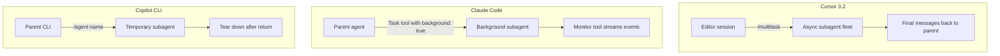

# Cursor /multitask

> Dispatch async subagents from the editor session — parallelise queued prompts and let Cursor break a large task across a background subagent fleet.

Cursor 3.2 (April 24, 2026) added `/multitask` to the [Agents Window](agents-window.md). Instead of queueing prompts, `/multitask` spawns async subagents that run in parallel, and can decompose a large request into chunks "for a fleet of async subagents to tackle simultaneously" ([Cursor changelog](https://cursor.com/changelog)).

## What /multitask Actually Does

Two behaviours, both routed through async subagents ([Cursor changelog](https://cursor.com/changelog)):

1. **Queue parallelisation** — stacked queued prompts run concurrently as background subagents instead of sequentially.
2. **Auto-decomposition** — a single larger request gets split into chunks, each dispatched to its own async subagent.

Each subagent runs in its own context window with no access to prior conversation history; the parent must pass any required context in the dispatch prompt ([Cursor subagents docs](https://cursor.com/docs/subagents)).

## Foreground vs Background — `/multitask` Uses Background

Cursor subagents have two execution modes ([Cursor subagents docs](https://cursor.com/docs/subagents)):

| Mode | Behaviour | When |
|------|-----------|------|
| Foreground | Blocks the parent until the subagent returns | Sequential tasks where the parent needs the output |
| Background | Returns immediately; subagent runs independently | Long-running or parallel workstreams |

`/multitask` is background dispatch — the parent stays interactive while subagents write state and can be resumed by agent ID.

## How Results Surface

Each subagent returns "a final message with its results" to the parent ([Cursor subagents docs](https://cursor.com/docs/subagents)). In the Agents Window each background subagent surfaces as a separate entry the user can inspect or promote. Long-running subagents write state continuously and can be resumed by agent ID after completion.

The parent's context window only receives the final summary from each subagent — intermediate output (file searches, command logs, browser snapshots) stays inside the subagent. This is the same context-isolation mechanism the built-in `Explore`, `Bash`, and `Browser` subagents use ([Cursor subagents docs](https://cursor.com/docs/subagents)).

## /multitask vs Adjacent Surfaces

Cursor 3.2 ships `/multitask` alongside improved worktrees and multi-root workspaces ([Cursor changelog](https://cursor.com/changelog)). The three surfaces solve different isolation problems:

| Surface | Isolation | Use when |
|---------|-----------|----------|
| `/multitask` | Context only | You want async parallelism but edits can land in the foreground checkout |
| `/worktree` | Filesystem (separate git checkout) | Subagents will edit overlapping files or you need clean diffs per task |
| Agents Window tabs | Visual / session | You want to drive multiple agent sessions manually rather than dispatch from one |

`/multitask` and `/worktree` compose. For risky parallel edits, dispatch with `/multitask` against worktree-isolated subagents; for read-mostly fan-out (codebase search, doc generation), `/multitask` alone is enough.

## Cross-Tool Comparison



| | Cursor `/multitask` | Claude Code background subagents | Copilot CLI custom agents |
|---|---|---|---|
| Surface | Slash command in editor / Agents Window | `background: true` frontmatter on subagent definition | `/agent <name>` invocation |
| Auto-decomposition | Yes — Cursor splits a large task into chunks | No — caller dispatches each subagent explicitly | No |
| Result surfacing | Final messages plus resumable agent IDs in the Agents Window | [Monitor tool streams events](../../multi-agent/async-non-blocking-subagent-dispatch.md) from background processes | Subagent torn down after each invocation |
| Filesystem isolation | Compose with `/worktree` for git-level isolation | Per-tool; `Worktree` tool available separately | None built-in |
| Recursion depth | 1 | 1 | 1 |

Sources: [Cursor subagents docs](https://cursor.com/docs/subagents), [Claude Code sub-agents](https://code.claude.com/docs/en/sub-agents), [Cross-tool subagent comparison](../../multi-agent/cross-tool-subagent-comparison.md).

## When /multitask Backfires

`/multitask` is a specialisation of [async non-blocking subagent dispatch](../../multi-agent/async-non-blocking-subagent-dispatch.md). The same caveats apply, plus editor-specific failure modes.

- **No productive parent work during the wait** — Anthropic's [multi-agent research system](https://www.anthropic.com/engineering/multi-agent-research-system) chose synchronous dispatch because "asynchronicity adds challenges in result coordination, state consistency, and error propagation across the subagents." For a single isolated prompt, sequential dispatch is simpler.
- **Tightly-coupled refactor across one module** — subagents lose shared context, produce inconsistent edits, and the user pays merge cost without parallelism gain.
- **Strong sequential dependencies** — subagent B must consume A's output; async degrades to effectively-synchronous with extra bookkeeping.
- **Small task count (1–2 items)** — coordination overhead exceeds parallelism payoff.
- **Overlapping file edits without `/worktree`** — multiple subagents writing to the same file in the foreground checkout produce manual-merge work. Cursor 3.2 shipped improved worktrees alongside `/multitask` for this reason ([Cursor changelog](https://cursor.com/changelog)).
- **Single-purpose, repeatable actions** — Cursor's docs recommend a Skill instead of a subagent for tasks like "format imports" or "generate a changelog" ([Cursor subagents docs](https://cursor.com/docs/subagents)).

## Example

A developer asks Cursor to update the docs site, run the linter, and regenerate the OpenAPI spec from one prompt:

**Without `/multitask`** — three queued prompts run sequentially. The developer waits for each before the next starts.

**With `/multitask`**:

```
/multitask Update the docs index, run the lint suite, and regenerate the OpenAPI spec from src/api
```

Cursor decomposes the request into three independent chunks, dispatches one async subagent per chunk, and surfaces each as a separate entry in the Agents Window. The developer keeps the editor session interactive — drafting the next prompt or reviewing earlier diffs — while the fleet runs. As each subagent finishes, its summary returns to the parent.

If the docs update and OpenAPI regeneration touch overlapping files, compose with `/worktree` so each subagent runs in an isolated checkout and merges land via separate branches.

## Key Takeaways

- `/multitask` runs async background subagents in parallel from the editor session — for queue parallelisation and auto-decomposition of one large request
- Each subagent has its own context window; only the final summary returns to the parent, preserving the parent's planning capacity
- `/multitask` gives context isolation only — compose with `/worktree` when subagents will edit overlapping files
- Justified when the parent has follow-up work during the wait; sequential dispatch is simpler for one-prompt sessions
- Cross-tool: Claude Code uses `background: true` plus the Monitor tool; Copilot CLI tears down subagents per invocation; Cursor adds explicit auto-decomposition

## Related

- [Cursor 3 Agents Window](agents-window.md) — the UI host for `/multitask`, with `/worktree` and `/best-of-n`
- [Async Non-Blocking Subagent Dispatch](../../multi-agent/async-non-blocking-subagent-dispatch.md) — the tool-agnostic pattern this specialises
- [Cross-Tool Subagent Comparison](../../multi-agent/cross-tool-subagent-comparison.md) — broader comparison of subagent definition formats and isolation models
- [Sub-Agents for Fan-Out Research](../../multi-agent/sub-agents-fan-out.md) — the underlying fan-out primitive
