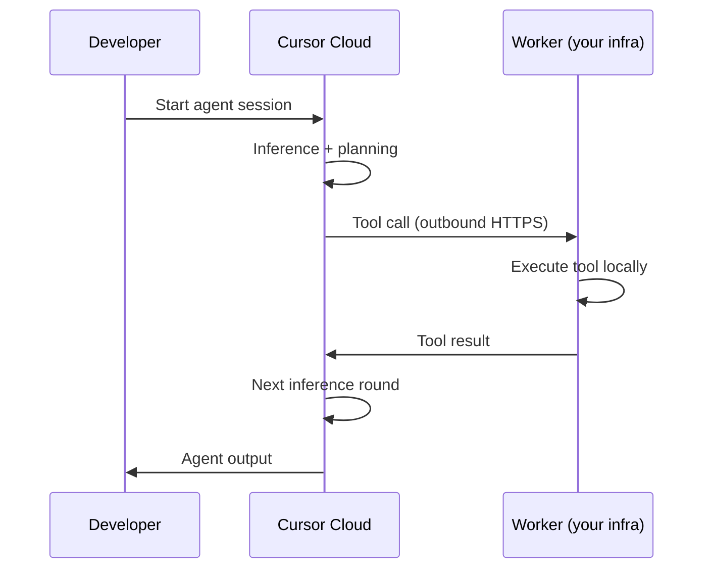

# Cursor Self-Hosted Cloud Agents

> Run Cursor cloud agents in your own infrastructure — inference stays in Cursor's cloud, tool execution runs locally.

Cursor [announced self-hosted cloud agents on March 25, 2026](https://cursor.com/changelog). The feature lets organizations keep code, secrets, and build artifacts inside their own network while still accessing Cursor's agent orchestration and multi-model harness. This is the primary use case for regulated industries, air-gapped networks, and teams whose policy blocks vendor-hosted code execution.

This is distinct from bring-your-own-key (BYOK) patterns. BYOK addresses model API access. Self-hosted agents address where tool calls execute and where code artifacts reside.

## Architecture

The key split: **Cursor's cloud handles inference and planning; your worker handles tool execution.**



The worker connects outbound via HTTPS to Cursor's cloud — no inbound ports, firewall changes, or VPN tunnels required. The worker receives tool calls, executes them against your local environment (filesystem, internal APIs, private registries), and returns results to the cloud for the next inference round. Code never leaves your network.

## Worker Deployment

Start a worker with:

```sh
agent worker start
```

**Worker lifetime options:**

| Mode | Behavior |
|------|----------|
| Long-lived | Single worker handles multiple sequential agent sessions |
| Single-use | Worker terminates after one task completes |

Long-lived workers suit always-on environments (CI runners, shared team infrastructure). Single-use workers suit ephemeral compute (Lambda, container jobs) where you want clean state between tasks.

**Kubernetes:** Deploy at scale via Helm charts and a `WorkerDeployment` custom resource. Define the desired pool size; the controller manages scaling, rolling updates, and lifecycle automatically. A fleet management API covers non-Kubernetes environments with utilization monitoring.

## When to Use Self-Hosted

Use self-hosted execution when:

- Policy prohibits code leaving the organizational network (regulated industries, government, defense)
- The agent needs access to internal resources — private package registries, internal APIs, airgapped build systems — not reachable from Cursor's infrastructure
- Compliance requires data residency: code, secrets, and build artifacts must stay in a specific region or network boundary
- You need agents to run with the same service account permissions as your CI system [unverified]

Use vendor-hosted execution (the default) when you have no residency constraints and want zero operational overhead. Vendor-hosted agents require no infrastructure provisioning, patching, or monitoring.

## Trade-offs

| | Vendor-hosted | Self-hosted |
|---|---|---|
| Setup | None | Worker provisioning, Kubernetes config or fleet API |
| Operational overhead | Zero | Patching, monitoring, scaling worker pool |
| Internal resource access | No | Yes — private registries, internal APIs |
| Code residency | Cursor's cloud | Your network |
| Compliance posture | Depends on Cursor's certifications | Under your control |

The same agent capabilities are available in both modes: parallel execution, long-horizon tasks, multi-model harnesses, plugin support. Self-hosted does not add agent capability — it relocates execution.

## Example

A team with an airgapped internal npm registry needs agents to install dependencies and run tests. Vendor-hosted agents cannot reach `npm.internal.corp`. Self-hosted workers run inside the corporate network with access to the registry:

```sh
# Start a long-lived worker on an internal runner
agent worker start

# Agent now resolves internal packages normally
npm install --registry https://npm.internal.corp
```

The inference (planning which commands to run) happens in Cursor's cloud. The `npm install` executes on the worker inside the corporate network, where the registry is reachable.

## Key Takeaways

- Cursor self-hosted agents split inference (Cursor cloud) from execution (your worker) — code never leaves your network
- Workers connect outbound via HTTPS only — no inbound firewall changes needed
- Kubernetes deployment uses `WorkerDeployment` resources for pool management; a fleet API covers non-Kubernetes environments
- The trade-off is operational overhead (worker provisioning and maintenance) vs. data residency and internal resource access
- Use self-hosted for compliance requirements and internal tooling access; use vendor-hosted when residency is not a constraint

## Related

- [Agents Window](agents-window.md)
- [Agent Harness](../../agent-design/agent-harness.md)
- [Security](../../security/index.md)
