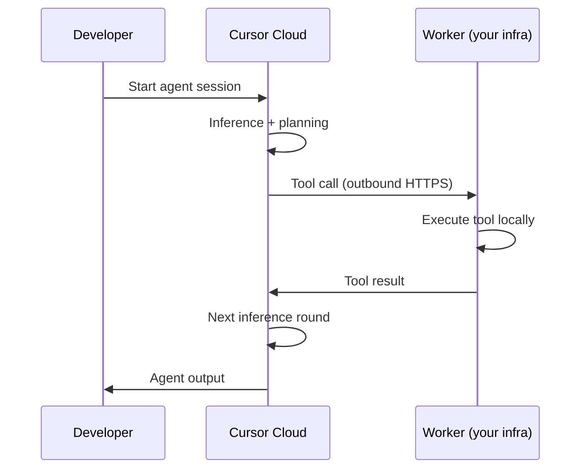

# Cursor Self-Hosted Cloud Agents

> Run Cursor cloud agents in your own infrastructure — inference stays in Cursor's cloud, tool execution runs locally.

Cursor [announced self-hosted cloud agents on March 25, 2026](https://cursor.com/changelog). The feature "moves Cloud Agent tool execution to a machine you manage", while "Cursor runs the agent loop, inference, and planning" ([Cursor docs](https://cursor.com/docs/cloud-agent/self-hosted)). It suits teams that need the agent to reach internal resources, or that need particular hardware. Read the next section before you reach for it as a data-residency control, because it is a weaker one than the name suggests.

This is distinct from bring-your-own-key (BYOK) patterns. BYOK addresses model API access and its [token visibility](../../observability/byok-model-token-visibility.md). Self-hosted agents address where tool calls execute and where code artifacts reside.

## Architecture

The split is simple. Cursor's cloud handles inference and planning. Your worker handles tool execution.


```mermaid
sequenceDiagram
    participant Dev as Developer
    participant CC as Cursor Cloud
    participant W as Worker (your infra)

    Dev->>CC: Start agent session
    CC->>CC: Inference + planning
    CC->>W: Tool call (outbound HTTPS)
    W->>W: Execute tool locally
    W->>CC: Tool result
    CC->>CC: Next inference round
    CC->>Dev: Agent output
```

The worker connects outbound via HTTPS to Cursor's cloud. No inbound ports, firewall changes, or VPN tunnels are required. The worker receives tool calls, executes them against your local environment (filesystem, internal APIs, private registries), and returns results to the cloud for the next inference round. Those results are the part people misread, so they get their own section.

## What leaves your network

Cursor documents this under a heading of the same name, and the answer is not "nothing".

"The full checkout, build cache, and machine-local credentials stay on your machine." But "during a run, the worker sends Cursor the content the agent needs, such as file contents, terminal output, diffs, screenshots, local MCP results, and routing metadata" ([Cursor docs](https://cursor.com/docs/cloud-agent/self-hosted)).

So code crosses the boundary. It goes as the file contents and diffs the model reasons over, rather than as a clone of the repository. Cursor's Privacy Mode sentence concedes the point: when enabled, "code sent from the worker is not used for training by Cursor or model providers" (same source). Privacy Mode governs training. Transmission happens either way.

Artifacts travel on a separate, blockable path. Screenshots, videos, and log references upload to `cloud-agent-artifacts.s3.us-east-1.amazonaws.com`; block that host and the docs say it "only prevents artifacts from uploading" while tool calls and results continue (same source). The session itself runs over `api2.cursor.sh` and `api2direct.cursor.sh`, which you cannot block and keep the feature.

If your requirement is that no source code reaches a vendor, self-hosted machines do not meet it and no flag changes that. What you do get is the checkout, the build cache, and the worker's credentials. For the tool-output channel Cursor offers a procedure, not a boundary: "keep secrets out of tool output and artifacts" (same source).

## Worker deployment

Start a worker with ([full options in Cursor docs](https://cursor.com/docs/cloud-agent/self-hosted)):

```sh
agent worker start --pool
```

Workers run in one of two modes:

| Mode | Behavior |
|------|----------|
| Long-lived | Single worker handles multiple sequential agent sessions |
| Single-use | Worker terminates after one task completes |

Long-lived workers suit always-on environments (CI runners, shared team infrastructure). Single-use workers suit ephemeral compute (Lambda, container jobs) where you want clean state between tasks.

On Kubernetes, a Helm chart and operator manage pool size, scaling, and rolling updates. A fleet management API covers everything else.

The June 2026 [Cursor SDK](cursor-sdk.md) update tightens self-hosted control further. It adds custom `LocalAgentStore` backends, so a self-hosted deployment can persist agent state to its own storage rather than Cursor's. It also adds `customTools` defined through the built-in MCP layer, plus recursive sub-agent nesting ([Cursor changelog](https://cursor.com/changelog)).

## When to use self-hosted

Use self-hosted execution when:

- The agent needs internal resources not reachable from Cursor's infrastructure: private package registries, internal APIs, airgapped build systems
- You need particular hardware, such as GPU machines or Macs for iOS builds
- The checkout itself must not be cloned onto vendor infrastructure, and sending file contents and diffs over the session is acceptable
- You need agents to run with the same credentials and environment access as your CI system

Use vendor-hosted execution, the default, when none of those hold. It needs no provisioning, patching, or monitoring.

## Trade-offs

| | Vendor-hosted | Self-hosted |
|---|---|---|
| Setup | None | Worker provisioning, Kubernetes config or fleet API |
| Operational overhead | Zero | Patching, monitoring, scaling worker pool |
| Internal resource access | No | Yes — private registries, internal APIs |
| Where the checkout lives | Cursor's cloud | Your machine |
| What still reaches Cursor | Everything | File contents, terminal output, diffs, screenshots, MCP results |
| Compliance posture | Depends on Cursor's certifications | Under your control |

Both modes carry the same agent capabilities. Self-hosted adds no capability; it relocates execution.

### What self-hosted does not solve

Relocating execution closes the data-residency gap, but it does not by itself satisfy enterprise governance. Independent analyses ([Qovery — "Cursor Cloud Agents Are Incredible — Until You Need Production Governance"](https://www.qovery.com/blog/cursor-cloud-agents-enterprise-limitations), [Oasis/Cursor governance partnership](https://www.oasis.security/blog/cursor-oasis-governing-agentic-access)) flag three residual gaps that self-hosted workers do not address:

- Audit-trail completeness for change review — workers log tool calls locally, but enterprise change-management evidence (who approved which agent action, against which policy) still needs an external control plane.
- Identity delegation per subagent — workers run with the host environment's credentials, so multi-agent fan-out cannot prove which subagent invoked which privileged action without extra identity wrapping.
- Post-PR pipeline ownership — Cursor agents stop at the PR boundary. Deployment, staging, rollback, and production governance stay the platform team's problem, and self-hosting workers does not change that scope.

Plan for these with an external policy-as-code layer or governance partner if you are deploying agents into a regulated SDLC, not just a regulated network.

## Example

A team with an airgapped internal npm registry needs agents to install dependencies and run tests. Vendor-hosted agents cannot reach `npm.internal.corp`. Self-hosted workers run inside the corporate network with access to the registry:

```sh
# Start a long-lived worker on an internal runner
agent worker start --pool

# Agent now resolves internal packages normally
npm install --registry https://npm.internal.corp
```

Cursor's cloud plans the commands. The `npm install` runs on the worker, where the registry is reachable, and its terminal output goes back to Cursor for the next round.

## Key Takeaways

- Self-hosted agents split inference (Cursor's cloud) from execution (your worker). The checkout stays local; file contents and diffs do not
- Workers connect outbound via HTTPS only — no inbound firewall changes needed
- Kubernetes deployment uses a Helm chart and operator for pool management; a fleet API covers non-Kubernetes environments
- The trade-off is operational overhead (worker provisioning and maintenance) versus data residency and internal resource access
- Use self-hosted for compliance requirements and internal tooling access; use vendor-hosted when residency is not a constraint

## Related

- [Agents Window](agents-window.md)
- [Agent Harness](../../patterns/agent-design/agent-harness.md)
- [Security](../../security/index.md)
