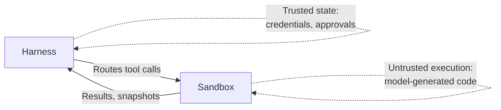

# OpenAI Agents SDK Sandboxes Harness and Memory

> The April 2026 OpenAI Agents SDK update ships three primitives — controlled sandboxes, an inspectable harness, and configurable memory — in one Python library.

## What Shipped

OpenAI released the Agents SDK update on [2026-04-15](https://openai.com/index/the-next-evolution-of-the-agents-sdk/), consolidating three primitives teams previously assembled themselves:

1. A **model-native harness** — the control plane around the model
2. **Native sandbox execution** — a compute plane for model-directed work
3. **Configurable memory** — two distinct systems (session and sandbox)

Python-first; TypeScript is [planned for later](https://openai.com/index/the-next-evolution-of-the-agents-sdk/).

## Harness / Compute Separation

The SDK separates a persistent, trusted **harness** from an ephemeral, untrusted **compute** environment ([concepts guide](https://openai.github.io/openai-agents-python/sandbox/guide/)):

| Plane | Owns |
|-------|------|
| Harness | Agent loop, model calls, tool routing, handoffs, approvals, tracing, recovery, run state |
| Compute | File reads/writes, command execution, dependency installs, mounted storage, exposed ports, state snapshots |

Colocation would let model-generated shell commands read loop credentials. Separation contains blast radius and enables snapshot/rehydrate: when a sandbox fails or expires, the SDK [restores state in a fresh container from the last checkpoint](https://openai.com/index/the-next-evolution-of-the-agents-sdk/).



## Sandbox Primitives

Sandbox execution is authored through [`SandboxAgent`, `Runner.run`, and `RunConfig`](https://developers.openai.com/api/docs/guides/agents/sandboxes). `SandboxAgent` keeps the standard agent surface (instructions, tools, handoffs, `mcp_servers`, guardrails, hooks) and adds a `Manifest` plus `LocalDir` mounts that declare the workspace file-access surface.

Sandbox clients are pluggable ([reference](https://openai.github.io/openai-agents-python/sandbox/clients/)):

- `UnixLocalSandboxClient` — local filesystem, dev-only
- Docker — stronger isolation, production parity
- Hosted providers — OpenAI [partners with Cloudflare, Vercel, E2B, and Modal](https://devops.com/openai-upgrades-its-agents-sdk-with-sandboxing-and-a-new-model-harness/) for container-based execution

The provider lives in `RunConfig`, not the agent — keep `SandboxAgent`, manifest, and capabilities stable and [swap the client per environment](https://developers.openai.com/api/docs/guides/agents/sandboxes).

**Isolation caveat**: partners ship containers (Modal uses gVisor). For cross-tenant threat models, [container isolation is weaker than Firecracker microVMs](https://northflank.com/blog/best-code-execution-sandbox-for-ai-agents) — see [Subprocess and PID-namespace sandboxing](../../security/subprocess-pid-namespace-sandboxing.md).

## Harness Primitives

The harness standardises primitives that were previously bespoke per-agent ([Help Net Security](https://www.helpnetsecurity.com/2026/04/16/openai-agents-sdk-harness-and-sandbox-update/)):

- Tool use via [MCP](../../standards/mcp-protocol.md)
- Progressive disclosure via [skills](../../standards/agent-skills-standard.md)
- Custom instructions via [`AGENTS.md`](../../standards/agents-md.md)
- Code execution via a `shell` tool
- File edits via an `apply_patch` tool
- Compaction for long-running runs

Loop customisation is coarse. `Runner` manages turns, tools, guardrails, handoffs, and sessions — teams that [want full loop control](https://ai-sdk.dev/docs/agents/loop-control) call the Responses API directly.

## Memory: Two Systems

The SDK exposes **two memory systems**, each with a distinct lifecycle. Confusing them is the most common mistake.

### Session Memory

Conversation history with an explicit API ([sessions guide](https://openai.github.io/openai-agents-python/sessions/)):

- `add_items()` — append messages
- `get_items()` — retrieve history
- `pop_item()` — remove most recent
- `clear_session()` — wipe

After a non-streaming run, `add_items()` persists the user input plus model outputs from the latest turn. Backends ship as first-class extras:

| Backend | Purpose |
|---------|---------|
| `SQLiteSession` / `AsyncSQLiteSession` | Local dev, single-server |
| [`SQLAlchemySession`](https://openai.github.io/openai-agents-python/sessions/sqlalchemy_session/) | Production — Postgres, MySQL, SQLite |
| `RedisSession` | Shared cache-backed session |
| `AdvancedSQLiteSession` | Branching, analytics, structured queries |
| [`EncryptedSession`](https://openai.github.io/openai-agents-python/sessions/encrypted_session/) | At-rest encryption wrapper |

### Sandbox Memory

Filesystem artifacts distilled from prior runs ([agent memory guide](https://openai.github.io/openai-agents-python/sandbox/memory/)). The workspace stores:

- `MEMORY.md` — concise summary injected into later runs
- `memories/memory_summary.md` — longer distilled lessons
- `raw_memories/` — unprocessed notes
- `workspace/sessions/<rollout-id>.jsonl` — rollout transcripts

The agent searches `MEMORY.md` for keywords and opens deeper rollout summaries only when needed — progressive disclosure inside the workspace.

Neither system replaces a dedicated long-term vector or graph store for cross-agent knowledge — pair with [agent memory patterns](../../agent-design/agent-memory-patterns.md) for scope beyond a workspace.

## When to Pick the SDK

Pick the SDK when:

- Python stack, no existing harness or sandbox investments
- Container isolation meets your threat model
- You accept an opinionated loop (`Runner`) and memory schema (`MEMORY.md`, rollout summaries)
- You want durable execution without writing it yourself

Skip the SDK when:

- You need TypeScript today
- You require microVM isolation for cross-tenant blast radius
- You need custom turn scheduling, non-standard handoffs, or heterogeneous model routing — call the Responses API directly
- You already run a [self-hosted harness](../../agent-design/managed-vs-self-hosted-harness.md) with verification or replay

## Example

A `SandboxAgent` run with a `SQLAlchemySession` for conversation history and a Docker sandbox for execution. The harness routes the tool call; the sandbox runs `shell` and `apply_patch` against a manifested workspace.

```python
from agents import Runner, RunConfig
from agents.sandbox import SandboxAgent, Manifest, LocalDir
from agents.extensions.memory import SQLAlchemySession

session = SQLAlchemySession.from_url(
    "user-123",
    url="postgresql+asyncpg://app:pw@db/agents",
    create_tables=True,
)

agent = SandboxAgent(
    name="refactor-bot",
    instructions="Refactor the target module. Run tests after each change.",
    manifest=Manifest(mounts=[LocalDir("./target", read_write=True)]),
    # tools: shell + apply_patch are wired by the harness
)

result = await Runner.run(
    agent,
    input="Extract the auth middleware into its own module.",
    session=session,
    run_config=RunConfig(sandbox_client="docker"),
)
```

Swap `sandbox_client="docker"` for `"unix_local"` in dev or a hosted provider in production. The agent definition, manifest, and session stay stable.

## Key Takeaways

- Three primitives in one Python SDK: model-native harness, native sandbox execution, configurable memory — shipped 2026-04-15
- Harness owns the trusted loop; sandbox owns untrusted execution — snapshot/rehydrate recovers from sandbox failure
- Two memory systems: `Session` for conversation history (SQLAlchemy, SQLite, Redis, encrypted), sandbox memory for filesystem-distilled lessons across runs
- Harness primitives are opinionated (`shell`, `apply_patch`, `AGENTS.md`, MCP, skills, compaction) — bypass `Runner` for custom loops
- Container-level isolation via partner providers (Cloudflare, Vercel, E2B, Modal) — insufficient for threat models requiring microVMs

## Related

- [Subprocess and PID-namespace sandboxing](../../security/subprocess-pid-namespace-sandboxing.md)
- [Sandbox rules and harness tools](../../security/sandbox-rules-harness-tools.md)
- [Harness engineering](../../agent-design/harness-engineering.md)
- [Managed vs self-hosted harness](../../agent-design/managed-vs-self-hosted-harness.md)
- [Agent memory patterns](../../agent-design/agent-memory-patterns.md)
- [Session harness sandbox separation](../../agent-design/session-harness-sandbox-separation.md)
- [Claude Agent SDK](../claude/agent-sdk.md)
- [Copilot SDK](../copilot/copilot-sdk.md)
