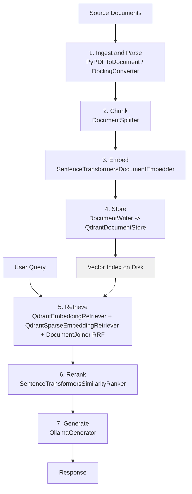

# Air-Gapped RAG: Architecture Fundamentals

> The seven stages of the RAG pipeline — what each does, where data lives, which stages are tightly coupled, and what breaks at each stage in a fully offline deployment.

Cloud RAG tutorials treat component boundaries as implementation details because every stage is a SaaS API call. In an air-gapped deployment, every component runs on your hardware and every boundary is a potential leak or failure point. This module gives you the mental model required to reason about the full pipeline before choosing any specific tools.

The series [reference stack](index.md#reference-stack) implements every stage below as a [Haystack 2.x](https://github.com/deepset-ai/haystack) `Component`, wired into one `Pipeline`. Each stage header below names the Haystack Component the runnable code in later modules uses; readers who prefer a different framework can replace the components one-for-one without changing the seven-stage mental model.

---

## The Two Phases

A RAG system operates in two distinct phases with different resource profiles and timing characteristics.

**Indexing phase** (offline, async): Documents are ingested, parsed, chunked, embedded, and stored. This phase runs ahead of any user query. It can be batched, parallelized, and repeated. The output is a vector index on disk.

**Query phase** (online, sync): A user query arrives, gets embedded with the same model used in indexing, is matched against the index, optionally reranked, and passed to the generation model with retrieved context. Latency here is user-visible.

The two phases share exactly one component: the embedding model. Every embedding in the index and every query embedding must use the same model version. This is the tightest coupling in the entire pipeline.

---

## The Seven Stages



Every label after the stage name is the Haystack Component the reference stack uses at that stage. Stages 3 and 4 run together in the indexing pipeline; stages 5–7 run together in the query pipeline. The only component shared across both pipelines is the embedder (in dual form as `SentenceTransformersDocumentEmbedder` for indexing and `SentenceTransformersTextEmbedder` for queries — both must load the same model version).

### Stage 1: Ingest and Parse

Extract text from source documents. For PDFs: [PyMuPDF](https://github.com/pymupdf/PyMuPDF), [pdfminer.six](https://github.com/pdfminer/pdfminer.six), or [docling](https://github.com/DS4SD/docling). For Word/DOCX: [python-docx](https://github.com/python-openxml/python-docx). For HTML: [BeautifulSoup](https://www.crummy.com/software/BeautifulSoup/) or [unstructured](https://github.com/Unstructured-IO/unstructured). For images with text: a local OCR model ([Tesseract](https://github.com/tesseract-ocr/tesseract) or [PaddleOCR](https://github.com/PaddlePaddle/PaddleOCR)).

**Data lives here**: Raw document bytes → plain text strings. Documents stay on local storage throughout.

**Resource profile**: CPU-bound. Parsing is embarrassingly parallel — run one process per CPU core. No GPU required. Memory scales with the largest document in the batch, not total corpus size.

**Haystack components**: `PyPDFToDocument`, `DOCXToDocument`, `HTMLToDocument`, `MarkdownToDocument`, `TextFileToDocument` (all in `haystack.components.converters`); `DoclingConverter` from [`docling-haystack`](https://github.com/DS4SD/docling-haystack) for layout-aware parsing. Each produces a list of `haystack.Document` objects with source metadata attached, ready to hand to the next stage. Covered in detail in [Module 3](document-ingestion-and-parsing.md).

**Air-gap consideration**: Parsing libraries require no network access for PDF/DOCX/HTML extraction. OCR models (Tesseract, [EasyOCR](https://github.com/JaidedAI/EasyOCR)) and ML-based parsers (docling, marker) run offline once model weights are downloaded — pre-fetch weights on the network side and set `artifacts_path` (docling) or `local_files_only=True` (HuggingFace) before air-gapping. The remaining risk is parsing libraries that phone home for updates — pin versions and disable update checks.

### Stage 2: Chunk

Split parsed text into segments that fit within the embedding model's context window and are semantically coherent enough to stand alone as retrieval units.

**Data lives here**: Plain text strings → a list of text chunks, each with source metadata (filename, page number, character offset).

**Resource profile**: CPU-bound, negligible. Chunking is fast string manipulation.

**Coupling note**: Chunk size is constrained by embedding model max tokens, not by the vector store. Most embedding models support 512 or 8192 tokens. Set chunk size below the model's declared max to leave headroom for tokenizer special tokens (CLS, SEP) and for slack between character-based counting and the model's actual BPE token count — a 512-token model in practice accepts ~460–480 tokens of real content.

**Haystack component**: `DocumentSplitter` from `haystack.components.preprocessors`. Supports `split_by="word" | "sentence" | "passage" | "page" | "line"`, `split_length`, `split_overlap`, and `split_threshold`. Handles sentence-aware boundaries when configured with `split_by="sentence"`. Covered in detail in [Module 4](chunking-strategies.md).

**Failure mode**: Chunks that split mid-sentence or mid-table lose semantic meaning. Retrieval then returns incoherent fragments. Use `DocumentSplitter(split_by="sentence")` or the `split_by="passage"` mode for paragraph-aware splits rather than the default word-based split.

### Stage 3: Embed

Convert each text chunk into a dense vector representation. This vector encodes semantic meaning — chunks with similar meaning will be close together in vector space.

**Data lives here**: Text chunks → float vectors. A 10M-document corpus with 1024-dimensional embeddings requires approximately 40GB of vector storage ([RAG embeddings storage analysis](https://link.springer.com/chapter/10.1007/978-3-032-08465-1_16)).

**Resource profile**: GPU-friendly but not GPU-required. [`nomic-embed-text-v1.5`](https://huggingface.co/nomic-ai/nomic-embed-text-v1.5) scores 62.39 MTEB on CPU alone ([Ollama](https://ollama.com/library/nomic-embed-text)). Small models (384–768 dimensions): 2–4GB RAM, 1–2GB VRAM optional. Large models (1024+ dimensions): 8–16GB RAM, 4–8GB VRAM recommended ([Morph: Ollama Embedding Models](https://www.morphllm.com/ollama-embedding-models)).

**Tight coupling**: The embedding model's output dimension must exactly match the vector store's configured dimension. Changing the embedding model at any point — even a patch version — requires re-embedding the entire corpus and rebuilding the index from scratch. Pin the model version and store it in the index metadata.

**Haystack components**: `SentenceTransformersDocumentEmbedder` for indexing chunks, `SentenceTransformersTextEmbedder` for embedding queries at search time. Both live in `haystack.components.embedders` and load the same Hugging Face model — the split exists because document and query embedding paths often need different instruction prefixes (e.g., BGE, E5 families). For sparse retrieval alongside dense, use `SentenceTransformersSparseDocumentEmbedder` and `SentenceTransformersSparseTextEmbedder`. Covered in [Module 5](local-embeddings-vector-stores.md).

**Air-gap consideration**: Models are downloaded to the Hugging Face cache on first use. Pre-fetch on the network side, point `HF_HOME` at the controlled cache directory, and set `HF_HUB_OFFLINE=1` in the runtime environment to raise immediately on any outbound fetch attempt. [`BGE-M3`](https://huggingface.co/BAAI/bge-m3) supports dense and sparse retrieval in one model, which maps cleanly onto Haystack's separate dense/sparse embedder components.

### Stage 4: Store

Persist vectors and their associated metadata (chunk text, source document, position) to a vector database on local disk.

**Data lives here**: Float vectors + metadata → indexed structure on disk.

**Resource profile**: Memory-bound at query time. Vector similarity search loads index segments into RAM. For large corpora, ensure the vector database's working set fits in available RAM or plan for MMAP-based access.

**Local options**: [Chroma](https://github.com/chroma-core/chroma) (embedded, zero-config, single process), [Qdrant](https://github.com/qdrant/qdrant) (embedded or standalone, supports filtering and sparse vectors), [LanceDB](https://github.com/lancedb/lancedb) (columnar, Rust-native, no separate process), [pgvector](https://github.com/pgvector/pgvector) (PostgreSQL extension, SQL-native, existing infra). All run fully offline.

**Haystack component**: `DocumentWriter` from `haystack.components.writers` combined with a `DocumentStore`. The reference stack uses `QdrantDocumentStore` from [`qdrant-haystack`](https://github.com/deepset-ai/haystack-core-integrations/tree/main/integrations/qdrant); alternatives include `ChromaDocumentStore`, `InMemoryDocumentStore`, `WeaviateDocumentStore`, `ElasticsearchDocumentStore`, and many others — every store is a separate integration package, so you install only what you use. Covered in [Module 5](local-embeddings-vector-stores.md).

**Failure mode**: Stale index. If source documents are updated post-ingestion, the index reflects the old content. Retrieval returns outdated chunks with no warning. Implement a document hash registry: store a hash of each source document at ingest time; re-ingest on hash change. Haystack's `Document` class carries an arbitrary `meta` dict — a `source_hash` field on every document makes re-ingest detection a metadata filter at the store level.

### Stage 5: Retrieve

Given a query vector, return the top-k most similar chunks from the index. Two retrieval strategies exist and can be combined.

**Dense retrieval**: Cosine or dot-product similarity over the full embedding space. Fast, captures semantic meaning, misses exact term matches.

**Sparse retrieval (BM25/keyword)**: Inverted index over token frequencies. Catches exact terms, handles acronyms and proper nouns, misses paraphrase.

**Hybrid retrieval**: Run both in parallel, merge results with reciprocal rank fusion. Requires a vector database that supports both index types ([Qdrant](https://github.com/qdrant/qdrant), [Elasticsearch](https://github.com/elastic/elasticsearch), or a separate BM25 index). BGE-M3 generates both dense and sparse vectors in one pass, simplifying this.

**Resource profile**: CPU-based similarity matching against the index. Memory-bound: the vector index's working set must be in RAM for low latency. Retrieval typically takes 10–50ms for indexes under 1M vectors with adequate RAM.

**Haystack components**: `QdrantEmbeddingRetriever` for dense, `QdrantSparseEmbeddingRetriever` for sparse, and `DocumentJoiner(join_mode="reciprocal_rank_fusion")` from `haystack.components.joiners` to fuse them. The fusion is a pure rank-based operation — no score normalization required — so you can plug any two retrievers into the joiner and get clean RRF output. Covered in [Module 6](retrieval-and-reranking.md).

**Failure mode**: Retrieval misses. The top-k results do not include the chunk the query actually needs. Causes: chunk too large (dilutes the semantic signal), chunk too small (lacks context), wrong embedding model for the domain, or query terms not matching document vocabulary. Hybrid retrieval reduces this significantly.

### Stage 6: Rerank

Re-score the top-k retrieved chunks using a cross-encoder model that attends to both the query and the chunk simultaneously, producing a more accurate relevance score than the bi-encoder used for retrieval.

LLMs suffer from the "Lost in the Middle" problem — they focus on context at the extremes of the prompt and ignore chunks in the middle ([LlamaIndex](https://www.llamaindex.ai/blog/using-llms-for-retrieval-and-reranking-23cf2d3a14b6)). Reranking ensures the most relevant chunks are placed at the top before truncating to the generation context window.

**Resource profile**: Run the reranker against the top-20 or top-30 candidates only — not the full corpus. Restricting to a small candidate set keeps precision high without destroying latency. Cross-encoders like [`cross-encoder/ms-marco-MiniLM-L-6-v2`](https://huggingface.co/cross-encoder/ms-marco-MiniLM-L-6-v2) run on CPU for small candidate sets. Module 6 covers reranker model selection in depth and settles on [`bge-reranker-v2-m3`](https://huggingface.co/BAAI/bge-reranker-v2-m3) as the series reference.

**Haystack components**: `SentenceTransformersSimilarityRanker` from `haystack.components.rankers` is the primary reranker — it loads any cross-encoder from Hugging Face and runs it against a `top_k` window pulled from the joiner output. `LostInTheMiddleRanker` complements it by reordering the final context so the most relevant chunks land at the extremes of the prompt rather than the middle. Both run locally, no server process required. Covered in [Module 6](retrieval-and-reranking.md).

**Failure mode**: Skipping rerank for latency reasons and sending the top-k bi-encoder results directly to generation. The generation model receives irrelevant chunks in prominent positions. The result is confident hallucination anchored to irrelevant text. Apply both rankers together in the query pipeline: similarity ranker filters to the top-5 or top-10, then lost-in-the-middle ranker orders the remaining chunks to sidestep the [attention-in-the-middle problem](https://arxiv.org/abs/2307.03172).

### Stage 7: Generate

Pass the reranked chunks, query, and a system prompt to a local LLM. The model generates a response grounded in the retrieved context.

**Data lives here**: Query + context chunks → generated text. This is the only stage where all data comes together.

**Resource profile**: VRAM-bound. The KV cache grows linearly with context length — doubling the context doubles the VRAM. A 7B model at 4-bit quantization requires approximately 4–5GB VRAM baseline; add context overhead. For large context windows (>8k tokens), 16GB VRAM is a practical minimum. A 13B+ model at 4-bit requires 24GB+ VRAM ([simple-local-rag](https://github.com/mrdbourke/simple-local-rag)).

**Local options**: [Ollama](https://github.com/ollama/ollama) (simplest, serves any GGUF model), [vLLM](https://github.com/vllm-project/vllm) (higher throughput, multi-GPU), [llama.cpp](https://github.com/ggerganov/llama.cpp) (direct, no server overhead). Models: [Llama 3](https://github.com/meta-llama/llama3), [Mistral](https://github.com/mistralai/mistral-src), [Qwen2.5](https://github.com/QwenLM/Qwen2.5), [Phi-4](https://huggingface.co/microsoft/phi-4).

**Haystack components**: `OllamaGenerator` and `OllamaChatGenerator` from [`ollama-haystack`](https://github.com/deepset-ai/haystack-core-integrations/tree/main/integrations/ollama) are the reference-stack choice — they wrap Ollama's REST API with a minimal Component interface. For vLLM deployments, `OpenAIGenerator` from `haystack.components.generators` works against vLLM's OpenAI-compatible endpoint (`base_url="http://localhost:8000/v1"`). `PromptBuilder` and `ChatPromptBuilder` from `haystack.components.builders` assemble the system prompt + retrieved chunks + query from a Jinja template. Covered in [Module 7](local-llm-inference.md).

**Air-gap consideration**: By default, Ollama binds to `0.0.0.0:11434`, exposing its API on all network interfaces. On a bare-metal host, set `OLLAMA_HOST=127.0.0.1:11434` to restrict the API to localhost ([Sitepoint](https://www.sitepoint.com/local-rag-private-documents/)). Inside a container the boundary is the container network, not `localhost` — keep `0.0.0.0` binding within the container and expose no host port, so other services on the same compose network can reach Ollama while the host remains isolated. Audit all bound ports at runtime: `ss -tlnp | grep ollama`.

**Failure mode**: Hallucination when retrieved context is insufficient or contradictory. The model fills gaps with training-data priors. Mitigation: explicit system prompt instruction to refuse rather than speculate; citation requirement in output format; verification stage comparing output claims against source chunks.

---

## Assembling the Pipeline in Haystack

The seven stages above become two Haystack `Pipeline` objects: one for indexing (stages 1–4), one for querying (stages 5–7). Every component is a first-class object with typed inputs and outputs; wiring is explicit.

### Indexing pipeline

```python
from haystack import Pipeline
from haystack.components.converters import PyPDFToDocument
from haystack.components.preprocessors import DocumentCleaner, DocumentSplitter
from haystack.components.embedders import (
    SentenceTransformersDocumentEmbedder,
    SentenceTransformersSparseDocumentEmbedder,
)
from haystack.components.writers import DocumentWriter
from haystack_integrations.document_stores.qdrant import QdrantDocumentStore

# Qdrant with both dense and sparse vectors enabled at collection creation
document_store = QdrantDocumentStore(
    path="/data/qdrant_db",              # local persistent mode
    index="documents",
    embedding_dim=768,                    # matches nomic-embed-text-v1.5
    use_sparse_embeddings=True,
    recreate_index=False,                 # never clobber an existing index by accident
)

indexing = Pipeline()
indexing.add_component("converter", PyPDFToDocument())
indexing.add_component("cleaner", DocumentCleaner())
indexing.add_component("splitter", DocumentSplitter(
    split_by="sentence", split_length=5, split_overlap=1,
))
indexing.add_component("dense_embedder", SentenceTransformersDocumentEmbedder(
    model="nomic-ai/nomic-embed-text-v1.5",
    device="cpu",                         # swap to "cuda" when a GPU is available
))
indexing.add_component("sparse_embedder", SentenceTransformersSparseDocumentEmbedder(
    model="prithivida/Splade_PP_en_v1",   # or any SPLADE-family sparse embedder
))
indexing.add_component("writer", DocumentWriter(document_store=document_store))

indexing.connect("converter.documents", "cleaner.documents")
indexing.connect("cleaner.documents", "splitter.documents")
indexing.connect("splitter.documents", "dense_embedder.documents")
indexing.connect("dense_embedder.documents", "sparse_embedder.documents")
indexing.connect("sparse_embedder.documents", "writer.documents")

indexing.run({"converter": {"sources": ["corpus/contract-001.pdf"]}})
```

### Query pipeline

```python
from haystack.components.embedders import (
    SentenceTransformersTextEmbedder,
    SentenceTransformersSparseTextEmbedder,
)
from haystack.components.joiners import DocumentJoiner
from haystack.components.rankers import SentenceTransformersSimilarityRanker
from haystack.components.builders import PromptBuilder
from haystack_integrations.components.retrievers.qdrant import (
    QdrantEmbeddingRetriever,
    QdrantSparseEmbeddingRetriever,
)
from haystack_integrations.components.generators.ollama import OllamaGenerator

PROMPT_TEMPLATE = """\
Answer the question using only the context below. Cite every fact with [N],
matching the numbered sources. If no source supports the answer, say so.


[{{ loop.index }}] {{ doc.content }}


Question: {{ query }}
Answer:"""

query = Pipeline()
query.add_component("dense_query", SentenceTransformersTextEmbedder(
    model="nomic-ai/nomic-embed-text-v1.5", device="cpu",
))
query.add_component("sparse_query", SentenceTransformersSparseTextEmbedder(
    model="prithivida/Splade_PP_en_v1",
))
query.add_component("dense_retriever", QdrantEmbeddingRetriever(
    document_store=document_store, top_k=20,
))
query.add_component("sparse_retriever", QdrantSparseEmbeddingRetriever(
    document_store=document_store, top_k=20,
))
query.add_component("joiner", DocumentJoiner(join_mode="reciprocal_rank_fusion", top_k=20))
query.add_component("ranker", SentenceTransformersSimilarityRanker(
    model="BAAI/bge-reranker-v2-m3", top_k=5, device="cpu",
))
query.add_component("prompt", PromptBuilder(template=PROMPT_TEMPLATE))
query.add_component("llm", OllamaGenerator(
    model="qwen2.5:7b",
    url="http://localhost:11434",
    generation_kwargs={"temperature": 0.1, "num_predict": 512},
))

query.connect("dense_query.embedding", "dense_retriever.query_embedding")
query.connect("sparse_query.sparse_embedding", "sparse_retriever.query_sparse_embedding")
query.connect("dense_retriever.documents", "joiner.documents")
query.connect("sparse_retriever.documents", "joiner.documents")
query.connect("joiner.documents", "ranker.documents")
query.connect("ranker.documents", "prompt.documents")
query.connect("prompt.prompt", "llm.prompt")

result = query.run({
    "dense_query": {"text": "Which contracts have arbitration clauses expiring before 2027?"},
    "sparse_query": {"text": "Which contracts have arbitration clauses expiring before 2027?"},
    "ranker":       {"query": "Which contracts have arbitration clauses expiring before 2027?"},
    "prompt":       {"query": "Which contracts have arbitration clauses expiring before 2027?"},
})
print(result["llm"]["replies"][0])
```

### Pipeline-as-YAML for audit and reproducibility

Either pipeline serializes to a YAML document with `pipeline.dumps()`. The output is human-readable, Git-diffable, and reviewable by someone who does not read Python:

```python
with open("query_pipeline.yaml", "w") as f:
    f.write(query.dumps())

# Reload from YAML — identical graph, identical components
from haystack import Pipeline
reloaded = Pipeline.loads(open("query_pipeline.yaml").read())
```

For defence-grade deployments this is the audit artifact that accompanies every signed container release: the YAML lists every component, its class, its parameters (model names, top-k values, temperature), and the wiring between them. A security reviewer can confirm the pipeline contains no network component class, and a change-control process can require a new signature when the YAML changes.

---

## Coupling Map

Understanding which stages are tightly coupled tells you the cost of changing each component.

| Stage pair | Coupling | Reason |
|-----------|----------|--------|
| Embed → Store | **Tight** | Embedding dimension must match vector store configuration exactly |
| Store → Retrieve | **Tight** | Retrieval algorithm must be compatible with the index format used at store time |
| Chunk → Embed | **Moderate** | Chunk size is constrained by embedding model max tokens |
| Ingest → Chunk | **Loose** | Any chunking strategy works on any parsed text |
| Retrieve → Generate | **Loose** | Any LLM can receive retrieved chunks; no format constraint |
| Retrieve → Rerank | **Loose** | Reranker operates on the retrieved text, independent of how it was retrieved |

**Implication**: Swapping your embedding model is the most disruptive change. It invalidates the entire index. Swapping your generation model is the least disruptive — no re-indexing required. In Haystack terms: swapping `OllamaGenerator` for `OpenAIGenerator` (pointed at vLLM) is one line and requires no pipeline rebuild; swapping `SentenceTransformersDocumentEmbedder`'s model parameter requires a full re-run of the indexing pipeline against the entire corpus.

---

## Hardware Sizing by Stage

| Stage | Bottleneck | Minimum | Practical |
|-------|-----------|---------|-----------|
| Ingest/Parse | CPU cores | 2 cores | 8+ cores |
| Chunk | CPU (negligible) | Any | Any |
| Embed (small model) | RAM | 4GB RAM | 8GB RAM + 2GB VRAM |
| Embed (large model) | VRAM | 8GB RAM + 4GB VRAM | 16GB RAM + 8GB VRAM |
| Store (vector index) | RAM (at query time) | 8GB RAM | 32GB+ RAM for large corpora |
| Retrieve | RAM bandwidth | 8GB RAM | 32GB+ RAM |
| Rerank | CPU | 4 cores | 8+ cores |
| Generate (7B, 4-bit) | VRAM | 6GB VRAM | 12GB VRAM |
| Generate (13B, 4-bit) | VRAM | 12GB VRAM | 24GB VRAM |

The CPU and GPU resource demands are largely non-overlapping within the indexing phase — a multi-GPU server is not required for a functional system. A single workstation with 32GB RAM and an RTX 4090 (24GB VRAM) handles the full pipeline for document corpora up to several million pages.

---

## Air-Gap Boundary Verification

An air-gapped deployment guarantees that documents, embeddings, and generated text never leave the local network. Verify this at three levels.

**Process level**: Every model runs as a local process (Ollama, llama.cpp, sentence-transformers). No `requests` calls to external APIs in the pipeline code. Dump the Haystack pipeline to YAML (`pipeline.dumps()`) and grep for network-bearing component classes — `OpenAIGenerator`, `AzureOpenAIGenerator`, `AnthropicGenerator`, `CohereRanker`, any `*API*` class — to confirm none are present. Audit with `strace -e trace=network <pid>` or `ss -tlnp` during a pipeline run.

**Network level**: Use a firewall rule or network namespace to block all outbound traffic from the inference host. Confirm the pipeline runs correctly with no external connectivity: `unshare --net python ingest.py`.

**Dependency level**: Pin all Python package versions and mirror to an internal PyPI proxy before air-gapping the host. The Haystack direct dependency set is small and explicit: `haystack-ai` plus one integration package per external component you actually use (`qdrant-haystack`, `ollama-haystack`, `docling-haystack`, etc.). Pin each to a specific version and include in your SBOM. Models must be downloaded once and stored in the local Hugging Face cache and Ollama model registry before the network is disconnected; set `HF_HOME`, `HF_HUB_OFFLINE=1`, `TRANSFORMERS_OFFLINE=1`, and `OLLAMA_MODELS` to controlled paths.

---

## Failure Mode Summary

| Stage | Failure mode | Signal | Mitigation |
|-------|-------------|--------|-----------|
| Ingest | Parse failure on corrupt or encrypted PDFs | Exception at parse time, no chunk produced | Log and quarantine failed documents; track ingest coverage |
| Chunk | Mid-sentence splits | Fragmented retrieval results | Use sentence-aware splitters; verify chunks manually on a sample |
| Embed | Model version drift | Retrieval quality degrades after re-index of new documents only | Pin embedding model version; hash the model at index build time |
| Store | Stale index | Outdated information in responses | Document hash registry; scheduled re-ingest for updated sources |
| Retrieve | Retrieval misses | Correct answer not in top-k | Hybrid retrieval (dense + sparse); tune chunk size; increase k |
| Rerank | Latency exceeds budget | User-visible delay | Cap rerank candidate count at 20–30; use smaller cross-encoder |
| Generate | Hallucination | Claims not supported by retrieved context | Require citations in output; post-generation verification step |

---

## Key Takeaways

- **Two phases, one shared component.** Indexing is offline and async; query is online and sync. The embedding model is the only component shared between phases — pin its version before building the index.
- **Tight coupling is localized.** The embed→store boundary is the hardest to change. Retrieval strategy, reranker, and generation model are all independently swappable.
- **Hardware demands are stage-specific.** Ingest is CPU-bound. Embedding is GPU-friendly but CPU-capable. Retrieval is memory-bound. Generation is VRAM-bound. A single 32GB RAM + 24GB VRAM workstation handles the full pipeline for multi-million-page corpora.
- **Air-gap compliance requires explicit verification.** Default Ollama binds to all interfaces. Verify at the process, network, and dependency layer — not just the architecture diagram.
- **Stale index is the most common silent failure.** Documents update; the index does not. Implement document hashing at ingest time and re-ingest on change detection.
- **Reranking is not optional.** Top-k bi-encoder retrieval without reranking degrades generation quality due to the "Lost in the Middle" problem. Apply a cross-encoder to the top-20 candidates before passing context to the generation model.
- **The seven stages map to a Haystack Pipeline one-for-one.** Indexing and query pipelines serialize to YAML — the audit artifact that accompanies every signed release. Pinning the YAML pins the architecture, the parameters, and the component classes in one reviewable document.

## Unverified Claims

- ColBERT-style multi-vector retrieval in BGE-M3 via Ollama's serving layer — the model supports it natively; whether Ollama exposes the multi-vector API endpoint is unconfirmed. Use sentence-transformers directly for confirmed ColBERT retrieval.
- Exact ingest parallelism limits for PyMuPDF and Unstructured on high core-count servers.

## Related

- [Overview and When to Use Air-Gapped RAG](overview.md)
- [Document Ingestion and Parsing](document-ingestion-and-parsing.md)
- [Chunking Strategies](chunking-strategies.md)
- [Local Embeddings and Vector Stores](local-embeddings-vector-stores.md)
- [Retrieval and Re-Ranking](retrieval-and-reranking.md)
- [Local LLM Inference](local-llm-inference.md)
- [Grounding, Citations, and Evaluation](grounding-citations-evaluation.md)
- [Deployment, Operations, and Compliance](deployment-operations-compliance.md)
