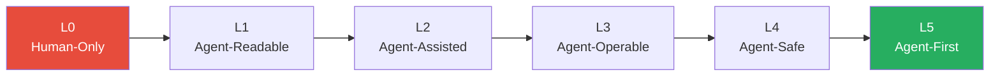

# Brownfield to Agent-First

> A staged transformation model for taking an existing codebase — with no agent considerations — and making it progressively more agent-friendly through sourced, incremental steps.

Most teams start with agents on codebases that were never designed for them: undocumented conventions, weak type coverage, no machine-readable project instructions, manual workflows. This training course provides a diagnostic model and a concrete transformation workflow.

The model is a diagnostic and investment guide, not a mandatory gate. You do not have to complete every level before using agents. Use the level descriptions to identify where your repo currently sits, then invest in moving to the next level.

## The Five Levels

| Level | Label | Defining quality | Agent capability |
|-------|-------|-----------------|-----------------|
| **L0** | Human-Only | Implicit knowledge; tribal conventions | Cannot orient without hand-holding |
| **L1** | Agent-Readable | Structure and context are explicit | Can explain the system; cannot execute reliably |
| **L2** | Agent-Assisted | Automated feedback loops in place | Can execute scoped changes with self-correction |
| **L3** | Agent-Operable | Mechanical enforcement; task interfaces | Can run reliably without per-action supervision |
| **L4** | Agent-Safe | Validated output gates; observability | Can operate autonomously with bounded risk |
| **L5** | Agent-First | Goal-driven; evals as deployment gates | Can plan and execute multi-step workflows |

## Modules

| # | Module | Transformation | Duration |
|---|--------|---------------|----------|
| 1 | [L0 → L1: Making the Repo Readable](level-0-to-1.md) | Add project instructions, document architecture, establish CI baseline | 30–45 min |
| 2 | [L1 → L2: Adding Feedback Loops](level-1-to-2.md) | Strong types, comprehensive tests, linter rules with remediation messages | 30–45 min |
| 3 | [L2 → L3: Building Mechanical Enforcement](level-2-to-3.md) | Hooks, pre-commit gates, structured task definitions, session scaffolding | 30–45 min |
| 4 | [L3 → L5: Reaching Agent-First](level-3-to-5.md) | Evals, goal specifications, CI integration, agentic autonomy | 30–45 min |

## How to Use This Course

**Diagnose first.** Read the level descriptions and exit criteria to identify where your repo currently sits. Use the [readiness scorecard](#readiness-scorecard) at the bottom of this page.

**Invest incrementally.** Each module covers one transition. Move to the next level before investing in the one after — the levels compound.

**Use agents during transformation.** Agents help with the transformation work itself. A repo at L1 can use agents to write tests (moving toward L2), and the test suite becomes the backpressure that enables L3+. You do not have to reach a level before using agents — you use agents to help reach it.

## Readiness Scorecard

Score your current codebase to identify your starting level.

| Capability | Indicator | Present? |
|-----------|-----------|----------|
| **Project instructions** | CLAUDE.md, AGENTS.md, or equivalent present and current | ☐ |
| **Architecture documented** | Directory structure, layer boundaries, key decisions written down | ☐ |
| **CI baseline** | Lint, build, and at least smoke tests run on every commit | ☐ |
| **Strong types** | TypeScript strict / mypy / equivalent with low `any` usage | ☐ |
| **Test coverage** | Critical paths (handlers, services, data access) have tests | ☐ |
| **Remediation linter rules** | Custom lint rules that include "what to do instead" in the message | ☐ |
| **Pre-commit hooks** | Lint + type check gate commits before they land | ☐ |
| **Session scaffolding** | Progress files or structured handoff artifacts for multi-session work | ☐ |
| **Mechanical enforcement** | Import boundary rules, path restrictions enforced by tooling | ☐ |
| **Output validation** | CI gates on agent PRs; diff policies; coverage thresholds | ☐ |
| **Evals** | Automated quality measurement for agent-generated output | ☐ |
| **Goal specifications** | Structured task/goal files with success criteria | ☐ |

**Score interpretation:**
- 0–3 checked: **L0** — start with [L0 → L1](level-0-to-1.md)
- 4–6 checked: **L1–L2** — start with [L1 → L2](level-1-to-2.md)
- 7–9 checked: **L2–L3** — start with [L2 → L3](level-2-to-3.md)
- 10–12 checked: **L3+** — start with [L3 → L5](level-3-to-5.md)

## Prerequisites

- Working development environment with version control
- Basic familiarity with AI coding assistants (Claude Code, GitHub Copilot, or equivalent)
- No prior agent infrastructure required — this course builds it from scratch

## Related

- [AI Development Maturity Model](../../workflows/ai-development-maturity-model.md) — the companion model for *developer* maturity (skeptic → agentic); this course covers *codebase* maturity
- [Codebase Readiness for Agents](../../workflows/codebase-readiness.md) — reference page on what makes code agent-friendly
- [Harness Engineering](../../agent-design/harness-engineering.md) — the technical discipline this course applies to brownfield contexts
- [Structured Agentic Software Engineering](../../agent-design/structured-agentic-software-engineering.md) — the SE 0–5 maturity model this course draws from ([arXiv:2509.06216](https://arxiv.org/abs/2509.06216))
