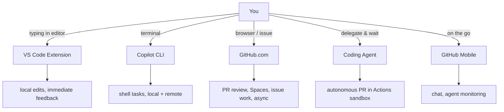

# GitHub Copilot: Platform Surface Map

> GitHub Copilot runs across five distinct surfaces — VS Code, GitHub.com, CLI, coding agent, and mobile — each with different environments, trade-offs, and capabilities. A layered customization stack (instructions, agents, skills, hooks, Spaces, memory) extends behaviour across all of them.

Copilot's surfaces differ in latency, autonomy, context access, and control model. Choosing the wrong surface is the most common cause of friction. This reference maps every surface and customization primitive so you can match each task to the right environment.

---

## The Surfaces



Each surface runs in a different environment with different trade-offs. Choosing the wrong surface is the most common cause of friction.

---

## VS Code Extension

### Inline Completions

**What it is**: Ghost-text suggestions that appear as you type, accepted with `Tab`.

**Used for**: Autocompleting lines, function bodies, boilerplate, test cases, and repetitive patterns.

**When to use it**: You know what you want to write — you just want to type less. Best for code with clear intent that fits in a few lines of context.

**When NOT to use it**: You need to understand a codebase, make cross-file changes, or the suggestion requires broader context than the current file. Completions are contextually shallow.

**How to use it**: Nothing to configure for basics. Type and `Tab`. Tune behaviour:

```json
// settings.json
{
  "github.copilot.enable": {
    "*": true,
    "markdown": false,
    "plaintext": false
  },
  "editor.inlineSuggest.enabled": true
}
```

**Example**: Type the signature of a utility function — Copilot completes the body based on the name, params, and nearby code.

---

### [Next Edit Suggestions (NES)](../../tool-engineering/next-edit-suggestions.md)

**What it is**: Predictive suggestions that appear at edit locations across the file — not just at your cursor. After you make a change, Copilot predicts where the next related edit should be and what it should contain. Accept with `Tab`, jump to the next suggestion with `Tab`.

**Used for**: Cascading edits — rename a parameter, and NES suggests updating all usages. Change a type, and NES offers the corresponding changes in related functions. Any repetitive multi-location edit pattern.

**When to use it**: You're making changes that have a ripple effect across the file. NES handles the follow-on edits so you don't miss any.

**When NOT to use it**: It's always on by default — no action needed. Adjust eagerness (frequency vs relevance) from the Copilot Status Bar item.

**How to configure**:

```json
// settings.json
{
  "github.copilot.nextEditSuggestions.enabled": true
}
```

NES is enabled by default. Adjust eagerness (frequency vs relevance) from the Copilot Status Bar item.

---

### Chat Panel — Three Built-in Agents

**What it is**: A conversational chat interface inside VS Code. Open it from the Copilot icon in the title bar, or with `Ctrl+Alt+I` / `Cmd+Alt+I`. The chat panel has three built-in **agents** selectable from a dropdown (called the "chat mode selector" since v1.110):

| Agent | What it does |
|-------|-------------|
| **Ask** | Answers questions about code, your codebase, or VS Code — no file changes (default) |
| **Agent** | Autonomously edits across the workspace, runs terminal commands, reads output, and iterates |
| **Plan** | Creates a step-by-step implementation plan, then hands off to Agent when approved |

Switch agents at any time during a session. Custom agents (`.github/agents/`) also appear in this dropdown.

> **Note**: Edit mode (per-file review of proposed changes) was **deprecated in v1.110** (February 2026) and hidden by default. It can be re-enabled via `chat.editMode.hidden` through v1.125, after which it will be fully removed. Agent mode now covers its use cases.

**Also available**:

- **Agent mode shortcut** (`Ctrl+Shift+I` / `Shift+Cmd+I` / `Ctrl+Shift+Alt+I` on Linux) — opens chat directly in Agent mode
- **Inline Chat** (`Ctrl+I` / `Cmd+I`) — ask Copilot directly in the editor at your cursor position
- **Quick Chat** (`Ctrl+Shift+Alt+L` / `Shift+Opt+Cmd+L`) — lightweight popup for one-off questions
- **Smart Actions** — right-click in the editor for context-menu suggestions
- **Image input** — paste or drag images (JPEG, PNG, GIF, WEBP) into chat for UI questions, screenshot analysis, or mockup implementation

---

### Context References

Before diving into each mode, know the context reference system — it works across all modes.

| Prefix | What it references | Example |
|--------|-------------------|---------|
| `#` + filename | A specific file in your workspace | `#src/auth/middleware.ts` |
| `#` + symbol | A code symbol (function, class, variable) | `#validateToken` |
| `#codebase` | Workspace code search | `#codebase how is auth handled?` |
| `#selection` | Current editor selection | `#selection explain this` |
| `#changes` | Source control modifications | `#changes summarise what I've changed` |
| `#problems` | Issues panel items | `#problems fix these warnings` |
| `#testFailure` | Unit test diagnostics | `#testFailure why is this failing?` |
| `#fetch` | Web page content retrieval | `#fetch https://docs.example.com/api` |
| `@github` | GitHub-specific skills and web search | `@github what changed in this PR?` |
| `@terminal` | Terminal output and shell context | `@terminal explain this error` |
| `@vscode` | VS Code settings and features | `@vscode how do I change the font?` |

Type `#` or `@` in the chat input to see all available references. After Copilot responds, click "Used *n* references" to see which files informed the answer.

> **Note**: `@workspace` and `#codebase` both exist. `@workspace` is a chat participant; `#codebase` is a context variable for workspace-wide code search. In Agent mode, workspace awareness is built in. `#fetch` retrieves web content directly in Agent mode.

---

### Ask Mode

**Used for**: Explaining unfamiliar code, asking "how do I…" questions, reviewing a function, generating tests for selected code, understanding architecture.

**When to use it**: You need an answer or a suggestion you'll apply yourself. No risk of unexpected file changes.

**When NOT to use it**: The task involves making actual changes across files — use Agent or Plan instead.

**How to use it**: Select **Ask** from the mode dropdown (this is the default). Use slash commands:

| Command | Does |
|---------|------|
| `/explain` | Explains selected code |
| `/fix` | Suggests a fix for selected code |
| `/tests` | Generates unit tests for selected code |
| `/new` | Scaffolds a new project |
| `/fixTestFailure` | Finds and fixes a failing test |

**Example**:

```
@workspace /explain why does the auth middleware call next() before validating the token?
```

---

### Edit Mode (Deprecated)

> **Deprecated in v1.110 (February 2026)**. Hidden by default. Re-enable temporarily via `chat.editMode.hidden` setting — fully removed at v1.125. Agent mode now covers these use cases.

**What it was**: A mode where you selected which files Copilot could modify, then reviewed and accepted proposed changes per file. More controlled than Agent mode but less capable — no terminal access, no iteration on results.

**Replacement**: Use Agent mode for the same workflows. Agent mode now handles multi-file edits with full autonomy, and you can still review and accept changes before they're applied.

---

### Agent Mode (Autonomous)

**What it is**: An autonomous loop that plans, edits files across the workspace, runs terminal commands, reads output, and iterates — all locally in your working directory.

**Used for**: Tasks that require multiple steps: write code → run tests → fix failures → commit. The agent handles the full loop.

**When to use it**: You want to stay in your editor with full visibility and control. Good for tasks where you want to watch the agent work and intervene in real time.

**When NOT to use it**: You want to hand off and not supervise. For async delegated work, the Copilot coding agent on GitHub is better — it runs in an isolated sandbox without occupying your machine.

**How to use it**: Select **Agent** from the mode dropdown. The agent has access to file read/write tools and the terminal. You approve tool use, or enable auto-approve for trusted tasks. Each prompt counts as one premium request (multiplied by the model's multiplier).

Tools available:

- File operations (read, create, edit, delete)
- Terminal execution
- Workspace search
- MCP server tools (if configured)

**Session forking** (v1.113+): Enable `github.copilot.chat.cli.forkSessions.enabled` to duplicate a conversation branch in Copilot CLI or Claude agent sessions — explore an alternative direction without losing the original context.

**Nested subagents** (v1.113+): Enable `chat.subagents.allowInvocationsFromSubagents` to permit subagents to invoke other subagents for multi-step workflows. Includes safeguards against infinite recursion.

**Configurable thinking effort** (v1.113+): Reasoning models now show a "Thinking Effort" submenu in the model picker (Low/Medium/High), replacing the deprecated per-model reasoning settings.

**Example**:

```
Add input validation to all form handlers in src/forms/ and write a test
for each validation rule. Run the tests and fix any failures.
```

---

### Plan Mode

**Used for**: Complex, multi-step tasks where you want to review and validate the approach before any code is written.

**When to use it**: The task has enough complexity that a wrong approach would waste significant time. Let Plan produce the strategy, review it, then hand off to Agent.

**When NOT to use it**: Simple or well-understood tasks — the planning overhead isn't worth it.

**How to use it**: Select **Plan** from the mode dropdown. Describe the task. Review the generated plan. Approve it to hand off execution to Agent mode.

**Example**:

```
Migrate all database access in src/ from raw SQL to Drizzle ORM.
Plan the approach before making any changes.
```

---

## GitHub.com / Web

### Copilot Code Review

**What it is**: An [agentic code reviewer](../../code-review/agentic-code-review-architecture.md) that runs on pull requests — GA for all paid Copilot plans (Pro, Pro+, Business, Enterprise) since April 2025. It reviews diffs, generates summaries, flags issues, and suggests improvements inline.

**Used for**: Automated first-pass review, PR description generation, surfacing bugs, security issues, and missed edge cases before human review.

**When to use it**: Every PR. Configure automatic review on all PRs via repository settings, or request it manually. Also requestable from the CLI (`gh pr create`, `gh pr edit`).

**When NOT to use it**: It is not a replacement for domain-aware human review. It misses architectural concerns, business logic errors, and context that lives in people's heads.

**How to use it**:

- **Manual**: On any PR, click "Request review" → select Copilot. It adds inline comments on the diff and posts a summary comment.
- **Automatic**: Repository Settings → Code review → Copilot → enable automatic review on all PRs.
- **CLI**: `gh pr create` or `gh pr edit --add-reviewer copilot` to request review from the terminal.

Copilot Code Review uses [Memory](#copilot-memory-public-preview) — it learns your repository conventions and applies them in future reviews.

---

### Copilot in Issues

**What it is**: On any issue, Copilot can suggest implementation plans, break down tasks, or help clarify requirements.

**Used for**: Turning vague issues into concrete task breakdowns. Ask Copilot to generate a plan before assigning work.

**When to use it**: Before assigning a complex issue to yourself or a colleague — or before assigning it to the coding agent.

**When NOT to use it**: Simple bugs or trivial tasks don't benefit from AI elaboration.

**How to use it**: In an issue, click the Copilot icon or ask `@copilot` in a comment.

---

### Web Chat (github.com/copilot)

**What it is**: A standalone Copilot chat interface on GitHub.com with access to your repositories.

**Used for**: Asking questions about repos you don't have locally, exploring unfamiliar codebases, generating code snippets without opening an IDE.

**When to use it**: You're on a different machine, reviewing code in the browser, or doing exploratory work on a repo you haven't cloned.

**When NOT to use it**: Active development work — your local IDE with agent mode is more capable and faster to iterate.

---

### [Copilot Spaces](../../tools/copilot/copilot-spaces.md)

**What it is**: Collaborative context containers that ground Copilot responses in curated collections of code, docs, issues, images, and instructions. GA since September 2025, replacing Knowledge Bases (sunset November 2025).

**Used for**: Curating the context that Copilot uses for answers. Instead of relying on Copilot to find the right files, you pre-select the relevant code, documentation, and issue context into a Space. Useful for onboarding, project-specific Q&A, and sharing curated context across a team.

**When to use it**: When you want Copilot to answer questions grounded in a specific set of files, docs, or issues — not the entire repository. Especially useful for large repos where automatic context selection misses relevant material.

**When NOT to use it**: Small repos where `#codebase` already surfaces the right context. Spaces are highest value in large, multi-team codebases.

**Scope**: Spaces can be private, shared with an organization or team, or shared publicly.

---

### GitHub Mobile

**What it is**: Copilot Chat is available on iOS and Android. You can ask questions, start and track coding agent tasks, and review agent work from your phone.

**Used for**: Quick questions when you're away from your machine. Starting or monitoring coding agent tasks on the go. Reviewing draft PRs from the agent.

**When NOT to use it**: Active development — use your IDE or CLI.

---

## Copilot CLI (`copilot`)

> **Note**: The old `gh copilot` extension (`gh copilot explain` / `gh copilot suggest`) is **retired**. It has been replaced by the standalone Copilot CLI — a full agentic tool, not a command wrapper.

**What it is**: A standalone terminal agent installed separately from the GitHub CLI. Invoked as `copilot`. It has a chat-like interface that can autonomously create and modify files, execute commands, and interact with GitHub.com — all from your terminal.

**Install**:
```bash
npm install -g @github/copilot   # Node 22+
# or
winget install GitHub.Copilot
# or
brew install copilot-cli
```

### Interactive Mode

**Used for**: Conversational, multi-turn tasks in the terminal. Ideal when you're already in a shell and don't want to switch to an IDE.

**When to use it**: Scripting tasks, local + remote GitHub work, anything where you prefer the terminal over VS Code. Good for CI/CD scripting, quick cross-repo GitHub operations, and tasks you want to automate with flags.

**When NOT to use it**: Tasks that benefit from a diff view or visual file browsing. VS Code agent mode is better when you want to see changes file-by-file before accepting.

**How to use it**:

```bash
copilot                        # interactive session
copilot -p "your task here"    # programmatic — runs and exits
./script.sh | copilot          # pipe output in as context
```

**Slash commands in session**:

| Command | Does |
|---------|------|
| `/model` | Switch model |
| `/context` | Show token usage breakdown |
| `/compact` | Manually compress conversation history |
| `/mcp` | List configured MCP servers |
| `/allow-all` | Approve all tools and paths for the session |
| `/yolo` | Same as `/allow-all` |
| `/feedback` | Submit feedback or bug report |

**Plan mode**: Press `Shift+Tab` to cycle through standard, plan, and autopilot modes. In plan mode, Copilot analyses the request, asks clarifying questions, and produces a structured plan before writing any code.

**Tool approval flags** (useful for automation):

```bash
# Allow everything except destructive commands
copilot --allow-all --deny-tool='shell(rm)' --deny-tool='shell(git push)'

# Allow only file reads and writes, no shell execution
copilot --allow-tool='write' --deny-tool='shell(*)'
```

**Context management**: Auto-compacts at 95% token limit. Use `/compact` to compress manually before hitting the limit. Sessions can run virtually indefinitely through background compression.

**Copilot Memory**: The CLI supports persistent memory — Copilot stores learned details about your repository (conventions, patterns, preferences) and reuses them across sessions. Default model varies — check with `/model` or the [supported models page](https://docs.github.com/en/copilot/reference/ai-models/supported-models). Change with `/model` or `--model`.

**Example — local task**:
```
I've been assigned https://github.com/org/repo/issues/42.
Start working on it in a suitably named branch.
```

**Example — GitHub.com tasks**:
```
List all open PRs assigned to me in org/repo
Merge all open PRs I created in org/repo that have passing checks
Create a GitHub Actions workflow that runs eslint on push
```

---

## GitHub Copilot Coding Agent

**What it is**: An autonomous agent that runs in a GitHub Actions sandbox, not on your machine. You assign it a task — via an issue, a comment, or a security alert — and it works independently, then opens a draft PR for your review.

**Used for**: Delegating well-defined tasks that don't require real-time decisions: bug fixes, adding tests, updating docs, applying standard refactors, addressing tech debt.

**When to use it**:

- The task is self-contained in one repository
- You can describe the desired outcome clearly in writing
- You're comfortable not supervising the work step-by-step
- The review-and-merge PR workflow is acceptable (it always opens a PR, never pushes directly)

**When NOT to use it**:

- The task requires changes across multiple repositories
- The correct solution requires understanding implicit context not in the codebase or issue
- You need the result immediately (agent work is async — minutes to hours)
- The repo has branch protection rules requiring signed commits (the agent can't comply)
- The task is exploratory ("figure out what's causing this" without a clear hypothesis)

**How to use it**:

Multiple ways to assign a task:

1. **From an issue**: Assign Copilot as the issue assignee.
2. **From a PR comment**: Mention `@copilot` in a comment on an existing PR to ask it to make changes.
3. **From the agents panel**: The agents panel is available on every page on GitHub — use it to start new tasks or track active sessions across repos.
4. **From a security alert**: Assign the alert to Copilot via security campaigns in the Security tab.
5. **From your IDE**: VS Code, JetBrains, and Eclipse can all start coding agent tasks directly.
6. **From the CLI**: Use `gh` or Copilot CLI to assign tasks programmatically.
7. **From external tools**: Slack, Jira, Teams, Linear, Azure Boards, and Raycast integrations let you assign tasks without leaving your existing workflow.

The agent will:

1. Read the issue/context
2. Make the required changes in an isolated `copilot/*` branch
3. Run tests and security checks
4. Open a draft PR tagged for your review

**Example**: Issue: "The user profile page throws a 500 when the avatar URL is null. Fix it and add a test."

Assign to Copilot → 15 minutes later, a draft PR arrives with the fix and a test. You review, approve, merge.

**Visual inputs**: Attach images (screenshots, mockups, design sketches) to issues or chat prompts. The agent uses them as context for UI implementation tasks.

**Available models**: Auto (default) plus models from Anthropic (Claude Haiku 4.5, Sonnet 4/4.5/4.6, Opus 4.5/4.6), OpenAI (GPT-4.1, GPT-5 series including Codex variants), Google (Gemini 2.5 Pro, Gemini 3 Flash, Gemini 3.1 Pro), and xAI (Grok Code Fast 1). The roster changes frequently — check the [supported models page](https://docs.github.com/en/copilot/reference/ai-models/supported-models) for the current list. Note that the model picker when assigning a coding agent task may offer a smaller subset than the full agent-mode model list; check the coding-agent-specific model docs if a model you expect is missing. Falls back to Auto for `@copilot` mentions and issue assignments.

**Third-party coding agents**: In addition to the Copilot coding agent, GitHub hosts third-party agents (Anthropic Claude, OpenAI Codex) that can be selected when assigning tasks. These produce PRs the same way, but use their own models and tool stacks.

**BYOK (Bring Your Own Key)**: Enterprise and Business plans can configure custom model providers (Anthropic, OpenAI, xAI, and Microsoft Foundry) so Copilot uses your own API keys and model access. Usage is billed directly by the provider and does not count against GitHub Copilot request quotas. Public preview.

**MCP integration**: Extend the agent's capabilities with MCP servers configured in **Settings > Code & automation > Copilot > Coding agent** as JSON. Supports `local`, `stdio`, `http`, and `sse` transport types — useful for connecting to Sentry, Notion, Jira, Azure DevOps, etc. Only tool calls are supported (not MCP resources or prompts).

**Security validation**: Before completing a PR, the agent runs four validation tools: CodeQL (code issues), GitHub Advisory Database (dependency threats), secret scanning (hardcoded credentials), and Copilot code review. These are free, enabled by default, and don't require a GitHub Advanced Security license. Repository admins can configure which validation tools run via repository settings.

**Constraints to know**:

- Only pushes to branches named `copilot/*`
- Cannot approve or merge its own PRs
- Only users with **write access** can instruct it
- Internet access is firewall-controlled
- Does not respect content exclusions configured in Copilot settings (same for Agent mode in IDEs and the CLI)
- GitHub Actions workflows don't run automatically on agent pushes until a user approves

---

## The Customization Stack

These mechanisms let you extend and constrain Copilot behaviour across all surfaces. They compose — you can use all simultaneously.

```
.github/
  copilot-instructions.md        ← always-on repo context
  instructions/
    frontend.instructions.md     ← path-specific instructions (glob-scoped)
  prompts/
    migrate-api.prompt.md        ← reusable prompt templates
  agents/
    my-agent.agent.md            ← specialized agent profiles
  hooks/
    hooks.json                   ← automation at lifecycle events
  skills/
    my-skill/
      SKILL.md                   ← reusable task knowledge
```

Additional mechanisms configured outside the repo:

- **MCP servers** — configured in `.vscode/mcp.json`, CLI config, or GitHub.com settings
- **Memory** — persistent learned context, stored at the repository level
- **Spaces** — curated context containers on GitHub.com (code, docs, issues, instructions)
- **Content exclusions** — admin-level file access control (Business/Enterprise only)

---

### Custom Instructions

Copilot supports three levels of instructions, applied from broadest to most specific.

**Priority**: personal instructions > repository instructions > organization instructions.

#### Repository-Wide (`.github/copilot-instructions.md`)

**What it is**: A Markdown file injected into every Copilot session in this repository. Applied to all requests regardless of which files are open.

**Used for**: Encoding repo conventions that Copilot would otherwise have to infer: build commands, test commands, coding standards, naming conventions, architecture decisions, what not to do.

**When to use it**: Every non-trivial repository should have one. If you've ever corrected Copilot for the same thing twice, put it in the instructions file.

**When NOT to use it**: Don't write an encyclopedia. Keep it to actionable rules. Long files get ignored or dilute important instructions.

```markdown
# Project: Payments API

## Stack
- Node.js 22, TypeScript 5.4, Fastify 4
- Postgres via Drizzle ORM
- Vitest for tests

## Conventions
- All handlers are async and use the `asyncWrapper` from `src/middleware/async.ts`
- Error classes live in `src/errors/` — use them, don't throw raw Error objects
- Database access only through repository classes in `src/repositories/`

## Build & Test
- `npm run build` — TypeScript compile
- `npm test` — run Vitest suite (unit + integration)
- `npm run test:db` — integration tests (requires local Postgres on port 5432)

## Do not
- Import directly from `src/db/connection.ts` — use repositories
- Use `any` types
- Write tests that mock the database (use the real test DB)
```

#### Path-Specific (`.github/instructions/NAME.instructions.md`)

**What it is**: Instructions that apply only when Copilot is working with files matching a glob pattern. Combine with repository-wide instructions when both match.

**Used for**: Different rules for different parts of the codebase — frontend components vs API routes vs database migrations.

**When to use it**: When a rule applies to a subset of files, not the entire repo. Keeps the global instructions file lean.

**When NOT to use it**: The rule is universal to the repo — use the repository-wide file instead.

```markdown
---
applyTo: "src/components/**/*.tsx,src/components/**/*.ts"
---

Use React functional components with hooks. Never class components.
Use Tailwind CSS utility classes — no inline styles or CSS modules.
All components must export a props interface named `{ComponentName}Props`.
```

The `applyTo` field supports standard glob patterns (`*`, `**`, comma-separated). An optional `excludeAgent` field can restrict the instructions to specific surfaces (e.g., `excludeAgent: "coding-agent"`).

#### Prompt Files (`.github/prompts/NAME.prompt.md`)

**What it is**: [Reusable prompt templates](../../instructions/prompt-file-libraries.md) with embedded file references. Available in VS Code, Visual Studio, and JetBrains.

**Used for**: Standardising how the team asks Copilot for specific tasks — ensures consistent results across developers.

**When to use it**: A task is repeated often by multiple team members and the prompt matters for quality. Encodes the "how to ask" knowledge.

**When NOT to use it**: One-off or exploratory tasks. Prompts are best for recurring patterns.

```markdown
Review the API handler in #file:../../src/routes/users.ts for:
1. Missing input validation
2. Unhandled error cases
3. N+1 query patterns
4. Missing auth checks

Suggest fixes with code snippets.
```

Reference files with `#file:` relative paths. Select prompt files from the chat input when starting a conversation.

---

### Custom Agents (`.github/agents/`)

**What it is**: Markdown files with YAML frontmatter that define specialized agent profiles. Each agent has a name, description, and a system prompt. You invoke a named agent instead of the default.

**Used for**: Giving the agent domain-specific expertise or constraints. A `docs-agent` that knows your documentation style. A `security-reviewer` that checks for a specific threat model. A `test-writer` that follows your coverage conventions.

**When to use it**: When the default Copilot behaviour produces consistent friction for a category of task — and you can articulate the better behaviour as a prompt.

**When NOT to use it**: Don't create an agent for a one-off task. Agents are for repeatable task types where the specialization pays off every time.

**How to use it**: Create `.github/agents/AGENT-NAME.agent.md` (`.agent.md` is the conventional extension; `.md` also works):

```markdown
---
description: Writes Vitest unit tests following project conventions
tools:
  - read_file
  - create_file
  - run_terminal_command
---

You are a test-writing specialist for this Node.js/TypeScript project.

When writing tests:
- Use Vitest (`describe`, `it`, `expect`) — never Jest syntax
- Import test utilities from `src/test/helpers.ts`
- Follow the Arrange-Act-Assert pattern with explicit blank lines between sections
- Test the behaviour (what it does), not the implementation (how it does it)
- Always test the happy path and at least two failure modes
- Do not mock the database — use the real test DB via `createTestDb()` from helpers

Start by reading the source file under test before writing a single line.
```

**Frontmatter fields**:

| Field | Required | Notes |
|-------|----------|-------|
| `name` | No | Defaults to filename stem |
| `description` | **Yes** | Shown in the dropdown — be specific |
| `tools` | No | Restrict which tools the agent can use |
| `mcp-servers` | No | Additional MCP servers for this agent |
| `model` | No | Override the default model |
| `target` | No | `vscode` or `github-copilot` to restrict surface |
| `user-invocable` | No | Whether the agent appears in the mode selector for manual invocation |

Select the agent from the chat mode selector in VS Code, use it in the CLI, or assign it when creating a coding agent task. Multiple agents can be defined — they appear alongside the built-in Ask, Agent, and Plan agents.

---

### Hooks (`.github/hooks/`)

**What it is**: JSON files that execute shell commands at specific points in the Copilot agent lifecycle. For the coding agent, hooks fire in the Actions sandbox. For the CLI, hooks fire locally on your machine. VS Code also supports hooks in Preview (v1.109+). For a tool-agnostic overview of hook lifecycle events and enforcement patterns, see [Hooks and Lifecycle Events: Intercepting Agent Behavior](../../tool-engineering/hooks-lifecycle-events.md).

**Used for**: Security validation before tool use, audit logging, enforcing policy (e.g., block writes to certain paths), custom notifications.

**When to use it**: When you need automated guardrails that shouldn't rely on the agent's own judgement. Hooks are outside the agent's context — it can't override them.

**When NOT to use it**: Don't use hooks for things the instructions file handles. Hooks are for enforcement; instructions are for guidance. Hooks also add latency — every `preToolUse` hook runs synchronously before every tool call.

**How to use it**: Create any `.json` file under `.github/hooks/` (e.g., `.github/hooks/security.json`):

```json
{
  "version": 1,
  "hooks": {
    "preToolUse": [
      {
        "type": "command",
        "bash": "scripts/check-path.sh",
        "powershell": "scripts/check-path.ps1",
        "timeoutSec": 10
      }
    ],
    "sessionStart": [
      {
        "type": "command",
        "bash": "echo \"[$(date -u)] Session started\" >> .copilot-audit.log",
        "powershell": "Add-Content -Path .copilot-audit.log -Value \"Session started: $(Get-Date)\"",
        "timeoutSec": 5
      }
    ]
  }
}
```

**Hook lifecycle events (CLI / coding agent)**:

| Event | Fires when |
|-------|-----------|
| `sessionStart` | Agent session begins |
| `sessionEnd` | Agent session ends |
| `userPromptSubmitted` | User sends a prompt |
| `preToolUse` | Before any tool call |
| `postToolUse` | After a tool call completes |
| `errorOccurred` | An error fires in the agent |

**VS Code lifecycle events** (PascalCase, different set):

| Event | Fires when |
|-------|-----------|
| `SessionStart` | Agent session begins |
| `UserPromptSubmit` | User sends a prompt |
| `PreToolUse` | Before any tool call |
| `PostToolUse` | After a tool call completes |
| `PreCompact` | Before conversation context is compacted |
| `SubagentStart` | A subagent begins execution |
| `SubagentStop` | A subagent completes |
| `Stop` | Agent stops executing |

For the Copilot CLI, hooks are read from `.github/hooks/` in the current working directory. For the coding agent, they must be on the repo's default branch. VS Code reads them from the workspace (Preview, v1.109+).

**Agent debug logs** (v1.113+): Debug logging is now available for Copilot CLI and Claude agent sessions in VS Code, providing chronological event logs of all interactions during a conversation.

---

### Skills (`.github/skills/`)

**What it is**: Folders of instructions, scripts, and resource files that give the agent specialized knowledge for a repeatable task type.

**Used for**: Encoding how to perform a specific task — not just what the outcome should be, but the steps, tools, and resources needed. More structured than agent prompts. Shareable across repos.

**When to use it**: When a task has a known, documented procedure that any competent agent could follow if they had it written down. Skills are that written-down procedure.

**When NOT to use it**: Don't wrap simple instructions in a skill. If the task can be described in 3 sentences in the instructions file, it doesn't need a skill.

**How to use it**: Create `.github/skills/generate-changelog/` (directory name must be lowercase with hyphens):

```
.github/skills/generate-changelog/
  SKILL.md          ← required — description, frontmatter, steps
  template.md       ← changelog template the agent uses
  scripts/
    fetch-commits.sh ← helper scripts
```

`SKILL.md` (uppercase, required):
```markdown
---
name: generate-changelog
description: Generates a CHANGELOG.md entry for the current release from recent commits
---

Generate a CHANGELOG.md entry for the current release.

## Steps
1. Run `scripts/fetch-commits.sh` to get commits since the last tag
2. Group commits by type: Features, Bug Fixes, Breaking Changes, Other
3. Use `template.md` as the format
4. Write the entry to the top of CHANGELOG.md, not replacing existing entries
5. Omit chore/ci/docs commits from the changelog

## Resources
- template.md — changelog entry format
- CHANGELOG.md — existing changelog to prepend to
```

When Copilot chooses to use a skill, the `SKILL.md` file is injected into the agent's context along with any referenced resources. Skills follow the [Agent Skills open standard](https://agentskills.io) — they work across Claude Code, GitHub Copilot CLI, and the coding agent.

**Personal skills** (reusable across repos) go in `~/.claude/skills/` for Claude Code. For the Copilot CLI, check the CLI configuration docs for the current personal skills path — it follows the `~/.copilot/` config directory convention but may vary by version.

---

### [Copilot Memory](../../tools/copilot/copilot-memory.md) (Public Preview)

**What it is**: Persistent knowledge that Copilot stores about your repository — coding conventions, patterns, preferences, and project structure — and reuses across sessions.

**Used for**: Reducing repetitive explanations. Instead of re-describing your conventions each session, Copilot remembers them. Complements custom instructions with learned context.

**When to use it**: When you find yourself repeatedly correcting Copilot about the same repo-specific details that aren't worth formalising in the instructions file.

**When NOT to use it**: Don't rely on memory for critical rules — use custom instructions for anything that must always apply. Memory is best-effort context, not guaranteed enforcement.

**Where it works**: Copilot CLI, the coding agent, and Copilot Code Review on GitHub.com. Memories are stored at the repository level.

---

## Decision Framework: Which Surface?

| Task type | Best surface | Why |
|-----------|-------------|-----|
| Autocomplete while writing | VS Code inline completions / NES | Zero friction, immediate |
| Ask a question about code | VS Code — Ask mode | No file changes, stays in editor |
| Complex task, want plan first | VS Code — Plan mode | Review strategy before any code is written |
| Multi-step task, local, want to watch | VS Code — Agent mode | Visible, controllable, immediate local execution |
| Delegate a well-defined task, async | Coding agent (GitHub) | Isolated sandbox, opens PR, frees your machine |
| Fix a bug from a GitHub issue | Coding agent (GitHub) | Issue context, PR workflow, external tool integrations |
| Terminal task, local or GitHub.com | Copilot CLI (`copilot`) | Agentic, full tool access, no IDE needed |
| Automate / script agent tasks | `copilot -p "..."` | Programmatic mode, combine with approval flags |
| PR first-pass review | Copilot Code Review (GitHub.com) | Automatic or on-demand, before human review |
| Ground answers in curated context | [Copilot Spaces](../../tools/copilot/copilot-spaces.md) (GitHub.com) | Pre-selected code, docs, issues for focused Q&A |
| Explore a repo you haven't cloned | GitHub.com web chat | No local setup needed |
| Quick question on the go | GitHub Mobile | Chat and coding agent management from phone |

### VS Code Agent vs Coding agent — the key question

> **Do you want to supervise the work in real time, or hand it off?**

- **Supervise** → VS Code **Agent** (in-editor). You see every action, can interrupt, iterate immediately.
- **Hand off** → **Coding agent** on GitHub. You describe the task, it runs in an Actions sandbox, you review the PR.

The coding agent is not faster — it's for tasks where your attention is more valuable elsewhere.

---

## Key Takeaways

- Copilot runs on **multiple surfaces** (VS Code, GitHub.com, CLI, coding agent, GitHub Mobile) with distinct environments. Matching the surface to the task matters more than mastering any single one.
- VS Code has **three built-in agents** (Ask, Agent, Plan) — know when each is the right choice. Agent mode runs autonomously; Plan mode produces a strategy first. (Edit mode was deprecated in v1.110.)
- The **customization stack** is cumulative: repo-wide instructions → path-specific instructions → prompt files → agents → skills → hooks → memory. Each layer adds specificity.
- **Custom instructions** should be in every non-trivial repo — highest-leverage, lowest-effort improvement. Path-specific instructions keep the global file lean.
- The **coding agent** always produces a PR, never pushes directly. It supports visual inputs, MCP integration, third-party agents, BYOK model selection, and a wide model roster. Treat it as an async contributor.
- **Copilot Code Review** is GA for all plans — configure automatic review on PRs to catch issues before human review. It learns your conventions via Memory.
- **[Copilot Spaces](../../tools/copilot/copilot-spaces.md)** let you curate the context Copilot uses for answers — code, docs, issues, and instructions in a shareable container.
- **Hooks** are enforcement mechanisms, not guidance. Use them for policy the agent must not be able to override. CLI/coding agent and VS Code have different event sets.
- The **Copilot CLI** (`copilot`) is a full agentic tool — not the old `gh copilot` wrapper. It runs locally with the same power as VS Code Agent mode.
- **[Content exclusions](../../instructions/content-exclusion-gap.md)** are not respected by Agent mode, the CLI, or the coding agent — only inline completions and chat in non-agent modes honour them.

## Related

- [Customization Primitives](customization-primitives.md) — deep dive into instructions, agents, skills, hooks, and prompt files
- [Context Engineering & Agent Workflows](context-and-workflows.md) — context references, workspace awareness, and multi-step agent workflows
- [Model Selection & Routing](model-selection.md) — choosing and routing models across Copilot surfaces
- [Harness Engineering](harness-engineering.md) — building reliable agent harnesses with instructions, hooks, and guardrails
- [Advanced Patterns](advanced-patterns.md) — advanced agent and Copilot usage patterns
- [GitHub Copilot docs](https://docs.github.com/en/copilot)
- [Agent Skills standard](https://agentskills.io)
- [GitHub Changelog](https://github.blog/changelog/)
