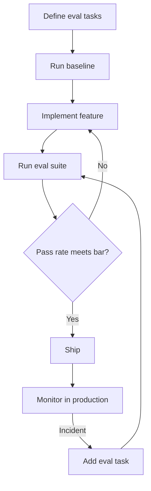

# The Eval-First Development Loop

> Write evals before code. Measure against a baseline. Iterate until the pass rate meets your bar. Ship with confidence that "done" has an objective definition.

---

## Why Evals Come First

Teams that write evals after the fact tend to reverse-engineer success criteria from a live system. This embeds the agent's current behavior — including its bugs — into the definition of correct. The eval suite then validates what the agent already does rather than what it should do.

Writing evals first forces clarity: you must decide what "done" means before building toward it. A low pass rate on a new capability eval is a feature, not a problem — it identifies the gap and makes progress visible as implementation proceeds. [Source: [Demystifying Evals for AI Agents](https://www.anthropic.com/engineering/demystifying-evals-for-ai-agents)]

---

## The Loop

### Step 1: Define Eval Tasks

Before writing any feature code, define 20-50 representative inputs the agent must handle correctly. Source these from real failure cases, anticipated edge cases, and the specific behaviors that motivated the feature. See [Writing Your First Eval Suite](writing-first-eval-suite.md) for task design guidance.

### Step 2: Run the Baseline

Run the eval suite against the current agent state — before any changes. Record the pass rate. This is your anchor.

A 0% baseline on a new capability is expected — it means the agent cannot do this yet. A 60% baseline means the agent already handles some cases and your implementation only needs to close the remaining gap.

### Step 3: Implement and Iterate

Make changes. Run the suite. Compare against the baseline. Each iteration should show measurable progress on specific tasks. If it does not, the implementation is not addressing the failure modes the eval captured.

When a change improves some tasks but regresses others, the eval suite makes this visible immediately — before the regression reaches production.

### Step 4: Ship When the Bar Is Met

Define the bar before development, not after. "95% pass rate across 3 runs" is a concrete shipping criterion. "Looks good to me" is not.

The bar should account for agent non-determinism. A 100% pass rate on a single run does not mean the agent is 100% reliable. Run the suite multiple times and set the bar on the minimum pass rate across runs.

### Step 5: Monitor and Grow

Production incidents feed back into the suite as new eval tasks. See [Hardening Evals for Production](hardening-evals.md) for the [incident-to-eval pipeline](../../verification/incident-to-eval-synthesis.md).

---

## Evals as Executable Specifications

Eval tasks function as executable specifications. When a task is well-defined, it answers "does this feature work?" with a reproducible, automatable check rather than a manual judgment call.

This reframes the development conversation. Instead of debating whether a feature is "good enough," the team looks at the pass rate and decides whether the remaining failure modes are acceptable for the current release.

---

## Converting Existing Manual Checks

You likely already have inputs suitable for an eval suite:

- **Manual development checks**: any scenario you tested by hand during development is a candidate eval task
- **Production failures**: incidents and bug reports are high-value eval tasks because they represent real cases the agent actually mishandled
- **Exploratory tests**: ad hoc prompts you ran while figuring out how a feature should behave
- **Reviewer feedback**: patterns that come up repeatedly in code review ("the agent keeps doing X") indicate missing eval coverage

Converting these to formal eval tasks avoids duplicating effort and anchors the suite to problems that actually matter. [Source: [Demystifying Evals for AI Agents](https://www.anthropic.com/engineering/demystifying-evals-for-ai-agents)]

---

## Model Upgrade Testing

Teams with eval suites in place can adopt new model releases in days. Teams without them face weeks of manual regression testing per upgrade. [Source: [Demystifying Evals for AI Agents](https://www.anthropic.com/engineering/demystifying-evals-for-ai-agents)]

The workflow for model upgrades:

1. Run the full eval suite against the current model — record the baseline
2. Switch to the new model
3. Run the suite again
4. Compare: improvements, regressions, and unchanged
5. Investigate regressions — are they real quality drops or grader sensitivity?
6. Ship if the new model meets or exceeds the bar

Without evals, step 4 is "have three engineers manually test for two weeks and report back." With evals, it is an automated comparison that takes minutes.

Not all features require the same upgrade strategy. Anthropic's skill-creator distinguishes two categories that generalize beyond skills to any agent capability: [Source: [Improving Skill-Creator](https://claude.com/blog/improving-skill-creator-test-measure-and-refine-agent-skills)]

- **Capability uplift** — encodes techniques that produce better output than the base model alone. These may become obsolete when a new model internalizes the technique. Model upgrade evals should compare the skill-augmented agent against the raw model on the same tasks; if the raw model matches or exceeds the skill, retire the skill rather than maintaining dead complexity.
- **Encoded preference** — sequences existing capabilities according to team-specific workflows. These remain valuable across model generations because the model cannot infer your process. Upgrade evals should verify workflow fidelity (step ordering, output format, required checks) rather than raw output quality.

---

## A/B Comparison Testing

When iterating on prompts, skills, or configurations, run a blind comparison rather than evaluating each version in isolation. A comparator agent receives outputs from version A and version B without labels and grades which is better on each eval criterion. This eliminates anchoring bias that occurs when grading sequentially. [Source: [Improving Skill-Creator](https://claude.com/blog/improving-skill-creator-test-measure-and-refine-agent-skills)]

Run each version's evals with independent agents in parallel, each starting from clean context. Shared context between eval runs introduces cross-contamination — the agent's performance on task 5 is influenced by what it learned from tasks 1-4.

---

## Common Anti-Patterns

**Writing evals and code simultaneously**: if you write tasks while building the feature, you may unconsciously write tasks that match what the agent already does rather than what it should do. The temporal separation is the discipline.

**Moving the bar to match the pass rate**: if the agent reaches 82% and your bar was 90%, do not lower the bar to ship. Either improve the agent or explicitly accept the risk with documentation of which failure modes remain.

**Treating the eval suite as immutable**: the suite should grow with every incident and every edge case discovered. A suite that does not change after launch is a suite that is not learning from production.

---

## Key Takeaways

- Write evals before code — this is the discipline that prevents embedding current bugs into the definition of correct
- Run a baseline before any development to make progress measurable
- Define the shipping bar before development, not after
- Account for non-determinism: run the suite multiple times and set the bar on the minimum pass rate
- Convert existing manual checks into formal eval tasks to avoid duplicating effort
- Teams with eval suites adopt model upgrades in days; teams without them take weeks

## Related

- [Writing Your First Eval Suite](writing-first-eval-suite.md) — task design and suite construction
- [Grading Strategies](grading-strategies.md) — previous module
- [Hardening Evals for Production](hardening-evals.md) — next module
- [Eval-Driven Development](../../workflows/eval-driven-development.md) — reference page
- [Eval-Driven Tool Development](../../workflows/eval-driven-tool-development.md) — applying the loop to tool/skill design
- [What Evals Are](what-evals-are.md) — foundational concepts on agent evaluations
- [Step-by-Step: Building Your First Eval-Driven Feature](step-by-step-first-feature.md) — hands-on walkthrough applying this loop
- [Enterprise Skill Marketplace](../../workflows/enterprise-skill-marketplace.md) — skill lifecycle including eval-gated publishing
