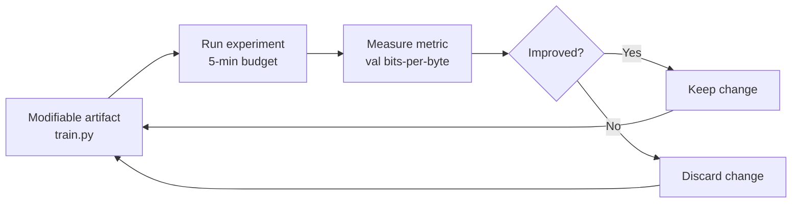
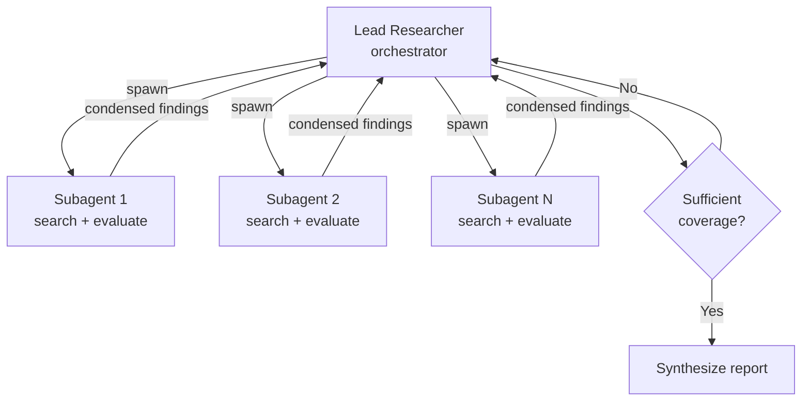
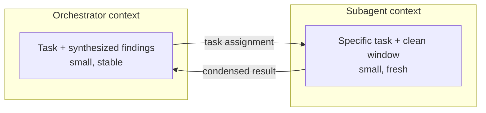

# Autonomous Research Loops: Loops That Know When to Stop

> Autonomous research loops are agent architectures that run unsupervised — modifying artifacts, measuring results, and iterating — with built-in termination, grounding, and control mechanisms that prevent runaway cost and hallucination drift.

Autonomous research agents run unsupervised for extended periods: modifying artifacts, measuring results, deciding next steps, and repeating. The engineering challenge is not making them run — it is making them stop appropriately, stay grounded, and produce trustworthy output. This module covers two variants of the pattern and the shared infrastructure that makes both reliable.

---

## Two Variants of the Same Loop

Autonomous research takes two distinct forms. Both share loop architecture, termination concerns, and grounding challenges, but differ in their control surfaces and failure modes.

| | Autonomous Experimentation | Autonomous Information Research |
|---|---|---|
| **Reference** | Karpathy's [autoresearch](https://github.com/karpathy/autoresearch) | Anthropic's [multi-agent research system](https://www.anthropic.com/engineering/multi-agent-research-system) |
| **What the agent modifies** | Code (a single `train.py`) | A growing knowledge base |
| **Evaluation** | Quantitative metric (e.g., validation bits-per-byte) | Source quality, coverage, coherence |
| **Architecture** | Single agent, serial loop | Orchestrator spawning parallel subagents |
| **Termination** | Time budget or manual interrupt | Completion-based with hard limits |
| **Primary failure mode** | Wasted compute on low-signal changes | Hallucination spirals from compounding grounding errors |

Understanding which variant you are building determines every downstream design decision.

---

## The Minimal Experimentation Loop

Karpathy's autoresearch is a 630-line Python script with three components:

**Three minimal components:**

1. **Modifiable artifact** — a file the agent can edit freely
2. **Single measurable metric** — one number that determines keep/discard
3. **Fixed time budget** — per-experiment wall clock limit

The human steers through `program.md` — a natural-language file carrying instructions, constraints, and exploration priorities. The human never touches the code; the agent never touches the program file. This separation is the control surface.

The design philosophy is deliberately aggressive: the agent runs until manually interrupted, never requests permission, and responds to stalling by intensifying exploration rather than pausing. This works because the metric provides unambiguous feedback — every change is either an improvement or it is not.

**When this pattern applies:** optimization problems with a clear, computable metric. Karpathy argues any efficiently-evaluable metric can be autoresearched. Results: ~12 experiments/hour, ~100 overnight, with measurable gains (11% in the reference run, 19% in Shopify's independent test).

---

## The Orchestrator-Worker Research Loop

For information research — where there is no single metric and the artifact is knowledge rather than code — a different architecture is needed.

Anthropic's multi-agent research system uses this pattern with scaling rules:

| Query complexity | Agent count |
|---|---|
| Simple factual | 1 |
| Comparison / contrast | 2–4 |
| Complex multi-faceted research | 10+ |

Each subagent gets a clean context window, searches independently, evaluates source quality, and returns condensed findings. The orchestrator synthesizes, identifies gaps, and decides whether to spawn more subagents.

**When this pattern applies:** knowledge gathering where coverage matters more than a single number — literature reviews, competitive analysis, technology evaluations, due diligence.

---

## Termination Design

The hardest engineering decision in autonomous loops is when to stop. Three strategies exist; production systems layer all three.

| Strategy | Mechanism | Strength | Weakness |
|---|---|---|---|
| **Completion-based** | Agent determines task is done | Adapts to task complexity | Agent may declare done prematurely |
| **Hard limits** | Max iterations, time budget, token budget | Prevents runaway cost | May stop mid-progress |
| **Human-triggered** | Pause at checkpoints or uncertainty thresholds | Catches subtle quality issues | Breaks autonomy |

Karpathy's autoresearch uses only hard limits (time budget per experiment, manual interrupt for the outer loop). This is viable because the metric makes every iteration self-evaluating. For information research, where quality assessment is subjective, completion-based termination requires explicit verification — a pre-completion checklist or a separate evaluator agent.

### Doom loop prevention

Agents can enter unproductive cycles: repeatedly editing the same file, oscillating between two approaches, or generating increasingly confident but incorrect reasoning.

Concrete mitigations:

- **Per-file edit counters** — track how many times each file has been modified; after N edits, force the agent to reconsider its approach ([loop detection](../../observability/loop-detection.md) middleware)
- **Change velocity monitoring** — if the rate of meaningful changes drops below a threshold, trigger a strategy reset
- **[Reasoning sandwich](../../agent-design/reasoning-budget-allocation.md)** — allocate maximum reasoning tokens to planning and verification phases, moderate tokens to implementation. Front-load thinking, do not let it accumulate at the end

---

## Context Management Across Iterations

Long-running loops degrade because of [context rot](../../context-engineering/context-window-dumb-zone.md): as the token count grows, model recall of earlier information drops. Two mitigations dominate.

### Compaction

Periodically summarize accumulated history, discard raw conversation, and keep only recent context plus the summary. The agent operates on a rolling window rather than an ever-growing transcript.

### Sub-agent isolation

Each sub-agent starts with a clean context window containing only its specific task and relevant background. It returns condensed output — not its full reasoning trace. The orchestrator's context contains synthesized findings, not raw sub-agent transcripts.

For multi-session work, a progress file (`claude-progress.txt` or equivalent) persists state between sessions. The file tracks completed work with commit references, in-progress items, and remaining tasks. This replaces conversation context (which degrades) with a persistent artifact (which stays accurate).

---

## Grounding Strategies

Autonomous research agents that lose grounding produce confident, internally consistent, and wrong output. Grounding errors compound: a minor mistake in early reasoning biases all subsequent planning, creating hallucination spirals.

| Strategy | How it works | What it prevents |
|---|---|---|
| **Citation tracking** | Every claim links to a retrievable source | Fabricated evidence |
| **Source quality scoring** | Heuristics to prefer authoritative sources over SEO-optimized content | Anthropic found early versions preferred "content farms over authoritative sources" |
| **Fact anchoring** | Key claims are verified against multiple independent sources before entering the synthesis | Single-source errors propagating |
| **Multi-agent validation** | Separate agent checks claims against sources | Confirmation bias within a single agent's context |

No single strategy is sufficient. Hybrid approaches (RAG + self-reflection + multi-agent validation) outperform any individual mitigation.

---

## Designing the Control Surface

The human steers autonomous agents through a control surface — not by editing the agent's code or interrupting its loop, but by modifying a structured artifact the agent reads.

| Control element | Experimentation loop | Information research loop |
|---|---|---|
| **Instructions** | What to explore, what hypotheses to test | What questions to answer, what depth is needed |
| **Constraints** | What must not change, invariants to preserve | What sources to prioritize or exclude |
| **Stopping criteria** | Metric threshold, time budget | Coverage requirements, confidence threshold |
| **Progress visibility** | Experiment log with metrics | Findings document with citations |

The principle: the human defines *what* and *why*; the agent determines *how* and *when* (within the defined budget). This separation scales — the human can review the progress artifact asynchronously without blocking the agent's loop.

---

## Key Takeaways

- **Two patterns, one challenge.** Autonomous experimentation (single metric, serial loop) and autonomous information research (multi-agent, coverage-based) share the core problem: designing loops that stop at the right time and stay grounded throughout.
- **Three components make the minimal loop.** A modifiable artifact, a measurable evaluation criterion, and a time/iteration budget. Start here; add complexity only when the problem demands it.
- **Layer your termination strategies.** Completion-based detection for the happy path, hard limits for cost control, human checkpoints for quality-sensitive decisions. Never rely on a single strategy.
- **Context rot is the primary degradation mechanism.** Compaction and sub-agent isolation keep context fresh. Progress files bridge sessions without accumulating stale conversation history.
- **Grounding requires redundancy.** Citation tracking, source quality scoring, and multi-agent validation compound. A single mitigation is insufficient for long-running autonomous work.
- **Design the control surface, not the steps.** Steer through instructions, constraints, and stopping criteria in a structured artifact. Let the agent determine execution within those bounds.

## Sources

- [Karpathy — autoresearch](https://github.com/karpathy/autoresearch) — 630-line autonomous experimentation loop for training runs
- [Anthropic — Building effective agents: multi-agent research system](https://www.anthropic.com/engineering/multi-agent-research-system) — orchestrator-worker architecture for information research

## Unverified Claims

- The 630-line count for the autoresearch script is approximate and based on a point-in-time reading of the repository `[unverified — repository may have changed since initial review]`
- ~12 experiments/hour and ~100 overnight throughput figures are from Karpathy's reported results; independent replication data is limited to Shopify's 19% gain claim `[unverified — single secondary confirmation]`
- LangChain's loop detection middleware as a per-file edit counter implementation `[unverified — referenced from community documentation, not a formal feature]`
- "Reasoning sandwich" token allocation strategy `[unverified — synthesized from multiple practitioner reports, no single canonical source]`

## Related

**Training**

- [Harness Engineering](harness-engineering.md) — [backpressure](../../agent-design/agent-backpressure.md), convergence detection, and pre-completion checklists apply directly to autonomous loops
- [Context Engineering](context-engineering.md) — context rot, compression strategies, and attention mechanics
- [Eval Engineering](eval-engineering.md) — designing the metrics that autonomous experimentation loops optimize against
- [Tool Engineering](tool-engineering.md) — designing tools agents can use reliably in unsupervised loops

**Source Pages**

- [Convergence Detection](../../agent-design/convergence-detection.md) — three-signal model for knowing when to stop iterating
- [Pre-Completion Checklists](../../verification/pre-completion-checklists.md) — verification gates before task completion
