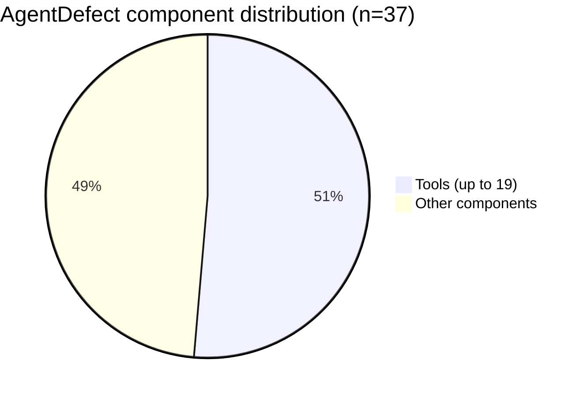
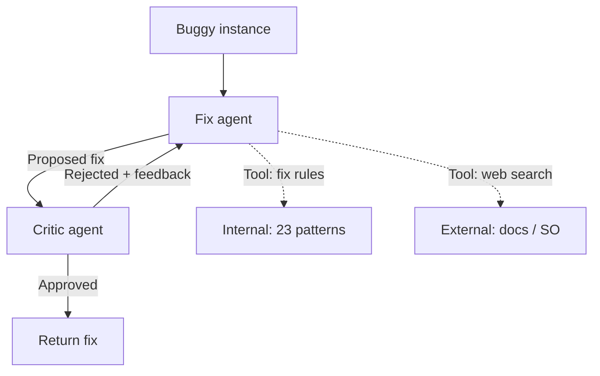

# LLM Agent Bug Fix Taxonomy

> 930 real bug fixes in LLM agents distill to 23 recurrent patterns dominated by tools-component edits, framework-version churn, and external-resource changes — scoped to Python + LangChain/LlamaIndex.

## Where the Bugs Live

Islam, Raza, and Wardat mined 930 buggy instances from Stack Overflow (665), GitHub (51 issues + 129 commits), and HuggingFace Forums (85) ([arxiv 2604.17699](https://arxiv.org/abs/2604.17699), EASE 2026). In the curated AgentDefect benchmark of 37 runtime-executable instances, **up to 19 bugs localize to the tools component** — more than any other part of the agent.

## The 23 Fix Patterns

Inter-annotator agreement (Cohen's kappa) is 0.953–1.0 for fix patterns and 0.808–0.973 for components ([arxiv 2604.17699 §3](https://arxiv.org/abs/2604.17699)) — the labels reproduce across coders.

| Pattern | Abbrev. |
|---------|---------|
| Addition of Operations | AOO |
| Removal of Operations | ROO |
| Add New Attribute | ANA |
| Remove Attribute | RA |
| Fix Attribute Name | FAN |
| Change Parameter Value | CPV |
| Change Parameter Order | CPO |
| Change Input Data | CID |
| Add Input Data | AID |
| Addition of Precondition Check | AOPC |
| Change Function | CF |
| Change Reference | CR |
| Change Data Type | CDT |
| Change Prompt | CP |
| Change Version | CV |
| Install Library | IL |
| Use Different Module | UDMo |
| Use Different Model | UDM |
| Change External Resources | CER |
| Add Exception Handling | AEH |
| Fix Syntax | FS |
| Move Code to Different Scope | MCTDS |
| Fix Data Access | FDA |

### Top patterns vary by platform

| Platform | Dominant pattern | Share |
|----------|-----------------|-------|
| Stack Overflow | Addition of Operations (AOO) | 13.1% |
| Stack Overflow (second) | Add New Attribute (ANA) | 9.9% |
| HuggingFace Forums | Change External Resources (CER) | 23.3% |
| GitHub | Change Parameter Value (CPV) | top |
| GitHub (versioning) | Change Version (CV) | 17.6% |

HuggingFace Forums skew toward external-resource changes (model/endpoint swaps). GitHub skews toward parameter- and version-level corrections. Stack Overflow shows a mix dominated by structural additions ([arxiv 2604.17699 §3](https://arxiv.org/abs/2604.17699)).

## Root Cause: Framework Version Churn

Framework churn drives a large share of these fixes. Quantified directly ([arxiv 2604.17699 §2](https://arxiv.org/abs/2604.17699)):

- **LangChain**: 55+ versions in 2024, 45+ in 2025
- **LlamaIndex**: 140+ versions in 2024, 60+ in 2025

Each version can introduce breaking changes in function signatures, module paths, or API contracts. Two consequences follow:

1. `Change Version` (CV) and `Install Library` (IL) fixes appear prominently on GitHub because upstream releases break downstream code between deploys.
2. LLM training data lags current framework APIs. Agents writing against documentation from 6+ months ago cannot repair bugs that require current API knowledge — a structural limit on autonomous repair.

60.1% of Stack Overflow bugs in the corpus involve LangChain or LlamaIndex directly ([arxiv 2604.17699](https://arxiv.org/abs/2604.17699)).

## SelfHeal: Retrieval-Augmented Repair

The authors propose a two-agent ReAct system as one response to the taxonomy ([arxiv 2604.17699 §5](https://arxiv.org/abs/2604.17699)):

Both agents use two tools: internal fix rules (the 23 patterns) and external web search. The fix agent proposes; the critic validates.

### Evaluation on AgentDefect (n=37)

| Backbone | Resolution | Component localization | Cost/fix | Time/fix |
|----------|-----------|------------------------|----------|----------|
| Gemini 3 Pro | 59.46% (22/37) | 91.89% | $0.4442 | 322.7 s |
| Claude Sonnet 4 | 56.76% (21/37) | 89.19% | $0.0759 | 43.4 s |
| GPT-5.2 | 54.05% (20/37) | 89.19% | $0.0492 | 41.8 s |

Against baselines ([arxiv 2604.17699 §6](https://arxiv.org/abs/2604.17699)):

- SelfHeal/Gemini 3 Pro at 59.46% vs zero-shot Claude Sonnet 4 at 40.54% — **+18.92 points** over zero-shot.
- SelfHeal/Gemini 3 Pro at 59.46% vs SWE-Agent/GPT-5.2 at 37.84% — **+21.62 points** over the prior SoTA on this benchmark.

### Ablations confirm both tools matter

- Removing internal fix rules: **−18.92 points** resolution rate.
- Removing web search: **−13.51 points** resolution rate.

External knowledge is not optional in a fast-churning framework domain ([arxiv 2604.17699 §6.3](https://arxiv.org/abs/2604.17699)).

## Practical Implications

**Audit the tools layer first.** If up to half of benchmark bugs occur in the tools component, tool definitions, tool-call parsing, and tool output handling are higher-leverage targets than prompt tuning. Pair with [behavioral testing](behavioral-testing-agents.md) focused on tool I/O.

**Version pinning reduces fix surface.** `Change Version` (CV) and `Install Library` (IL) fixes disappear when framework versions are pinned. A slow-upgrade LTS-style policy beats chasing breaking changes with a repair agent.

**Retrieval is structural, not optional.** The 13.51-point drop from removing web search shows retrieval-augmented repair is doing real work. Repair systems without live access to current framework docs are bounded by training cutoff. See [retrieval-augmented agent workflows](../context-engineering/retrieval-augmented-agent-workflows.md).

**Cost-quality is steep at the top.** Gemini 3 Pro costs 9x GPT-5.2 per fix for 5.4 extra percentage points. For CI-scale bug repair, cheaper backbones at 54–57% are the rational choice; reserve top-tier models for manual triage.

## When This Taxonomy Backfires

- **Non-Python or framework-free stacks**: the corpus is overwhelmingly Python + LangChain + LlamaIndex. For JavaScript agent frameworks, Semantic Kernel, or agents written directly against a provider SDK, the distribution shifts.
- **Small benchmark, single-file fixes**: AgentDefect has 37 instances; SelfHeal operates on single files. Cross-file state, long-running memory, and multi-agent coordination bugs are out of scope.
- **Data leakage via web search**: 36 of 37 AgentDefect bugs come from Stack Overflow, so web search can retrieve the exact post the fix came from. Authors restrict search to the source site to mitigate, but the 59.46% rate should be read as an upper bound for bugs already discussed publicly.
- **Stable framework regimes**: teams pinning to long-lived versions cut the `Change Version` and `Install Library` rate, reducing the taxonomy's differential value over a generic repair agent.

## Key Takeaways

- The tools component is the most bug-prone part of LLM agents — up to 19 of 37 AgentDefect bugs localize there
- 23 recurrent fix patterns repeat across Stack Overflow, GitHub, and HuggingFace Forums with high inter-annotator agreement
- LangChain and LlamaIndex version churn drives `Change Version` and `Install Library` fixes — pinning reduces fix surface
- Retrieval-augmented repair beats SoTA SWE-Agent by 21+ points on AgentDefect; removing web search costs 13.51 points in ablation
- The taxonomy is scoped to Python + LangChain/LlamaIndex — other stacks have different distributions

## Related

- [Completion Failure Taxonomy](completion-failure-taxonomy.md) — Analogous empirical taxonomy for code-completion failures
- [Agent Debugging](../observability/agent-debugging.md) — Higher-level diagnostic sequence for bad agent output
- [RAG Agent Reliability Problem Map](rag-agent-reliability-problem-map.md) — Broader 16-domain failure map
- [Trajectory Decomposition Diagnosis](trajectory-decomposition-diagnosis.md) — Per-stage precision/recall diagnosis
- [Self-Healing Production Agent](../agent-design/self-healing-production-agent.md) — Post-deploy regression auto-fix loop
- [Retrieval-Augmented Agent Workflows](../context-engineering/retrieval-augmented-agent-workflows.md) — The general pattern behind SelfHeal's external-knowledge tool
- [Nonstandard Errors in AI Agents](nonstandard-errors-ai-agents.md) — Why single-run repair rates need distributions, not point estimates
