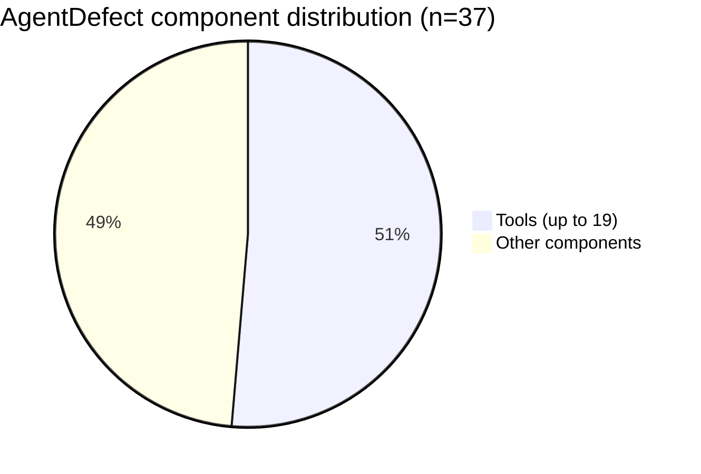
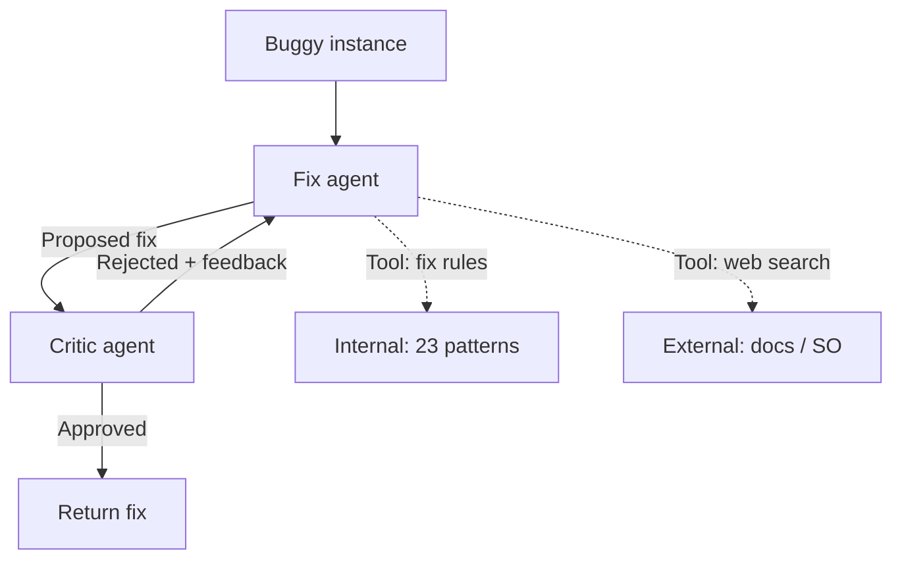

# LLM Agent Bug Fix Taxonomy

> 930 real bug fixes in LLM agents distill to 23 recurrent patterns dominated by tools-component edits, framework-version churn, and external-resource changes — scoped to Python + LangChain/LlamaIndex.

## Where the Bugs Live

Islam, Raza, and Wardat mined 930 buggy instances from Stack Overflow (665), GitHub (180), and HuggingFace (85) ([arxiv 2604.17699](https://arxiv.org/abs/2604.17699), EASE 2026). In the AgentDefect benchmark (37 runtime-executable), **up to 19 bugs localize to the tools component**.

```mermaid
pie title AgentDefect component distribution (n=37)
    "Tools (up to 19)" : 19
    "Other components" : 18
```

## The 23 Fix Patterns

| Pattern | Abbrev. |
|---------|---------|
| Addition of Operations | AOO |
| Removal of Operations | ROO |
| Add New Attribute | ANA |
| Remove Attribute | RA |
| Fix Attribute Name | FAN |
| Change Parameter Value | CPV |
| Change Parameter Order | CPO |
| Change Input Data | CID |
| Add Input Data | AID |
| Addition of Precondition Check | AOPC |
| Change Function | CF |
| Change Reference | CR |
| Change Data Type | CDT |
| Change Prompt | CP |
| Change Version | CV |
| Install Library | IL |
| Use Different Module | UDMo |
| Use Different Model | UDM |
| Change External Resources | CER |
| Add Exception Handling | AEH |
| Fix Syntax | FS |
| Move Code to Different Scope | MCTDS |
| Fix Data Access | FDA |

Top patterns by platform ([arxiv 2604.17699 §3](https://arxiv.org/abs/2604.17699)):

| Platform | Dominant pattern | Share |
|---|---|---|
| Stack Overflow | Addition of Operations (AOO) | 13.1% |
| HuggingFace | Change External Resources (CER) | 23.3% |
| GitHub | Change Version (CV) | 17.6% |

HuggingFace skews to external-resource changes; GitHub to parameter/version corrections; Stack Overflow to structural additions.

## Root Cause: Framework Version Churn

Framework churn drives a large share of these fixes: LangChain shipped 55+ versions in 2024 and 45+ in 2025 ([releases](https://github.com/langchain-ai/langchain/releases)); LlamaIndex shipped 140+ then 60+ ([releases](https://github.com/run-llama/llama_index/releases)). Each version can break signatures, module paths, or API contracts. `Change Version` and `Install Library` fixes dominate GitHub because upstream releases break downstream code between deploys, and LLM training data lags current APIs — a structural limit on autonomous repair. 60.1% of Stack Overflow bugs in the corpus involve LangChain or LlamaIndex directly ([arxiv 2604.17699](https://arxiv.org/abs/2604.17699)).

## SelfHeal: Retrieval-Augmented Repair

The authors propose a two-agent [ReAct](https://arxiv.org/abs/2210.03629) system (Yao et al., 2022) as one response to the taxonomy ([arxiv 2604.17699 §5](https://arxiv.org/abs/2604.17699)):

```mermaid
graph TD
    A[Buggy instance] --> B[Fix agent]
    B -->|Proposed fix| C[Critic agent]
    C -->|Approved| D[Return fix]
    C -->|Rejected + feedback| B
    B -.->|Tool: fix rules| E[Internal: 23 patterns]
    B -.->|Tool: web search| F[External: docs / SO]
```

Both agents use two tools: internal fix rules (the 23 patterns) and external web search.

### Evaluation on AgentDefect (n=37)

| Backbone | Resolution | Localization | $/fix | s/fix |
|---|---|---|---|---|
| Gemini 3 Pro | 59.46% | 91.89% | $0.4442 | 322.7 |
| Claude Sonnet 4 | 56.76% | 89.19% | $0.0759 | 43.4 |
| GPT-5.2 | 54.05% | 89.19% | $0.0492 | 41.8 |

Against baselines: SelfHeal/Gemini at 59.46% beats zero-shot Sonnet 4 (40.54%) by **+18.92 pp** and SWE-Agent/GPT-5.2 (37.84%) by **+21.62 pp** ([arxiv 2604.17699 §6](https://arxiv.org/abs/2604.17699)).

Ablations: removing internal fix rules drops **−18.92 pp**; removing web search drops **−13.51 pp** — external knowledge is not optional in fast-churning framework domains ([arxiv 2604.17699 §6.3](https://arxiv.org/abs/2604.17699)).

## Practical Implications

**Audit the tools layer first.** Up to half of benchmark bugs sit in the tools component, so tool definitions, call parsing, and output handling are higher-leverage targets than prompt tuning. Pair with [behavioral testing](behavioral-testing-agents.md) on tool I/O.

**Version pinning reduces fix surface.** `Change Version` and `Install Library` fixes disappear when framework versions are pinned. A slow-upgrade LTS policy beats chasing breaking changes with a repair agent.

**Retrieval is structural.** The 13.51-point drop from removing web search shows retrieval is doing real work. Repair systems without live framework docs are bounded by training cutoff. See [retrieval-augmented agent workflows](../context-engineering/retrieval-augmented-agent-workflows.md).

**Cost-quality is steep at the top.** Gemini 3 Pro costs 9x GPT-5.2 for 5.4 extra points. For CI-scale repair, cheaper backbones at 54–57% are the rational choice; reserve top-tier models for manual triage.

## When This Taxonomy Backfires

- **Non-Python stacks**: corpus is overwhelmingly Python + LangChain + LlamaIndex; distributions shift for JS frameworks, Semantic Kernel, or direct-SDK agents.
- **Single-file scope**: AgentDefect has 37 instances; cross-file state, long memory, and multi-agent coordination are out of scope.
- **Data leakage**: 36/37 bugs come from Stack Overflow; web search can retrieve the source post. The 59.46% rate is an upper bound for publicly-discussed bugs.
- **Stable framework regimes**: pinned versions cut `Change Version`/`Install Library` fixes, reducing differential value.

## Key Takeaways

- The tools component is the most bug-prone part of LLM agents — up to 19 of 37 AgentDefect bugs localize there
- 23 recurrent fix patterns repeat across Stack Overflow, GitHub, and HuggingFace Forums with high inter-annotator agreement
- LangChain and LlamaIndex version churn drives `Change Version` and `Install Library` fixes — pinning reduces fix surface
- Retrieval-augmented repair beats SoTA SWE-Agent by 21+ points on AgentDefect; removing web search costs 13.51 points in ablation
- The taxonomy is scoped to Python + LangChain/LlamaIndex — other stacks have different distributions

## Related

- [Completion Failure Taxonomy](completion-failure-taxonomy.md) — Analogous empirical taxonomy for code-completion failures
- [Agent Debugging](../observability/agent-debugging.md) — Higher-level diagnostic sequence for bad agent output
- [RAG Agent Reliability Problem Map](rag-agent-reliability-problem-map.md) — Broader 16-domain failure map
- [Trajectory Decomposition Diagnosis](trajectory-decomposition-diagnosis.md) — Per-stage precision/recall diagnosis
- [Self-Healing Production Agent](../agent-design/self-healing-production-agent.md) — Post-deploy regression auto-fix loop
- [Retrieval-Augmented Agent Workflows](../context-engineering/retrieval-augmented-agent-workflows.md) — The general pattern behind SelfHeal's external-knowledge tool
- [Nonstandard Errors in AI Agents](nonstandard-errors-ai-agents.md) — Why single-run repair rates need distributions, not point estimates
