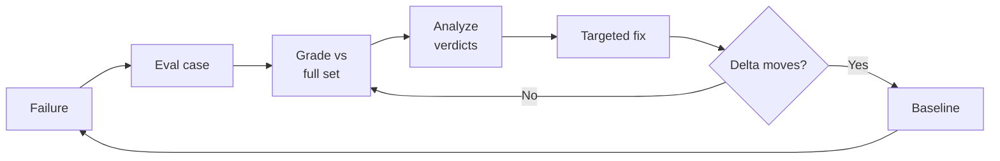

# Agent-Driven Eval Flywheel: Prove a Fix Generalizes

> Drive an eval loop from your coding agent: turn each failure into a re-runnable case so a fix is proven to generalize.

An agent-driven eval flywheel uses the coding agent itself to run the eval-improvement loop. It builds an evaluation dataset, grades the agent against it, reads why cases failed, applies a fix, and re-runs. The point is to answer the one question a manual prompt tweak cannot: did this change generalize, or did it just look better on the three examples you tried while breaking ten others? [Source: [Google — Driving the Agent Quality Flywheel](https://developers.googleblog.com/en/driving-the-agent-quality-flywheel-from-your-coding-agent/)]

This targets the gap between "looks better on a few examples" and "actually better in production." Most teams have eval cases somewhere and most teams tweak prompts, but few connect the two with enough discipline to know whether a change moved the metric or just moved the vibe. [Source: [Google](https://developers.googleblog.com/en/driving-the-agent-quality-flywheel-from-your-coding-agent/)]

## The five-stage loop

Google frames the loop as five stages. You run them in order on the first pass, then repeat stages 2 to 5 until quality targets are met. [Source: [Google](https://developers.googleblog.com/en/driving-the-agent-quality-flywheel-from-your-coding-agent/)]

1. Prepare data: build an eval dataset from existing traces, hand-crafted cases, or synthesized scenarios.
2. Run inference: execute the agent over the dataset to produce traces. Skip this if you already have traces.
3. Grade: score traces with model-based judges or your own custom metrics. This is the only stage that always runs.
4. Analyze failures: read the rubric verdicts to understand why a case failed, and cluster them once you have ten or more.
5. Optimize and iterate: apply a targeted fix, re-run stages 2 to 4, and compare against the previous baseline.

The developer describes a worry in plain language, approves a plan, and reads results. The agent chooses the metric, runs the eval service, reads the verdicts, and proposes the fix, so you never touch the eval CLI or name a metric by hand. [Source: [Google](https://developers.googleblog.com/en/driving-the-agent-quality-flywheel-from-your-coding-agent/)]

## Why it works

The loop works because it separates two roles that a manual tweak collapses into one. An independent evaluator scores the change, and whatever proposes the fix never grades its own work. An optimizer that grades itself learns to game the metric instead of improving the agent, so the decoupling is what keeps the signal honest. [Source: [Google](https://developers.googleblog.com/en/driving-the-agent-quality-flywheel-from-your-coding-agent/)]

Generalization becomes measurable because the loop promotes the one behavior under change to a stable metric. In Google's trip-planner cycle, an adaptive rater already caught a missed revision, but it folded that miss into a blended score that regenerated differently every run, so there was no number to trend. Pinning the concern to a fixed categorical rubric made a before-and-after delta countable and attributable to the fix rather than to rater drift. [Source: [Google](https://developers.googleblog.com/en/driving-the-agent-quality-flywheel-from-your-coding-agent/)] Re-running the whole accumulated set, not just the case that motivated the change, is the same regression discipline behind [incident-to-eval synthesis](incident-to-eval-synthesis.md) and [skill evals](skill-evals.md).

## When this backfires

- Model-based graders are directional, not ground truth. Judge scores can be internally consistent yet not track correctness, so trust the delta between runs more than any single number as a grade. [Source: [Reliability without Validity: LLM-as-a-Judge](https://arxiv.org/abs/2606.19544)] Google makes the same caveat about its own raters. [Source: [Google](https://developers.googleblog.com/en/driving-the-agent-quality-flywheel-from-your-coding-agent/)]
- Deterministic failures do not need this. When the failure is a wrong JSON shape or a missing field, a code-based assertion or a plain count is cheaper and more reliable than a model judge. [Source: [Skill Evals](skill-evals.md)]
- Agent-authored cases inherit the oracle problem. A case generated from an already-buggy trace can encode the bug as expected behavior, so the suite passes and the defect ships anyway. Review synthesized cases before trusting them. [Source: [Katalon — Reviewing AI-Generated Test Cases](https://katalon.com/resources-center/blog/reviewing-ai-generated-test-cases)]
- Synthetic scenarios are a cold start. A user simulator gets you moving with no traffic, but the loop only sharpens once fed real production traces. [Source: [Google](https://developers.googleblog.com/en/driving-the-agent-quality-flywheel-from-your-coding-agent/)]

## Example

Google ran the loop on `travel-concierge`, a trip planner that keeps the itinerary in session state. The developer asked only whether the agent honored mid-conversation changes, such as different dates or a different hotel. The agent read the code, then promoted that concern to a custom rubric, `revision_honored`, with a categorical verdict (HONORED, IGNORED, PARTIAL, NO_REVISION), and bootstrapped 25 scenarios across the revision types. [Source: [Google](https://developers.googleblog.com/en/driving-the-agent-quality-flywheel-from-your-coding-agent/)]

The first pass returned 21% IGNORED. The verdicts located the failure precisely: in three of four failures the internal state was correct, but the agent's final message to the user echoed the stale value. Nothing in the root instruction told it to check its final response against the user's most recent message. A three-sentence instruction change took IGNORED from 21% to 5% on a re-run of the same set. [Source: [Google](https://developers.googleblog.com/en/driving-the-agent-quality-flywheel-from-your-coding-agent/)]

## Key Takeaways

- The coding agent runs the whole loop: it builds the dataset, grades traces, reads verdicts, and proposes a fix, so you describe the goal rather than drive the eval tool.
- Keep the proposer and the evaluator decoupled. An optimizer that grades its own work learns to game the metric.
- Promote the behavior you changed to a stable metric so the before-and-after delta is countable, and treat adaptive judge scores as a directional signal.
- Re-run the whole accumulated case set after every fix, which is what separates "moved the metric" from "patched one case."
- Model-based grading, deterministic failures, the oracle problem, and synthetic-only data each bound where the flywheel pays off.

## Related

- [Incident-to-Eval Synthesis: Production Failures as Evals](incident-to-eval-synthesis.md) — the production-sourced counterpart that feeds failures into the same regression loop
- [Skill Evals](skill-evals.md) — evaluating a single skill as a dataset-graded unit with paired baseline runs
- [Eval-Driven Development](../workflows/eval-driven-development.md) — writing evals before building the feature the loop then guards
- [Agentic Flywheel: Self-Improving Agent Systems](../agent-design/agentic-flywheel.md) — the harness-improvement flywheel, where evals here become the measurement substrate
- [Meta-Evaluate the LLM Judge Before Trusting Rubric Verdicts](meta-evaluate-llm-judge-rubric-verification.md) — measuring a model grader's own error rate before you gate on it
