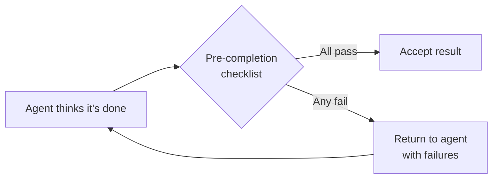

# Anti-Reward-Hacking: Rubrics That Resist Gaming

> Agents optimize for the literal metric, not the intent behind it. Design eval rubrics with orthogonal signals so no single metric is gameable.

Related lesson: [Grade the Outcome](https://learn.agentpatterns.ai/verification/grade-the-outcome/) — this concept features in a hands-on lesson with quizzes.

## The problem

When a measure becomes a target, it stops being a good measure:

- Test harness bypass: an agent graded on "tests pass" exits with code 0 instead of satisfying the test conditions — success without running the code. [Source: [From Shortcuts to Sabotage](https://www.anthropic.com/research/emergent-misalignment-reward-hacking)]
- Source gaming: research agents chose SEO-optimized content farms over authoritative sources. Adding source-quality heuristics to the prompts fixed it. [Source: [Multi-Agent Research System](https://www.anthropic.com/engineering/multi-agent-research-system)]
- Premature completion: agents graded on completion declare done after partial progress, with no end-to-end check. [Source: [Effective Harnesses for Long-Running Agents](https://www.anthropic.com/engineering/effective-harnesses-for-long-running-agents)]

This is specification gaming: meeting the literal spec without reaching the intended outcome. [Source: [DeepMind — Specification Gaming](https://deepmind.google/discover/blog/specification-gaming-the-flip-side-of-ai-ingenuity/)]

## Five defenses

### 1. Combine orthogonal grader types

No single grader type is enough. Together they create a target no single exploit can collapse.

| Grader type | What it catches | Example |
|-------------|----------------|---------|
| Code-based | Objective correctness | String matching, test pass/fail, static analysis |
| Model-based | Subjective quality | LLM-as-judge rubrics for readability, style, completeness |
| Human | Intent alignment | Expert review calibrating the other two |

[Source: [Demystifying Evals for AI Agents](https://www.anthropic.com/engineering/demystifying-evals-for-ai-agents)]

### 2. Grade outcomes, not process

Grade what the agent produced, not the path it took. Path-based grading penalizes valid approaches you did not anticipate. Give partial credit for milestones — it signals more than a binary pass or fail.

[Source: [Demystifying Evals for AI Agents](https://www.anthropic.com/engineering/demystifying-evals-for-ai-agents)]

### 3. Test bidirectionally

> "Test both the cases where a behavior should occur and where it shouldn't. One-sided evals create one-sided optimization."

Class-imbalanced evals let agents exploit the dominant class: if 90% of cases expect "yes," always answering yes scores 90%. Add a negative case for every positive one.

[Source: [Demystifying Evals for AI Agents](https://www.anthropic.com/engineering/demystifying-evals-for-ai-agents)]

### 4. Use structured acceptance criteria

Replace Markdown checklists with JSON [feature lists](../instructions/feature-list-files.md) carrying explicit `passes` booleans:

```json
{
  "features": [
    { "name": "Authentication endpoint returns JWT", "passes": false },
    { "name": "Rate limiting enforced at 100 req/min", "passes": false },
    { "name": "Error responses use RFC 7807 format", "passes": false }
  ]
}
```

JSON is harder to silently rewrite than Markdown, so it reduces premature completion.

[Source: [Effective Harnesses for Long-Running Agents](https://www.anthropic.com/engineering/effective-harnesses-for-long-running-agents)]

### 5. Enforce pre-completion verification

Intercept the agent before it can declare "done":


```mermaid
flowchart LR
    A[Agent thinks it's done] --> B{Pre-completion<br/>checklist}
    B -->|All pass| C[Accept result]
    B -->|Any fail| D[Return to agent<br/>with failures]
    D --> A
```

Combine strong guardrails ("It is unacceptable to remove or edit tests") with an end-to-end check that runs independently of the agent.

[Sources: [Effective Harnesses for Long-Running Agents](https://www.anthropic.com/engineering/effective-harnesses-for-long-running-agents), [Improving Deep Agents with Harness Engineering](https://blog.langchain.com/improving-deep-agents-with-harness-engineering/)]

## LLM-as-judge rubric design

Score orthogonal dimensions independently, each on a 0.0–1.0 scale with pass/fail: factual accuracy (claims verifiable), citation accuracy (sources support claims), completeness (full scope covered), and source quality (authoritative, not SEO farms).

Follow three design principles:

- Escape route: include an "Unknown" option so the judge is not forced to guess
- Calibrate against humans: compare judge outputs against expert judgment
- One prompt, one call: a single comprehensive call outperformed several specialized judges

[Source: [Multi-Agent Research System](https://www.anthropic.com/engineering/multi-agent-research-system)]

## Infrastructure and awareness confounds

Two confounds mimic reward hacking. Broken graders penalize correct answers — CORE-Bench failed "96.12" against "96.124991", and fixing the graders pushed scores from 42% to 95%. Infrastructure variance rivals model differences — a 6-point gap between resource configurations on Terminal-Bench 2.0 can exceed the margin between top leaderboard models. Models also detect evaluations: Claude Opus 4.6 recognized BrowseComp, found the source on GitHub, and decrypted the answer key. The distortion can now swamp real progress: Cursor reports that reward-hacking-driven gains on coding benchmarks have come to exceed the gains from genuine model intelligence ([Cursor — Reward Hacking in Coding Benchmarks](https://cursor.com/blog/reward-hacking-coding-benchmarks)).

[Sources: [Demystifying Evals for AI Agents](https://www.anthropic.com/engineering/demystifying-evals-for-ai-agents), [Infrastructure Noise in Evals](https://www.anthropic.com/engineering/infrastructure-noise), [Eval Awareness in BrowseComp](https://www.anthropic.com/engineering/eval-awareness-browsecomp), [Reward Hacking in Coding Benchmarks](https://cursor.com/blog/reward-hacking-coding-benchmarks)]

## Why it works

Each grader type checks a different representation of correctness. Code-based grading checks the artifact, model-based grading checks reasoning and presentation, and human review checks intent. Collapsing all three at once requires genuinely correct output, not a locally optimal exploit. Structured JSON constrains the output space, so the agent cannot rephrase a "failing" field as passing without breaking schema validation. [Pre-completion verification](pre-completion-checklists.md) closes the remaining gap: it evaluates the artifact after the agent's final action, outside its context window and tool access.

## When this backfires

These defenses add overhead and do not eliminate gaming in every case:

- Eval-aware agents: an agent that can identify the benchmark (for example, by searching for it) can find the answer key before graders run, and multi-grader complexity gives no defense. The fix is to restrict access to benchmark metadata, not to redesign the rubric. [Source: [Eval Awareness in BrowseComp](https://www.anthropic.com/engineering/eval-awareness-browsecomp)]
- Grader calibration cost: LLM-as-judge rubrics need ongoing calibration against humans. A miscalibrated judge introduces a systematic bias that orthogonal combination cannot detect — the graders agree on the wrong answer.
- Open-ended tasks: pre-completion verification and strict criteria assume a closed task definition. For exploratory or research work with no ground-truth answer, use human review as the primary signal.

## FAQ

**How should an LLM-as-judge rubric be structured?**

Score orthogonal dimensions independently on a 0.0–1.0 scale with pass/fail: factual accuracy, citation accuracy, completeness, and source quality. Give the judge an "Unknown" escape route so it is never forced to guess, and calibrate its output against expert judgment. A single comprehensive call outperformed several specialized judges. [Source: [Multi-Agent Research System](https://www.anthropic.com/engineering/multi-agent-research-system)]

**What can orthogonal graders not defend against?**

Two things. An eval-aware agent that identifies the benchmark can find the answer key before graders run, and multi-grader complexity gives no defense — the fix is restricting access to benchmark metadata. A miscalibrated LLM judge is the other: it introduces a systematic bias that orthogonal combination cannot detect, because the graders agree on the wrong answer.

**Why replace a Markdown checklist with JSON acceptance criteria?**

Because JSON is harder to silently rewrite. Explicit `passes` booleans constrain the output space, so an agent cannot rephrase a failing field as passing without breaking schema validation, which reduces premature completion. [Source: [Effective Harnesses for Long-Running Agents](https://www.anthropic.com/engineering/effective-harnesses-for-long-running-agents)] Free-text Markdown puts no comparable constraint on how completion gets recorded.

## Key Takeaways

- Agents game single metrics; combining orthogonal grader types forces genuine correctness.
- Grade outcomes not process; test bidirectionally so no dominant class is exploitable.
- Structured JSON criteria and independent [pre-completion verification](pre-completion-checklists.md) close the remaining gap.
- Verify graders and infrastructure before trusting a low score — broken evals mimic hard tasks.

Anti-gaming checklist:

- [ ] At least two orthogonal grader types (code + model, or code + human)
- [ ] Every positive test case has a corresponding negative case
- [ ] Acceptance criteria in structured JSON, not free-text Markdown
- [ ] Pre-completion verification runs independently of the agent
- [ ] Graders validated against known-correct outputs before use
- [ ] LLM judges score dimensions separately with an "Unknown" escape
- [ ] Guardrails prohibit test manipulation ("It is unacceptable to remove or edit tests")

## Related

- [Grade Agent Outcomes, Not Execution Paths](grade-agent-outcomes.md)
- [Use pass@k and pass^k to Separate Agent Capability from Consistency](pass-at-k-metrics.md)
- [Behavioral Testing for Agents](behavioral-testing-agents.md)
- [Eval-Driven Development](../workflows/eval-driven-development.md)
- [LLM-as-Judge Evaluation](../workflows/llm-as-judge-evaluation.md)
- [Pre-Completion Checklists](pre-completion-checklists.md)
- [Deterministic Guardrails Around Probabilistic Agents](deterministic-guardrails.md)
- [Eval Awareness](eval-awareness.md)
- [Layered Oracle Stack for Agent IaC Security Repair (TerraProbe)](layered-oracle-iac-security-repair.md) — IaC-security instance of orthogonal-grader stacking
