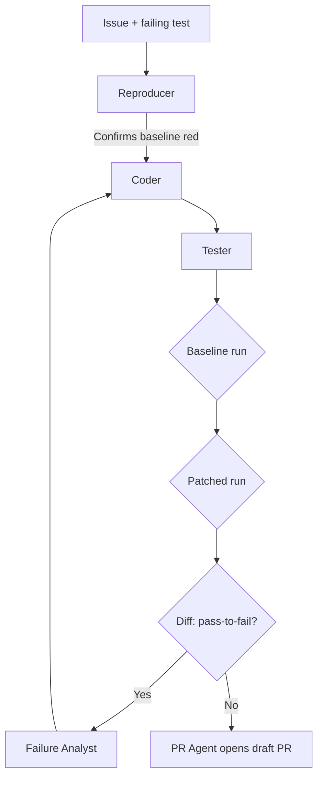

# Baseline-Aware Test Evaluation for Multi-Agent Issue Resolution (Phoenix)

> Run the test suite twice — baseline first, patched second — and gate the agent PR on the diff, not the absolute pass rate.

Baseline-aware test evaluation is a differential-testing gate for agent-generated patches: a regression is observable only as a change between baseline and patched runs, so the test gate compares two runs rather than judging one. Phoenix wires this gate behind a six-agent issue-to-PR pipeline (Planner, Reproducer, Coder, Tester, Failure Analyst, PR Agent) coordinated by a label-based GitHub webhook state machine ([Koech et al., 2026](https://arxiv.org/abs/2606.20243)).

## When This Pattern Applies

The pattern's headline result — Phoenix's zero pass-to-pass regressions on a 24-instance SWE-bench Lite subset and 100% correctness preservation across a 42-issue real-world pilot ([Koech et al., 2026](https://arxiv.org/abs/2606.20243)) — only holds when three preconditions are met. Lead with these; the guarantee collapses when any one fails.

1. **The test suite already catches semantic errors.** On SWE-bench, 7.8% of test-passing patches fail the developer-written test suite outright and 29.6% induce behavioral divergence from the ground-truth patch ([Aleithan et al., 2025](https://arxiv.org/abs/2503.15223)); after adversarial test strengthening, 19.71% of previously-passing patches are rejected ([SWE-ABS, 2026](https://arxiv.org/abs/2603.00520)). A pass-to-pass guarantee on a weak suite is a probabilistic filter, not a correctness signal.
2. **Planner localization is solved or sidestepped.** The Phoenix authors acknowledge that roughly half of generated PRs place code at incorrect paths — a planner localization limitation they address through retrieval enhancement ([Koech et al., 2026](https://arxiv.org/abs/2606.20243)). Baseline-aware tests cannot detect a misplaced patch whose tests pass for the wrong reason.
3. **The CI baseline is deterministic.** Differential testing depends on a stable reference. Flaky tests — network races, timing-sensitive integration suites, container ordering — corrupt the baseline and either mask regressions (false negative) or block valid patches (false positive).

When any of these fails, the simpler architecture (one capable agent plus a CI gate at the end) captures the same value with fewer moving parts.

## The Mechanism

A regression is, by definition, a test that changes from passing to failing. Running the suite once against the patched tree tells you which tests pass after the patch. Running it twice — baseline, then patched — tells you which tests changed between the two runs. Pre-existing failures are filtered out before the patch is judged, which eliminates two specific false signals:

- **The "I broke something I didn't" false positive** — an agent sees a red test in CI, attributes it to its own patch, and either reverts or opens a doomed remediation loop. The baseline run shows the test was already red.
- **The "all green, ship it" false-green** — the suite was green only because the test exercising the new behavior didn't exist yet. The reproducer step requires that the failing test be present in the baseline before the patch is judged ([Koech et al., 2026](https://arxiv.org/abs/2606.20243)).

This is differential testing applied to the agent's own changes, the same primitive PatchDiff uses adversarially to expose semantic divergence between agent and developer patches ([Aleithan et al., 2025](https://arxiv.org/abs/2503.15223)). The multi-agent layering complements it by separating concerns: the Reproducer confirms the bug exists in baseline; the Tester confirms the patch lands without regression. Failures become attributable to one role rather than tangled into a single prompt.

## How the Gate Sits in the Pipeline



The Reproducer establishes that the failing test exists in the baseline — without this step, the gate cannot distinguish "the agent fixed it" from "the test was always green." The Tester runs the suite twice and compares pass sets, not pass counts. Anything that flips from pass to fail is a regression; the PR is blocked and the Failure Analyst feeds back to the Coder ([Koech et al., 2026](https://arxiv.org/abs/2606.20243)).

Latency cost: Phoenix reports a mean of 122 seconds on its hard tier across the 42-issue pilot ([Koech et al., 2026](https://arxiv.org/abs/2606.20243)). The cost compounds with each role hop. For triage flows where humans expect a draft PR in under a minute, the multi-agent decomposition is too slow.

## Why It Works

The result is causally attributable to the baseline run — without it, the Tester cannot tell pre-existing failures apart from agent-introduced ones, and Phoenix's zero pass-to-pass regressions on successful executions across both the SWE-bench Lite subset and the 42-issue real-world pilot ([Koech et al., 2026](https://arxiv.org/abs/2606.20243)) collapse. The same logic underlies [staged evidence gates](staged-evidence-gates-program-repair.md) (a cheap diff signal ahead of expensive regression runs) and [incremental verification](incremental-verification.md) (verification against a known-good state before the next step). The six-role decomposition then makes the gate attributable: a regression discovered late can be traced to one role's output rather than tangled into a single prompt.

## When This Backfires

**Weak test suites yield false confidence.** Phoenix's "no pass-to-pass regressions" headline applies only against the baseline suite — and around 20% of test-passing patches across SWE-bench are semantically wrong because the suite under-specifies behavior ([SWE-ABS, 2026](https://arxiv.org/abs/2603.00520); [Aleithan et al., 2025](https://arxiv.org/abs/2503.15223)). On a low-coverage codebase the differential gate green-lights wrong patches.

**Planner-localization failures slip through.** When the planner places a patch at the wrong path, the patched run may pass baseline tests for reasons unrelated to the bug. The Phoenix authors report this happens on roughly half of generated PRs ([Koech et al., 2026](https://arxiv.org/abs/2606.20243)); the baseline-aware gate cannot detect "the patch passes because it doesn't touch the broken code." The [precise debugging benchmark](precise-debugging-benchmark.md) shows frontier LLMs often pass tests by regenerating large chunks of unrelated code, the same failure pattern.

**Coordination overhead exceeds the verification dividend.** The MAST taxonomy identifies 14 failure modes for multi-agent systems across system design, inter-agent misalignment, and task verification ([Cemri et al., 2025](https://arxiv.org/abs/2503.13657)). For small teams with low PR volume, the six-role decomposition adds operational surface (state machine, webhooks, role-specific prompts) whose maintenance cost dwarfs the throughput gain. A single capable agent plus a CI gate captures the differential-testing signal without the orchestration tax.

**Flaky baselines corrupt the diff.** If the baseline run is non-deterministic — flaky integration tests, container-ordering effects, network races — the diff becomes noise. Pre-existing flake either masks real regressions (the test was sometimes red anyway) or blocks valid patches (the test flipped for reasons unrelated to the diff). The gate is only as deterministic as the suite underneath it.

**Cross-cutting fixes break the model.** Baseline-aware tests assume the patch is localized; when the correct fix touches several files or requires repository-wide reasoning, the planner's wrong localization (above) combines with diffuse test signal to produce green pipelines that ship wrong code.

## Example

A minimal baseline-aware gate looks like this in CI shell:

```bash
# Phase 1: Reproducer — confirm the bug is present in baseline
git stash --include-untracked
pytest --json-report --json-report-file=baseline.json tests/ || true
git stash pop

# Phase 2: Tester — run the suite against the patched tree
pytest --json-report --json-report-file=patched.json tests/ || true

# Phase 3: Diff — block on any pass-to-fail flip
python -c "
import json
b = {t['nodeid']: t['outcome'] for t in json.load(open('baseline.json'))['tests']}
p = {t['nodeid']: t['outcome'] for t in json.load(open('patched.json'))['tests']}
regressions = [t for t in b if b[t] == 'passed' and p.get(t) == 'failed']
print('Regressions:', regressions)
exit(1 if regressions else 0)
"
```

The shape is the load-bearing part — two runs, a diff on the pass set, exit non-zero on any pass-to-fail flip. The Reproducer step (confirming the failing test exists in baseline) and the per-role attribution are what the Phoenix architecture adds on top.

## Key Takeaways

- A regression is a change between baseline and patched runs, not an absolute test count — the only honest gate is differential.
- The pattern works only when the test suite already catches semantic errors; on weak suites it is a probabilistic filter, not a guarantee ([SWE-ABS, 2026](https://arxiv.org/abs/2603.00520)).
- Planner localization must be solved separately — baseline-aware tests cannot detect a misplaced patch that passes for the wrong reason ([Koech et al., 2026](https://arxiv.org/abs/2606.20243)).
- The multi-agent decomposition (six roles in Phoenix) buys attribution — knowing which step caused a diff — but adds latency and 14 documented inter-agent failure modes ([Cemri et al., 2025](https://arxiv.org/abs/2503.13657)).
- For low-volume pipelines or weak-suite codebases, a single capable agent with a CI gate is cheaper and gives the same end-state.

## Related

- [Staged Evidence Gates for Agentic Program Repair](staged-evidence-gates-program-repair.md) — the staging principle this gate fits into: order cheap diff signals ahead of expensive regression runs.
- [Incremental Verification](incremental-verification.md) — the broader pattern of checking at each step against a known-good state.
- [Issue-to-PR Delegation Pipeline](../workflows/issue-to-pr-delegation-pipeline.md) — the end-to-end workflow Phoenix's gate plugs into.
- [Chain-of-Verification for Coding Agents](chain-of-verification-coding-agents.md) — adjacent verification-loop pattern that combines structural diff with self-critique.
- [Pre-Change Impact Analysis](pre-change-impact-analysis.md) — a complementary up-front gate that surfaces at-risk tests before the patch is generated.
