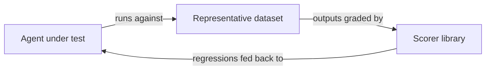

# Behavioral Testing for Agents

> Agent outputs are non-deterministic. Test decision quality and end-state, not exact execution paths, and define acceptable behavioral variance as a product decision.

## Why Traditional Testing Breaks Down

Traditional tests assert exact outputs for given inputs. Agents produce different valid outputs for identical inputs -- different tool call sequences, different phrasings, different solution paths. Equality checks generate false negatives on correct behavior and false positives on lucky runs.

Behavioral testing replaces "did the agent produce output X?" with "did the agent make good decisions and reach a valid end-state?" [Source: [Demystifying Evals for AI Agents](https://www.anthropic.com/engineering/demystifying-evals-for-ai-agents)]

## Why It Works

Agents solve problems through search — iteratively selecting tools, observing results, and updating plans. The same task admits multiple valid paths because the solution space is under-constrained. Equality checks penalize valid alternative paths as false negatives and reward lucky runs as false positives. End-state evaluation removes the path constraint: if the final state satisfies acceptance criteria, the agent succeeded regardless of route. [Source: [Demystifying Evals for AI Agents](https://www.anthropic.com/engineering/demystifying-evals-for-ai-agents)]

## Separate Deterministic from Agentic Components

Not every part of an agent system needs behavioral testing. A capability matrix isolates what to test and how:

| Component type | Testing method | Example |
|---|---|---|
| Deterministic | Traditional unit/integration tests | Tool input parsing, output formatting, API call construction |
| Agentic | Behavioral evaluation | Decision-making, tool selection, multi-step reasoning |

Mock tools to test agent reasoning without external dependencies. Evaluation must also cover tool output quality — concise, filtered, well-formatted — because tool responses shape the context the agent reasons over in subsequent steps.

## Three Grading Methods

Use the lightest method that covers each case:

| Method | Best for | Trade-off |
|---|---|---|
| **Code-based** | Exact match, regex, test suite pass/fail | Fastest and most reliable, but limited to verifiable outputs |
| **LLM-as-judge** | Open-ended outputs, style, completeness | Scalable and consistent with human judgment, but requires calibration |
| **Human grading** | Ambiguous edge cases, novel failure modes | Most flexible, but slowest -- avoid when possible |

### LLM-as-Judge

For free-form outputs, an LLM judge with a structured rubric can approximate human judgment when properly calibrated. Define scoring dimensions explicitly:

```python
RUBRIC = """Score the agent's response on each dimension (0.0-1.0):
- factual_accuracy: Are claims correct and supported?
- completeness: Does it address the full query?
- tool_efficiency: Were tools used appropriately (no redundant calls)?

Respond with JSON: {"scores": {...}, "pass": true/false, "explanation": "..."}"""
```

Track precision and recall of LLM graders against human assessments separately — raw agreement metrics mislead when pass/fail classes are imbalanced.

## Three-Part Eval Foundation

Every agent eval system needs three components working in a feedback loop:



**Representative dataset**: Start with ~20 queries. Small-sample evaluation catches dramatic effect sizes (e.g., 30% to 80% from a prompt change) without a large dataset upfront. [Source: [Demystifying Evals for AI Agents](https://www.anthropic.com/engineering/demystifying-evals-for-ai-agents)]

**Scorer library**: Reusable grading functions — code-based checkers, LLM rubric evaluators, composite scorers — each returning a structured result (score, pass/fail, explanation).

**Feedback loop**: Every model change, prompt edit, or tool modification runs through the same dataset and scorers, catching regressions before deployment.

## Define Acceptable Variance

Pass rate thresholds are not fixed at 100% — they depend on the failures you are willing to tolerate. This is a product decision.

- **File editing agent**: 95% acceptable (formatting differences tolerable)
- **Security scanning agent**: 99.5% minimum (missed vulnerabilities are not tolerable)
- **Research summarization agent**: 85% acceptable (phrasing variance expected)

When pass rates drop below thresholds, the eval suite blocks deployment. Review thresholds as agent capabilities evolve.

## Evaluate End-State, Not Process

For agents that modify persistent state across multiple turns, focus evaluation on final outcomes. A longer path that reaches the correct state beats a shorter path that does not.

See [Grade Agent Outcomes, Not Execution Paths](grade-agent-outcomes.md) for detailed implementation.

## Example

A minimal behavioral eval that combines code-based and LLM-based grading for a coding agent:

```python
import subprocess, json, anthropic

client = anthropic.Anthropic()

def grade_deterministic(repo_path: str, test_file: str) -> dict:
    """Code-based grading: does the test suite pass?"""
    result = subprocess.run(
        ["python", "-m", "pytest", test_file, "-q"],
        cwd=repo_path, capture_output=True, text=True,
    )
    return {"method": "code", "passed": result.returncode == 0}

def grade_behavioral(question: str, output: str, rubric: str) -> dict:
    """LLM-as-judge grading: does the output meet behavioral criteria?"""
    response = client.messages.create(
        model="claude-opus-4-5",
        max_tokens=256,
        messages=[{"role": "user", "content": (
            f"Evaluate this agent output.\n\n"
            f"Task: {question}\nOutput: {output}\nRubric: {rubric}\n\n"
            f"Respond with JSON: {{\"score\": 0.0-1.0, \"pass\": true/false, "
            f"\"explanation\": \"...\"}}"
        )}],
    )
    return {"method": "llm", **json.loads(response.content[0].text)}

# Combine both methods for a complete behavioral eval
deterministic = grade_deterministic("./repo", "tests/test_feature.py")
behavioral = grade_behavioral(
    question="Refactor the user service to use dependency injection",
    output=open("./repo/services/user.py").read(),
    rubric="Uses constructor injection, no global state, testable in isolation",
)
overall_pass = deterministic["passed"] and behavioral.get("pass", False)
print(f"Deterministic: {deterministic['passed']} | Behavioral: {behavioral}")
```

## Multi-Agent Considerations

Small prompt changes in one agent unpredictably alter subagent behavior. [Source: [Multi-Agent Research System](https://www.anthropic.com/engineering/multi-agent-research-system)] Monitor interaction patterns across the full system and establish golden trajectory baselines to catch regressions across decision points.

## When This Backfires

Behavioral testing pays off only when outputs are genuinely non-deterministic:

- **Constrained function-calling agents**: Structured JSON with a fixed schema needs equality checks, not LLM grading. Behavioral evaluation adds cost without signal.
- **High-volume regression suites**: LLM-as-judge at thousands of cases per CI run is slow and expensive. Reserve behavioral evaluation for the agentic layer; use code-based checks for structured outputs at scale.
- **Uncalibrated thresholds**: Thresholds set without real failure data either block valid outputs or pass defective ones. Threshold selection requires actual failure history.
- **Uncalibrated LLM judge**: An LLM grader not calibrated against human expert assessments introduces systematic bias that invalidates the entire eval pipeline.

## Key Takeaways

- Separate deterministic from agentic components using a capability matrix
- Use code-based grading first, LLM-as-judge for open-ended outputs, human grading as a last resort
- Start with ~20 representative queries -- small samples catch large effect sizes
- Define pass rate thresholds as a product decision, not an engineering target
- Evaluate end-state and decision quality, not execution paths
- In multi-agent systems, monitor cross-agent interaction patterns

## Related

- [Grade Agent Outcomes, Not Execution Paths](grade-agent-outcomes.md)
- [Golden Query Pairs as Continuous Regression Tests](golden-query-pairs-regression.md)
- [Eval-Driven Development](../workflows/eval-driven-development.md)
- [LLM-as-Judge Evaluation](../workflows/llm-as-judge-evaluation.md)
- [pass@k Metrics](pass-at-k-metrics.md)
- [Anti-Reward-Hacking: Rubrics That Resist Gaming](anti-reward-hacking.md)
- [Incident-to-Eval Synthesis: Converting Production Failures into Regression Evals](incident-to-eval-synthesis.md)
- [Red-Green-Refactor with Agents: Tests as the Spec](red-green-refactor-agents.md)
- [Risk-Based Task Sizing for Agent Verification Depth](risk-based-task-sizing.md)
- [Five-Pass Blunder Hunt](five-pass-blunder-hunt.md)
- [Test-Driven Agent Development](tdd-agent-development.md)
- [Test Harness Design for LLM Context Windows](llm-context-test-harness.md)
- [Deterministic Guardrails Around Probabilistic Agents](deterministic-guardrails.md)
- [Using the Agent to Analyze Its Own Evaluation Transcripts](agent-transcript-analysis.md)
- [Benchmark Contamination as Eval Risk](benchmark-contamination-eval-risk.md)
- [Pre-Completion Checklists for AI Agent Development](pre-completion-checklists.md)
