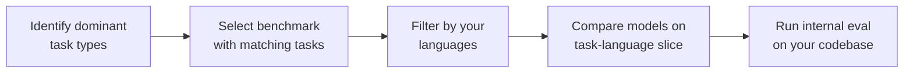

# Benchmark-Driven Tool Selection for Code Generation

> Academic coding benchmarks overstate real-world capability. Telemetry-derived benchmarks like DevBench reveal that model performance varies sharply by language, task type, and context size — making task-specific evaluation essential before committing to a tool.

## The Gap Between Benchmarks and Reality

Most code-generation benchmarks (HumanEval, MBPP, SWE-bench) use self-contained puzzles or curated repository tasks. [Source: [Evaluating Large Language Models Trained on Code](https://arxiv.org/abs/2107.03374)] Developers work differently: they complete partial functions mid-file, call unfamiliar APIs, and navigate multi-file dependencies. DevBench addresses this by deriving 1,800 evaluation instances from real developer telemetry across six languages and six task categories.

The key finding: **models that rank similarly on synthetic benchmarks diverge significantly on realistic tasks.** A model that excels at Python API usage may underperform on C++ multi-file completions. A model that tops leaderboards on isolated function generation may struggle with contextual code that depends on surrounding scope. [Source: [DevBench](https://arxiv.org/abs/2601.11895)]

## What Realistic Benchmarks Reveal

### Performance is language-specific

Leading models (GPT-4o, Claude 4 Sonnet) substantially outperform smaller alternatives on aggregate scores. But per-language breakdowns show that the gap narrows or reverses on specific languages — TypeScript underperforms across all models due to its complex type system and strict type-consistency requirements, while Python scores run higher overall. A model's Python performance does not predict its TypeScript or C performance. [Source: [DevBench](https://arxiv.org/abs/2601.11895)]

### Task type matters more than overall score

DevBench evaluates six task categories derived from what developers actually do: API usage, code purpose understanding, partial completions, and others. Models show uneven profiles across these categories. An overall accuracy number hides whether the model handles your dominant task type well.

### Context handling is the differentiator

Models diverge most on tasks requiring understanding of large surrounding context — multi-file dependencies, project-wide conventions, imported types. This is where developers most need AI assistance and where synthetic benchmarks provide the least signal.

## Evaluation Strategy

### 1. Profile your workload

Identify what your team actually asks AI tools to do. Common categories: completions mid-function, API usage, multi-file edits, test generation, refactoring.

### 2. Match benchmark to workload

Use benchmarks matching your task types. Synthetic puzzles cannot predict multi-file refactoring performance. Telemetry-derived benchmarks provide per-task breakdowns for the slice that matters.

### 3. Filter by language

Never rely on aggregate cross-language scores. If your codebase is 80% TypeScript, the model's Python performance is irrelevant. Extract per-language results and weight accordingly.

### 4. Evaluate on your own code

Public benchmarks identify candidates; internal evaluation confirms them. Run 2-3 models against your actual codebase to catch training-data contamination and surface project-specific context gaps.

## What DevBench Gets Right

DevBench's design choices map directly to evaluation best practices:

| Design Choice | Why It Matters |
|---|---|
| Tasks from telemetry, not invention | Ecological validity — measures what developers actually need |
| Six languages, six task types | Exposes language-specific and task-specific variation that aggregates hide |
| Multi-metric evaluation (correctness + similarity + LLM-judge) | No single metric captures "useful" — functional correctness misses style, similarity misses logic |
| Contamination resistance | Tasks derived from telemetry are harder to memorize than static benchmark suites |

## When This Backfires

Benchmark-driven selection fails or loses value under three conditions:

- **Team lacks internal eval capacity**: Running models against real codebase PRs requires instrumented tooling, reviewer time, and repeatable test cases. Teams without this infrastructure will treat public benchmark scores as final answers — restoring the original problem.
- **Workload profile shifts post-selection**: If the dominant task type changes (e.g., from completions to large-scale refactors), the chosen model may no longer be the best fit. Selection should be revisited when language distribution or task mix changes significantly.
- **Benchmark data becomes contaminated**: Telemetry-derived benchmarks resist contamination at creation time, but published benchmark suites become training targets once released. DevBench mitigates this with contamination-resistant design, but no public benchmark remains fully uncontaminated indefinitely. [Source: [DevBench](https://arxiv.org/abs/2601.11895)]

## Why It Works

Task-language slicing outperforms aggregate scoring because aggregate metrics obscure two orthogonal sources of variance: language-specific training coverage and task-specific capability. A model trained on more Python open-source code will perform better on Python API usage regardless of its general reasoning ability. Similarly, multi-file editing requires maintaining cross-file context across long token windows — a capability that is architecturally distinct from single-function generation. Synthetic benchmarks collapse these dimensions into one score; realistic benchmarks expose each dimension independently, letting teams weight variance that matches their actual workload.

## Key Takeaways

- Aggregate benchmark scores hide language-specific and task-specific weaknesses — always examine per-language, per-task breakdowns
- Synthetic benchmarks overstate capability for real development tasks; prefer telemetry-derived evaluations
- Context handling (multi-file, project-wide dependencies) is where models diverge most and where you need the most signal
- Public benchmarks identify candidates; internal evaluation on your own codebase confirms the choice
- A model's ranking can change depending on the task type — there is no universally "best" code generation model

## Example

A backend team writing 80% TypeScript with frequent multi-file refactors evaluates three models for their IDE copilot.

**Step 1 — Profile workload**: Git history shows 45% of AI-assisted edits are multi-file refactors, 30% are API usage completions, and 25% are test generation.

**Step 2 — Select benchmark**: The team filters DevBench results to the "multi-file completion" and "API usage" task categories, ignoring "code purpose understanding" and single-function generation scores.

**Step 3 — Filter by language**: They extract TypeScript-only results. Model A leads aggregate scores but ranks third on TypeScript multi-file tasks. Model B, mid-pack overall, ranks first on that slice.

**Step 4 — Internal eval**: The team runs Models A and B against 20 recent PRs from their codebase, measuring functional correctness and style match. Model B produces fewer cross-module import errors and follows the project's barrel-export convention more consistently.

**Result**: The team selects Model B despite its lower aggregate ranking — the task-language slice that matches their workload is the only score that matters.

## Related

- [pass@k and pass^k: Capability and Consistency Metrics](pass-at-k-metrics.md) — Complement benchmark selection with multi-trial evaluation to separate capability from consistency
- [Grade Agent Outcomes, Not Execution Paths](grade-agent-outcomes.md) — Evaluate by final output quality, not intermediate steps
- [Behavioral Testing for Non-Deterministic AI Agents](behavioral-testing-agents.md) — Design evaluations that account for agent non-determinism
- [Eval-Driven Development](../workflows/eval-driven-development.md) — Define correctness criteria before comparing tools
