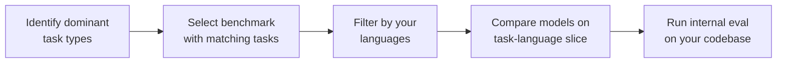

# Benchmark-Driven Tool Selection for Code Generation

> Academic coding benchmarks overstate real-world capability. Benchmark-driven tool selection uses telemetry-derived suites like DevBench, where performance varies sharply by language and task type.

## The gap between benchmarks and reality

Most code-generation benchmarks (HumanEval, MBPP, SWE-bench) use self-contained puzzles or curated repository tasks. [Source: [Evaluating Large Language Models Trained on Code](https://arxiv.org/abs/2107.03374)] Developers work differently. They complete partial functions mid-file, call unfamiliar APIs, and navigate multi-file dependencies. DevBench addresses this by deriving 1,800 evaluation instances from real developer telemetry across six languages and six task categories.

The main finding: models that rank similarly on synthetic benchmarks diverge sharply on realistic tasks. A model that excels at Python API usage may underperform on C++ multi-file completions. A model that tops leaderboards on isolated function generation may struggle with code that depends on surrounding scope. [Source: [DevBench](https://arxiv.org/abs/2601.11895)]

## What realistic benchmarks reveal

### Performance is language-specific

Leading models (GPT-4o, Claude 4 Sonnet) outperform smaller alternatives on aggregate scores. But per-language breakdowns show the gap narrows or reverses on specific languages. TypeScript is consistently the hardest language, with most models scoring 20 to 30% lower than on other languages because of strict type-consistency requirements. Strong aggregate performance does not guarantee strength in every language: DeepSeek-V3, competitive overall, ranks near the bottom on C++. [Source: [DevBench](https://arxiv.org/abs/2601.11895)]

### Task type matters more than overall score

DevBench evaluates six task categories derived from what developers actually do: API usage, code purpose understanding, partial completions, and others. Models show uneven profiles across these categories. An overall accuracy number hides whether the model handles your dominant task type well.

### Context handling is the differentiator

Models diverge most on tasks requiring understanding of large surrounding context — multi-file dependencies, project-wide conventions, imported types. This is where developers most need AI assistance and where [synthetic benchmarks](benchmark-contamination-eval-risk.md) provide the least signal.

## Evaluation strategy

```mermaid
flowchart LR
    A[Identify dominant<br/>task types] --> B[Select benchmark<br/>with matching tasks]
    B --> C[Filter by your<br/>languages]
    C --> D[Compare models on<br/>task-language slice]
    D --> E[Run internal eval<br/>on your codebase]
```

### 1. Profile your workload

Identify what your team actually asks AI tools to do. Common categories: completions mid-function, API usage, multi-file edits, test generation, refactoring.

### 2. Match benchmark to workload

Use [benchmarks matching your task types](../workflows/eval-driven-development.md). Synthetic puzzles cannot predict multi-file refactoring performance. Telemetry-derived benchmarks provide per-task breakdowns for the slice that matters.

### 3. Filter by language

Never rely on aggregate cross-language scores. If your codebase is 80% TypeScript, the model's Python performance is irrelevant. Extract per-language results and weight accordingly.

### 4. Evaluate on your own code

Public benchmarks identify candidates; internal evaluation confirms them. Run 2-3 models against your actual codebase to catch training-data contamination and surface project-specific context gaps.

Sourcegraph publishes a vendor methodology for this step, covering how to evaluate its own product against your codebase ([How to evaluate Sourcegraph on your own codebase](https://sourcegraph.com/blog/how-to-evaluate-sourcegraph-on-your-own-codebase)).

## What DevBench gets right

DevBench's design choices map directly to evaluation best practices:

| Design choice | Why it matters |
|---|---|
| Tasks from telemetry, not invention | Ecological validity — measures what developers actually need |
| Six languages, six task types | Exposes language-specific and task-specific variation that aggregates hide |
| Multi-metric evaluation (correctness + similarity + LLM-judge) | No single metric captures "useful" — functional correctness misses style, similarity misses logic |
| Contamination resistance | Tasks derived from telemetry are harder to memorize than static benchmark suites |

## When this backfires

Benchmark-driven selection fails or loses value under three conditions:

- No internal eval capacity: running models against real codebase PRs needs instrumented tooling, reviewer time, and repeatable test cases. Teams without this infrastructure treat public benchmark scores as final answers, which restores the original problem.
- Workload profile shifts after selection: if the dominant task type changes (for example, completions to large-scale refactors), the chosen model may no longer fit. Revisit selection through the [eval-driven loop](../workflows/eval-driven-development.md) when language or task mix shifts.
- Benchmark data becomes contaminated: published benchmark suites become training targets once released. DevBench's contamination-resistant design reduces this, but no public benchmark stays uncontaminated indefinitely. See [Benchmark Contamination as Eval Risk](benchmark-contamination-eval-risk.md). [Source: [DevBench](https://arxiv.org/abs/2601.11895)]

## Why it works

Task-language slicing beats aggregate scoring. Aggregate metrics hide two independent sources of variance: language-specific training coverage and task-specific capability. A model trained on more Python open-source code performs better on Python API usage, regardless of general reasoning ability. Multi-file editing needs cross-file context held across long token windows, which is architecturally distinct from single-function generation. Synthetic benchmarks collapse these dimensions into one score. Realistic benchmarks expose each one independently, so teams can weight the variance that matches their workload.

## Key Takeaways

- Aggregate benchmark scores hide language-specific and task-specific weaknesses — always examine per-language, per-task breakdowns
- Synthetic benchmarks overstate capability for real development tasks; prefer telemetry-derived evaluations
- Context handling (multi-file, project-wide dependencies) is where models diverge most and where you need the most signal
- Public benchmarks identify candidates; internal evaluation on your own codebase confirms the choice
- A model's ranking can change depending on the task type — there is no universally "best" code generation model

## Example

A backend team writing 80% TypeScript with frequent multi-file refactors evaluates three models for their IDE copilot.

Step 1, profile workload: Git history shows 45% of AI-assisted edits are multi-file refactors, 30% are API usage completions, and 25% are test generation.

Step 2, select benchmark: The team filters DevBench results to the "multi-file completion" and "API usage" task categories, ignoring "code purpose understanding" and single-function generation scores.

Step 3, filter by language: They extract TypeScript-only results. Model A leads aggregate scores but ranks third on TypeScript multi-file tasks. Model B, mid-pack overall, ranks first on that slice.

Step 4, internal eval: The team runs Models A and B against 20 recent PRs from their codebase, measuring functional correctness and style match. Model B produces fewer cross-module import errors and follows the project's barrel-export convention more consistently.

Result: The team selects Model B despite its lower aggregate ranking — the task-language slice that matches their workload is the only score that matters.

## Related

- [pass@k and pass^k: Capability and Consistency Metrics](pass-at-k-metrics.md) — Complement benchmark selection with multi-trial evaluation to separate capability from consistency
- [Grade Agent Outcomes, Not Execution Paths](grade-agent-outcomes.md) — Evaluate by final output quality, not intermediate steps
- [Behavioral Testing for Non-Deterministic AI Agents](behavioral-testing-agents.md) — Design evaluations that account for agent non-determinism
- [Eval-Driven Development](../workflows/eval-driven-development.md) — Define correctness criteria before comparing tools
- [Purpose-Built Eval Suites for Model and Harness Swaps](purpose-built-eval-suites.md) — Build your own small suite when no public benchmark matches your workload
