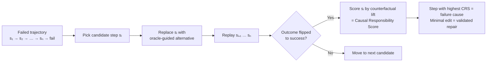

# CausalFlow: Counterfactual Repair for Failed Agent Trajectories

> Intervene on each step of a failed agent trajectory — the step whose oracle-guided replacement flips the outcome is the cause and the repair.

This technique needs three conditions: a binary success verifier, replay isolation (steps re-executable without irreversible side effects), and a single-trajectory failure that is not the tip of a cascade. Where they hold, CausalFlow turns a failure log into a controlled experiment yielding an immediate patch and a validated training pair. Where they do not, cheaper retries or deterministic guardrails win.

## How it works

CausalFlow models a failed trajectory as a chain of dependent steps and runs a per-step interventional probe ([arxiv 2605.25338](https://arxiv.org/abs/2605.25338)):

### 1. Causal Responsibility Score (CRS)

For each step, the framework asks: if this step had been different, would the run have succeeded? The score is the change in success probability under intervention ([arxiv 2605.25338](https://arxiv.org/abs/2605.25338)); high CRS means high responsibility. This is Pearl-style abduct–act–predict applied to agent traces; the SCM-for-LLM-attribution framing is formalized more generally ([A2P, arxiv 2509.10401](https://arxiv.org/abs/2509.10401)).

### 2. Minimal edit

CausalFlow then generates the smallest edit that makes the intervention work. The success criterion is mechanical: the edited step plus original downstream replay must produce an accepted outcome ([arxiv 2605.25338](https://arxiv.org/abs/2605.25338)). Validation by re-execution is what separates this from log-scanning heuristics whose repairs are never tested.

### 3. Dual use of the (wrong, corrected) pair

Each repair yields a contrastive pair usable in two modes:

| Mode | What it does |
|------|--------------|
| Test-time repair | Apply the corrected step in-flight to recover the failed run |
| Offline training signal | Aggregate pairs as preference data for DPO-style fine-tuning |

Validated across mathematical reasoning, code generation, question answering, and medical tasks, outperforming heuristic refinement baselines with the largest gains in retrieval-heavy scenarios ([arxiv 2605.25338](https://arxiv.org/abs/2605.25338)).

## Why it works

Treating the trajectory as a Pearl-style structural causal chain and replacing one step with an oracle-guided alternative gives a per-step counterfactual probability — the highest-lift step is the most plausible cause, and the minimal edit that produced the flip is by construction a validated repair, not a hypothesized one ([CausalFlow, arxiv 2605.25338](https://arxiv.org/abs/2605.25338); the SCM-for-LLM-attribution case is framed generally in [A2P, arxiv 2509.10401](https://arxiv.org/abs/2509.10401)). Heuristic refinement loops ask the model to "try again" without isolating the wrong step.

## When this backfires

Five conditions break the assumptions and make cheaper approaches preferable.

Side-effecting tools without replay isolation. Counterfactual intervention re-executes the trajectory with an alternative action. If steps mutate external state — databases, files, paid APIs, sent emails — [replay](../observability/offline-trajectory-replay-multi-agent-debugging.md) corrupts state or is infeasible. The technique fits sandboxed reasoning, code generation, and retrieval; production tool-use agents need a snapshotting layer first.

Cascading or distributed failures. Single-trajectory CRS attributes responsibility to one step. Empirically, ~40 % of LLM/Agent-node failure root causes occur at locations different from where the failure surfaces, rising to ~45 % for Logic/Control nodes ([arxiv 2509.23735](https://arxiv.org/abs/2509.23735)). Multi-perspective failures are ill-posed for single-step attribution because multiple distinct interventions can independently repair the task ([arxiv 2603.25001](https://arxiv.org/abs/2603.25001)). For distributed cases, prefer hierarchical causal-graph attribution ([CHIEF, arxiv 2602.23701](https://arxiv.org/abs/2602.23701)) or multi-agent attribution benchmarks ([TraceElephant, arxiv 2604.22708](https://arxiv.org/abs/2604.22708)).

No binary verifier. Minimal repair only works when "did the run succeed?" is mechanically checkable. Essay writing, creative code, and UX decisions lack the binary signal, so the "minimal edit that flips outcome to success" is undefined.

Cost-bounded inference pipelines. Each counterfactual probe is at least one extra forward pass per candidate step. On long trajectories with budget-constrained backbones, the apparatus exceeds the [cost of retrying](staged-evidence-gates-program-repair.md) with a stronger model. [Deterministic guardrails](deterministic-guardrails.md) plus retry often dominate cost per recovered failure.

Self-distillation collapse when fed back as offline signal. Paired (wrong, corrected) examples derived from a model's own failures, then fed back as preference data, risk distribution collapse — see [anti-reward-hacking](anti-reward-hacking.md). External oracle guidance is what keeps the corrected step out of the model's prior.

## Practical implications

Audit replay isolation before the CRS pipeline. The first investment is the sandbox that makes step-level replay safe, not the attribution model. Agents already inside a snapshottable environment ([offline trajectory replay](../observability/offline-trajectory-replay-multi-agent-debugging.md)) can adopt CausalFlow; others need that foundation first.

Start with the offline-signal use. Aggregating pairs into a preference dataset is lower-stakes than rerouting live traffic through CRS-driven repair, and composes with [incident-to-eval synthesis](incident-to-eval-synthesis.md).

Combine with stage decomposition. [Trajectory decomposition](trajectory-decomposition-diagnosis.md) tells you which stage a population fails in; CausalFlow tells you which step a single trajectory failed at and what would have fixed it. Use the population view to choose where to invest; use CRS to extract supervision per failure.

## Key Takeaways

- CausalFlow scores each step in a failed trajectory by counterfactual lift — replace the step with an oracle-guided alternative, replay, observe whether the outcome flips ([arxiv 2605.25338](https://arxiv.org/abs/2605.25338))
- The minimal edit that produces the flip is a *validated* repair, not a hypothesized one — usable for test-time recovery or as offline preference data
- The technique is qualified by three preconditions: binary verifier, replay isolation, and single-trajectory failure that is not the tip of a cascade
- For distributed or multi-agent failures, prefer hierarchical causal-graph attribution ([CHIEF](https://arxiv.org/abs/2602.23701)) or multi-perspective benchmarks ([TraceElephant](https://arxiv.org/abs/2604.22708))
- Replay isolation is the load-bearing prerequisite — invest there before the attribution model

## Related

- [Trajectory Decomposition Diagnosis](trajectory-decomposition-diagnosis.md) — Per-stage precision/recall view across many runs; complement to CausalFlow's per-step view on a single run
- [Offline Trajectory Replay for Multi-Agent Workflow Debugging](../observability/offline-trajectory-replay-multi-agent-debugging.md) — The replay infrastructure CausalFlow assumes
- [LLM Agent Bug Fix Taxonomy](agent-bug-fix-taxonomy.md) — Empirical fix-pattern distribution complementing CausalFlow's per-trajectory repair
- [Incident-to-Eval Synthesis](incident-to-eval-synthesis.md) — How each validated repair becomes a regression eval case
- [Staged Evidence Gates for Agentic Program Repair](staged-evidence-gates-program-repair.md) — Cost-orders the repair-validation checks CausalFlow runs per candidate edit
- [Deterministic Guardrails Around Probabilistic Agents](deterministic-guardrails.md) — Cheaper alternative when CRS conditions don't hold
