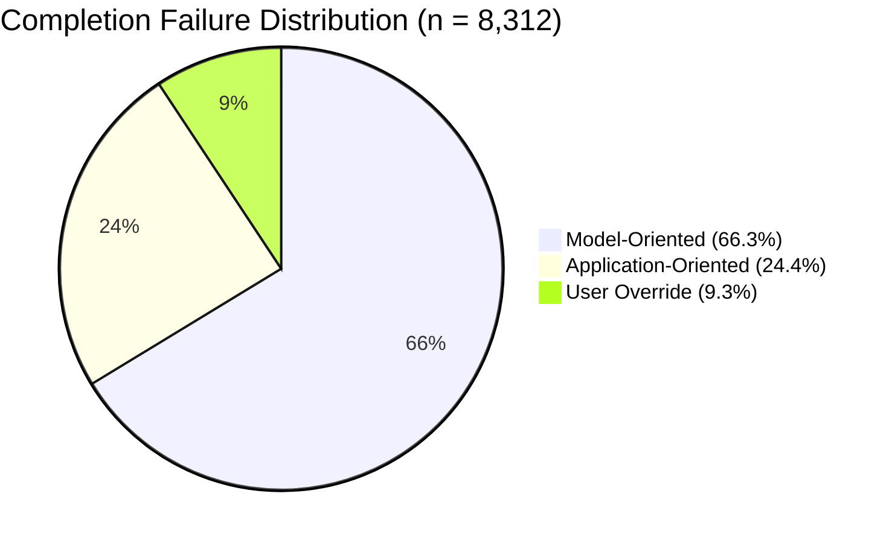

# Completion Failure Taxonomy

> Not every rejected completion is a model failure. A quarter of real-world completion failures trace to integration problems — when the tool fires, what context it sends, and whether the suggestion was even needed.

## The Three Failure Categories

Code4Me collected 600K+ real completions from 1,200+ developers across 12 languages. Analysis of 8,312 failures revealed three categories with stable proportions. [Source: [Izadi et al., ICSE 2024](https://arxiv.org/abs/2402.16197)]

### Model-oriented errors (66.3%)

The model produced wrong output. Two sub-types:

| Sub-type | Count | Examples |
|----------|-------|---------|
| Token-level mistakes | 3,835 | Wrong variable name, incorrect function call, bad literal, wrong type |
| Statement-level errors | 1,676 | Wrong parameter count, incorrect semantics, early/late termination, rambling output |

Better models directly reduce this category. Upgrading from the study's models (InCoder, UniXcoder, CodeGPT) to modern production systems narrows the gap: an Accenture deployment of GitHub Copilot reported developers accepting around 30% of suggestions, versus the Code4Me study's 4.91%. [Source: [GitHub/Accenture study](https://github.blog/news-insights/research/research-quantifying-github-copilots-impact-in-the-enterprise-with-accenture/)]

### Application-oriented errors (24.4%)

The integration layer caused the failure, not the model:

| Sub-type | Count | Implication |
|----------|-------|-------------|
| Mid-token invocation | 1,173 | Completion triggered while the developer was mid-keystroke — the partial token corrupted the prompt |
| Insufficient context | 482 | The IDE sent too little surrounding code for the model to produce a useful completion |
| Redundant invocation | 240 | Completion fired when no suggestion was needed — wasting a round-trip and interrupting flow |

This is the actionable category for agent builders. Nearly **one in four failures** had nothing to do with model capability.

### User overrides (9.3%)

The model output was acceptable but rejected:

| Sub-type | Count | Meaning |
|----------|-------|---------|
| Correct but rejected | 605 | Model predicted correctly; developer chose to type it themselves |
| Valid but unpreferred | 112 | Output was functionally correct but didn't match developer's style or intent |

These are not true failures — they represent the irreducible gap between prediction and developer intent.

## The Benchmark Gap

The study's key finding: **offline evaluations substantially misrepresent real-world effectiveness**.

| Setting | Metric behavior |
|---------|----------------|
| Offline (synthetic test sets) | Models score well on curated, clean inputs with full context |
| Online (real IDE usage) | 4.91% average acceptance rate across all models and languages |

Corroboration: LLMs achieve 84–89% on synthetic benchmarks but only 25–34% on real-world class-level tasks. [Source: [arxiv 2510.26130](https://arxiv.org/abs/2510.26130)]

The gap stems from:

- Benchmark inputs are clean; real code has typos, partial expressions, and mid-edit states
- Benchmarks provide full file context; real invocations often have truncated or stale context
- Benchmarks measure correctness; real usage also requires timing, relevance, and style match

## Practical Implications for Agent Builders

### 1. Audit the integration layer, not just the model

If ~25% of failures are application-oriented, improving the model alone hits diminishing returns. Measure and optimize:

- **Invocation timing** — debounce triggers to avoid mid-token firing
- **Context assembly** — ensure the prompt includes sufficient surrounding code, imports, and type information
- **Relevance gating** — suppress completions when the cursor position or editing pattern suggests no suggestion is needed

### 2. Use real-world telemetry for evaluation

Synthetic benchmarks rank models but do not predict user acceptance. Track acceptance rate, time-to-accept, and rejection reasons from actual usage. RepoMasterEval confirms realistic benchmarks correlate with online acceptance rates — prefer telemetry-derived evals. [Source: [arxiv 2408.03519](https://arxiv.org/abs/2408.03519)]

### 3. Treat user overrides as signal, not noise

The 9.3% override rate means roughly 1-in-10 suggestions is correct but unwanted. This reveals style mismatches, context preferences, and developer intent that can inform personalization or filtering.

### 4. Language-specific performance varies sharply

InCoder outperformed across all 12 languages, but mainstream languages (Python, Java) consistently scored higher than less common ones. Do not assume Python performance predicts Rust or Kotlin performance — evaluate per-language.

## When This Taxonomy Backfires

The 66 / 24 / 9 split is a useful prior, not a fixed budget:

- **Ratios are model- and cohort-specific.** The study used first-gen code LMs (InCoder, UniXcoder, CodeGPT). Better models shrink the model-oriented share and raise the relative weight of integration errors.
- **Integration gains plateau.** Smart-invocation work raised acceptance from ~4.9% to ~18.6% [Source: [Koohestani et al., arxiv 2405.14753](https://arxiv.org/abs/2405.14753)]. Past that, gains come from model capability and context quality, not more timing heuristics.
- **Narrow cohorts may skip harness work.** Single-language teams on recent models often clear the bar off-the-shelf; the "just upgrade the model" steelman holds in that regime.
- **Non-mainstream languages invert priorities.** For Rust, Kotlin, or niche DSLs, thin training data dominates; invocation tuning cannot compensate.
- **Override data needs good instrumentation.** If telemetry cannot separate "rejected because wrong" from "rejected because already typed", the 9.3% bucket is noise.

## Key Takeaways

- Two-thirds of completion failures are model errors; one quarter are integration failures — fix both
- Mid-token invocation is the single largest application-oriented failure mode (1,173 of 2,030 cases)
- Offline benchmarks systematically overstate real-world completion quality — use telemetry-derived evals
- ~10% of rejected completions were actually correct — user override data is a feedback signal, not waste

## Related

- [Benchmark-Driven Tool Selection for Code Generation](benchmark-driven-tool-selection.md) — Why synthetic benchmarks hide language-specific and task-specific weaknesses
- [Instruction-Guided Code Completion](../context-engineering/instruction-guided-code-completion.md) — When models complete code correctly but ignore structural constraints
- [Demo-to-Production Gap](../anti-patterns/demo-to-production-gap.md) — The systematic gap between curated demos and production reality
- [pass@k and pass^k Metrics](pass-at-k-metrics.md) — Separating capability from consistency in agent evaluation
