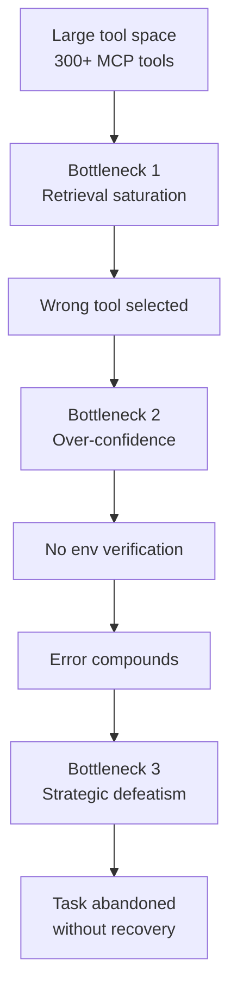

# ComplexMCP: Three Bottlenecks in Large Interdependent Tool Sandboxes

> ComplexMCP, a 300+ tool MCP benchmark, caps top models near 55% against a 94% human baseline through three deployment-conditional failure modes.

## The Benchmark and the Gap

[ComplexMCP](https://arxiv.org/abs/2605.10787) evaluates LLM agents on 47 hand-curated tasks routed through seven stateful application sandboxes — operating system, social, e-commerce, weather, flight, stock trading, and news. The benchmark exposes 150+ interdependent tools and another 150+ stateless APIs through the Model Context Protocol, then perturbs the environment with seed-driven state initialization and injected API failures.

The headline result is a persistent ceiling. Across 16 evaluated models, the top score is Gemini-3-Flash at **55.31%**, followed by GLM-4.7 (42.55%) and Claude-Opus-4 (41.84%). Three human evaluators averaged **93.61%**. No model crossed 60%. [Source: [arxiv.org/abs/2605.10787](https://arxiv.org/abs/2605.10787)]

Trajectory analysis decomposes the gap into three reproducible failure modes.

## Three Bottlenecks

### 1. Tool retrieval saturation

As the action space scales, the agent cannot reliably identify the next correct tool from its partial plan. Vector-retrieval RAG — including iterative RAG, the best variant tested — does not match full-context tool listing. The paper notes: "without a comprehensive view of the full API set, the LLM may fail to invoke essential intermediate steps that are not explicitly surfaced by the retrieval mechanism." [Source: [arxiv.org/abs/2605.10787](https://arxiv.org/abs/2605.10787)]

This is the same precision-drop-at-scale mechanism documented in the [Skill Retrieval Realism Gap](skill-retrieval-realism-gap.md) for skills — retrieval that looks adequate at 30 items degrades sharply at 300.

### 2. Over-confidence skipping environment verification

Agents commit to actions without checking environment state first. A booking flow assumes a user exists; a trade assumes the account tier permits the order type. Because the seed-driven architecture varies users, accounts, and permissions between runs, any hardcoded assumption fails. The paper frames the needed shift as moving from "proactive executors" to "perceptive planners" — agents that reconcile their internal plan with a dynamic, non-empty environment state. [Source: [arxiv.org/abs/2605.10787](https://arxiv.org/abs/2605.10787)]

### 3. Strategic defeatism

When an action fails — a transient API error, a missing precondition — agents tend to abandon the task rather than attempt recovery. GPT-5 reaches only 19.14%, attributed to "polite surrender" after the first error. Models trained heavily on refusal and hedging are more susceptible. [Source: [arxiv.org/abs/2605.10787](https://arxiv.org/abs/2605.10787)]

## When These Bottlenecks Bite

The three bottlenecks are conditional on deployment shape, not inherent to agents.

| Deployment | Retrieval saturation | Over-confidence | Strategic defeatism |
|------------|---------------------|-----------------|--------------------|
| 10-30 curated tools, single domain | Low risk | Low risk if read-mostly | Low if harness retries |
| 50-150 tools, multi-domain | Moderate | High on writes | Model-dependent |
| 300+ tools, stateful, interdependent | High — full-context required | High — verification mandatory | High — needs explicit recovery prompts |

Narrow MCP servers see different failure profiles than the benchmark predicts. [Consolidate Agent Tools](../tool-engineering/consolidate-agent-tools.md) and [Tool Minimalism](../tool-engineering/tool-minimalism.md) address bottleneck 1 by design — fewer, higher-level tools never saturate retrieval; scoped discovery and partitioned servers achieve the same at the harness layer.

## Design Responses

**For bottleneck 1 (retrieval):** keep the active toolset small enough to fit in context. If the surface is large, partition by task phase or sub-agent rather than retrieve from a flat pool. Track which tools the agent selects across a trajectory sample — unselected tools are dead weight.

**For bottleneck 2 (over-confidence):** require state-reading tool calls before any mutating call, enforced at the harness layer. Schema-level checks on tool outputs catch agents that assume entities exist. The [Deterministic Guardrails](deterministic-guardrails.md) pattern wraps this around probabilistic agent decisions.

**For bottleneck 3 (defeatism):** the harness, not the prompt, owns recovery. Pre-completion checklists that re-run failed tool calls with backoff prevent single-error abandonment. [RFC 9457 machine-readable errors](../tool-engineering/rfc9457-machine-readable-errors.md) give the agent a structured signal that an error is retryable versus terminal.

## Limitations of the Benchmark

Reproducible but bounded:

- **47 hand-curated tasks** with 3 human evaluators, 1 attempt each — narrow diversity and wide confidence intervals on the human baseline. [Source: [arxiv.org/abs/2605.10787](https://arxiv.org/abs/2605.10787)]
- **Synthetic sandboxes** omit concurrency, fraud detection, and rate limits real systems enforce.
- **Full-context retrieval as upper bound** is not a viable production posture; the RAG vs full-context gap measures a regime no one ships.

Treat the bottlenecks as design hypotheses to test against your own toolset, not universal agent claims.

Adjacent benchmarks corroborate the shape: [τ-bench](https://arxiv.org/abs/2406.12045) reports SOTA function-calling agents under 50% and "quite inconsistent" on tool-agent-user tasks (over-confidence and defeatism without MCP); [MCP-Bench](https://arxiv.org/abs/2508.20453) wires 250 tools across 28 servers and finds retrieval breaks down on fuzzy instructions without explicit tool names (the same saturation dynamic).

## Example

The benchmark's LightStock domain illustrates all three bottlenecks compounding. A stop-loss trade requires: verifying account tier permits stop-loss orders, checking the trading password is set, confirming sufficient funds, then placing the order through the correct order-type tool. With 300 tools available:

- Bottleneck 1: the agent retrieves a generic `place_order` tool rather than the stop-loss-specific variant.
- Bottleneck 2: the agent skips the account-tier check, assuming the default tier allows the order.
- Bottleneck 3: when the API returns an `INSUFFICIENT_TIER` error, the agent reports failure to the user rather than calling the tier-upgrade flow.

Each step is independently fixable. Scoping the toolset to LightStock alone (~30 tools) addresses bottleneck 1. Requiring a `get_account_info` call before any `place_*` call addresses bottleneck 2. A harness-level retry policy on tier errors addresses bottleneck 3. The 41% raw score becomes a much higher effective score once the deployment is shaped to the workload.

## Key Takeaways

- ComplexMCP demonstrates a 35-point gap between top models (55%) and humans (94%) on large, stateful, interdependent toolsets — the gap is decomposable into three measurable failure modes.
- Tool retrieval saturation is the precision-at-scale problem; the [Skill Retrieval Realism Gap](skill-retrieval-realism-gap.md) showed the same mechanism for skills.
- Over-confidence on environment state and strategic defeatism on errors are harness-level problems — fix them with verification gates and retry policies, not better prompts.
- The bottlenecks are deployment-conditional. Curated toolsets, scoped servers, and deterministic guardrails design most of them away.
- Treat any agent benchmark as descriptive of the regime it tests; ComplexMCP's regime is flat 300-tool deployment, which production rarely ships.

## Related

- [Skill Retrieval Realism Gap](skill-retrieval-realism-gap.md) — the same retrieval-precision-at-scale mechanism, applied to skills
- [Benchmark-Driven Tool Selection for Code Generation](benchmark-driven-tool-selection.md) — telemetry-derived benchmarks beat synthetic puzzles; ComplexMCP is the MCP analogue
- [Deterministic Guardrails Around Probabilistic Agents](deterministic-guardrails.md) — wrap verification and retry around bottleneck 2 and 3
- [Consolidate Agent Tools](../tool-engineering/consolidate-agent-tools.md) — fewer, higher-level tools address bottleneck 1 by design
- [Tool Minimalism and High-Level Prompting](../tool-engineering/tool-minimalism.md) — non-overlapping tools never saturate retrieval
- [Scoped MCP Server Discovery](../tool-engineering/scoped-mcp-server-discovery.md) — partition large MCP surfaces so the active set stays small
- [RFC 9457 Machine-Readable Errors](../tool-engineering/rfc9457-machine-readable-errors.md) — structured retryable signals defeat strategic defeatism
