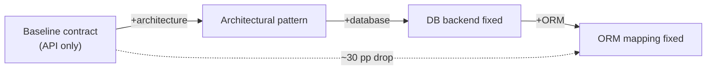

# Constraint Decay in Backend Code Generation

> Multi-file backend tasks expose a measured fragility: agents that pass functional asserts on a baseline contract drop ~30 percentage points when the same contract is wrapped in framework, database, and ORM constraints — with convention-heavy frameworks taking the largest hit.

## What Was Measured

Dente, Satriani, and Papotti construct a benchmark of greenfield backend tasks under a fixed API contract, then layer structural requirements — architectural patterns, database backends, ORM mappings — on top. As structural requirements accumulate, capable configurations lose roughly 30 percentage points in assertion pass rate moving from baseline to fully specified tasks ([Dente et al., 2026](https://arxiv.org/abs/2605.06445)).

The drop is not a knowledge gap — agents recognise the conventions individually. It is a budget gap: satisfying the API contract jointly with the framework's implicit invariants pushes constraint count past reliable simultaneous compliance.

## Framework Sensitivity Is the Dominant Axis

Agents perform well on minimal, explicit frameworks (Flask) and substantially worse on convention-heavy environments (FastAPI, Django) ([Dente et al., 2026](https://arxiv.org/abs/2605.06445)). The more the framework relies on implicit conventions — model classes implying migrations, DI containers implying lifetimes, blueprint registration implying URL prefixes — the more invariants the agent must hold, and the steeper the decay.

This matches the prompt-level mechanism in [constraint degradation in code generation](../instructions/constraint-degradation-code-generation.md): when constraint count rises, models silently drop the lowest-prominence constraints. Framework conventions are less prominent than the explicit contract, so they go first.

## Where the Failures Live

Data-layer defects dominate — incorrect query composition and ORM runtime violations are the leading root causes ([Dente et al., 2026](https://arxiv.org/abs/2605.06445)). Two consequences for verification design:

- **Contract assertions under-detect ORM bugs.** A response can be JSON-shape-correct while the underlying query is N+1, missing a join, or violating a relationship constraint. Contract tests are necessary but not sufficient.
- **Framework-aware checks belong in the loop.** ORM violations surface only when the data layer executes — static type checks miss them. Pair contract assertions with integration tests against a real database.

BaxBench, an independent backend benchmark covering correctness and security, finds an analogous gap between snippet-level and complete-system performance ([Vero et al., 2025](https://arxiv.org/abs/2502.11844)). Both studies converge: passing a functional contract does not imply structural correctness.

## Practical Implications

**Treat framework choice as an evaluation variable.** Run the same contract across at least two frameworks of different convention density. A model that wins on Flask may lose on Django or FastAPI on the same logical task ([Dente et al., 2026](https://arxiv.org/abs/2605.06445)). See [benchmark-driven tool selection](benchmark-driven-tool-selection.md) for telemetry-derived eval design.

**Move structural constraints out of the prompt.** Schema-first models, generated migrations, scaffolded routers, and framework-native code generators offload structural rules to deterministic tooling — reducing the constraint count the agent must hold. Same lever as [constraint degradation in code generation](../instructions/constraint-degradation-code-generation.md), applied at the framework layer.

**Add ORM-layer assertions to the eval suite.** Because data-layer defects dominate, the suite needs query-shape and relationship-integrity assertions, not just response-shape assertions. A `pytest` fixture that snapshots executed SQL or counts queries per request catches the failure mode contract tests miss.

**Decompose multi-file generation across turns.** A one-shot prompt for routes, models, schemas, services, and migrations stacks the constraint load. Sequential turns — model, then migration, then router, then service — let the agent verify prior constraints before adding the next layer.

## When This Result Does Not Apply

- **Single-file scripts and microservices** with no ORM, no fixed architectural pattern, and a self-contained API contract. Constraint decay does not bite when the structural surface is empty.
- **Strong post-generation verification.** When the agent loop includes integration tests, schema validation, and lints that catch ORM defects before merge, the 30-point gap shrinks — failure becomes a feedback signal, not a final verdict. The benchmark measures one-shot agent output, not loop-augmented systems.
- **Minimal-convention frameworks where the agent supplies the architecture.** Flask-style stacks let the agent define structure rather than conform to one — the implicit-invariant load that drives the decay does not exist.
- **Mature retrieval over framework docs.** The benchmark does not measure agents augmented with current framework documentation in context. Retrieval-augmented setups may close part of the gap, though no public number quantifies how much.

## Key Takeaways

- Multi-file backend tasks exhibit a ~30 percentage point assertion pass rate drop as structural constraints accumulate beyond the bare API contract ([Dente et al., 2026](https://arxiv.org/abs/2605.06445))
- Convention-heavy frameworks (FastAPI, Django) take a larger hit than minimal frameworks (Flask) — invariant density correlates with decay
- Data-layer defects — query composition errors, ORM runtime violations — dominate the failure surface; contract assertions alone miss them
- The mechanism is the same as prompt-level constraint degradation: too many simultaneous invariants exceed the model's reliable constraint budget
- Mitigations that work at the prompt layer (schema-first generation, decomposition, post-generation verification) extend to the framework layer

## Related

- [Constraint Degradation in AI Code Generation](../instructions/constraint-degradation-code-generation.md) — the prompt-level mechanism that backend constraint decay extends across files
- [Benchmark-Driven Tool Selection for Code Generation](benchmark-driven-tool-selection.md) — how to design realistic, telemetry-derived evals so framework sensitivity surfaces in your stack
- [LLM Agent Bug Fix Taxonomy](agent-bug-fix-taxonomy.md) — empirical taxonomy of recurrent fix patterns where the tools and data components dominate
- [Completion Failure Taxonomy](completion-failure-taxonomy.md) — companion taxonomy for code-completion failures
- [Structured Output Constraints](structured-output-constraints.md) — schema-enforced constraints as a way to offload structural rules outside the prompt
