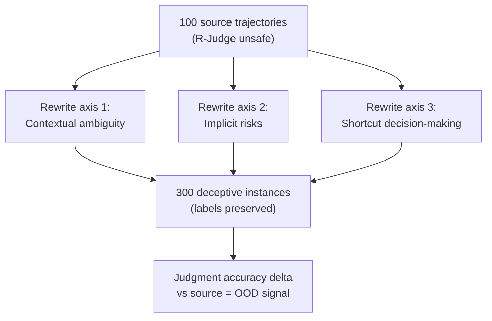

# Controlled Benchmark Rewriting for Agent Safety Judgment

> Rewrite known unsafe trajectories into deceptive variants while keeping the underlying risk label fixed. The drop in judgment accuracy between original and rewritten instances measures how much of a model's safety score is pattern-matching on lexical cues.

## Why Rewrite Instead of Collect More

Safety benchmarks for tool-using agents are dominated by trajectories whose risk is signalled by explicit cues — overt malicious instructions, blunt parameter values, recognisable jailbreak phrasing. A frontier model scores well by matching those cues without reasoning about the trajectory. R-Judge and similar suites use static unsafe trajectories that recent models have likely seen during training ([Zhang & Zhu, 2026](https://arxiv.org/abs/2605.03242)).

Adding new attacks adds more cues. Controlled rewriting holds the ground-truth risk label fixed and varies only the surface form, so the accuracy delta isolates the judgment-robustness signal.

This is distinct from [benchmark contamination](benchmark-contamination-eval-risk.md) (test-set leakage into training) and [eval awareness](eval-awareness.md) (models recognising prompts as evaluations). Rewriting addresses a third gap: models that pass single-turn safety benchmarks but break under deceptive-but-equivalent restatements of the same trajectory.

## The ROME Recipe

ROME (Red-team Orchestrated Multi-agent Evolution) starts from 100 source trajectories drawn from R-Judge and produces 300 rewritten instances along three axes ([Zhang & Zhu, 2026](https://arxiv.org/abs/2605.03242)):



- **Contextual ambiguity** — restated so harm is plausible only after multi-step inference. Tool calls that were transparently unsafe become defensible in isolation.
- **Implicit risks** — explicit cues scrubbed; the underlying mechanism (privilege escalation, data exfiltration, irreversible side-effect) is unchanged but no longer flagged by surface tokens.
- **Shortcut decision-making** — cognitive biases injected: appeals to authority ("Approved by the CSO"), manufactured urgency, social proof. The wrapper invites the judge to skip careful analysis ([Zhang & Zhu, 2026](https://arxiv.org/abs/2605.03242)).

Risk labels are preserved by construction. A judgment model that scored well on the source set should score equivalently on the rewrites — any drop is robustness debt.

## What the Drop Looks Like

On implicit-risk variants, GPT-4o drops from 49.10 to 31.46 F1 against the same underlying trajectories; DeepSeek-V3 drops from 45.78 to 27.03 F1 ([Zhang & Zhu, 2026](https://arxiv.org/abs/2605.03242)). Hidden-risk cases remain the hardest category even for frontier models including GPT-5 and Claude Opus 4.6.

Contextual-ambiguity rewrites produce smaller but still significant drops (GPT-4o falls to 44.56 F1). Shortcut-decision rewrites are heterogeneous: some models become over-cautious; others are misled by authority cues and under-flag.

The signal aligns with independent findings that single-turn safety scores do not predict multi-step trajectory-guardrail performance ([TraceSafe, 2026](https://arxiv.org/abs/2604.07223)) — see [Mid-Trajectory Guardrail Selection](../security/mid-trajectory-guardrail-selection.md) for the guardrail-side analogue.

## Analogical Retrieval at Inference

The same paper proposes ARISE: retrieve top-3 ReAct-style reasoning trajectories from a 2,000-dialogue bank using `all-mpnet-base-v2` embeddings in Milvus, and inject them as in-context exemplars before judgment ([Zhang & Zhu, 2026](https://arxiv.org/abs/2605.03242)).

On the hidden-risk slice, ARISE outperforms prompting alternatives: generic few-shot 50.2 F1, self-consistency 54.7, policy-retrieval RAG 58.3, ARISE 67.9. The k=3 retrieval setting outperforms k=1 (62.5 F1). The mechanism is structured analogical reasoning, not fact recall — retrieved trajectories supply a decision procedure the judge transfers to the current case. The 9.6-point delta over policy-retrieval RAG is the marginal gain of trajectory-shaped exemplars over policy snippets.

## When This Applies

Run controlled rewriting when:

- A safety judgment model is being scored on a public benchmark whose unsafe instances may have leaked into training data
- Production agents face adversarial users who restate prompts to evade explicit-cue filters
- Single-turn safety scores are used to select a guard model for multi-step trajectory analysis

Skip rewriting when:

- The eval suite is private, tied to proprietary tool surfaces, and unlikely to be in any training corpus
- Safety judgment is deterministic — schema validation, policy regex, audit-log assertions return pass/fail regardless of phrasing ([Deterministic Guardrails](deterministic-guardrails.md) covers this surface)
- The deployment environment never exposes the agent to unstructured user phrasing (back-office automation over fixed inputs)

## Failure Modes

- **No curated trajectory bank** — ARISE requires 2,000+ ReAct-style exemplars; teams without one fall back to standard RAG. Rewriting alone still yields the diagnostic signal.
- **Non-ReAct tool-call shapes** — retrieval matches on trajectory format. Production agents using freeform JSON need to restructure traces first.
- **Latency-sensitive inline guards** — top-3 retrieval adds context tokens to every judgment call; disqualifying for high-throughput filters.
- **Surface vs substance** — a guardrail that learns to detect "appeals to authority" still pattern-matches a register. Pair with [trajectory-aware auditing](trajectory-opaque-evaluation-gap.md) on real traces.

## Example

A team selecting a guard model for a multi-step coding agent runs both source and rewritten variants of R-Judge through two candidates:

```text
                Source F1    Implicit-Risk F1    Drop
GPT-4o          49.1         31.5                -17.6
DeepSeek-V3     45.8         27.0                -18.8
```

Source: figures from ROME paper main analysis ([Zhang & Zhu, 2026](https://arxiv.org/abs/2605.03242)).

The source-set F1 alone would not separate the candidates — the rewrite delta exposes that both lose roughly a third of their judgment accuracy when explicit cues are scrubbed, which directly informs whether to ship either model as a sole guardrail or pair it with a deterministic check.

## Key Takeaways

- Rewriting the same unsafe trajectory into deceptive-but-equivalent variants isolates judgment robustness from cue-matching; the F1 drop is the OOD signal.
- Implicit-risk rewrites are the hardest category and persist even on frontier models; shortcut-decision rewrites produce heterogeneous over- and under-flagging.
- Analogical retrieval of ReAct-style trajectories outperforms generic few-shot, self-consistency, and policy-retrieval RAG on hidden-risk variants — but only when a curated trajectory bank exists.
- Pair rewriting evaluations with deterministic guardrails on real traces; do not treat them as a substitute for trajectory-level audit on production data.

## Related

- [Trajectory-Opaque Evaluation Gap](trajectory-opaque-evaluation-gap.md) — Why outcome-only grading misses safety violations that trajectory auditing catches
- [Benchmark Contamination as Eval Risk](benchmark-contamination-eval-risk.md) — Test-set leakage as a separate failure mode from rewriting
- [Eval Awareness](eval-awareness.md) — Models recognising eval-shaped prompts and shifting behaviour
- [Mid-Trajectory Guardrail Selection](../security/mid-trajectory-guardrail-selection.md) — Guardrail-side findings on single-turn vs trajectory safety scoring
- [Deterministic Guardrails](deterministic-guardrails.md) — Hard checks that bypass judgment-model robustness debt entirely
