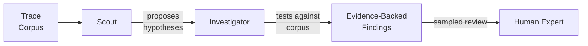

# Corpus-Level Trace Diagnostics for LLM Agents

> Once your trace corpus exceeds a few hundred runs, single-trace inspection misses failure modes that only show up across populations. A scout-investigator multi-agent pipeline surveys the corpus, proposes recurring failure hypotheses, then verifies each against evidence.

Corpus-level trace diagnostics runs a structured multi-agent pipeline over a large set of agent execution traces to surface systematic failure patterns — recurring tool misuse, silent [reward hacking](anti-reward-hacking.md), drift after long context — invisible when a human inspects one failing trace at a time. It sits above per-trace error analysis, not in place of it.

## When It Applies

Apply only when all three conditions hold:

- **Corpus size ≥ ~100 comparable traces** — below this, a human reading every trace outperforms automation. LangSmith caps a single Insights Agent run at 1,000 traces. [Source: [LangChain — Insights Agent and Multi-turn Evals](https://blog.langchain.com/insights-agent-multiturn-evals-langsmith/)]
- **Traces are long or multi-turn** — value comes from patterns hidden across many tool calls. Sub-1k-token interactions are better served by response-level error analysis. [Source: [Hamel Husain](https://hamel.dev/blog/posts/evals-faq/why-is-error-analysis-so-important-in-llm-evals-and-how-is-it-performed.html)]
- **A human validates findings** — generated "insights" are LLM outputs and can fabricate plausible-but-wrong patterns. Without sampled expert review the pipeline entrenches false beliefs. [Source: [Manglik et al., Insights Generator (arxiv 2605.21347)](https://arxiv.org/abs/2605.21347)]

If any condition fails, stay with manual error analysis on a focused sample.

## Scout-Investigator Architecture

- **Scout** surveys traces in a wide, cheap pass and emits candidate failure-mode hypotheses (`tool X is consistently called before tool Y in failed runs`).
- **Investigator** queries the corpus for supporting and counter-evidence on one hypothesis at a time, promoting it with linked trace IDs or discarding it.
- **Human expert** reviews a sampled subset to filter fabricated patterns before findings are treated as ground truth.

The split mirrors the proposer-verifier division in [Anthropic's multi-agent research system](https://www.anthropic.com/engineering/multi-agent-research-system): a broad surveyor generates hypotheses; a narrower verifier reduces false positives.

## Why It Works

Agent failures are governed by a few recurring causal patterns (tool misuse, context drift, reward hacking, missing capability), but each surfaces with high per-trace variance. Aggregating across many traces averages out task-specific noise so the signal becomes detectable.

The scout-investigator split keeps this safe at scale: scout pattern recognition is cheap but error-prone; investigator verification is expensive but precise. Composed, they mirror clinical diagnostic reasoning — broad differential, then targeted confirmation. Reported payoff: 30.4 percentage points scaffold improvement over baseline across HLE, SWeBench Pro, TerminalBench, and FeatureBench. [Source: [Manglik et al., Insights Generator (arxiv 2605.21347)](https://arxiv.org/abs/2605.21347)]

## Where It Sits Among Diagnostic Layers

| Layer | Granularity | Use when |
|-------|-------------|----------|
| Response-level error analysis | Single output | Building the first eval suite [[Hamel Husain](https://hamel.dev/blog/posts/evals-faq/why-is-error-analysis-so-important-in-llm-evals-and-how-is-it-performed.html)] |
| Per-trajectory decomposition | Single trace, stage-split | Localising the failing stage [[TRAJEVAL](https://arxiv.org/abs/2603.24631)] |
| Cross-trace clustering | Production corpus | Sizing error modes by frequency [[LangChain](https://blog.langchain.com/insights-agent-multiturn-evals-langsmith/)] |
| Corpus-level scout-investigator | Production corpus | Evidence-backed natural-language findings [[Manglik et al.](https://arxiv.org/abs/2605.21347)] |

The layers compose; they do not replace each other.

## When This Backfires

- **Small or fast-iterating corpora** — under ~100 traces, scout-investigator overhead exceeds the benefit. Hamel Husain's 30 manually-read traces remains the right tool. [Source: [Hamel Husain](https://hamel.dev/blog/posts/evals-faq/why-is-error-analysis-so-important-in-llm-evals-and-how-is-it-performed.html)]
- **Highly heterogeneous workloads** — clustering depends on comparable traces. A corpus mixing code review, RAG QA, and data exploration produces weak clusters and generic insights.
- **No human review** — generated insights can fabricate plausible-but-wrong patterns; without sampled expert review the pipeline entrenches false beliefs.
- **Privacy-sensitive traces** — production traces containing PII or proprietary code expand the exposure surface when sent through a hosted pipeline.
- **Cost and latency** — a LangSmith Insights Agent run takes up to 15 minutes for insights and up to 30 minutes for the full report. [Source: [LangChain](https://blog.langchain.com/insights-agent-multiturn-evals-langsmith/)]

## Workflow

1. **Decide the corpus**. Filter to a comparable trace set (same agent version, task family, time window).
2. **Define the diagnostic question**. `Why do tool-use tasks fail at step 6-15?` beats `Why does the agent fail?` — failures cluster in mid-trajectory steps where early missteps cascade. [Source: [Where LLM Agents Fail (arxiv 2509.25370)](https://arxiv.org/pdf/2509.25370)]
3. **Run the scout pass**. A cheap model emits capped candidate hypotheses — long lists dilute investigator effort.
4. **Run the investigator pass**. For each hypothesis, fetch supporting and counter-evidence traces; discard hypotheses with strong counter-examples or no corroboration.
5. **Sample-review findings**. A domain expert reads 10-20% of cited traces per finding before any insight is ground truth. Non-optional.
6. **Convert findings into eval cases**. Each confirmed pattern becomes a regression eval — see [incident-to-eval synthesis](incident-to-eval-synthesis.md).

## Key Takeaways

- Corpus-level trace diagnostics is the layer above per-trace error analysis — apply only when corpus size, trace length, and human review capacity justify the overhead.
- The scout-investigator split is what makes automated pattern discovery safe: broad cheap proposal followed by targeted expensive verification.
- The reported expert gain (30.4pp scaffold improvement) is real but conditional on human review of generated findings — without it, the pipeline manufactures false patterns.
- Composes with, does not replace, manual error analysis on small samples and per-trajectory decomposition on single failures.

## Related

- [Using the Agent to Analyze Its Own Evaluation Transcripts](agent-transcript-analysis.md) — agent-as-analyst on a smaller transcript batch, focused on tool design changes
- [Trajectory Decomposition: Diagnose Where Coding Agents Fail](trajectory-decomposition-diagnosis.md) — per-trace stage decomposition; the layer below corpus-level diagnostics
- [Incident-to-Eval Synthesis](incident-to-eval-synthesis.md) — convert each confirmed failure pattern into a regression eval case
- [LLM Agent Bug Fix Taxonomy](agent-bug-fix-taxonomy.md) — empirical failure-mode taxonomy from 930 real agent bugs
- [Learned Prefix Monitors for Agent Traces](learned-prefix-monitors-agent-traces.md) — online failure detection at the trace level; complements offline corpus-level analysis
