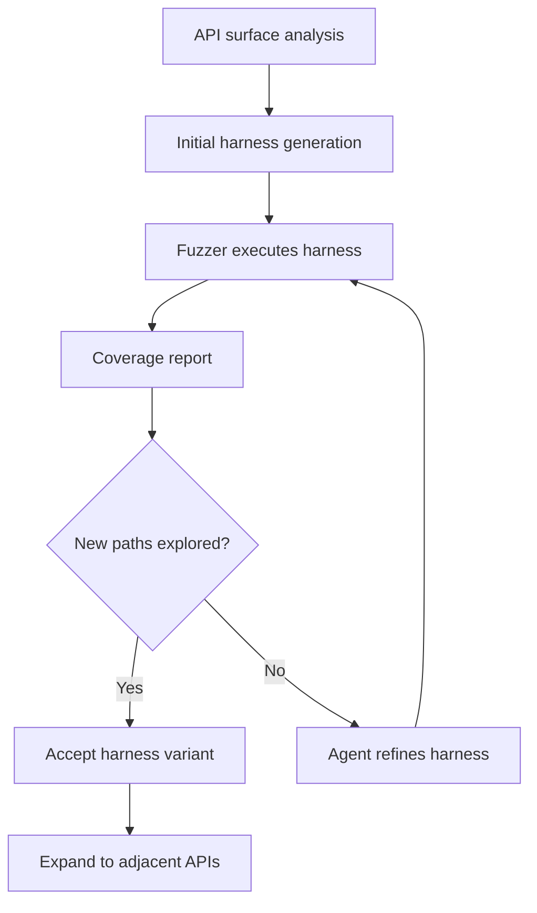

# Coverage-Guided Agents for Fuzz Harness Generation

> Multi-agent systems can automatically generate fuzzing harnesses for library APIs using coverage feedback as the iteration signal, removing the primary bottleneck in library fuzzing workflows.

## The Manual Harness Bottleneck

Coverage-guided fuzzing is effective at finding memory corruption bugs, logic errors, and edge-case crashes in library code. The constraint is harness authoring: hand-written glue code that translates fuzzer byte streams into valid sequences of API calls. Writing a correct harness requires understanding parameter constraints, call ordering dependencies, and state initialization — work that can take significant time per API.

[arXiv:2603.08616](https://arxiv.org/abs/2603.08616) demonstrates that a five-agent system using coverage feedback can automate harness generation for Java libraries, achieving a median 26% improvement in branch coverage over OSS-Fuzz baselines at a cost of $3.20 and ~10 minutes per harness.

## How Coverage Feedback Drives Iteration

Coverage data (branch coverage, line coverage) provides a grounded signal that guides harness improvement:



When a harness fails to reach new code paths, the agent receives that signal and generates a revised harness — adjusting parameter values, reordering calls, or adding setup state. This is the same signal human harness authors use, but applied automatically.

## What the Agent Reasons About

Harness generation requires the agent to work through three constraints:

**Parameter constraints**: What values are valid for each argument? Null-safety, range constraints, format requirements. The research agent queries type signatures, Javadoc, and codebase examples on-demand to build this understanding before generating harness code.

**Call ordering**: Which methods must be called before others? Constructor before method calls, open before read, initialize before use. The research agent queries the API surface and available documentation to infer object lifecycle requirements.

**State coverage**: Which code paths require specific preconditions to be reachable? An authenticated session, a populated collection, a configured subsystem. Coverage feedback identifies when state assumptions are wrong.

## Implementation Considerations

- **Start with shallow APIs first**: Simple, pure functions with scalar parameters establish a coverage baseline before you tackle stateful APIs
- **Use typed API surfaces**: Strongly typed APIs (generics, sealed types) give the agent more inference signal than loosely typed ones
- **Instrument for path coverage, not just line coverage**: Branch coverage catches more conditional logic than line coverage alone
- **Review before production fuzzing**: Generated harnesses may exercise APIs in unintended sequences — review for crash-on-startup conditions before you target production builds
- **Corpus seeding**: Provide a seed corpus of valid inputs alongside the harness to give the fuzzer a head start on interesting paths

## When This Backfires

Coverage improvement is not a universal proxy for harness quality. The approach degrades in several conditions:

- **Weakly typed or dynamically typed APIs**: The research agent's ability to infer parameter constraints depends on type information. APIs that rely on runtime duck-typing, `Object` parameters, or reflection give the agent less signal, increasing the rate of invalid call sequences.
- **Deeply stateful initialization**: APIs that require complex, multi-step setup (authentication flows, database connections, protocol handshakes) may require state the agent cannot construct from documentation alone, resulting in harnesses that abort early on every input.
- **Side-effecting APIs**: Harness generation calls methods in combinations that may not occur in production. APIs with destructive side effects — file deletion, network writes, irreversible state changes — can cause harnesses to be unsafe to run without sandboxing.
- **Coverage plateau without semantic progress**: Branch coverage can increase while the harness reaches semantically uninteresting code paths. Coverage metrics do not distinguish bug-prone deep paths from shallow error handlers; high coverage numbers do not guarantee the harness is exercising security-relevant behavior.
- **Cost at scale**: At $3.20 per harness, generating harnesses for hundreds of API methods in a large library is expensive. The approach is most practical for targeted high-value APIs, not full-library coverage.

## Generalization

The paper demonstrates the pattern on Java libraries. The feedback loop — generate, measure coverage, refine — could in principle apply to other typed API surfaces — C/C++ with [libFuzzer](https://llvm.org/docs/LibFuzzer.html) or [AFL++](https://github.com/AFLplusplus/AFLplusplus), Python with [Atheris](https://github.com/google/atheris), Rust with [cargo-fuzz](https://github.com/rust-fuzz/cargo-fuzz) — but cross-language generalization has not been validated by published research.

## Key Takeaways

- Coverage data provides a grounded iteration signal that replaces your intuition about which API call sequences to try
- The agent's value is in reasoning about parameter constraints and call ordering, not in writing fuzzer boilerplate
- Review generated harnesses before targeting production systems
- Strong typing and documentation quality directly improve harness generation accuracy

## Example

A Java library exposes a `Parser` class. The agent starts by inspecting the public API surface and generating an initial harness:

```java
// Generated harness v1 — covers only the top-level parse path
public static void fuzzerTestOneInput(byte[] data) {
    String input = new String(data, StandardCharsets.UTF_8);
    try {
        Parser parser = new Parser();
        parser.parse(input);
    } catch (ParseException e) {
        // expected — not a crash
    }
}
```

Coverage report shows 12% branch coverage. The agent identifies that `Parser.parse()` returns a `Document` and that `Document.validate()` exercises a separate branch tree. It refines:

```java
// Generated harness v2 — adds document validation path
public static void fuzzerTestOneInput(byte[] data) {
    String input = new String(data, StandardCharsets.UTF_8);
    try {
        Parser parser = new Parser();
        Document doc = parser.parse(input);
        if (doc != null) {
            doc.validate();           // new: exercises validation branches
            doc.getChildren();        // new: exercises tree traversal
        }
    } catch (ParseException | ValidationException e) {
        // expected
    }
}
```

Coverage increases to 34%. The agent continues iterating until coverage plateaus or the configured iteration budget is exhausted.

## Related

- [Red-Green-Refactor with Agents](red-green-refactor-agents.md)
- [Test-Driven Agent Development](tdd-agent-development.md)
- [Evaluator-Optimizer Pattern](../agent-design/evaluator-optimizer.md)
- [Incremental Verification](incremental-verification.md)
- [FLARE: Multi-Agent Fuzzing](flare-multi-agent-fuzzing.md)
