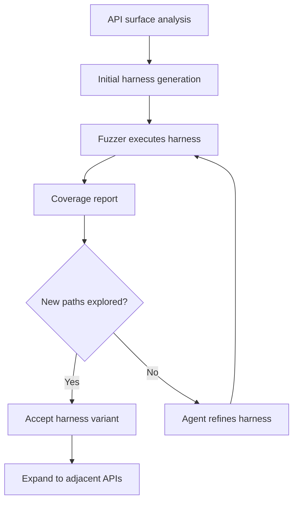

# Coverage-Guided Agents for Fuzz Harness Generation

> Coverage-guided agents generate fuzz harnesses for library APIs automatically, using coverage feedback as the iteration signal that removes the primary harness-authoring bottleneck.

## The manual harness bottleneck

Coverage-guided fuzzing finds memory corruption bugs, logic errors, and edge-case crashes in library code. The constraint is harness authoring: hand-written glue code that turns fuzzer byte streams into valid API call sequences. A correct harness requires understanding parameter constraints, call ordering, and state initialization — work that can take a long time per API.

[arXiv:2603.08616](https://arxiv.org/abs/2603.08616) demonstrates that a five-agent system using coverage feedback can automate harness generation for Java libraries, achieving a median 26% improvement in branch coverage over OSS-Fuzz baselines at a cost of $3.20 and ~10 minutes per harness.

## How coverage feedback guides iteration

Coverage data (branch coverage, line coverage) gives a grounded signal that guides harness improvement:


```mermaid
graph TD
    A[API surface analysis] --> B[Initial harness generation]
    B --> C[Fuzzer executes harness]
    C --> D[Coverage report]
    D --> E{New paths explored?}
    E -->|Yes| F[Accept harness variant]
    E -->|No| G[Agent refines harness]
    G --> C
    F --> H[Expand to adjacent APIs]
```

When a harness fails to reach new code paths, the agent receives that signal and generates a revised harness — adjusting parameter values, reordering calls, or adding setup state. This is the same signal human harness authors use, but applied automatically.

## What the agent reasons about

Harness generation requires the agent to work through three constraints:

Parameter constraints: which values are valid for each argument — null-safety, range, format. The research agent queries type signatures, Javadoc, and codebase examples on demand before generating harness code.

Call ordering: which methods must run before others — constructor before method calls, `open()` before `read()`, initialize before use. The research agent queries the API surface to infer object lifecycle requirements.

State coverage: which code paths require specific preconditions — an authenticated session, a populated collection, a configured subsystem. Coverage feedback shows when state assumptions are wrong.

## Implementation considerations

- Start with shallow APIs first: simple, pure functions with scalar parameters set a coverage baseline before you tackle stateful APIs
- Use typed API surfaces: strongly typed APIs (generics, sealed types) give the agent more inference signal than loosely typed ones
- Instrument for branch coverage, not just line coverage: branch coverage catches more conditional logic than line coverage
- Review before production fuzzing: generated harnesses may exercise APIs in unintended sequences, so check for crash-on-startup before you target production builds
- Seed the corpus: provide a seed corpus of valid inputs alongside the harness to give the fuzzer a head start on interesting paths

## When this backfires

Coverage improvement is not a universal proxy for harness quality. The approach degrades in several conditions:

- Weakly typed or dynamically typed APIs: the research agent can only infer parameter constraints from type information. APIs that rely on runtime duck-typing, `Object` parameters, or reflection give the agent less signal, which raises the rate of invalid call sequences.
- Deeply stateful initialization: APIs that need complex, multi-step setup (authentication flows, database connections, protocol handshakes) may need state the agent cannot construct from documentation alone, so the harnesses abort early on every input.
- Side-effecting APIs: harness generation calls methods in combinations that may not occur in production. APIs with destructive side effects — file deletion, network writes, irreversible state changes — can make harnesses unsafe to run without sandboxing.
- Coverage plateau without semantic progress: branch coverage can rise while the harness reaches [semantically uninteresting code paths](mutation-testing-quality-gate.md). Coverage metrics do not tell bug-prone deep paths from shallow error handlers, so high coverage numbers do not guarantee the harness exercises security-relevant behavior.
- Cost at scale: at $3.20 per harness, generating harnesses for hundreds of API methods in a large library is expensive. The approach is most practical for targeted high-value APIs, not full-library coverage.
- Coverage is not correctness: a concurrent line of work argues coverage-only signals fail to detect logic errors, API misuse, and lifecycle violations in the harness itself — issues that surface as false-positive crashes downstream. [Sheng et al. (2026)](https://arxiv.org/abs/2605.21824) frame this as a "Four Principles" gap (Logic Correctness, API Protocol Compliance, Security Boundary Respect, Entry Point Adequacy) and add an explicit generate-check-fix loop (the QuartetFuzz system) before fuzzing. Treat the coverage signal as necessary but not sufficient, and pair it with a correctness check if you want the generated harnesses trusted in CI.

## Generalization

The paper demonstrates the pattern on Java libraries. The feedback loop — generate, measure coverage, refine — could in principle apply to other typed API surfaces — C/C++ with [libFuzzer](https://llvm.org/docs/LibFuzzer.html) or [AFL++](https://github.com/AFLplusplus/AFLplusplus), Python with [Atheris](https://github.com/google/atheris), Rust with [cargo-fuzz](https://github.com/rust-fuzz/cargo-fuzz) — but cross-language generalization has not been validated by published research.

## Key Takeaways

- Coverage data provides a grounded iteration signal that replaces your intuition about which API call sequences to try
- The agent's value is in reasoning about parameter constraints and call ordering, not in writing fuzzer boilerplate
- Review generated harnesses before targeting production systems
- Strong typing and documentation quality directly improve harness generation accuracy

## Example

A Java library exposes a `Parser` class. The agent starts by inspecting the public API surface and generating an initial harness:

```java
// Generated harness v1 — covers only the top-level parse path
public static void fuzzerTestOneInput(byte[] data) {
    String input = new String(data, StandardCharsets.UTF_8);
    try {
        Parser parser = new Parser();
        parser.parse(input);
    } catch (ParseException e) {
        // expected — not a crash
    }
}
```

Coverage report shows 12% branch coverage. The agent identifies that `Parser.parse()` returns a `Document` and that `Document.validate()` exercises a separate branch tree. It refines:

```java
// Generated harness v2 — adds document validation path
public static void fuzzerTestOneInput(byte[] data) {
    String input = new String(data, StandardCharsets.UTF_8);
    try {
        Parser parser = new Parser();
        Document doc = parser.parse(input);
        if (doc != null) {
            doc.validate();           // new: exercises validation branches
            doc.getChildren();        // new: exercises tree traversal
        }
    } catch (ParseException | ValidationException e) {
        // expected
    }
}
```

Coverage increases to 34%. The agent continues iterating until coverage plateaus or the configured iteration budget is exhausted.

## Related

- [Red-Green-Refactor with Agents](red-green-refactor-agents.md)
- [Test-Driven Agent Development](tdd-agent-development.md)
- [Evaluator-Optimizer Pattern](../patterns/agent-design/evaluator-optimizer.md)
- [Incremental Verification](incremental-verification.md)
- [FLARE: Multi-Agent Fuzzing](flare-multi-agent-fuzzing.md)
- [Skill Specification Violation Fuzzing](skill-specification-violation-fuzzing.md)
- [Mutation Testing as a Quality Gate for AI-Generated Test Suites](mutation-testing-quality-gate.md)
