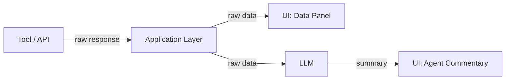
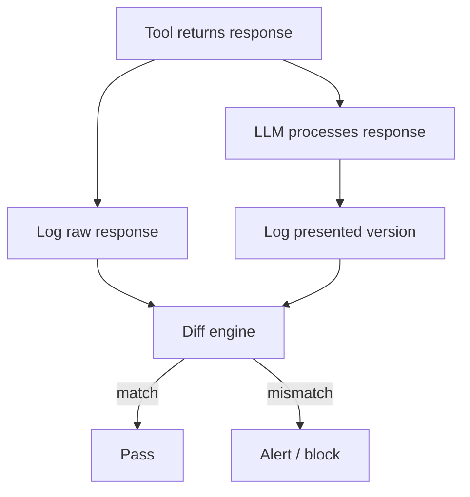

# Data Fidelity Guardrails

> Ensure agents faithfully relay data from APIs, MCP servers, and databases rather than silently summarizing, altering, or fabricating values.

## The Data Relay Problem

Agents sit between users and live data sources. The failure mode is not hallucination from nothing -- it is mutation of real data. The model receives correct data from a tool and presents an altered version: financial figures get rounded, query results get summarized, status fields get paraphrased. The user cannot distinguish faithful relay from subtle fabrication.

[CyberArk's ATPA research](https://www.cyberark.com/resources/threat-research-blog/poison-everywhere-no-output-from-your-mcp-server-is-safe) demonstrates that malicious tool outputs can instruct the model to alter data deliberately -- tool poisoning extends beyond descriptions into return values.

## Architecture Patterns

### Passthrough Architecture

Route raw tool responses to the UI alongside the model's summary:



The user sees both the raw data and the agent's interpretation; discrepancies are immediately visible. The raw panel is populated by deterministic code, never by the LLM. The trade-off is UI complexity -- not every interface can display raw data alongside commentary [unverified].

### Structural Separation of Data and Commentary

Separate factual fields (populated by deterministic code) from the LLM's generated commentary:

```json
{
  "data": {
    "account_balance": 14523.87,
    "last_transaction": "2025-03-12T09:41:00Z",
    "status": "active"
  },
  "commentary": "Account is active with a recent transaction yesterday."
}
```

The `data` object is copied directly from the API response by application code; `commentary` is the only LLM-generated field. Downstream consumers know which fields to trust unconditionally.

### Typed Schema Validation

[Structured outputs](https://platform.claude.com/docs/en/build-with-claude/structured-outputs) enforce schema shape through constrained decoding — see [Typed Schemas at Agent Boundaries](../tool-engineering/typed-schemas-at-agent-boundaries.md) for the full pattern of applying typed contracts at every agent-to-agent interface. But schema compliance does not equal value accuracy -- a correctly-typed `"balance": 14500.00` still differs from the true value of `14523.87`.

Layer schema validation with other defenses:

| Layer | What it catches | What it misses |
|-------|----------------|----------------|
| Schema validation | Wrong types, missing fields, invalid enums | Fabricated values within valid types |
| Passthrough display | Value mutations visible to users | Nothing -- but requires human attention |
| Diff-based auditing | Any discrepancy, automatically | Mutations the model applies before logging |
| Checksum verification [unverified] | Any payload alteration | Requires infrastructure support |

### Diff-Based Auditing

Log raw tool responses and the model's presented version; flag discrepancies automatically [unverified]:



Observability platforms like LangSmith and Langfuse log tool inputs and outputs, enabling this comparison in production. The key constraint: logging must happen before the LLM sees the data.

## Tool Output Integrity

### Tool Poisoning as a Data Fidelity Threat

Tool poisoning attacks embed hidden instructions in tool return values, not just descriptions. A compromised MCP server can include directives telling the model to alter, exfiltrate, or suppress data. [Invariant Labs](https://invariantlabs.ai/blog/mcp-security-notification-tool-poisoning-attacks) documented cross-server data exfiltration via this vector.

Mitigations:

- **Version pinning with checksums** -- detect unauthorized tool modifications ([ETDI](https://arxiv.org/html/2506.01333v1) proposes cryptographic signing of tool definitions)
- **Cross-server dataflow boundaries** -- prevent data from one MCP server reaching tools on another
- **Spotlighting / datamarking** -- [Microsoft's MCP security guidance](https://developer.microsoft.com/blog/protecting-against-indirect-injection-attacks-mcp) recommends marking boundaries between trusted instructions and untrusted tool content
- **Dual LLM separation** -- the [Dual LLM pattern](https://agentic-patterns.com/patterns/dual-llm-pattern/) routes untrusted data through a quarantined model with no tool access

### Design Tools for Fidelity

[Anthropic's tool output guidance](https://www.anthropic.com/engineering/writing-tools-for-agents) recommends:

- Return only relevant fields -- every extra field is a mutation opportunity
- Use semantic values instead of opaque identifiers -- the model is less likely to fabricate a name than a UUID
- Paginate at the tool layer -- unbounded result sets force the model to summarize, introducing mutation risk

See [Semantic Tool Output](../tool-engineering/semantic-tool-output.md) for the full pattern.

## Anti-Pattern

Trusting the model to faithfully transcribe data because the prompt says "report exact values." Prompt instructions are probabilistic; a passthrough panel or diff-based audit is deterministic. Use both -- prompt for guidance, architecture for enforcement.

## Key Takeaways

- Data relay failures are value mutations, not hallucinations -- the model has the right data and presents it wrong
- Passthrough architecture and structural separation are the strongest defenses; schema validation enforces shape, not accuracy
- Diff-based auditing catches discrepancies automatically; tool poisoning makes this a security concern, not just a reliability one
- Design tools to minimize mutation opportunity: fewer fields, semantic values, tool-layer filtering

## Unverified Claims

- Passthrough architecture as a named pattern lacks a canonical primary source `[unverified]`
- Diff-based auditing is architecturally straightforward but no primary source describes a production implementation `[unverified]`
- Hash/checksum verification of individual tool call payloads does not appear in any primary source `[unverified]`

## Related

- [Deterministic Guardrails Around Probabilistic Agents](deterministic-guardrails.md)
- [Structured Output Constraints](structured-output-constraints.md)
- [Verification Ledger](verification-ledger.md)
- [Semantic Tool Output](../tool-engineering/semantic-tool-output.md)
- [Tool Signing and Verification](../security/tool-signing-verification.md)
- [Layered Accuracy Defense](layered-accuracy-defense.md)
