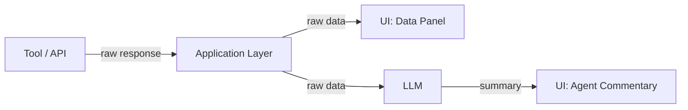
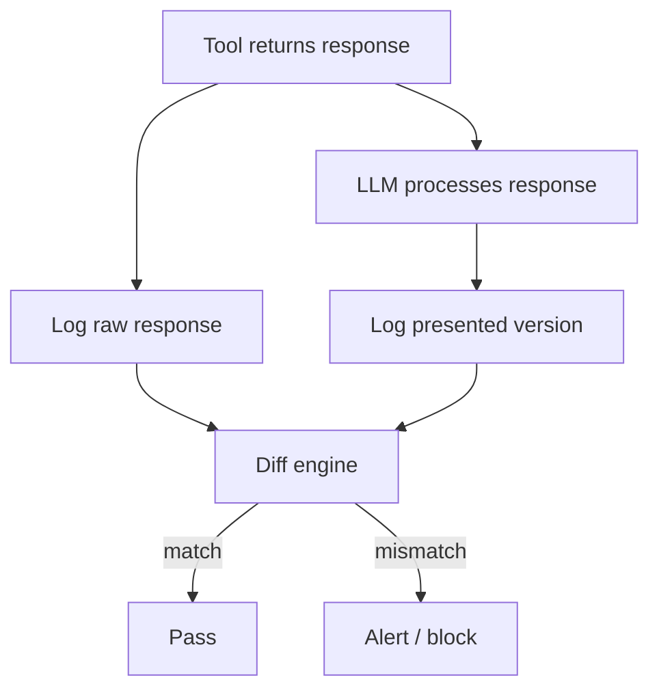

# Data Fidelity Guardrails

> Ensure agents faithfully relay data from APIs, MCP servers, and databases rather than silently summarizing, altering, or fabricating values.

## The data relay problem

Agents sit between users and live data sources: APIs, MCP servers, and databases. The failure mode is not hallucination from nothing. It is mutation of real data. The model gets correct data from a tool, then presents an altered version. Financial figures get rounded, query results get summarized, status fields get paraphrased. The user cannot tell faithful relay from subtle fabrication.

[CyberArk's ATPA research](https://www.cyberark.com/resources/threat-research-blog/poison-everywhere-no-output-from-your-mcp-server-is-safe) shows that malicious tool outputs can instruct the model to alter data on purpose. Tool poisoning reaches beyond descriptions into return values.

## Architecture patterns

### Passthrough architecture

Route raw tool responses to the UI alongside the model's summary:


```mermaid
graph LR
    A[Tool / API] -->|raw response| B[Application Layer]
    B -->|raw data| C[UI: Data Panel]
    B -->|raw data| D[LLM]
    D -->|summary| E[UI: Agent Commentary]
```

The user sees both the raw data and the agent's interpretation, so discrepancies are visible at once. Deterministic code fills the raw panel, never the LLM. The trade-off is UI complexity, because not every interface can show raw data alongside commentary.

### Structural separation of data and commentary

Separate factual fields, filled by deterministic code, from the LLM's generated commentary:

```json
{
  "data": {
    "account_balance": 14523.87,
    "last_transaction": "2025-03-12T09:41:00Z",
    "status": "active"
  },
  "commentary": "Account is active with a recent transaction yesterday."
}
```

Application code copies the `data` object straight from the API response, and `commentary` is the only LLM-generated field. Downstream consumers know which fields to trust without question.

### Typed schema validation

[Structured outputs](https://platform.claude.com/docs/en/build-with-claude/structured-outputs) enforce schema shape through constrained decoding. See [Typed Schemas at Agent Boundaries](../multi-agent/typed-schemas-at-agent-boundaries.md) for the full pattern of applying typed contracts at every agent-to-agent interface. But schema compliance does not equal value accuracy. A correctly typed `"balance": 14500.00` still differs from the true value of `14523.87`.

Layer schema validation with other defenses:

| Layer | What it catches | What it misses |
|-------|----------------|----------------|
| Schema validation | Wrong types, missing fields, invalid enums | Fabricated values within valid types |
| Passthrough display | Value mutations visible to users | Nothing -- but requires human attention |
| Diff-based auditing | Any discrepancy, automatically | Mutations the model applies before logging |
| Checksum verification | Any payload alteration | Requires infrastructure support |

### Diff-based auditing

Log raw tool responses and the model's presented version, then flag any discrepancy automatically:


```mermaid
graph TD
    A[Tool returns response] --> B[Log raw response]
    A --> C[LLM processes response]
    C --> D[Log presented version]
    B --> E[Diff engine]
    D --> E
    E -->|match| F[Pass]
    E -->|mismatch| G[Alert / block]
```

Observability platforms like LangSmith and Langfuse log tool inputs and outputs, which makes this comparison possible in production. The key constraint is that logging must happen before the LLM sees the data.

## Tool output integrity

### Tool poisoning as a data fidelity threat

Tool poisoning attacks embed hidden instructions in tool return values, not just descriptions. A compromised MCP server can include directives that tell the model to alter, exfiltrate, or suppress data. [Invariant Labs](https://invariantlabs.ai/blog/mcp-security-notification-tool-poisoning-attacks) documented cross-server data exfiltration through this vector.

You can mitigate it in four ways:

- Pin tool versions with checksums to detect unauthorized tool modifications. [ETDI](https://arxiv.org/html/2506.01333v1) proposes cryptographic signing of tool definitions.
- Set cross-server dataflow boundaries to stop data from one MCP server reaching tools on another.
- Apply spotlighting or datamarking. [Microsoft's MCP security guidance](https://developer.microsoft.com/blog/protecting-against-indirect-injection-attacks-mcp) recommends marking boundaries between trusted instructions and untrusted tool content.
- Separate trust with the [Dual LLM pattern](https://agentic-patterns.com/patterns/dual-llm-pattern/), which routes untrusted data through a quarantined model with no tool access.

### Design tools for fidelity

[Anthropic's tool output guidance](https://www.anthropic.com/engineering/writing-tools-for-agents) recommends three habits:

- Return only relevant fields, because every extra field is a mutation opportunity.
- Use semantic values instead of opaque identifiers, since the model is less likely to fabricate a name than a UUID.
- Paginate at the tool layer, because unbounded result sets force the model to compress output and add mutation risk.

See [Semantic Tool Output](../tool-engineering/semantic-tool-output.md) for the full pattern.

## Anti-pattern

Do not trust the model to transcribe data faithfully just because the prompt says "report exact values." Prompt instructions are probabilistic, but a passthrough panel or diff-based audit is deterministic. Use both: prompt for guidance, architecture for enforcement.

## When this backfires

These guardrails impose real costs. Skip the full stack when one of these holds:

- The surface cannot show structured data. Voice, SMS, and narrow chat surfaces have no room for a raw panel, so passthrough becomes noise users ignore.
- Stakes are low and reads are casual. Status lookups and document summaries have a small mutation blast radius, so the engineering cost outweighs the [protection it buys](layered-accuracy-defense.md).
- Data is high-cardinality or streaming. Large result sets make raw panels unreadable and turn diff engines into a latency bottleneck.
- Token or latency budgets are tight. Logging raw responses and returning both raw fields and commentary inflates context and response time.

Under these conditions, prefer [typed schemas at the boundary](structured-output-constraints.md) and spot-check evals on exact values instead of the full passthrough-plus-diff stack.

## Key Takeaways

- Data relay failures are value mutations, not hallucinations -- the model has the right data and presents it wrong
- Passthrough architecture and structural separation are the strongest defenses; schema validation enforces shape, not accuracy
- Diff-based auditing catches discrepancies automatically; tool poisoning makes this a security concern, not just a reliability one
- Design tools to minimize mutation opportunity: fewer fields, semantic values, tool-layer filtering

## Related

- [Deterministic Guardrails Around Probabilistic Agents](deterministic-guardrails.md)
- [Structured Output Constraints](structured-output-constraints.md)
- [Verification Ledger](verification-ledger.md)
- [Semantic Tool Output](../tool-engineering/semantic-tool-output.md)
- [Tool Signing and Verification](../security/tool-signing-verification.md)
- [Layered Accuracy Defense](layered-accuracy-defense.md)
