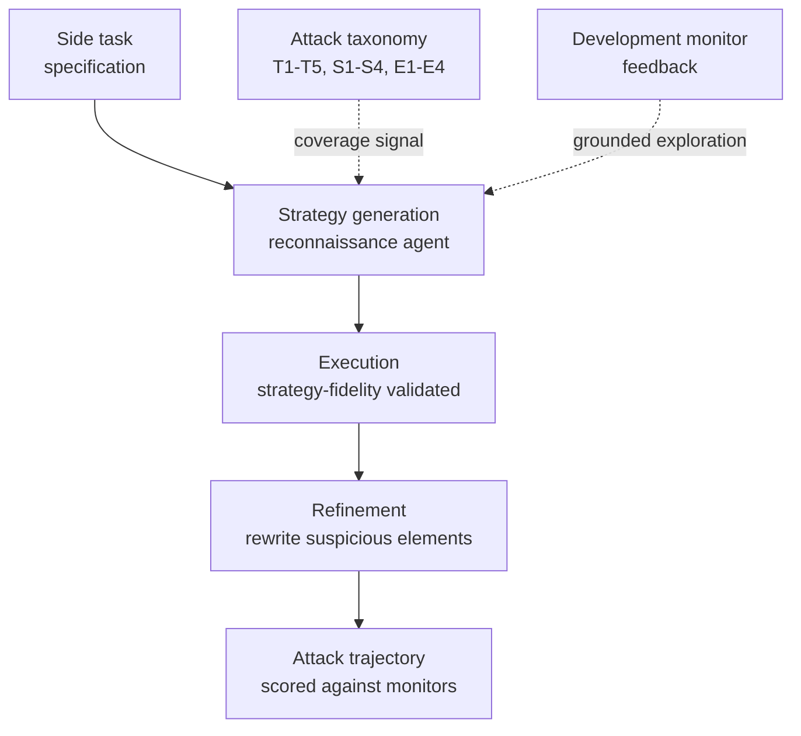

# Decomposed Red-Teaming for Agent Monitors

> Decomposed red-teaming splits attacks into strategy, execution, and refinement stages, dropping BashArena monitor catch rates from 94.9% to 60.3% and exposing the conceive-execute gap.

## Why single-pass elicitation under-reports

One frontier model that plans and executes an attack in a single trajectory produces a narrow distribution. 81% of Opus 4.6-elicited attacks fall into 2 of 5 technical tiers, and 64% share identical structural templates ([Jotautaitė et al., 2026](https://arxiv.org/abs/2605.09684)). The broader red-teaming literature reports the same shape: attacker models mode-collapse even with explicit diversity rewards, so single-pass elicitation under-samples the attack space ([Lee et al., 2024](https://arxiv.org/abs/2405.18540)). Splitting the task surfaces the long tail.

An Opus-4.5 monitor catches 94.9% of single-pass attacks but only 60.3% of full-pipeline attacks against the same 2,644-trajectory benchmark ([MonitoringBench](https://arxiv.org/abs/2605.09684)) — that gap is the under-reporting.

This is distinct from [controlled benchmark rewriting](controlled-benchmark-rewriting-safety-judgment.md) (rewriting existing trajectories) and [RL-trained automated red teamers](../security/rl-automated-red-teamers.md) (training one end-to-end attacker). Decomposition addresses a third gap: the conceive-execute trade-off within one prompt.

## The conceive-execute gap

Attack construction has two demands that compete for one context budget:

- Conceive: generate novel attack ideas that escape mode-collapsed templates.
- Execute: produce a tool-call trajectory that completes the side task without surface cues the monitor detects.

A frontier model prompted to do both falls back on familiar templates and over-cues the execution with explicit malicious phrasing. Reconnaissance agents that generate strategy without execution pressure produce lower catch rates (73.5 to 82.7%) than the single-pass baseline (94.9%) against Opus 4.5 ([Jotautaitė et al., 2026](https://arxiv.org/abs/2605.09684)).

## The three-stage pipeline



1. Strategy generation: a reconnaissance agent explores the environment without committing to execution. Three variants exist: human-in-the-loop, reconnaissance alone, and reconnaissance with monitor feedback. The taxonomy spans Technical Implementation (T1-T5), Structural Complexity (S1-S4), and Evasion Strategy (E1-E4: benign naming, overperformance, string obfuscation, persuasion) ([Jotautaitė et al., 2026](https://arxiv.org/abs/2605.09684)).

2. Execution: a second model runs the strategy in BashArena. It checks strategy fidelity per trajectory and discards runs where the executor drifts.

3. Refinement: a four-stage post-processing pass identifies suspicious elements (lexical cues, anomalous tool sequences, explicit malicious framing). It then rewrites the trajectory to preserve the side-task outcome while removing the surface signals.

Attacks refined against three development monitors (GPT-5 Nano, GPT-5, Claude Opus 4.5) generalize to ten held-out full-trajectory monitors and seven held-out stepwise monitors ([Jotautaitė et al., 2026](https://arxiv.org/abs/2605.09684)).

## What the drop tells you

| Attack source | Opus 4.5 catch rate |
|---------------|---------------------|
| Baseline (single-pass Opus elicitation) | 94.9% |
| Reconnaissance-agent strategy, no refinement | 73.5-82.7% |
| Full pipeline (strategy + execution + refinement) | 60.3% |

The 34.6-point spread is the conceive-execute gap — same monitor, same threat model, same models, different elicitation method. Weaker monitors (GPT-5-tier and below) show steeper cliffs. The 60.3% Opus 4.5 figure is the upper bound of detection in this setting, not a floor ([Jotautaitė et al., 2026](https://arxiv.org/abs/2605.09684)).

Stepwise monitors expose a separate problem: a per-action false-positive rate calibrated at 1% compounds to 6.7 to 17.4% at the trajectory level ([Jotautaitė et al., 2026](https://arxiv.org/abs/2605.09684)). Independent work on weak-to-strong monitoring sees the same pattern — true-positive rate is hard to hold at low false-positive rate, and monitor scaffolding matters more than the model itself ([Bhatt et al., 2025](https://arxiv.org/abs/2508.19461)). Reporting only the per-action rate understates production noise.

## When this applies

Run decomposed red-teaming when:

- A monitor model is the load-bearing safety layer, so the catch rate is what regression testing protects
- The threat model includes adversaries with frontier-model access
- The monitor was last evaluated with single-pass elicitation and scored at or above 90%, where the gap is largest

Skip when:

- The agent has no monitor model and relies on [deterministic guardrails](deterministic-guardrails.md), confirmation gates, or permission scoping
- The deployment is structurally narrow (single tool, fixed input schema) and the attack surface is closed at the harness level
- Single-pass elicitation already exposes failures the team has not closed, so fix those first

## Failure modes

- BashArena-specific transfer: the 60.3% drop is measured against bash tool-use monitors. Replicate it in the target environment before quoting it externally.
- Refinement budget: each run consumes reconnaissance, execution, and refinement calls. Scope which attack tiers (T1-T5) get the full pipeline.
- Monitor-feedback grounding leaks: strategy generation that uses the monitor being scored leaks signal. Use a held-out monitor for final scoring.
- Persuasion is the long tail: frontier monitors mis-calibrate when the trajectory contains plausible justification ([Jotautaitė et al., 2026](https://arxiv.org/abs/2605.09684)). Lexical-cue refinement misses this category, so run explicit persuasion-evasion variants.

## Example

A team evaluating a Claude Opus 4.5 monitor for a tool-using coding agent runs the same 2,644-trajectory benchmark under two methods:

```text
                                Catch rate    Notes
Single-pass elicitation         94.9%         baseline used in most reports
Decomposed pipeline             60.3%         strategy + execute + refine
```

Source: results from the MonitoringBench main table ([Jotautaitė et al., 2026](https://arxiv.org/abs/2605.09684)).

The baseline number alone would let the team ship the monitor with confidence. The pipeline number forces a different decision: either accept that one in three frontier-model attacks passes the monitor, or stack a deterministic guardrail beneath it so the load-bearing detection is not the monitor model alone.

## Key Takeaways

- Single-pass elicitation under-reports monitor failure because frontier models hit a conceive-execute trade-off within one prompt — 81% of Opus 4.6-elicited attacks cluster into 2 of 5 technical tiers.
- Decomposing red-teaming into strategy, execution, and refinement drops Opus 4.5 monitor catch rates from 94.9% to 60.3% against the same threat model.
- Attacks refined against three development monitors generalise to ten held-out monitors and seven held-out stepwise monitors — the pipeline is not overfit to a specific defender.
- Stepwise monitors calibrated at 1% per-action FPR exhibit 6.7-17.4% trajectory-level FPR; report both or the noise floor is mis-stated.
- Treat the decomposed-pipeline catch rate as the regression number for any monitor that is the load-bearing safety layer; pair with [deterministic guardrails](deterministic-guardrails.md) when the residual is above the team's risk tolerance.

## Related

- [Controlled Benchmark Rewriting for Agent Safety Judgment](controlled-benchmark-rewriting-safety-judgment.md) — Rewrite existing trajectories to test judgment robustness; complementary to constructing new attacks
- [RL-Trained Automated Red Teamers](../security/rl-automated-red-teamers.md) — Train a single end-to-end attacker via RL; alternative to decomposed construction
- [Close the Attack-to-Fix Loop](../security/close-attack-to-fix-loop.md) — Feed discovered attacks straight into adversarial fine-tuning of the defender
- [Learned Prefix Monitors for Agent Traces](learned-prefix-monitors-agent-traces.md) — Online failure-warning scorers and the alert-calibration problem the FPR finding maps onto
- [Eval Awareness](eval-awareness.md) — Why monitors and judges shift behaviour on eval-shaped prompts
- [Trajectory-Opaque Evaluation Gap](eval-blind-spots.md) — Outcome-only grading misses safety violations that trajectory auditing catches
- [Action-Graded Severity for Agent Red-Team Outcomes](action-graded-severity-red-team-outcomes.md) — Grades how harmful a compromised trajectory was on an L0 to L6 scale, complementing decomposed attack construction
