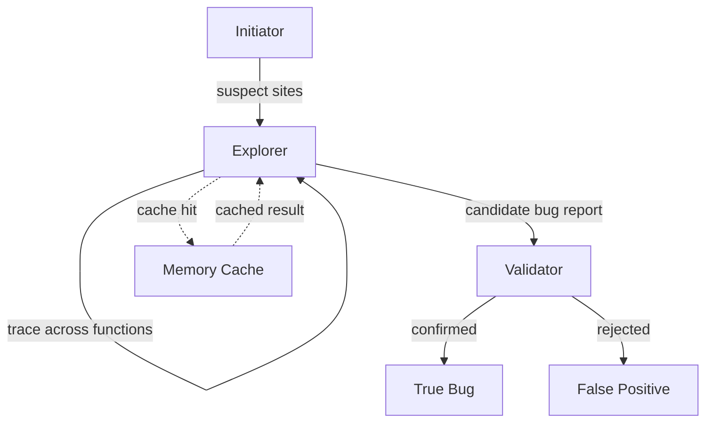

# Demand-Driven Repository Auditing

> Trace specific data flows across function boundaries on-demand instead of analyzing entire codebases. An Initiator-Explorer-Validator architecture finds real bugs at repository scale — $2.54 and 0.44 hours per project on average.

## The Whole-Codebase Ingestion Problem

Feeding an entire repository into an LLM context window does not scale. A 250K-line C project exceeds any current context limit, and whole-codebase approaches produce noisy results because the model lacks a directed question to answer.

Demand-driven analysis inverts this: start from a suspicious pattern (a potentially null pointer, an allocation without a matching free), then trace only the call chains that matter. The agent reads functions one at a time, following data flow across boundaries, and stops when the flow is resolved or a bug is confirmed.

[RepoAudit](https://arxiv.org/abs/2501.18160) demonstrates this on C/C++ memory safety bugs across 15 projects averaging 251K LoC, finding 40 true bugs at 78.43% precision — $2.54 and 0.44 hours per project.

## Architecture: Initiator-Explorer-Validator

Three components divide the work so each LLM call has a focused, bounded task:

### Initiator

Pattern-matches source code (via tree-sitter or AST queries) to find suspect sites — locations where a bug *could* exist. Each suspect site captures file path, line number, tracked variable, and bug category. This is a syntactic filter, not semantic analysis — fast and deterministic.

The initiator also **abstracts** each function before analysis: the LLM strips irrelevant statements, keeping only those that affect the tracked variable. This improved true positive detection by 47.5% in ablation studies.

### Explorer

Takes a suspect site and traces the relevant data flow across function boundaries. At each call site, the explorer:

1. Reads the callee function
2. Asks the LLM: "Does this function affect the tracked variable's state?"
3. If yes, continues tracing into that function
4. If the flow resolves (variable is checked/freed/initialized), stops — no bug

The explorer follows demand-driven traversal: it only reads functions that appear on the data-flow path, not the entire call graph.

### Validator

Receives a candidate bug report and independently verifies it. The validator re-examines the full path the explorer traced, checking for:

- Path feasibility (can the conditions actually co-occur?)
- Aliasing (does another variable reference the same memory?)
- Error handling (is the null case caught by a different mechanism?)

Removing the validator increased false positives by 245.5% in ablation — mechanical re-verification of LLM-generated claims is not optional.

## Cache Per-Function Results

When multiple suspect sites share common functions in their call chains, the agent re-analyzes the same function repeatedly without caching. RepoAudit's memory system caches results as `M(function, variable@statement)` — the analysis of a specific variable at a specific point in a specific function.

This reduced LLM calls by 3-30x depending on the project, and is the primary mechanism that makes repository-scale analysis affordable.

**Cache key design matters**: caching at the function level alone is too coarse (the same function may behave differently for different tracked variables). Caching at the statement level within a function-variable pair provides the right granularity.

## Where LLMs Add Value Over Traditional Tools

Traditional static analysis tools (Meta Infer, Amazon CodeGuru) struggle with pointer aliasing and path feasibility. On the same benchmark, Infer found 7 true bugs (2 FP) across 8 projects; CodeGuru found 0 true bugs (18 FP). RepoAudit found 40 true bugs (11 FP) across 15 projects.

The LLM advantage concentrates in **alias analysis** (do two pointers reference the same memory?), **path feasibility** (can these conditions co-occur?), and **cross-function reasoning** (how does a callee affect the caller's invariants?) — precisely where rule-based tools produce the most false positives.

## Practical Implications

**Demand-driven over whole-codebase**: Trace specific flows across function boundaries on-demand rather than feeding entire repos into context.

**Always validate mechanically**: The 245.5% false positive increase without validation reinforces the [deterministic guardrails](deterministic-guardrails.md) pattern. Re-verify findings through a separate prompt, or use a deterministic checker where possible.

**Abstract before analyzing**: Filter a function to only statements relevant to the tracked property before the actual analysis.

**Memoize at the right granularity**: Cache results keyed to (function, variable, statement) tuples. Function-level is too coarse; statement-level without function context is too fine.

## Limitations

- Call chain depth is bounded (RepoAudit uses 4 functions) — deeper inter-procedural bugs are missed
- Requires language-specific pattern matchers (tree-sitter grammars) for each bug type — not zero-shot
- Demonstrated only on C/C++ memory safety bugs — generalization to other languages and bug classes is unproven [unverified]
- Whether this demand-driven pattern works for dynamically-typed languages where data flow is harder to trace statically is an open question [unverified]

## Unverified Claims

- Generalization beyond C/C++ memory safety (see Limitations above)
- Applicability to dynamically-typed languages where static flow tracing is harder

## Key Takeaways

- Trace specific data flows on-demand — the agent reads only functions on the path
- Split into detect (Initiator), trace (Explorer), verify (Validator) — each LLM call has a focused task
- Removing the validator increased false positives by 245.5% — re-verification is essential
- Abstract functions before analysis — 47.5% improvement in true positive detection
- Cache at (function, variable, statement) granularity for affordable repo-scale analysis
- LLMs outperform traditional tools on alias analysis and path feasibility

## Related

- [Deterministic Guardrails Around Probabilistic Agents](deterministic-guardrails.md) — the validator component applies this pattern to static analysis
- [Incremental Verification: Check at Each Step, Not at the End](incremental-verification.md) — the Explorer checks at each function boundary rather than deferring verification to the end of the trace
- [Coverage-Guided Agents for Fuzz Harness Generation](coverage-guided-fuzz-harness-generation.md) — another agent-driven code analysis technique
- [Layered Accuracy Defense](layered-accuracy-defense.md) — the Initiator-Explorer-Validator split applies layered verification where each stage catches errors the previous stage is not designed to catch
- [Five-Pass Blunder Hunt](five-pass-blunder-hunt.md) — repeated review passes finding progressively deeper issues
