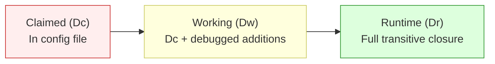

# Dependency Gap Validation for AI-Generated Code

> AI coding agents declare a fraction of the dependencies their code actually needs at runtime — validate in clean environments before trusting the manifest.

## The Problem

When an LLM generates a project, it writes a dependency file — `requirements.txt`, `package.json`, `pom.xml`. That file is incomplete. An [empirical study of 300 projects](https://arxiv.org/abs/2512.22387) across Claude Code, OpenAI Codex, and Gemini found a **13.5x average expansion** from declared dependencies to actual runtime dependencies. A Python project declaring 3 packages (scikit-learn, pandas, matplotlib) required 52 at runtime.

This is the **dependency gap**: the difference between what the agent says the code needs and what it actually needs to execute.

## How Large Is the Gap?

The study tested each agent across Python, JavaScript, and Java in pristine AWS environments with only OS-level packages installed:

| Language | Success Rate | Runtime Multiplier | Why |
|----------|:---:|:---:|-----|
| Python | 89.2% | 12.3x | Flat `requirements.txt` is easiest for LLMs to enumerate |
| JavaScript | 61.9% | 9.7x | [npm](https://docs.npmjs.com/cli/v11/configuring-npm/package-lock-json/) auto-resolves transitive deps into `package-lock.json`, masking gaps in the manifest |
| Java | 44.0% | 18.4x | [Maven transitive resolution](https://maven.apache.org/resolver/transitive-dependency-resolution.html) produces deep dependency graphs that LLMs rarely declare completely |

Agent performance also varies by language:

| Agent | Python | JavaScript | Java |
|-------|:---:|:---:|:---:|
| Claude Code | 80% | 60% | 80% |
| Gemini | 100% | 71% | 28% |
| Codex | 88% | 54% | 24% |

The practical takeaway: **match agent to language**. Gemini excels at Python but struggles with Java. Claude shows the most balanced cross-language performance.

## Three-Layer Dependency Framework

The study introduces a useful mental model for reasoning about AI-generated dependency declarations:



- **Claimed (Dc)** — packages the agent explicitly listed in the dependency file
- **Working (Dw)** — claimed packages plus whatever you manually add to get the code running
- **Runtime (Dr)** — the complete transitive closure: every package loaded during execution

The gap between Dc and Dr is what breaks your builds. Lock files (`package-lock.json`, `poetry.lock`, `Pipfile.lock`) capture Dr, but only if generated from a working environment — not from the agent's incomplete Dc.

## Where Failures Actually Come From

The dependency gap is real but not the primary failure mode. Among 95 failed projects:

| Failure Type | Share | Example |
|---|:---:|---|
| Code bugs (syntax, logic, malformed imports) | 52.6% | Uninitialized variables, wrong API signatures |
| Unparseable output | 16.8% | Agent output too malformed to execute |
| Version/structural conflicts | 15.8% | Incompatible package versions |
| **Missing dependencies** | **10.5%** | `ImportError`, `ModuleNotFoundError` |
| Environment issues | 4.2% | System-level conflicts |

Code quality failures outnumber dependency gaps 5:1. Both matter, but fixing only the manifest won't save a project with broken imports.

## Validation Workflow

### 1. Generate Lock Files in a Clean Environment

Never trust the agent's declared dependencies as the final list. Generate the lock file in a clean environment to capture the full transitive closure:

```bash
# Python
python -m venv .venv && source .venv/bin/activate
pip install -r requirements.txt
pip freeze > requirements-lock.txt

# JavaScript
rm -rf node_modules package-lock.json
npm install

# Java
mvn dependency:resolve
mvn dependency:tree > dep-tree.txt
```

### 2. Test in Isolation

Run the generated project in a container or fresh virtual environment with nothing pre-installed:

```bash
# Docker-based validation
docker run --rm -v $(pwd):/app -w /app python:3.12-slim \
  sh -c "pip install -r requirements.txt && python main.py"
```

If it fails, you've found a dependency gap. Add the missing packages and regenerate the lock file.

### 3. Add to CI

Make clean-environment validation a gate, not a manual step. A [deterministic guardrail](deterministic-guardrails.md) catches what prompts cannot enforce:

```yaml
# GitHub Actions example
- name: Validate dependencies
  run: |
    pip install -r requirements.txt
    python -c "import main"  # Fails fast on missing imports
```

## When This Backfires

Clean-environment validation is not free. It is worse than the alternatives under these conditions:

- **Prototype or throwaway code** — if the project will never leave a developer's laptop, the 30–60s clean-env rebuild per iteration outweighs a 10% chance of `ModuleNotFoundError`
- **Tight inner loop** — when the agent is iterating in a harness that already imports and runs the code each turn, import errors surface immediately; a separate CI gate adds latency without new signal
- **Managed runtimes with implicit deps** — platforms like AWS Lambda layers, Databricks notebooks, or Jupyter kernels pre-install common packages; a strict "only OS packages" baseline flags false positives that are guaranteed to exist in the target environment
- **Monorepos with shared lockfiles** — if a root lockfile already pins the transitive closure for all sub-projects, re-resolving per agent-authored change is wasted work

Weigh the gate cost against failure cost: for production deployments and external releases, clean-env validation pays for itself; for experiments and spike branches, it often does not.

## Key Takeaways

- AI agents declare ~7% of the packages their code actually loads at runtime — the other 93% are transitive dependencies they never mention
- Python is the safest language for AI-generated projects (89% success); Java is the riskiest (44%)
- Most AI code failures are bugs, not dependency gaps — validate both
- Lock files only work if generated from a working environment, not from the agent's incomplete manifest
- Clean-environment testing is a [deterministic guardrail](deterministic-guardrails.md) — add it to CI, don't rely on agents to self-check

## Related

- [Deterministic Guardrails Around Probabilistic Agents](deterministic-guardrails.md) — the principle behind making dependency validation a CI gate rather than an agent instruction
- [Agent Environment Bootstrapping](../workflows/agent-environment-bootstrapping.md) — broader workflow for setting up reproducible agent execution environments
- [Verification-Centric Development](../workflows/verification-centric-development.md) — development workflow that prioritizes verification at every stage
