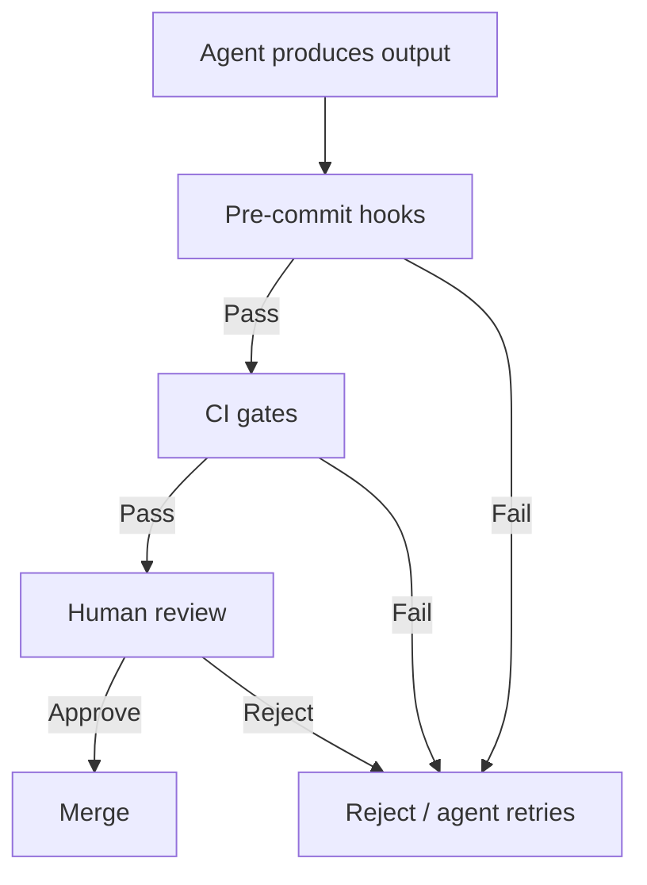

# Deterministic Guardrails Around Probabilistic Agents

> Wrap agent output in hard, deterministic checks — linting, schema validation, CI gates — that enforce correctness regardless of what the agent produces.

## The Core Distinction

Telling an agent "don't break any links" is a prompt — probabilistic, sometimes ignored, sometimes misunderstood. Running a link checker on every URL in a pre-commit hook is a guardrail — deterministic, always runs, cannot be reasoned around.

Agents are probabilistic. They will sometimes produce bad output. Guardrails are deterministic. They either pass or fail, every time, for every output.

Use both. Prompts guide agent behavior. Guardrails enforce properties of the output.

## Guardrail Categories

### Pre-Commit Hooks

Hooks run before a commit is accepted, catching problems at the point of introduction. Claude Code supports [`PreToolUse` and `PostToolUse` hooks](https://code.claude.com/docs/en/hooks) that intercept agent tool calls.

Common pre-commit guardrails:

- **URL validation** — follow every link and verify it resolves; catches hallucinated citations
- **Secret detection** — scan for API keys, tokens, credentials before they reach the repository
- **Formatting** — enforce consistent code style without relying on the agent to apply it correctly
- **Linting** — static analysis catches syntax errors and undefined variables the agent introduced

### CI Gates

CI checks run after a commit is pushed, providing a second layer independent of the local environment. [GitHub Copilot coding agent](https://docs.github.com/en/copilot/concepts/agents/coding-agent/about-coding-agent) executes automated tests and linters within its development environment before opening a PR; CI workflows run only after a human approves them.

Common CI guardrails:

- **Test suites** — automated tests the agent must not break
- **Type checking** — compile-time or static type analysis across the full codebase
- **Build verification** — the artifact must build without errors
- **Coverage thresholds** — fail the build when total coverage drops below a floor; [`pytest --cov-fail-under=N`](https://pytest-cov.readthedocs.io/en/latest/config.html) exits non-zero below `N`

### Schema Validation

Structured agent output — JSON review results, research notes, frontmatter blocks — can be validated against a schema. Invalid structure is rejected before downstream processing begins.

- Review agents that output `{"verdict":"PASS|FAIL","issues":[...]}` can be validated with JSON Schema
- Frontmatter blocks can be validated for required fields (`tags`, title structure)
- API responses from agent tool calls can be validated before the agent acts on them

### PostToolUse Validation

Claude Code's [`PostToolUse` hooks](https://code.claude.com/docs/en/hooks) run after the agent executes a tool call. This allows validation of the action's result before the agent continues:

- Validate that a file the agent wrote conforms to a template
- Check that a URL the agent navigated to actually loaded
- Confirm that a command the agent ran exited with code 0

## Layering Guardrails

No single guardrail catches everything. Layer them:



Each layer catches what the previous missed:

- Pre-commit hooks catch obvious errors fast, before they enter the repository
- CI gates catch integration errors that only manifest in the full build
- Human review catches semantic errors that automated tools cannot assess

## What Guardrails Cannot Do

Guardrails check properties, not intent. A URL validator confirms a link resolves — it cannot confirm the link points to the claimed content. A linter confirms syntax — it cannot confirm logic. A schema validator confirms structure — it cannot confirm the data is correct.

The guardrail catches what it is programmed to catch. Design guardrails to be specific. A guardrail that checks "file is valid YAML" is weaker than one that checks "file matches the required schema with all required fields present."

## When This Backfires

Guardrails impose fixed costs that do not scale linearly with value. The pattern is worse than the alternative when:

- **Coverage is thin but visible.** A handful of cheap checks create the impression of verification without covering the classes of errors that actually ship. Teams stop scrutinising output because "the checks passed" — the false-confidence failure mode identified in [Layered Accuracy Defense](layered-accuracy-defense.md).
- **CI latency dominates the agent loop.** When every iteration waits on a multi-minute test matrix, agents batch fixes into larger, less reviewable diffs. Short feedback cycles matter more than thoroughness during exploration; move heavy checks to merge gates and keep pre-commit hooks fast.
- **Hook noise trains bypass behaviour.** Aggressive pre-commit checks that fire on legitimate exploratory work push operators toward `--no-verify` habitually. Once bypass is normalised, the deterministic guarantee is gone.
- **The guardrail drifts from the property.** A linter rule or schema written years ago can encode a stale invariant. When production behaviour moves on, the check keeps passing while the thing it was meant to protect has changed. Guardrails need the same maintenance as the code they guard.

## Anti-Pattern

Relying solely on prompt instructions for properties that can be checked programmatically. "Don't include broken links" in a system prompt is a suggestion. A pre-commit hook that curls every URL is a guarantee.

## Key Takeaways

- Prompts guide behavior; guardrails enforce output properties — use both
- Pre-commit hooks catch errors before they enter the repository
- CI gates provide a second layer independent of the local environment
- Schema validation rejects malformed structured output before downstream processing
- PostToolUse hooks validate agent actions after they happen
- Guardrails check properties, not intent — design them to be specific
- Anti-pattern: using prompts alone to enforce things that can be checked programmatically

## Example

A Python project uses Claude Code to write code. Three guardrail layers enforce quality:

**Pre-commit hook** (`pre-commit-config.yaml`):
```yaml
repos:
  - repo: https://github.com/astral-sh/ruff-pre-commit
    rev: v0.4.4
    hooks:
      - id: ruff          # linting — catches syntax errors and undefined names
      - id: ruff-format   # formatting — enforces style regardless of agent output
  - repo: https://github.com/gitleaks/gitleaks
    rev: v8.18.3
    hooks:
      - id: gitleaks      # secret detection — blocks API keys before they reach the repo
```

**CI gate** (`.github/workflows/ci.yml`):
```yaml
- run: pytest --tb=short          # test suite must pass
- run: pyright src/               # type checking across full codebase
- run: pytest --cov=src --cov-fail-under=80  # coverage threshold — exits non-zero below 80%
```

**PostToolUse hook** (`.claude/settings.json`):
```json
{
  "hooks": {
    "PostToolUse": [{
      "matcher": "Write",
      "hooks": [{ "type": "command", "command": "ruff check $CLAUDE_TOOL_INPUT_PATH" }]
    }]
  }
}
```

Each layer is independent: the PostToolUse hook catches issues file-by-file as the agent writes; the pre-commit hook catches anything missed before the commit lands; CI catches integration failures the local environment didn’t surface.

## Related

- [Layered Accuracy Defense](layered-accuracy-defense.md)
- [Incremental Verification: Check at Each Step, Not at the End](incremental-verification.md)
- [Hooks for Enforcement vs Prompts for Guidance](hooks-vs-prompts.md)
- [Diff-Based Review Over Output Review](../code-review/diff-based-review.md)
- [PostToolUse Hooks: Automatic Formatting and Linting After Every File Edit](../workflows/posttooluse-auto-formatting.md)
- [PostToolUse Hook for BSD/GNU Tool Miss Detection](../tool-engineering/posttooluse-bsd-gnu-detection.md)
- [Data Fidelity Guardrails](data-fidelity-guardrails.md)
- [Structured Output Constraints](structured-output-constraints.md)
- [Risk-Based Shipping: Review by Risk Matrix, Not by Default](risk-based-shipping.md)
- [Test-Driven Agent Development: Tests as Spec and Guardrail](tdd-agent-development.md)
- [Verification Ledger](verification-ledger.md)
- [Red-Green-Refactor with Agents: Tests as the Spec](red-green-refactor-agents.md)
- [Risk-Based Task Sizing for Agent Verification Depth](risk-based-task-sizing.md)
- [Demand-Driven Repo Auditing](demand-driven-repo-auditing.md)
