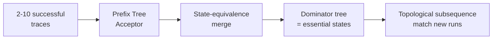

# Dominator-Graph Trajectory Invariants for Non-Deterministic Agents

> Validate non-deterministic agent runs by checking which states must dominate success — not by replaying a scripted sequence.

Dominator-graph trajectory invariants lift the compiler-theory notion of dominance (`A` dominates `B` if every path to `B` passes through `A`) onto agent traces. We merge a small set of successful runs into a graph, compute the dominator tree, and check new runs by topological subsequence matching against the mandatory states — not against an exact sequence ([Sharma, Mittal, Hu — GitHub Blog, 2026-05-06](https://github.blog/ai-and-ml/generative-ai/validating-agentic-behavior-when-correct-isnt-deterministic/); paper at [arxiv 2605.03159](https://arxiv.org/abs/2605.03159)).

## When to reach for it

This technique is qualified — it earns its complexity only when all of these hold:

- The success path branches and reconverges (UI flows, multi-tool workflows). Flat checkpoint lists cannot express conditional ordering.
- The end state is ambiguous — you cannot write a deterministic assertion like "PR opened" or "test suite passing". If you can, [outcome grading](grade-agent-outcomes.md) is simpler and equally sound.
- You can collect 2 to 10 successful traces. The technique learns from positive examples, not failure logs alone ([GitHub Blog](https://github.blog/ai-and-ml/generative-ai/validating-agentic-behavior-when-correct-isnt-deterministic/)).
- You have multimodal-LLM budget for state-equivalence checks. The published method calls an external multimodal model to decide when two observed states mean the same thing.

If any fails, prefer simpler tools: outcome assertions, [pre-completion checklists](pre-completion-checklists.md), or trajectory-match modes from [`agentevals`](https://github.com/langchain-ai/agentevals) (`strict`, `unordered`, `superset`, `subset`).

## How it works

Four stages, mirroring the published method ([GitHub Blog](https://github.blog/ai-and-ml/generative-ai/validating-agentic-behavior-when-correct-isnt-deterministic/), [arxiv 2605.03159](https://arxiv.org/abs/2605.03159)):

1. Capture traces. You record each successful run as a sequence of `(state, action)` pairs. For a UI agent, states are screenshots. For a tool-using agent, states are observable post-conditions of each tool call (filesystem state, API response shape, exit codes).
2. Build a Prefix Tree Acceptor (PTA). You merge the traces into a directed graph: nodes are observable states, edges are actions. Branching captures [non-deterministic variation](behavioral-testing-agents.md) (a loading screen that appears in some runs). Convergence captures where alternative paths rejoin.
3. Merge equivalent states. A three-tier comparison decides when two nodes are the same state: perceptual hashes or SSIM for near-identical visuals, multimodal LLM analysis for semantic equivalence, conservative merging only when both signals agree.
4. Compute dominators, then validate by topological subsequence matching. The Lengauer–Tarjan algorithm computes the dominator tree in near-linear time `O((V+E)·α(V+E))` ([Lengauer & Tarjan, TOPLAS 1979](https://dl.acm.org/doi/10.1145/357062.357071); [Boost Graph Library](https://www.boost.org/doc/libs/1_79_0/libs/graph/doc/lengauer_tarjan_dominator.htm)). A new run passes if its observed states include the dominator subtree in the required logical order. Gaps and detours between dominators are allowed.

## Why it works

A node `A` dominates a node `B` if and only if every observed successful path through `B` also passes through `A`. The dominance relation is a sound necessary-condition test: if `A` dominates `B` in the learned graph and a new run reaches `B` without passing through `A`, the run is either following an unobserved success variant or failing. Both warrant review. The relation generalizes flat "must visit checkpoint" semantics to a graph: it expresses conditional dominance ("if state X was reached, the run must have come through Y first") that flat lists and unordered trajectory-match modes cannot.

The empirical evidence: on a VS Code extension agent test scenario, the dominator-tree method scored 100% F1 against 69.8% for agent self-assessment (a 40-point recall improvement), and 52.2% F1 against 0% on discriminating execution noise from genuine product regressions ([GitHub Blog, 2026-05-06](https://github.blog/ai-and-ml/generative-ai/validating-agentic-behavior-when-correct-isnt-deterministic/)). The baseline is "agent grades its own run". The comparison against a tuned outcome-only or curated-checkpoint baseline is not published, so the published delta proves the mechanism works, not that it beats every simpler alternative.

## When this backfires

The "When to reach for it" conditions cover the positive case. Three further failure modes are worth naming because they affect teams that apply the technique correctly:

- Failure modes are duration- or negation-based. The technique validates ordering of included states. It does not catch "stuck on a loading screen for 90 seconds" (duration) or "must not have called the production-API tool" (negation). Pair with [deterministic guardrails](deterministic-guardrails.md) for those invariants.
- Traces are very short or strictly linear. A two-step agent has no branching to work with. Dominator analysis degenerates to a flat assertion the team should write directly.
- Trace diversity is low. Any dominance relation learned from a small sample under-approximates the true must-precede relation: an incidental state may appear in every captured trace and be wrongly marked mandatory. Calibrate by varying the inputs of captured runs on purpose ([Sharma et al., arxiv 2605.03159](https://arxiv.org/abs/2605.03159)).

## Example

A Copilot Cloud Agent task: "open a PR that fixes the failing test in repo R." Successful runs vary on file-tree or search palette, test-first or implementation-first reading, local-test or CI-only verification. A scripted assertion ("`read_file` then `run_tests` then `create_pr`") fails on the alternative paths. Outcome grading ("PR exists and CI is green") loses signal when CI is flaky.

Dominator-graph invariants learned from 3 successful traces capture the structure:

- `repo opened` dominates every later state.
- `failing test identified` dominates `fix proposed`.
- `fix proposed` dominates `PR created`.
- `read_file` and `run_tests` are not mandatory dominators — they are optional variations.

A new run that creates a PR without first reaching `failing test identified` fails the invariant, even though the outcome ("PR exists") looks correct.

## Key Takeaways

- Dominator analysis lifts compiler theory onto agent traces — it expresses "must precede" as a graph relation, not a flat list.
- The technique is qualified: it pays off on branching, ambiguous-outcome workflows with 2–10 successful traces and multimodal-LLM budget; it is overkill when the end state is directly assertable.
- The reported 100% / 52.2% F1 numbers are against agent self-assessment, not against tuned outcome or checkpoint baselines — frame results honestly when comparing.
- Pair dominator-graph invariants with [deterministic guardrails](deterministic-guardrails.md) for the failure modes it does not catch: duration and negative constraints.
- The Lengauer–Tarjan dominator step is near-linear; the cost is in state-equivalence merging (multimodal LLM calls), not in the dominator computation itself.

## Related

- [Grade Agent Outcomes, Not Execution Paths](grade-agent-outcomes.md) — the alternative when the end state is directly assertable; the natural simpler baseline.
- [Trajectory Decomposition: Diagnose Where Coding Agents Fail](trajectory-decomposition-diagnosis.md) — complementary technique that breaks trajectories into search / read / edit stages with IR metrics rather than dominance.
- [Trajectory-Opaque Evaluation Gap](eval-blind-spots.md) — motivates trajectory-aware checks: outcome-only grading misses 44% of safety violations.
- [Golden Journeys: Restartability as a First-Class Verification Primitive](golden-journeys.md) — sibling approach for naming end-to-end paths with per-step failure signals.
- [Behavioral Testing for Agents](behavioral-testing-agents.md) — broader framing of non-deterministic agent testing; situates dominator-graph invariants within capability-matrix grading.
- [Pre-Completion Checklists](pre-completion-checklists.md) — deterministic gating that pairs naturally with dominator-graph invariants for the constraints they do not cover.
- [Deterministic Guardrails Around Probabilistic Agents](deterministic-guardrails.md) — the layer that catches what dominator analysis cannot: must-not states, duration violations, and hard schema checks.
- [Learned Prefix Monitors for Agent Traces](learned-prefix-monitors-agent-traces.md) — the failure-prediction alternative that learns from traces too, but scores partial runs for likely failure rather than checking mandatory states.
