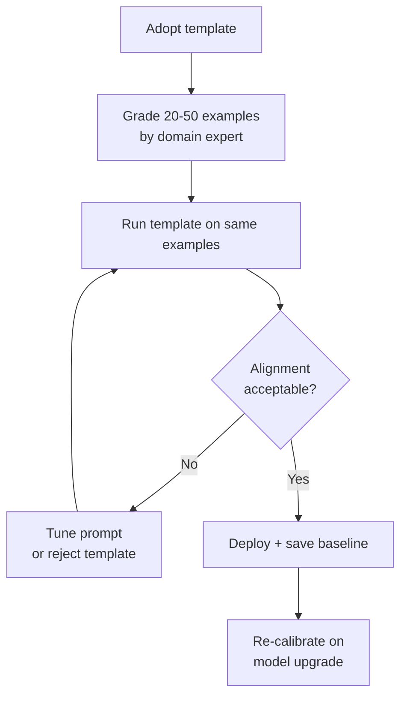
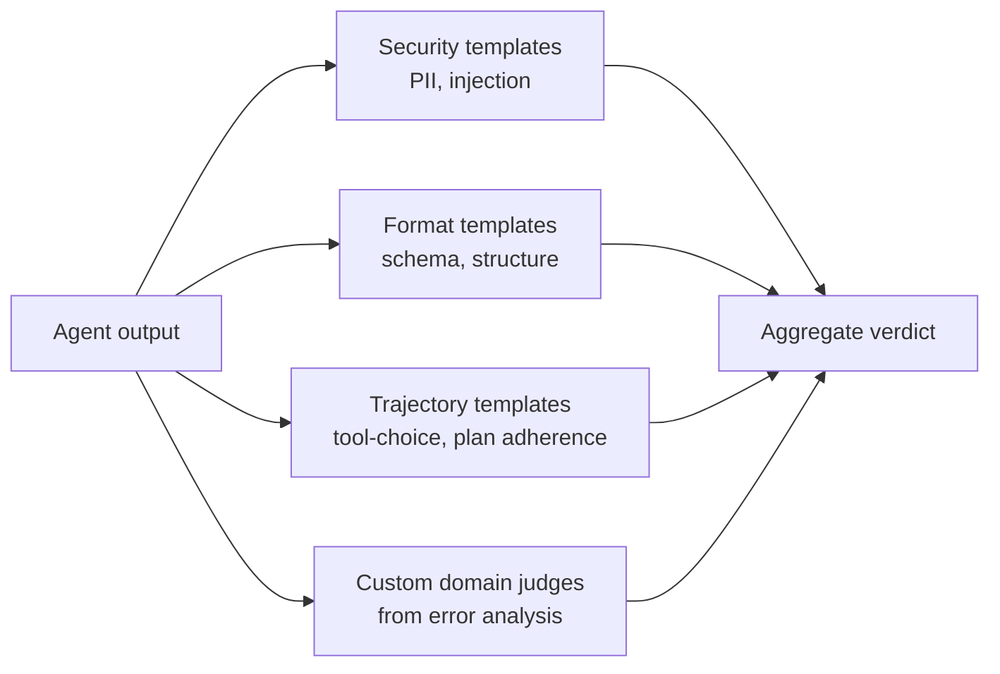

# Evaluator Templates: Portable Primitives

> Treat judge prompts as parameterised templates for the narrow set of evaluation questions whose shape is portable across domains. Use custom evaluators for everything else.

## What Templates Actually Solve

Every agent project re-authors the same judge prompts: prompt-injection detection, PII leakage, format adherence, tool-choice correctness, trajectory accuracy. LangSmith shipped 30+ evaluator templates on April 16, 2026, organised into six categories: Security, Safety, Quality, Conversation, Trajectory, and Image & Voice — LLM-as-judge prompts and rule-based code evaluators with tuned prompts and default rubrics. [Source: [Reusable Evaluators and Evaluator Templates in LangSmith](https://blog.langchain.com/reusable-langsmith-evaluator-templates/)]

The open-source [openevals](https://github.com/langchain-ai/openevals) library exposes them as parameterised f-string constants — `PROMPT_INJECTION_PROMPT`, `PII_LEAKAGE_PROMPT`, `RAG_GROUNDEDNESS_PROMPT`, `TRAJECTORY_ACCURACY_PROMPT`, `TOOL_SELECTION_PROMPT`, `CODE_CORRECTNESS_PROMPT`, `HALLUCINATION_PROMPT` — fed into a `create_llm_as_judge(prompt=...)` factory with `{inputs}`, `{outputs}`, and `{reference_outputs}` parameters.

LangSmith also ships a workspace-level Evaluators tab: build once, attach to multiple tracing projects, update in one place. Definition and attachment are separated — no duplicate copies to maintain. [Source: [Manage evaluators — LangSmith docs](https://docs.langchain.com/langsmith/evaluators)]

## The Portable Subset

Templates work when the evaluation question's shape does not depend on application semantics.

| Portable question | Why shape is portable |
|-------------------|-----------------------|
| Prompt injection detection | Structural pattern (injection markers, role confusion) independent of domain |
| PII / secret leakage | Regex-matchable artefacts (SSNs, API keys, emails) |
| Toxicity, bias | Well-defined corpora and definitions from public benchmarks |
| Format / schema adherence | Structured output matched against a JSON schema |
| Tool-choice correctness | Compared against a fixed tool schema known to the judge |
| Trajectory accuracy against a plan | Compared against a reference trajectory |

[Source: [LangSmith template categories](https://docs.langchain.com/langsmith/evaluators)]

The judge does not need to know anything specific about the application to score these. A PII leakage template on a medical-records agent uses the same judging logic as one on a customer-support agent.

## What Templates Do Not Solve

Generic correctness, helpfulness, coherence, and tone templates fail as primary quality signals because "good" is domain-specific. A leasing agent's real failures — proposing unavailable showing times, omitting budget constraints — are invisible to a generic helpfulness judge.

> "Generic evaluations waste time and create false confidence. [...] All you get from using these prefab evals is you don't know what they actually do and in the best case they waste your time and in the worst case they create an illusion of confidence that is unjustified."

[Source: [Hamel Husain — Should I use "ready-to-use" evaluation metrics?](https://hamel.dev/blog/posts/evals-faq/#q-should-i-use-ready-to-use-evaluation-metrics)]

Successful teams spend most of their effort on application-specific metrics derived from error analysis on real failures. [Source: [Hamel Husain — Custom Evaluators Over Generic Metrics](https://hamel.dev/blog/posts/evals-faq/#3-custom-evaluators-over-generic-metrics)]

The rule: **portability belongs to the question, not the template object**. If the question is "did the agent leak an API key?", a template carries. If the question is "did the agent address the user's actual need?", no template can encode what "actual need" means in your domain.

## Calibration Is Not Optional

A template without calibration against a human-graded golden set is a score generator of unknown alignment. LangSmith ships a separate feature — Align Evals — precisely because template scores drift from human judgment unless calibrated. [Source: [Introducing Align Evals](https://blog.langchain.com/introducing-align-evals/)]



Calibration is recurring:

- **Model upgrade**: A judge model upgrade shifts scores on a fixed prompt. Re-run the golden set before trusting regression signal.
- **Distribution shift**: New query types outside the calibration set have systematically miscalibrated scores.
- **Class imbalance**: Production traffic where one class dominates (99% benign for a safety template) rewards always-pass behaviour. Add negative cases in proportion to the risk measured.

[Source: [Demystifying Evals for AI Agents](https://www.anthropic.com/engineering/demystifying-evals-for-ai-agents)]

## Template Anatomy

A reusable template is more than a prompt string. It bundles:

| Element | Example |
|---------|---------|
| Parameterised prompt | f-string with `{inputs}`, `{outputs}`, `{reference_outputs}` placeholders |
| Output schema | pass/fail + score 0.0–1.0 + short rationale |
| Default rubric | Criteria and escape hatches ("Unknown" option) |
| Calibration dataset | 20–50 human-graded examples bundled with the template |
| Version identifier | Pinned so score comparisons are meaningful across time |

A template missing the calibration dataset or version identifier is a prompt string, not a reusable primitive — score drift becomes untraceable.

## Where Templates Compose With Custom Evaluators

A practical eval suite layers them:



Templates cover the portable floor; custom evaluators cover what matters to the user. The two are not substitutes — a suite that skips either is incomplete.

## Example

Using the openevals prompt-injection template as a portable primitive, then adding a domain-specific evaluator for the question the template cannot answer.

```python
from openevals.llm import create_llm_as_judge
from openevals.prompts import PROMPT_INJECTION_PROMPT

# Portable primitive: reused across every tracing project
injection_judge = create_llm_as_judge(
    prompt=PROMPT_INJECTION_PROMPT,
    model="openai:gpt-5.4",
)

# Domain-specific: derived from error analysis on real leasing-agent failures
LEASING_CORRECTNESS_PROMPT = """
You are scoring a leasing agent response.

## Output
{outputs}

## Checks (all must pass)
1. Does the agent avoid proposing showing times that are not in the available_slots list?
2. Does the agent honour every budget constraint stated in the user's request?
3. Does the agent avoid claiming a unit is available when inventory_status says otherwise?

Return JSON: {"pass": bool, "failed_checks": [int], "note": str}
"""

leasing_judge = create_llm_as_judge(
    prompt=LEASING_CORRECTNESS_PROMPT,
    model="openai:gpt-5.4",
)

# Suite applies both
def evaluate(output, tool_log, available_slots):
    return {
        "injection": injection_judge(outputs=output),
        "domain":    leasing_judge(outputs=output),
    }
```

The template carries the portable question; the custom judge carries the domain-specific failure modes that were surfaced by error analysis on production traces, not by a template library.

## Key Takeaways

- Templates are genuinely reusable for security, safety, format adherence, tool-choice correctness, and trajectory checks — questions whose shape is portable across domains
- Generic quality, helpfulness, and correctness templates produce false confidence — domain-specific failure modes require custom evaluators built from error analysis
- A template without a calibration dataset and version identifier is a prompt string, not a primitive
- Re-calibrate after every judge-model upgrade; score drift from model changes contaminates regression signal
- A workspace-level evaluator definition applied across tracing projects beats duplicate copies — update propagation is the operational value
- Compose templates with custom evaluators; the two are not substitutes

## Related

- [LLM-as-Judge Evaluation with Human Spot-Checking](../workflows/llm-as-judge-evaluation.md)
- [Anti-Reward-Hacking: Rubrics That Resist Gaming](anti-reward-hacking.md)
- [Eval-Driven Development](../workflows/eval-driven-development.md)
- [Grade Agent Outcomes, Not Execution Paths](grade-agent-outcomes.md)
- [Behavioral Testing for Agents](behavioral-testing-agents.md)
- [Incident to Eval Synthesis](incident-to-eval-synthesis.md)
