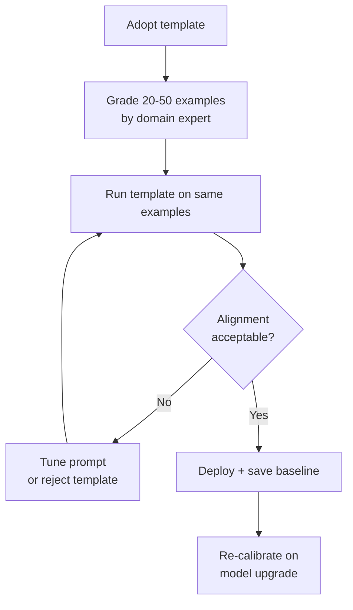
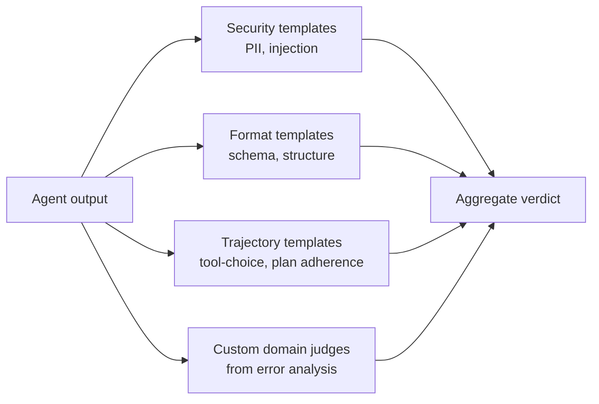

# Evaluator Templates: Portable Primitives

> Treat judge prompts as parameterized templates for the narrow set of evaluation questions whose shape is portable across domains. Use custom evaluators for everything else.

## What templates actually solve

Every agent project re-authors the same judge prompts: prompt-injection detection, PII leakage, format adherence, tool-choice correctness, trajectory accuracy. LangSmith shipped 30+ evaluator templates on April 16, 2026, across six categories — Security, Safety, Quality, Conversation, Trajectory, Image & Voice — as LLM-as-judge prompts and rule-based evaluators with tuned defaults. [Source: [Reusable Evaluators and Evaluator Templates in LangSmith](https://blog.langchain.com/reusable-langsmith-evaluator-templates/)]

The [openevals](https://github.com/langchain-ai/openevals) library exposes them as parameterized f-string constants (`PROMPT_INJECTION_PROMPT`, `PII_LEAKAGE_PROMPT`, `TRAJECTORY_ACCURACY_PROMPT`, `TOOL_SELECTION_PROMPT`, `HALLUCINATION_PROMPT`) fed into `create_llm_as_judge(prompt=...)` with `{inputs}`, `{outputs}`, `{reference_outputs}` placeholders. A workspace-level Evaluators tab attaches one definition to many tracing projects. [Source: [Manage evaluators — LangSmith docs](https://docs.langchain.com/langsmith/evaluators)]

## The portable subset

Templates work when the evaluation question's shape does not depend on application semantics.

| Portable question | Why shape is portable |
|-------------------|-----------------------|
| Prompt injection | Structural pattern (injection markers, role confusion) |
| PII / secret leakage | Regex-matchable artifacts (SSNs, API keys, emails) |
| Toxicity, bias | Public benchmarks supply corpora and definitions |
| Format / schema adherence | Output matched against a JSON schema |
| Tool-choice correctness | Compared against a fixed tool schema |
| Trajectory accuracy | Compared against a reference plan |

[Source: [LangSmith template categories](https://docs.langchain.com/langsmith/evaluators)]

A PII template on a medical-records agent uses the same judging logic as one on customer support — the judge needs nothing application-specific.

## What templates do not solve

Generic correctness, helpfulness, and tone templates fail as primary quality signals because "good" is domain-specific. A leasing agent's real failures — unavailable showing times, ignored budget constraints — are invisible to a generic helpfulness judge.

> "Generic evaluations waste time and create false confidence. [...] In the best case they waste your time and in the worst case they create an illusion of confidence that is unjustified."

[Source: [Hamel Husain — Should I use "ready-to-use" evaluation metrics?](https://hamel.dev/blog/posts/evals-faq/#q-should-i-use-ready-to-use-evaluation-metrics)]

Successful teams spend most effort on application-specific metrics derived from error analysis on real failures. [Source: [Hamel Husain — Custom Evaluators Over Generic Metrics](https://hamel.dev/blog/posts/evals-faq/#3-custom-evaluators-over-generic-metrics)]

Portability belongs to the question, not the template object. "Did the agent leak an API key?" carries; "address the user's actual need?" cannot.

## Calibration is not optional

A template without calibration against a human-graded golden set is a score generator of unknown alignment. LangSmith ships Align Evals separately because template scores drift from human judgment unless calibrated. [Source: [Introducing Align Evals](https://blog.langchain.com/introducing-align-evals/)]


```mermaid
graph TD
    A[Adopt template] --> B[Grade 20-50 examples<br/>by domain expert]
    B --> C[Run template on same examples]
    C --> D{Alignment<br/>acceptable?}
    D -->|No| E[Tune prompt<br/>or reject template]
    D -->|Yes| F[Deploy + save baseline]
    E --> C
    F --> G[Re-calibrate on<br/>model upgrade]
```

Calibration recurs on: judge-model upgrades (scores shift on a fixed prompt), distribution shift (new query types are miscalibrated), and class imbalance (99% benign traffic rewards always-pass — add negative cases proportional to risk). [Source: [Demystifying Evals for AI Agents](https://www.anthropic.com/engineering/demystifying-evals-for-ai-agents)]

## Template anatomy

A reusable template is more than a prompt string. It bundles:

| Element | Example |
|---------|---------|
| Parameterized prompt | f-string with `{inputs}`, `{outputs}`, `{reference_outputs}` |
| Output schema | pass/fail + score 0.0–1.0 + short rationale |
| Default rubric | Criteria and escape hatches ("Unknown" option) |
| Calibration dataset | 20–50 human-graded examples bundled with the template |
| Version identifier | Pinned so score comparisons are meaningful over time |

A template missing the calibration dataset or version identifier is a prompt string, not a reusable primitive — score drift becomes untraceable.

## Where templates compose with custom evaluators

A practical eval suite layers them:


```mermaid
graph LR
    A[Agent output] --> B[Security templates<br/>PII, injection]
    A --> C[Format templates<br/>schema, structure]
    A --> D[Trajectory templates<br/>tool-choice, plan adherence]
    A --> E[Custom domain judges<br/>from error analysis]
    B --> F[Aggregate verdict]
    C --> F
    D --> F
    E --> F
```

Templates cover the portable floor; custom evaluators cover what matters. They are not substitutes.

## When this backfires

The steelman against templates: skip the library, write every judge from scratch. Reasonable failure conditions:

- Calibration debt outweighs saved draft cost. Template prompts are only "free" until you grade 20–50 examples per template and re-grade on every judge-model upgrade. For a small suite (≤3 judges), calibration overhead can exceed bespoke authoring time.
- Workspace-level lock-in. Centralizing definitions in one vendor's tab re-creates the migration tax LangSmith identifies for duplicated copies — the unit of duplication moves from per-project to per-vendor.
- Shortcut bias inherited silently. Recent work documents systematic [shortcut bias in LLM judges](anti-reward-hacking.md) — recency, provenance hierarchy, verbosity inflation — that templates inherit unacknowledged. A safety template scoring "expert-tagged" outputs higher independent of content is portable only on the surface. [Source: [The Silent Judge: Unacknowledged Shortcut Bias in LLM-as-a-Judge (arXiv 2509.26072)](https://arxiv.org/abs/2509.26072)]
- False ceiling on coverage. Six template categories can read as "evals done" while domain-specific failures remain unmeasured.

## Example

Compose an openevals primitive with a domain-specific judge for the question the template cannot answer.

```python
from openevals.llm import create_llm_as_judge
from openevals.prompts import PROMPT_INJECTION_PROMPT

# Portable primitive: reused across every tracing project
injection_judge = create_llm_as_judge(
    prompt=PROMPT_INJECTION_PROMPT,
    model="openai:gpt-5.4",
)

# Domain-specific: derived from error analysis on real leasing-agent failures
LEASING_CORRECTNESS_PROMPT = """
You are scoring a leasing agent response.

## Output
{outputs}

## Checks (all must pass)
1. Does the agent avoid proposing showing times that are not in the available_slots list?
2. Does the agent honour every budget constraint stated in the user's request?
3. Does the agent avoid claiming a unit is available when inventory_status says otherwise?

Return JSON: {"pass": bool, "failed_checks": [int], "note": str}
"""

leasing_judge = create_llm_as_judge(
    prompt=LEASING_CORRECTNESS_PROMPT,
    model="openai:gpt-5.4",
)

# Suite applies both
def evaluate(output, tool_log, available_slots):
    return {
        "injection": injection_judge(outputs=output),
        "domain":    leasing_judge(outputs=output),
    }
```

The template carries the portable question. The custom judge carries the domain-specific failure modes that error analysis on production traces surfaced, not a template library.

## Key Takeaways

- Templates are genuinely reusable for security, safety, format adherence, tool-choice correctness, and trajectory checks — questions whose shape is portable across domains
- Generic quality, helpfulness, and correctness templates produce false confidence — domain-specific failure modes require custom evaluators built from error analysis
- A template without a calibration dataset and version identifier is a prompt string, not a primitive
- Re-calibrate after every judge-model upgrade; score drift from model changes contaminates regression signal
- A workspace-level evaluator definition applied across tracing projects beats duplicate copies — update propagation is the operational value
- Compose templates with custom evaluators; the two are not substitutes

## Related

- [LLM-as-Judge Evaluation with Human Spot-Checking](../workflows/llm-as-judge-evaluation.md)
- [Anti-Reward-Hacking: Rubrics That Resist Gaming](anti-reward-hacking.md)
- [Meta-Evaluate the LLM Judge Before Trusting Rubric Verdicts](meta-evaluate-llm-judge-rubric-verification.md) — measure a template judge's reliability against human labels before trusting its rubric verdicts at scale
- [Eval-Driven Development](../workflows/eval-driven-development.md)
- [Grade Agent Outcomes, Not Execution Paths](grade-agent-outcomes.md)
- [Behavioral Testing for Agents](behavioral-testing-agents.md)
- [Incident to Eval Synthesis](incident-to-eval-synthesis.md)
