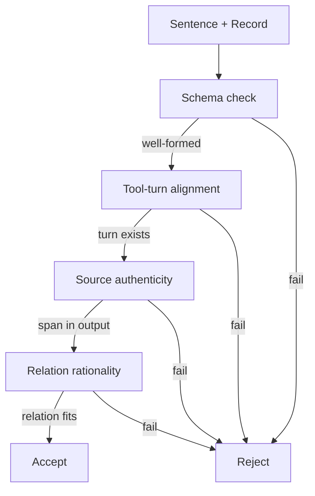

# Generative Provenance Records for Tool-Using Agents

> Emit a structured provenance record alongside each output sentence so a mechanical verifier can check claim-level grounding before the answer leaves the loop.

## The provenance gap

Tool-using agents expose their tool trajectory (the sequence of calls) and the final answer, but rarely specify which tool observation supports each generated claim. [Yu et al. (2026)](https://arxiv.org/abs/2605.09934) call this the provenance gap. Useful evidence, redundant exploration, and unsupported reasoning are mixed in the same trajectory, so a downstream reviewer cannot tell which sentence was grounded in which tool turn.

Post-hoc citation does not close the gap. A reviewer asked "is this claim faithful?" inherits all the cost and unreliability of the original generation step — public hallucination-detection benchmarks like AggreFact, RAGTruth, and FaithBench [report current methods near 50% accuracy](https://arxiv.org/html/2505.04847v2). Verification has to be cheap, deterministic, and built into generation.

## The record

Each generated sentence is paired with a tuple:

```json
{
  "sentence": "The receipt total is $42.18.",
  "provenance": {
    "tool_turn_id": "OCR_3",
    "evidence_span": "TOTAL ............ 42.18",
    "support_relation": "Quotation"
  }
}
```

The three fields are the primitives that carry the weight, and the third is the one that makes mechanical verification possible. The relation taxonomy comes from [TRACER](https://arxiv.org/abs/2605.09934):

- Quotation — direct reuse of explicit text in the tool observation, with minimal transformation
- Compression — faithful condensation of a longer observation, with no new reasoning introduced
- Inference — derived by combining or computing over one or more evidence units, still grounded in cited observations

The labels are not decoration. Each one specifies a different check the verifier runs.

## The four-check verifier



1. Schema validation — the record is well-formed JSON with the required fields. This catches malformed output, missing indices, and dropped provenance items.
2. Tool-turn alignment — the cited `tool_turn_id` is present in the trajectory. This catches fabricated turn IDs and hallucinated tool calls.
3. Source authenticity — the `evidence_span` actually appears in that turn's output (substring or localized region match). This catches fabricated quotes and misattributed observations.
4. Relation rationality — the labeled relation is consistent with the claim-evidence pair. For Quotation, a substring match suffices. Compression and Inference need a tighter check, usually a small judge model with the evidence and claim in front of it.

Checks 1 to 3 are deterministic string operations on JSON. They cannot be fooled in the way an LLM judge can. The relation taxonomy narrows check 4 — verifying "this is a Quotation" is far cheaper than asking "is this faithful?" in the abstract. This is the same mechanism documented in [Citation-Grounded Code Comprehension](https://arxiv.org/html/2512.12117v1), where upfront constraint enforcement produced "zero false negatives in 1,080 verified responses, confirming architectural prevention superior to post-hoc detection."

## Where to apply it

This pattern earns its overhead when tool observations are unstructured natural language or multimodal blobs the agent must summarize:

- Multimodal QA over OCR snippets, image captions, retrieved passages
- Deep-research agents that fan out across many sources and produce a synthesis
- RAG pipelines where the final answer cites multiple chunks

It does not earn its overhead when tool outputs are themselves the verification:

- Coding agents calling `pytest`, `git diff`, the type checker — the trajectory log already is the audit trail, and a sentence like "the failing test was `test_foo`" is verified by re-running the test, not by a relation-labeled record
- Single-tool agents — `tool_turn_id` collapses to a constant
- Latency-sensitive interactive loops — structured provenance roughly doubles output tokens and demands schema-aware decoding

## Operational caveats

Bolting a "produce citations" prompt onto a base model does not give you this pattern. TRACER's reported gains (78.23% answer accuracy on Qwen3-VL-8B, 23.80 percentage points over the strongest closed-source baseline, tool calls reduced from 4,949 to 3,486 across the test set) come from SFT plus RL on a 14k-example provenance benchmark with verified records used as the reward signal ([Yu et al., 2026](https://arxiv.org/abs/2605.09934)). Without training data, the agent fabricates records that pass schema validation but fail source authenticity — the same fabricated-citation failure mode [LongCite](https://aclanthology.org/2025.findings-acl.264.pdf) showed in long-context QA without sentence-level supervision.

Provenance grounds claims; it does not validate them. If a tool's output is attacker-controlled (web fetch of a poisoned page), source authenticity still passes — the claim is faithful to the tool observation but the tool observation lies. Treat provenance as a faithfulness check, not a factuality check ([Huang et al., 2024](https://dl.acm.org/doi/10.1145/3703155)).

## Example

A multimodal agent answers "How much did the customer pay including tax?" over a receipt image. Without provenance, the agent emits a single sentence and the reviewer has no anchor. With generative provenance:

```json
[
  {
    "sentence": "The subtotal on the receipt is $38.50.",
    "provenance": {
      "tool_turn_id": "OCR_2",
      "evidence_span": "SUBTOTAL ........ 38.50",
      "support_relation": "Quotation"
    }
  },
  {
    "sentence": "Sales tax of $3.68 was added.",
    "provenance": {
      "tool_turn_id": "OCR_2",
      "evidence_span": "TAX 9.55% ....... 3.68",
      "support_relation": "Quotation"
    }
  },
  {
    "sentence": "The total paid is $42.18.",
    "provenance": {
      "tool_turn_id": "Calculator_1",
      "evidence_span": "38.50 + 3.68 = 42.18",
      "support_relation": "Inference"
    }
  }
]
```

The verifier confirms `OCR_2` and `Calculator_1` are in the trajectory, the spans appear in those outputs, and the Inference relation is consistent with the arithmetic. A fabricated turn ID, an invented OCR span, or a sum claimed as Quotation would all fail before the answer is shown to the user.

## Key Takeaways

- The provenance gap: agents emit trajectories and answers but not the claim-level dependency between them; post-hoc citation inherits the cost and unreliability of generation
- The record is a tuple of `tool_turn_id`, `evidence_span`, and `support_relation` (Quotation / Compression / Inference) emitted with each sentence, not appended
- Four deterministic checks — schema, tool-turn alignment, source authenticity, relation rationality — verify the record. The relation label narrows the only check that needs judgment
- Apply where tool observations are unstructured (multimodal QA, RAG, deep research); skip where the tool output is itself the verification (tests, compilers, diffs)
- Provenance is a faithfulness check, not a factuality check — a poisoned tool output still passes source authenticity

## Related

- [Structured Output Constraints](structured-output-constraints.md)
- [Deterministic Guardrails Around Probabilistic Agents](deterministic-guardrails.md)
- [Layered Accuracy Defense](layered-accuracy-defense.md)
- [Trajectory Decomposition: Diagnose Where Coding Agents Fail](trajectory-decomposition-diagnosis.md)
- [Trajectory-Opaque Evaluation Gap](eval-blind-spots.md)
- [RAG/Agent Reliability Problem Map](rag-agent-reliability-problem-map.md)
- [Per-Line Requirement Citations for Hallucination Detection](per-line-requirement-citations.md) — Attach a machine-checkable requirement ID to each generated line so a set-difference check catches hallucinated requirements deterministically.
- [Typed Generation Contracts for Grounded Extraction](typed-generation-contract.md) — The same evidence-span discipline applied to a single extraction step, with typed values and an explicit not-found flag.
