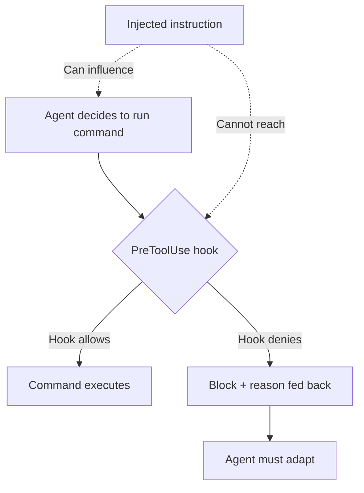

# Hooks for Enforcement vs Prompts for Guidance

> Prompts request behavior; hooks require it. Use prompts for judgment calls and context-dependent guidance; use hooks for rules that must not vary.

!!! note "Also known as"
    **Enforcement vs Advisory**, **Hooks Beat Prompts**.

## The Core Distinction

Prompt instructions are probabilistic. Under task pressure — context window filling, attention diverted — compliance degrades and the agent reverts to training defaults.

Hooks are deterministic. A pre-command hook runs outside the agent's context window entirely; the model cannot overrule it. Compliance is unconditional.

## The Decision Rule

Use hooks for a rule when all three apply:

1. Compliance is non-negotiable — failure has real cost
2. The rule is binary — a command either violates it or it does not
3. The behavior has a strong opposing prior in training data

Use prompts when any of the following applies:

- The guidance is contextual ("prefer X when working in Y")
- The rule requires model judgment to apply correctly
- The correct behavior depends on factors the hook cannot inspect
- The cost of false positives from over-blocking exceeds the cost of occasional non-compliance

## What Hooks Can Enforce

Hooks intercept agent lifecycle events and can allow, block, or modify what the agent is about to do.

High-value enforcement targets:

- **Package manager fidelity** — block `npm install`, enforce `pnpm install`
- **Destructive git operations** — block `git reset --hard`, `git push --force`
- **Branch protection** — block direct push to main
- **File restrictions** — block writes to infrastructure or secrets files
- **Tool allowlisting** — permit only a defined set of shell commands

All share a property: absolute, binary, and the agent has a training prior toward the wrong behavior (more `npm` than `pnpm` in training data [unverified — no public source confirms training data composition]).

## What Prompts Do That Hooks Cannot

Hooks operate on observable agent actions. They cannot encode intent, context, or trade-offs.

Prompts handle:

- **Architectural guidance** — "prefer composition over inheritance when adding new features"
- **Quality standards** — "write a test for any change to business logic"
- **Situational judgment** — "raise a concern before modifying authentication code"
- **Tone and style** — communication conventions in output

These require evaluating context that a hook cannot inspect mechanically.

## Injection Resistance

Hooks provide a security property that prompts cannot: immunity to [prompt injection](../security/prompt-injection-threat-model.md).

Injected instructions enter the model's reasoning loop and can influence what the agent *tries* to do. They cannot influence what a hook *allows*.



Without a hook, injected instructions and `CLAUDE.md` compete in the model's reasoning loop — **non-deterministic**. With a hook, `PreToolUse` fires before execution — **deterministic**.

## Context Cost

Prompt instructions occupy context and compete for model attention — under the [instruction compliance ceiling](../instructions/instruction-compliance-ceiling.md), attention has limits. Hooks have zero context cost; moving absolute rules from prompt to hook improves reliability and frees context.

## Cross-Tool Applicability

The enforcement vs. guidance distinction is tool-agnostic. The mechanism varies:

| Tool | Hook mechanism |
|------|---------------|
| Claude Code | `PreToolUse` / `PostToolUse` hooks in `.claude/settings.json` ([docs](https://code.claude.com/docs/en/hooks)) |
| Git operations | Git hooks (`pre-commit`, `pre-push`) |
| CI/CD | GitHub Actions, pipeline gates |
| Editor | Extension rules, linters on save |

Git hooks and CI gates predate AI agents — a `pre-commit` hook enforces its rule regardless of whether the commit came from a developer, an agent, or a script.

## Example

The package-manager rule goes into a hook (absolute, binary, strong training prior toward `npm`); the architectural guidance stays in the prompt (requires judgment, context-dependent).

**Hook — deterministic enforcement in `.claude/settings.json`**

```json
{
  "hooks": {
    "PreToolUse": [
      {
        "matcher": "Bash",
        "hooks": [
          {
            "type": "command",
            "command": "bash -c 'if echo \"$CLAUDE_TOOL_INPUT_COMMAND\" | grep -qE \"^npm (install|i |ci )\"; then echo \"Use pnpm instead of npm\" >&2; exit 1; fi'"
          }
        ]
      }
    ]
  }
}
```

If the command starts with `npm install`, the hook exits with code 1 and the agent sees the error message. The rule runs outside the agent's context window — it cannot be forgotten or overridden mid-task.

**Prompt — contextual guidance in `CLAUDE.md`**

```markdown
## Architecture guidance

Prefer composition over inheritance when adding new features to the payment module.
If you are modifying authentication code, raise a concern in the chat before making changes —
authentication failures are hard to detect and expensive to recover from.
Write a unit test for any change to business logic in `src/domain/`.
```

These instructions require evaluating context a hook cannot inspect mechanically — they belong in the prompt.

## Unverified Claims

- Training data contains more `npm` than `pnpm` [unverified — no public source confirms training data composition]

## Related

- [Hook Catalog: Guardrails, Sandboxing, and CLI Enforcement](../tool-engineering/hook-catalog.md)
- [The Instruction Compliance Ceiling](../instructions/instruction-compliance-ceiling.md)
- [Instruction Polarity: Positive Rules Over Negative](../instructions/instruction-polarity.md)
- [Prompt Injection: A First-Class Threat](../security/prompt-injection-threat-model.md)
- [Blast Radius Containment](../security/blast-radius-containment.md)
- [Deterministic Guardrails](deterministic-guardrails.md)
- [PostToolUse Hooks: Automatic Formatting and Linting After Every File Edit](../workflows/posttooluse-auto-formatting.md)
- [PostToolUse Hook for BSD/GNU Tool Miss Detection](../tool-engineering/posttooluse-bsd-gnu-detection.md)
