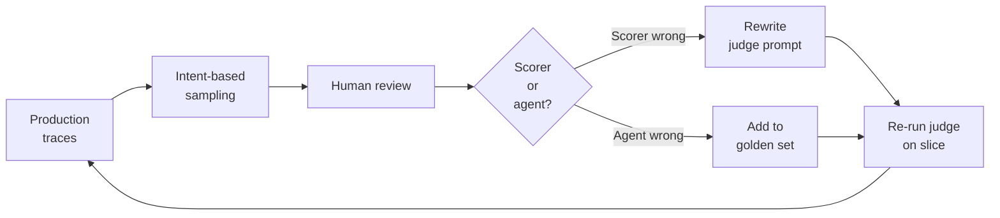

# Human-Review-Driven Curation of Golden Eval Datasets

> Sample production traces on intent, split each disagreement into scorer-wrong or agent-wrong, and feed only agent failures back into the golden set.

The loop applies when three conditions hold: a domain SME is available for review, the production distribution shifts faster than synthetic data can track, and failure modes include subjective or semantic correctness an assertion scorer cannot decide. Outside those conditions the loop is a net cost — skip it and tune the [LLM judge](golden-query-pairs-regression.md) once instead.

## The Loop

Four stages do load-bearing work; the rest is bookkeeping.

| Stage | Input | Output |
|---|---|---|
| **Intent-based sampling** | Full trace firehose | 1–5% slice biased toward failed runs, low-confidence scorer outputs, drift signals, topic-cluster representatives |
| **Review with attribution split** | Sampled trace + scorer verdict | Reviewer label + decision: scorer rubric wrong, or agent output wrong |
| **Feedback by attribution** | Reviewer decisions | Scorer-wrong → judge prompt rewrite; agent-wrong → golden set entry |
| **Re-calibrate** | Updated judge + golden set | Re-run judge on a held-out slice; verify agreement ≥ target before trusting the suite |

## Sampling Is Intent-Driven, Not Random

Random sampling wastes reviewer time on near-duplicates. Bias the queue toward four signals ([Braintrust](https://www.braintrust.dev/blog/human-review-golden-datasets), [Kinde](https://www.kinde.com/learn/ai-for-software-engineering/ai-devops/human-in-the-loop-evals-at-scale-golden-sets-review-queues-drift-watch/)):

- **Failed runs** — the existing scorer marked the agent wrong; confirm or overturn.
- **Low-confidence scorer outputs** — judge confidence is near the decision boundary; high information yield per review.
- **Drift signals** — inputs that differ statistically from the original golden distribution, or where user-reported issues spike.
- **Topic-cluster representatives** — one trace per failure-mode cluster from [open coding then axial coding](incident-to-eval-synthesis.md) ([Hamel Husain](https://hamel.dev/blog/posts/evals-faq/why-is-error-analysis-so-important-in-llm-evals-and-how-is-it-performed.html)).

A two-stage design extends this: the judge scores all traces, humans rate a strategic subsample weighted toward inputs where LLM rating predictability is lowest ([arxiv.org/abs/2605.16354](https://arxiv.org/abs/2605.16354)).

## The Scorer-vs-Agent Attribution Split

This is the load-bearing distinction between this pattern and generic "human-in-the-loop." When a reviewer disagrees with a scorer verdict, two failures look identical from the outside:

| The scorer was wrong | The agent was wrong |
|---|---|
| Judge rubric missed an edge case, applied a bias, or scored an acceptable rephrasing as a failure | Agent produced a hallucinated, mis-formatted, or off-policy output |
| Fix: rewrite the judge prompt or rubric; **do not** add to the golden set | Fix: add as a labeled failure case in the golden set; **do not** modify the judge rubric |
| Re-run the updated judge against the held-out slice; verify the rewrite did not regress other cases | Tracks as a regression case in CI; gates future deploys against the same failure mode |

Skipping the split poisons the suite. The same trace ends up both grading the agent and tuning the judge — benchmark contamination at the data-prep stage ([benchmark contamination](benchmark-contamination-eval-risk.md)). Scores improve while real users churn — Goodhart's Law applied to evals ([Future AGI](https://futureagi.com/blog/llm-as-judge-best-practices-2026)).

## Calibrate Reviewer Agreement First

Before letting a reviewer's verdict overwrite scorer output, measure inter-reviewer agreement on a shared slice using Cohen's kappa ([Brenndoerfer](https://mbrenndoerfer.com/writing/inter-annotator-agreement-kappa-alpha-reliability)):

| Kappa | Interpretation | Action |
|---|---|---|
| **≥ 0.8** | Strong | Trust labels; promote to golden set |
| **0.6–0.8** | Substantial | Use with a third-reviewer tiebreaker on disagreements |
| **< 0.6** | Rubric weak | Halt; rewrite the review rubric and re-calibrate before labels feed back |

For LLM judge calibration, iterate the judge prompt against a 200-example expert-labeled slice until 85–90% agreement is reached ([Adaline 2026 guide](https://www.adaline.ai/blog/complete-guide-llm-ai-agent-evaluation-2026)). GPT-4-class judges hit ~80% human agreement on MT-Bench out of the box — the same level as human-human agreement ([Zheng et al. 2023](https://arxiv.org/abs/2306.05685)) — but documented biases (position, verbosity, self-enhancement, family) drift the number downward on subjective tasks without periodic re-anchoring.

## Why It Works

LLM judges drift silently across model updates, prompt rewrites, and tool changes because each shift pushes the judge to score inputs outside its calibration distribution, and the drift is unobservable from inside the suite when the same data both grades the agent and tunes the judge. A periodic human-review loop is the only signal that re-anchors the judge to ground truth on the moving production distribution. Without it, scores improve while real-user satisfaction degrades — a Goodhart's Law signature documented across LLM-judge calibration practice ([Future AGI](https://futureagi.com/blog/llm-as-judge-best-practices-2026), [Braintrust](https://www.braintrust.dev/articles/llm-as-a-judge-vs-human-in-the-loop-evals)).

## When This Backfires

The loop adds latency and reviewer cost. Five conditions tip it from net-positive to net-cost:

- **High-volume, deterministic outputs.** When the agent emits structured JSON tool calls or schema-validated outputs and an assertion-based scorer already catches the failure class, a continuous review queue adds days of latency between failure and fix without surfacing new failure modes. Tune the [deterministic guardrails](deterministic-guardrails.md) and ship without it.
- **No domain SME on hand.** Reviewer agreement below 0.6 kappa means the labels are noisier than the LLM judge they are meant to calibrate against. Junior reviewers calibrating a frontier judge inverts the signal direction.
- **Fast-moving target distribution.** When the product changes weekly (new tools, new policies, new model), goldens drift faster than reviewers can re-label. Either the suite gates legitimate deploys or it silently passes regressions. Drop to a smaller faster-rotating set or shift to synthetic-data-plus-meta-judge pipelines that have shown meta-correlations > 0.9 in narrow domains ([arxiv.org/abs/2603.09403](https://arxiv.org/abs/2603.09403)).
- **Reviewer and prompt-tuner are the same person.** If the same engineer reviews traces and tunes the agent prompt against those reviews, the suite leaks into the optimisation target and benchmark hill-climbing replaces real-user improvement. Separate the two roles or rotate weekly.
- **No deduplication or topic clustering.** Without [error-analysis-style clustering](incident-to-eval-synthesis.md), reviewers waste sessions on near-duplicate failures and the queue balloons. Cluster first, then sample one representative per cluster.

## Relation to Adjacent Practices

This pattern sits one layer above [golden query pairs](golden-query-pairs-regression.md) and [incident-to-eval synthesis](incident-to-eval-synthesis.md): both feed individual cases into the golden set, while human-review-driven curation is the maintenance discipline that keeps the set calibrated as the distribution moves. It complements [SynAE](synae-synthetic-eval-quality.md), which scores how closely a synthetic set matches the production reference this loop maintains. The calibration thresholds also guard against the [reward-hacking](anti-reward-hacking.md) signature on the suite itself: when judge and reviewer co-drift toward the same blind spot, no internal metric will show it.

## Key Takeaways

- Sample by intent (failed runs, low-confidence scores, drift, topic representatives) — not random across the firehose.
- Every disagreement gets attributed: scorer-rubric wrong rewrites the judge prompt; agent wrong adds to the golden set. Mixing the two contaminates the suite.
- Validate reviewer agreement (kappa ≥ 0.8 strong, 0.6–0.8 substantial, < 0.6 rewrite the rubric) before letting reviewer labels overwrite scorer output.
- For LLM-judge calibration, iterate the judge prompt against a ~200-example expert slice until 85–90% agreement is reached.
- Skip the loop when outputs are deterministic, no SME is available, the distribution moves faster than reviewers can re-label, or the reviewer is also the prompt-tuner.

## Related

- [Golden Query Pairs as Continuous Regression Tests for Agents](golden-query-pairs-regression.md)
- [Incident-to-Eval Synthesis: Production Failures as Evals](incident-to-eval-synthesis.md)
- [Measuring Synthetic Eval Data Quality (SynAE)](synae-synthetic-eval-quality.md)
- [Anti-Reward-Hacking: Rubrics That Resist Gaming](anti-reward-hacking.md)
- [Benchmark Contamination as Eval Risk](benchmark-contamination-eval-risk.md)
