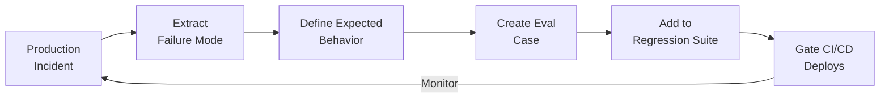

# Incident-to-Eval Synthesis: Converting Production Failures into Regression Evals

> Every production incident involving an LLM feature is a candidate for a regression eval case. Extract the failure mode, define expected behavior, and add it to a growing suite that gates future deploys.

!!! note "Also known as"
    Failure-to-Eval Pipeline, Production Regression Evals. This technique feeds into [Eval-Driven Development](../workflows/eval-driven-development.md) and complements [Golden Query Pairs](golden-query-pairs-regression.md) by providing a systematic source of new eval cases.

## Why Incidents Are Your Best Eval Source

Manually authored evals reflect what developers *think* will go wrong. Production incidents reveal what *actually* goes wrong — real users find edge cases no developer anticipates.

The suite becomes a living record of every way the system has broken.

## The Pipeline



Each stage has a specific output:

| Stage | Input | Output |
|---|---|---|
| **Extract failure mode** | Incident report, logs, traces | Minimal reproducible input that triggers the failure |
| **Define expected behavior** | Domain expert judgment | Concrete expected output or acceptance criteria |
| **Create eval case** | Input + expected output | Executable test with a grader (assertion, LLM-as-judge, or both) |
| **Add to suite** | Eval case + severity label | Entry in regression dataset with P0/P1/P2 priority |
| **Gate deploys** | Suite run results | P0 failures block release; P1/P2 warn |

## Error Analysis: From Traces to Failure Taxonomy

Identifying the failure mode is harder than writing the eval. A structured error analysis methodology makes this repeatable:

1. **Gather traces** -- collect 100+ production traces covering failures and near-misses
2. **Open coding** -- domain experts review traces and journal issues without predefined categories, focusing on the first upstream failure in each trace
3. **Axial coding** -- group journal entries into a failure taxonomy with frequency counts
4. **Iterate** -- repeat until new traces stop producing new categories (theoretical saturation)

The resulting taxonomy shows which failure modes are most common, most severe, and most amenable to automated detection.

[Source: [Hamel Husain -- Your AI Product Needs Evals](https://hamel.dev/blog/posts/evals/), [LLM Evals FAQ](https://hamel.dev/blog/posts/evals-faq/)]

## Not Every Incident Becomes an Eval

Evals have a maintenance cost. Apply a cost-benefit filter:

| Failure Type | Eval Strategy | Rationale |
|---|---|---|
| Deterministic format errors (wrong JSON, missing fields) | Assertion / regex check | Cheap to write, cheap to run, catches exact recurrence |
| Semantic failures (wrong answer, hallucinated facts) | LLM-as-judge eval | More expensive but necessary for subjective correctness |
| One-off data issues (corrupt input, transient API failure) | Skip -- fix upstream | Eval would test infrastructure, not the LLM feature |
| Security/safety violations | Mandatory P0 eval | Always worth the cost regardless of frequency |

Reserve LLM-as-judge evaluators for persistent problems; use assertions for deterministic failures.

[Source: [Hamel Husain -- LLM Evals FAQ](https://hamel.dev/blog/posts/evals-faq/)]

## Tiered Blocking in CI/CD

Assign severity when adding the eval case:

- **P0** -- blocks release. Safety violations, data leaks, complete task failures.
- **P1** -- warns in CI, requires explicit override. Quality regressions, accuracy drops.
- **P2** -- logged and tracked. Minor formatting issues, style deviations.

[Promptfoo](https://www.promptfoo.dev/docs/integrations/ci-cd/) supports configurable pass-rate thresholds across GitHub Actions, GitLab CI, and Jenkins. Use a hard threshold for P0 (100%) and a softer threshold for the full suite (e.g., 95%).

## Example

A minimal incident-to-eval workflow. An LLM-powered customer service agent hallucinates a refund policy that does not exist.

**Step 1: Extract the failure mode**

```yaml
# incident_report.yaml
incident_id: INC-2024-0847
failure_mode: hallucinated_policy
input: "Can I return a laptop after 90 days?"
actual_output: "Yes, our 120-day extended return policy covers laptops."
root_cause: No such 120-day policy exists. Model confabulated.
```

**Step 2: Define expected behavior and create eval case**

```python
INCIDENT_EVALS = [
    {
        "id": "INC-2024-0847",
        "input": "Can I return a laptop after 90 days?",
        "expected": "Our return policy is 30 days for electronics. "
                    "A laptop purchased 90 days ago is not eligible for return.",
        "grader": "llm_judge",
        "severity": "P0",
        "tags": ["hallucination", "policy"],
    },
]
```

**Step 3: Run in CI with a grader**

```python
import anthropic, json

client = anthropic.Anthropic()

JUDGE_PROMPT = """You are evaluating a customer service agent's response.

Customer question: {input}
Expected answer: {expected}
Agent's actual answer: {actual}

Does the agent's answer contain any fabricated policies, made-up deadlines,
or factual claims not supported by the expected answer?

Reply with JSON: {{"pass": true/false, "explanation": "..."}}"""

def run_incident_evals(agent_fn, evals):
    results = []
    for case in evals:
        actual = agent_fn(case["input"])
        response = client.messages.create(
            model="claude-sonnet-4-20250514",
            max_tokens=256,
            messages=[{"role": "user", "content": JUDGE_PROMPT.format(
                input=case["input"], expected=case["expected"], actual=actual
            )}],
        )
        verdict = json.loads(response.content[0].text)
        results.append({
            "id": case["id"], "severity": case["severity"], **verdict
        })

    p0_failures = [r for r in results if not r["pass"] and r["severity"] == "P0"]
    if p0_failures:
        print(f"BLOCKING: {len(p0_failures)} P0 failure(s)")
        for f in p0_failures:
            print(f"  {f['id']}: {f['explanation']}")
        exit(1)
```

Each incident adds an entry to `INCIDENT_EVALS`. Cases are never removed, only updated when expected behavior changes.

## Growing the Dataset

Dataset maturity tiers [unverified]:

- **Minimum viable**: 50-100 cases covering the most critical failure modes
- **Production-ready**: 200-500 cases with broad failure category coverage
- **Mature**: 1000+ cases with tiered severity and automated CI gating

Every postmortem should ask: "What eval would have caught this?" If actionable, write it before closing the incident.

[Source: [Maxim AI -- Building a Golden Dataset](https://www.getmaxim.ai/articles/building-a-golden-dataset-for-ai-evaluation-a-step-by-step-guide/)]

## Key Takeaways

- Production incidents are the highest-signal source of eval cases
- Use error analysis (open coding, axial coding) to extract failure modes from production traces
- Cheap assertions for deterministic failures; LLM-as-judge for persistent semantic problems
- P0 failures block deploys; P1/P2 warn
- Every closed incident should produce a new eval case

## Unverified Claims

- 60-80% success rates for automated test generation from failure reports [unverified]
- Only ~30% of organizations systematically reuse incident data for eval purposes [unverified]
- Dataset maturity thresholds (50-100 / 200-500 / 1000+) are practitioner heuristics without cited research [unverified]

## Related

- [Golden Query Pairs as Continuous Regression Tests](golden-query-pairs-regression.md)
- [Eval-Driven Development: Write Evals Before Building Agent Features](../workflows/eval-driven-development.md)
- [Grade Agent Outcomes, Not Execution Paths](grade-agent-outcomes.md)
- [Test-Driven Agent Development](tdd-agent-development.md)
- [LLM-as-Judge Evaluation](../workflows/llm-as-judge-evaluation.md)
