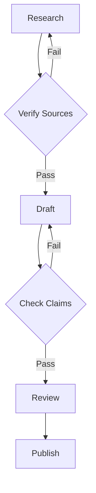

# Incremental Verification: Check at Each Step, Not at the End

> Verify agent output at each logical step to catch errors close to their source, before they propagate.

## The Pattern

An agent that generates 500 lines of code before any verification may have made a wrong assumption at line 10. Everything after that point is built on a mistake. Unwinding the cascade is expensive — each dependent decision must be re-evaluated.

Incremental verification inserts checkpoints between stages. After each meaningful unit of work, you verify before proceeding. The cost of a checkpoint is low; the cost of debugging downstream consequences is high.

## Why This Works

Error cost grows with distance from the error. A type mismatch caught at the point of introduction is a one-line fix. The same mismatch discovered after 10 functions have been written against the wrong type requires auditing every callsite.

This is the same principle as [fail-fast in software design](https://martinfowler.com/ieeeSoftware/failFast.pdf): surface problems immediately, in the location where they occurred, with full context still available. The same compounding dynamic shows up in LLM pipelines — a [study of multi-agent collaboration](https://arxiv.org/html/2603.04474v1) traces final failures back to intermediate stages where small misstatements undergo semantic shifts and amplify downstream.

## Checkpoint Patterns

### Code: Build → Test → Iterate

Implement one function, run the test suite, fix failures, move to the next function. Do not write multiple functions before running tests — the second function may build on a broken assumption in the first.

Type checking is continuous verification: compile after each change, not after a batch. Type errors at the function boundary are simpler to fix than type errors across a module.

### Documents: Claim-by-Claim Verification

Check each source as it is cited, not after the whole document is written. A hallucinated citation in paragraph 2 invalidates every argument that builds on it. Verifying at the end means re-reading against sources retroactively, which is harder than checking forward.

### Agent Workflows: Stage Gates

Agent pipelines should include explicit verification steps between stages, not just at the end of the pipeline. A research → draft → review pipeline with no verification between research and draft means the draft may be built on unverified claims.

### Checkpoint-Save Pattern

Before making a batch of changes: save a known-good state (commit, checkpoint, snapshot). Make changes. Verify. If verification fails, restore to the known-good state and retry. This contains the [blast radius](../security/blast-radius-containment.md) of errors to one checkpoint interval.

## Anti-Patterns

- **Write everything, then review** — errors compound through the entire artifact before detection
- **Batch verification** — running tests only at the end of a session, not between logical units
- **No automated checkpoints** — relying on human review as the only verification layer

## When This Backfires

Checkpoints are not free. Adding a validation step [introduces latency and cost overhead](https://arxiv.org/pdf/2511.00330) that can dominate runtime on long trajectories. Incremental verification turns into a drag when:

- **The unit is too small.** Checking after every token or line suppresses exploration — a model forced to pass a type check before line two cannot sketch across functions before refining.
- **The verifier is weaker than the generator.** An LLM-as-judge that hallucinates rejects correct work and blesses wrong work. The checkpoint must be more reliable than the thing being verified; compilers and tests qualify, unconstrained models often do not.
- **The task is throwaway.** Prototypes and spikes are cheaper to rewrite than to incrementally verify. Fixed per-checkpoint overhead never pays back on code that is discarded.
- **Granularity misaligns with failure modes.** If errors only manifest across components (integration bugs, emergent behavior), unit-level checkpoints pass while the real failure hides until the end-to-end test.

Use incremental verification where the verifier is stronger than the generator, a wrong step is expensive, and the unit carries meaningful signal.

A stronger caveat applies to AI coding agents. Checkpoints that only inspect the agent's own narration — "I fixed the bug", "all tests pass" — are easy to fool. Practitioners report agents that [claim fixes for code that was never changed](https://dev.to/moonrunnerkc/ai-coding-agents-lie-about-their-work-outcome-based-verification-catches-it-12b4) and insist tests pass when the transcript shows failures. Pair step gates with outcome-based checks — `git diff`, build exit codes, test output — and cross-reference claims against that evidence. A checkpoint that reads the agent's self-report is not a checkpoint.

## Key Takeaways

- Error cost grows with distance from the error source — catch failures close to where they occur
- Automated checkpoints (type checks, tests, linters) are cheap; manual review of cascaded errors is expensive
- Structure agent pipelines with verification gates between stages, not only at the end
- Save known-good state before each batch of changes to bound recovery cost
- The anti-pattern is "write the whole thing then we'll review it"

## Related

- [Trust Without Verify](../anti-patterns/trust-without-verify.md)
- [Test-Driven Agent Development: Tests as Spec and Guardrail](tdd-agent-development.md)
- [Pre-Completion Checklists for AI Agent Development](pre-completion-checklists.md)
- [Layered Accuracy Defense for Reliable Agent Outputs](layered-accuracy-defense.md)
- [Verification Ledger](verification-ledger.md)
- [Five-Pass Blunder Hunt](five-pass-blunder-hunt.md)
- [Deterministic Guardrails](deterministic-guardrails.md)
- [Demand-Driven Repo Auditing](demand-driven-repo-auditing.md)
