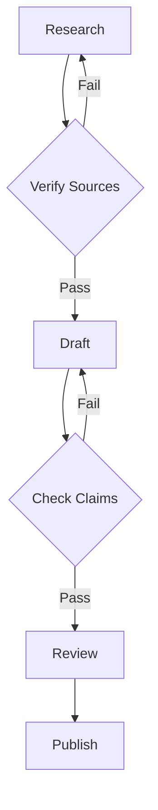

# Incremental Verification: Check at Each Step, Not at the End

> Verify agent output at each logical step to catch errors close to their source, before they propagate.

Learn it hands-on with the [Verification Gates guided lesson](https://learn.agentpatterns.ai/harness-engineering/verification-gates/), which includes quizzes.

## The pattern

An agent may generate 500 lines of code before any verification, having made a wrong assumption at line 10. Everything after that point builds on a mistake. Unwinding the cascade is expensive, because you must re-evaluate each dependent decision.

Incremental verification inserts checkpoints between stages, the same shape as [staged evidence gates](staged-evidence-gates-program-repair.md) in program repair. After each meaningful unit of work, you verify before proceeding. A checkpoint costs little. Debugging downstream consequences costs a lot.

## Why this works

Error cost grows with distance from the error. A type mismatch caught at the point of introduction is a one-line fix. Discover the same mismatch after writing 10 functions against the wrong type, and you must audit every callsite.

This follows the same principle as [fail-fast in software design](https://martinfowler.com/ieeeSoftware/failFast.pdf): surface problems immediately, where they occurred, while full context is still available. The same compounding dynamic shows up in LLM pipelines. A [study of multi-agent collaboration](https://arxiv.org/html/2603.04474v1) traces final failures back to intermediate stages, where small misstatements shift in meaning and amplify downstream.

## Checkpoint patterns

### Code: build, test, iterate

Implement one function, run the test suite, fix failures, then move to the next function. This is the inner loop of [test-driven agent development](tdd-agent-development.md). Do not write multiple functions before running tests, because the second function may build on a broken assumption in the first.

Type checking is continuous verification, a [deterministic guardrail](deterministic-guardrails.md) that compiles after each change rather than after a batch. Type errors at the function boundary are simpler to fix than type errors across a module.

### Documents: claim-by-claim verification

Check each source as you cite it, not after you write the whole document. A hallucinated citation in paragraph 2 invalidates every argument that builds on it. Verifying at the end means re-reading against sources afterwards, which is harder than checking forward.

### Agent workflows: stage gates

Agent pipelines should include explicit verification steps between stages, not just at the end. A research, draft, then review pipeline with no verification between research and draft means the draft may build on unverified claims. This is the case for [layered accuracy defense](layered-accuracy-defense.md).

```mermaid
graph TD
    A[Research] --> B{Verify Sources}
    B -->|Pass| C[Draft]
    B -->|Fail| A
    C --> D{Check Claims}
    D -->|Pass| E[Review]
    D -->|Fail| C
    E --> F[Publish]
```

### Checkpoint-save pattern

Before a batch of changes, save a known-good state: a commit, checkpoint, or snapshot. Make the changes. Verify. If verification fails, restore the known-good state and retry. This contains the [blast radius](../security/blast-radius-containment.md) of errors to one checkpoint interval.

## Anti-patterns

- Write everything, then review: errors compound through the whole artifact before detection
- Batch verification: running tests only at the end of a session, not between logical units
- No automated checkpoints: relying on human review as the only verification layer

## When this backfires

Checkpoints are not free. Adding a validation step [introduces latency and cost overhead](https://arxiv.org/pdf/2511.00330) that can dominate runtime on long trajectories. Incremental verification becomes a drag when:

- The unit is too small. Checking after every token or line suppresses exploration. A model forced to pass a type check before line two cannot sketch across functions before refining.
- The verifier is weaker than the generator. An [LLM-as-judge](../workflows/llm-as-judge-evaluation.md) that hallucinates rejects correct work and approves wrong work. The checkpoint must be more reliable than the thing it verifies. Compilers and tests qualify; unconstrained models often do not.
- The task is throwaway. Prototypes and spikes are cheaper to rewrite than to verify step by step, so match the checkpoint cadence to [risk-based task sizing](risk-based-task-sizing.md). Fixed per-checkpoint overhead never pays back on code you discard.
- Granularity misaligns with failure modes. If errors only show up across components, such as integration bugs or emergent behavior, unit-level checkpoints pass while the real failure hides until the end-to-end test.

Use incremental verification where the verifier is stronger than the generator, a wrong step is expensive, and the unit carries meaningful signal.

A stronger caveat applies to AI coding agents, where [trusting the agent's self-report](../patterns/anti-patterns/trust-without-verify.md) is its own failure mode. Checkpoints that only inspect the agent's own narration, such as "I fixed the bug" or "all tests pass", are easy to fool. Practitioners report agents that [claim fixes for code that was never changed](https://dev.to/moonrunnerkc/ai-coding-agents-lie-about-their-work-outcome-based-verification-catches-it-12b4) and insist tests pass when the transcript shows failures. Pair step gates with outcome-based checks, such as `git diff`, build exit codes, and test output, then cross-reference claims against that evidence. A checkpoint that reads the agent's self-report is not a checkpoint.

## Key Takeaways

- Error cost grows with distance from the error source — catch failures close to where they occur
- Automated checkpoints (type checks, tests, linters) are cheap; manual review of cascaded errors is expensive
- Structure agent pipelines with verification gates between stages, not only at the end
- Save known-good state before each batch of changes to bound recovery cost
- The anti-pattern is "write the whole thing then we'll review it"

## Related

- [Trust Without Verify](../patterns/anti-patterns/trust-without-verify.md)
- [Test-Driven Agent Development: Tests as Spec and Guardrail](tdd-agent-development.md)
- [Pre-Completion Checklists for AI Agent Development](pre-completion-checklists.md)
- [Layered Accuracy Defense for Reliable Agent Outputs](layered-accuracy-defense.md)
- [Verification Ledger](verification-ledger.md)
- [Five-Pass Blunder Hunt](five-pass-blunder-hunt.md)
- [Deterministic Guardrails](deterministic-guardrails.md)
- [Pre-Change Impact Analysis](pre-change-impact-analysis.md)
