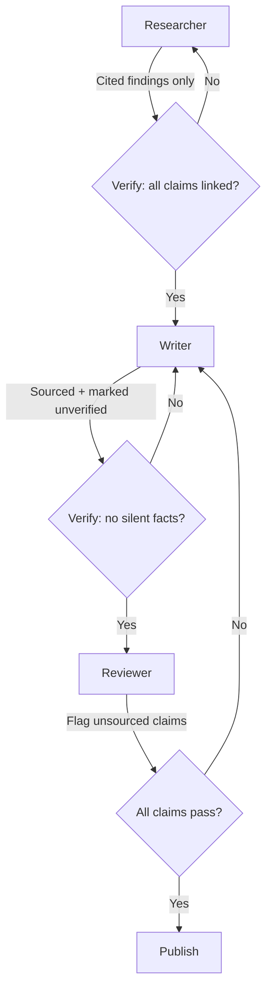

# Layered Accuracy Defense

> Distribute accuracy verification across every agent in a pipeline so no single agent is the sole gatekeeper.

## The Pattern

A fabricated claim can survive from research through to publish if only one stage checks accuracy. Layered accuracy defense assigns each agent in the pipeline an explicit verification responsibility, so claims must survive multiple independent checkpoints before they reach the reader.

This mirrors [defense in depth](../security/defense-in-depth-agent-safety.md) from security: assume each layer will sometimes fail. Build the pipeline so that one layer's failure is caught by the next.

## Layer Responsibilities

Each agent receives explicit instructions to reject unverified information, not just "be accurate."

**Researcher** — output only findings that have a retrievable source URL. If a claim cannot be linked, it is excluded or marked `[unverified]`. The researcher does not summarize from memory.

**Writer** — use only material present in the research notes. Any knowledge added beyond those notes must be marked `[unverified]` inline and collected in an "Unverified Claims" section. The writer does not silently include recalled facts.

**Reviewer** — flag any unsourced claim the writer included without marking. This is the catch layer for anything that slipped through. The reviewer treats an unmarked, unsourced assertion as a critical defect.



## Why Multiple Layers

A single "fact-checker" agent at the end of the pipeline has to re-examine the entire artifact. It may miss claims that were stated confidently, may trust citations without verifying them, or may have the same knowledge gaps as the writer. Multiple independent layers catch different failure modes:

- The researcher layer prevents the writer from inventing sources
- The writer layer prevents recalled knowledge from entering as fact
- The reviewer layer catches anything the writer missed

Each layer only needs to catch some errors, not all. Because each layer checks a distinct property — source existence, note fidelity, and markup completeness — an error must evade three different detection criteria to reach the reader.

## What Each Layer Checks

| Layer | Input | Check | Reject Condition |
|-------|-------|-------|-----------------|
| Researcher | Raw sources | Can this claim be linked? | No URL → exclude or mark |
| Writer | Research notes | Is this from my notes? | Unknown source → mark `[unverified]` |
| Reviewer | Draft page | Is every claim sourced or marked? | Unmarked, unsourced claim → flag |

## Anti-Pattern

Relying on a single review agent at the end of the pipeline. That agent will see confident, well-written prose with plausible citations. It has no way to distinguish fabricated confidence from real sourcing unless it re-verifies every claim independently — which is expensive and still fallible.

## Key Takeaways

- No single agent is the accuracy gatekeeper — every agent in the chain validates within its scope
- Explicit reject instructions per layer outperform generic "be accurate" prompts
- Each layer checks a distinct property, so errors must evade different detection criteria rather than the same check repeated
- This is defense in depth applied to content accuracy, not security
- Anti-pattern: a single fact-checker at the end of the pipeline

## When This Backfires

Layered verification adds latency and cost proportional to the number of agents. Three round-trips through researcher → writer → reviewer is appropriate for high-stakes content pipelines, but can be excessive for:

- **Simple lookup tasks** where a single agent retrieves and returns a fact — adding a reviewer layer adds cost without addressing the root failure mode (model fabrication without retrieval).
- **Rapid iteration contexts** where speed matters more than accuracy — a draft that ships in one pass and gets corrected by a human may be faster than a three-agent pipeline.
- **Correlated knowledge gaps** — if the writer and reviewer share the same training data blind spots, both layers will miss the same class of errors. Independent layers require genuinely different perspectives or constraints, not just role labels.

The pattern works when each layer has a structurally different task: the researcher fetches real URLs, the writer is constrained to those notes, and the reviewer checks markup. If two layers are doing the same check, one is redundant.

## Example

A three-agent [content pipeline](../workflows/content-pipeline.md) where each agent's system prompt encodes its verification responsibility.

**Researcher prompt excerpt:**

```text
You are a research agent. For every claim you include in your output,
append the source URL in parentheses. If you cannot find a retrievable
URL for a claim, exclude it entirely. Never summarize from memory —
only output findings backed by a URL you retrieved in this session.
```

**Writer prompt excerpt:**

```text
You are a writer agent. Use ONLY the research notes provided below.
If you add any knowledge not present in the notes, mark it inline
with [unverified]. Collect all [unverified] items in a final
"Unverified Claims" section. Do not silently include recalled facts.
```

**Reviewer prompt excerpt:**

```text
You are a reviewer agent. Read the draft and check every factual claim.
If a claim has no source URL and is not marked [unverified], flag it
as a CRITICAL defect. Return a list of flagged claims with line numbers.
Any unmarked, unsourced assertion is a rejection-worthy finding.
```

The researcher rejects claims without URLs. The writer marks anything beyond the notes. The reviewer catches anything the writer missed. Each layer's failure mode is independent, so a fabricated claim must survive all three to reach the reader.

## Related

- [Incremental Verification: Check at Each Step, Not at the End](incremental-verification.md)
- [Deterministic Guardrails Around Probabilistic Agents](deterministic-guardrails.md)
- [Structured Output Constraints: Reducing Hallucination Surface](structured-output-constraints.md)
- [Data Fidelity Guardrails](data-fidelity-guardrails.md)
- [Pre-Completion Checklists](pre-completion-checklists.md)
- [Verification Ledger](verification-ledger.md)
- [Five-Pass Blunder Hunt](five-pass-blunder-hunt.md)
- [Defense Patterns](index.md)
