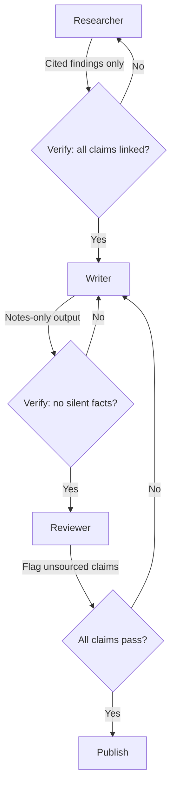

# Layered Accuracy Defense

> Distribute accuracy verification across every agent in a pipeline so no single agent is the sole gatekeeper.

## The Pattern

A fabricated claim can survive from research through to publish if only one stage checks accuracy. Layered accuracy defense assigns each agent in the pipeline an explicit verification responsibility, so claims must survive multiple independent checkpoints before they reach the reader.

This mirrors [defense in depth](../security/defense-in-depth-agent-safety.md) from security — [NIST](https://csrc.nist.gov/glossary/term/defense_in_depth) defines it as layering heterogeneous controls "to ensure that attacks missed by one technology are caught by another." Assume each layer will sometimes fail, and build the pipeline so one layer's failure is caught by the next.

## Layer Responsibilities

Each agent receives explicit instructions to reject unsourced information, not just "be accurate."

**Researcher** — output only findings that have a retrievable source URL. If a claim cannot be linked, exclude it. Do not summarize from memory — the [honesty-harness fabrication defense](honesty-harness-fabrication-defense.md) treats memory-sourced claims as the primary fabrication risk — and do not emit hedge tags, which push the verification burden onto downstream layers with less context.

**Writer** — use only material present in the research notes. If a load-bearing claim has no supporting note, omit it and append an outstanding-research item naming the missing source.

**Reviewer** — flag any assertion in the draft that has no inline citation, the [chain-of-verification](chain-of-verification-coding-agents.md) pass applied to prose. This is the catch layer for anything that slipped through, and treats an unsourced claim as a critical defect to be removed or sourced before merge.


```mermaid
graph TD
    A[Researcher] -->|Cited findings only| B{Verify: all claims linked?}
    B -->|No| A
    B -->|Yes| C[Writer]
    C -->|Notes-only output| D{Verify: no silent facts?}
    D -->|No| C
    D -->|Yes| E[Reviewer]
    E -->|Flag unsourced claims| F{All claims pass?}
    F -->|No| C
    F -->|Yes| G[Publish]
```

## Why Multiple Layers

A single "fact-checker" agent at the end of the pipeline has to re-examine the entire artifact. It may miss confidently-stated claims, may trust citations without verifying them, or may share the writer's knowledge gaps. Splitting the work helps because each layer checks a distinct property — source existence, note fidelity, and citation completeness — so an error must evade three different detection criteria to reach the reader, not the same check repeated. A [2025 review of LLM fact-checking](https://arxiv.org/abs/2508.03860) reaches a similar conclusion: integrated approaches that combine retrieval, prompting, and external evidence validation outperform any single metric or checkpoint.

## What Each Layer Checks

| Layer | Input | Check | Reject Condition |
|-------|-------|-------|-----------------|
| Researcher | Raw sources | Can this claim be linked? | No URL → exclude |
| Writer | Research notes | Is this from my notes? | Unknown source → omit, open research item |
| Reviewer | Draft page | Is every claim sourced inline? | Unsourced claim → flag for [removal or sourcing](chain-of-verification-coding-agents.md) |

## Anti-Pattern

Relying on a single review agent at the end of the pipeline — instead of a [multi-pass review](five-pass-blunder-hunt.md) — means it sees confident, well-written prose with plausible citations and cannot distinguish fabricated confidence from real sourcing unless it re-verifies every claim, which is expensive and still fallible.

A second anti-pattern is letting intermediate layers emit hedge tags instead of excluding the claim. Hedge tags defer the work to a downstream layer with less context, and in auto-merged pipelines no human is positioned to clear them. The claim either has a source or it does not exist.

## Key Takeaways

- No single agent is the accuracy gatekeeper — every agent in the chain validates within its scope
- Explicit reject instructions per layer outperform generic "be accurate" prompts
- Each layer checks a distinct property, so errors must evade different detection criteria rather than the same check repeated
- Hedge tags are not a defense layer — they shift work downstream without resolving it
- This is defense in depth applied to content accuracy, not security
- Anti-pattern: a single fact-checker at the end of the pipeline

## When This Backfires

Layered verification adds latency and cost proportional to the number of agents. Three round-trips through researcher → writer → reviewer is appropriate for high-stakes content pipelines, but can be excessive for:

- **Simple lookup tasks** where a single agent retrieves and returns a fact — adding a reviewer layer adds cost without addressing the root failure mode (model fabrication without retrieval).
- **Rapid iteration contexts** where speed matters more than accuracy — under [risk-based shipping](risk-based-shipping.md), a draft that ships in one pass and gets corrected by a human may be faster than a three-agent pipeline.
- **Correlated knowledge gaps** — if the writer and reviewer share the same training data blind spots, both layers will miss the same class of errors. Independent layers require genuinely different perspectives or constraints, not just role labels.

Chaining agents does not automatically reduce errors — without disciplined handoffs it can amplify them. A 2025 study of role-specialized pipelines ([Planner → Executor → Critic](https://arxiv.org/abs/2510.07614)) finds that in sequential multi-agent systems "errors quietly pass from one stage to the next": a confident but wrong intermediate output gets written into shared context as ground truth, and a downstream layer tends to align with it rather than push back. Layered accuracy defense only pays off when each handoff forces the next layer to re-derive what it checks from the source — the same logic as [incremental verification](incremental-verification.md), where each checkpoint re-checks rather than trusting the prior step. A reviewer that trusts the writer's framing instead of re-verifying against the citation adds latency without adding a real checkpoint.

The pattern works when each layer has a structurally different task: the researcher fetches real URLs, the writer is constrained to those notes, and the reviewer checks every assertion against a citation. If two layers are doing the same check, one is redundant.

## Example

A three-agent content pipeline where each agent's system prompt encodes its verification responsibility.

**Researcher prompt excerpt:**

```text
You are a research agent. For every claim you include in your output,
append the source URL in parentheses. If you cannot find a retrievable
URL for a claim, exclude it entirely. Never summarize from memory —
only output findings backed by a URL you retrieved in this session.
```

**Writer prompt excerpt:**

```text
You are a writer agent. Use ONLY the research notes provided below.
Do not insert any knowledge that is not present in the notes. If a
load-bearing claim has no supporting note, omit the claim and append
an "Outstanding Research" item naming the missing source instead of
writing the claim into the draft. Do not emit hedge tags.
```

**Reviewer prompt excerpt:**

```text
You are a reviewer agent. Read the draft and check every factual claim.
If a factual assertion has no inline source URL, flag it as a CRITICAL
defect. Return a list of flagged claims with line numbers. Hedge tags
are not an acceptable substitute for a citation — flag those too.
```

Each layer's failure mode is independent, so a fabricated claim must survive all three to reach the reader.

## Related

- [Incremental Verification: Check at Each Step, Not at the End](incremental-verification.md)
- [Deterministic Guardrails Around Probabilistic Agents](deterministic-guardrails.md)
- [Structured Output Constraints: Reducing Hallucination Surface](structured-output-constraints.md)
- [Data Fidelity Guardrails](data-fidelity-guardrails.md)
- [Pre-Completion Checklists](pre-completion-checklists.md)
- [Verification Ledger](verification-ledger.md)
- [Five-Pass Blunder Hunt](five-pass-blunder-hunt.md)
- [Defense Patterns](index.md)
