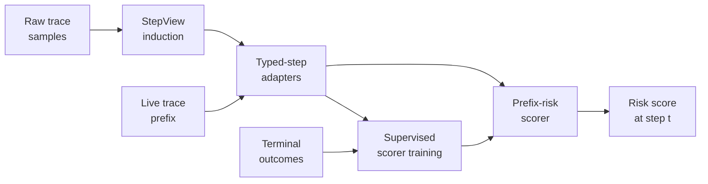

# Learned Prefix Monitors for Agent Traces

> A prefix monitor reads a partial agent trace and predicts whether the run will end in failure. Learning that scorer offline avoids deployment-time LLM judging cost, but the authors of [PrefixGuard](https://arxiv.org/abs/2605.06455) show that strong ranking metrics do not always translate into low-false-alarm alerts.

## The Problem with Final-Outcome Checks

Long agent runs surface failure too late — the intervention window closes before the grader sees the result. The two common alternatives both have costs:

- **Hand-authored event schemas** — explicit rules over typed events. Transparent and cheap, but brittle when the harness, model, or tool catalog changes.
- **Deployment-time LLM judges** — call a separate model at every step. Robust to surface change, expensive at scale.

[PrefixGuard](https://arxiv.org/abs/2605.06455) frames a third option: an offline-trained *prefix monitor* scoring partial traces in flight. Two stages — induce a typed-event abstraction from raw traces, then train a supervised scorer against terminal outcomes.

## The Two-Stage Architecture

**StepView induction.** Offline, the framework derives "deterministic typed-step adapters from raw trace samples" — replacing the hand-authored schema with one learned from the trace distribution. Output: a fixed event vocabulary plus a parser mapping any raw step into it [Source: [Huang et al., *PrefixGuard*](https://arxiv.org/abs/2605.06455)].

**Supervised monitor.** With the abstraction fixed, train a scorer mapping a typed-step prefix to terminal-failure probability from labelled complete traces.

The split matters. Hand-authored schemas commit to one vocabulary; StepView re-derives it from data. LLM judges reason at inference; the supervised scorer pushes that cost offline. Adjacent work uses the same offline-learn / online-score split: *ProbGuard* fits a discrete-time Markov chain over abstracted agent states and triggers when the probability of reaching an unsafe state crosses a threshold [Source: [Zhou et al., *ProbGuard*](https://arxiv.org/abs/2508.00500)].

## What the Numbers Actually Say

Reported AUPRC across four benchmarks [Source: [Huang et al., *PrefixGuard*](https://arxiv.org/abs/2605.06455)]:

| Benchmark | Peak AUPRC | DFA states (post-hoc) |
|-----------|-----------|-----------------------|
| WebArena | 0.900 | 29 |
| τ²-Bench | 0.710 | 20 |
| SkillsBench | 0.533 | 151 |
| TerminalBench | 0.557 | 187 |

Average lift over raw-text baselines: +0.137 AUPRC.

The headline AUPRC is not load-bearing. The authors flag it: *"strong ranking does not imply deployment utility: WebArena ranks well yet fails to support low-false-alarm alerts"* [Source: [Huang et al., *PrefixGuard*](https://arxiv.org/abs/2605.06455)]. A monitor with AUPRC 0.9 can still be unusable if precision-at-recall sits where the false-alarm rate exceeds the review budget.

## Where Learned Monitors Beat Deterministic Guardrails

Deterministic signals — [circuit breakers](../observability/circuit-breakers.md), [loop detection](../observability/loop-detection.md), token-budget caps — catch failure modes a human can name in advance. They miss patterns that show up only across many steps: plausible tool calls that, in aggregate, mean the agent has lost the plot.

A learned prefix monitor sees the aggregate. It pays off on long-horizon traces where the failure signature is distributional, the trace distribution is stable enough to train on, and a labelled terminal-outcome dataset exists. When those fail, deterministic alternatives win on cost and interpretability.

## When the Pattern Backfires

- **Distribution shift.** Change the harness, model, or tool catalog and the trace distribution shifts. Calibration degrades silently — no in-band signal flags the monitor as wrong. Retraining cadence becomes operational cost.
- **Low-base-rate failures.** When terminal failures are rare, supervised training has few positives. AUPRC can look strong while precision-at-recall stays unusable — the WebArena pattern.
- **Short tasks.** When tasks finish in a handful of steps, a final-outcome check lands in time; the prefix-monitor premise no longer applies.
- **Single-team shops.** With one or two agent shapes, a hand-written deterministic invariant suite delivers most of the warning value at lower cost.

## Interpretability via DFA Extraction

Post-hoc DFA extraction converts the trained monitor into a finite-state representation for auditing [Source: [Huang et al., *PrefixGuard*](https://arxiv.org/abs/2605.06455)]. On smaller benchmarks the result is compact — 20–29 states. On longer-horizon benchmarks (SkillsBench 151, TerminalBench 187) the extracted DFA is large enough that "interpretable" stops doing useful work. Treat large DFAs as a signal that the monitor's policy is too complex for state-level review.

## How to Adopt

1. Start with [deterministic guardrails](deterministic-guardrails.md) and [circuit breakers](../observability/circuit-breakers.md). They are cheap, transparent, and catch named failure modes.
2. Collect labelled terminal outcomes. The same corpus supports [incident-to-eval](incident-to-eval-synthesis.md) regression cases.
3. Decide the alert-budget envelope before training. Pick a target false-alarm rate the team can absorb; report precision and recall at that operating point, not just AUPRC.
4. Pin the trace distribution. If the harness or model changes, retrain — calibration drifts silently otherwise.

## Key Takeaways

- A prefix monitor reads partial traces and predicts terminal failure; learned monitors avoid both hand-authored-schema brittleness and deployment-time LLM judging cost.
- StepView induces a typed-event abstraction from raw traces offline; the supervised scorer trains on terminal outcomes against that fixed vocabulary.
- Reported AUPRC is +0.137 over raw-text baselines across WebArena, τ²-Bench, SkillsBench, TerminalBench — but high AUPRC does not imply low-false-alarm alerts.
- Use learned prefix monitors as a complement to deterministic circuit breakers, not a replacement; they pay off on long-horizon traces with stable distributions and labelled outcomes.
- Treat the alert-budget operating point as the deployment metric, not AUPRC. A monitor that can't hit the team's false-alarm budget is not deployable regardless of ranking score.

## Related

- [Circuit Breakers for Agent Loops](../observability/circuit-breakers.md) — the deterministic counterpart; named failure modes and explicit stopping signals.
- [Loop Detection](../observability/loop-detection.md) — point-wise repetition detection; complementary to prefix-distribution monitoring.
- [Deterministic Guardrails Around Probabilistic Agents](deterministic-guardrails.md) — the broader case for hard, transparent checks before adding learned components.
- [Incident-to-Eval Synthesis](incident-to-eval-synthesis.md) — the labelled-outcome corpus the monitor trains against can also seed regression evals.
- [Trajectory Decomposition: Diagnose Where Coding Agents Fail](trajectory-decomposition-diagnosis.md) — stage-level diagnostic that pairs with distribution-level monitoring.
- [Trajectory-Opaque Evaluation Gap](trajectory-opaque-evaluation-gap.md) — why outcome-only grading misses safety failures the prefix view catches.
- [Corpus-Level Trace Diagnostics](corpus-level-trace-diagnostics.md) — offline cross-trace analysis that complements online prefix scoring.
- [Decomposed Red-Teaming Agent Monitors](decomposed-red-teaming-agent-monitors.md) — adversarial monitor evaluation that exposes the same false-positive-rate calibration problem.
